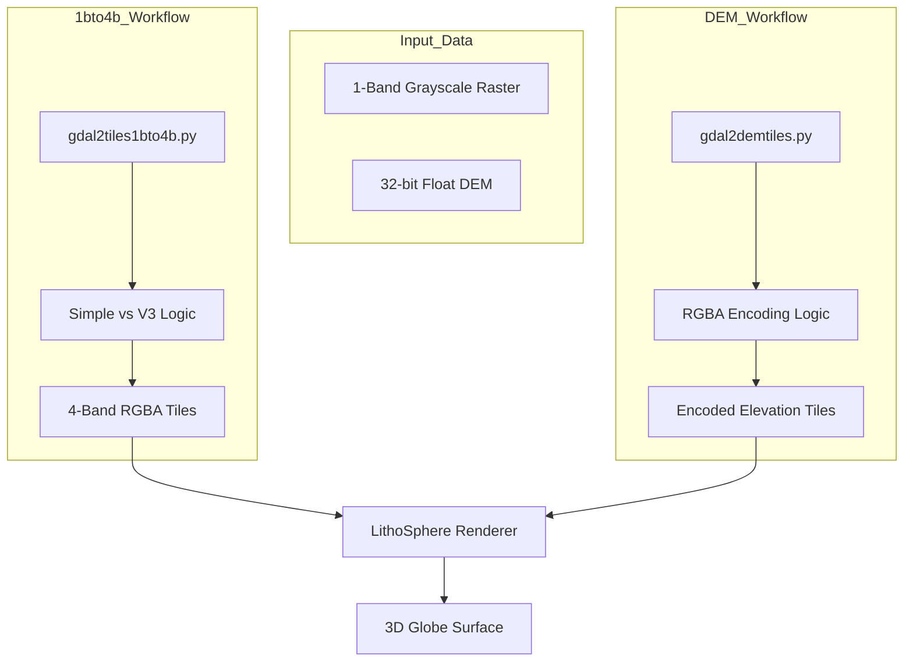
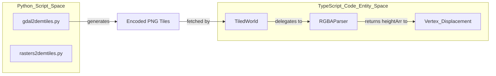

# 1bto4b & demtiles Tilers

Relevant source files

The following files were used as context for generating this wiki page:

- [.eslintrc.js](.eslintrc.js)
- [README.md](README.md)
- [docs/assets/images/screenshot1.png](docs/assets/images/screenshot1.png)
- [src/parsers/tif.ts](src/parsers/tif.ts)
- [travis.yml](travis.yml)

The LithoSphere project provides a suite of Python-based tiling scripts designed to prepare raw geospatial data for 3D visualization. While `gdal2customtiles` serves as the primary general-purpose tiler, the specialized **1bto4b** and **demtiles** families handle specific conversion workflows, such as transforming 1-band grayscale rasters into 4-band RGBA tiles and processing Digital Elevation Models (DEMs) into encoded terrain tiles.

## Specialized Tiling Architecture

The specialized tilers are built as wrappers or variations of GDAL utilities. They focus on two primary transformations:
1.  **Channel Expansion**: Converting single-channel data (e.g., scientific grayscale imagery) into RGBA formats compatible with web browsers and LithoSphere's multi-texture shaders.
2.  **DEM Encoding**: Packing 32-bit floating-point elevation values into the Red, Green, and Blue channels of a PNG to preserve precision in a web-friendly format.

### Data Flow: Raw Raster to LithoSphere Tiles

The following diagram illustrates the data flow for these specialized scripts:

**Tiling Pipeline Flow**

Sources: [README.md:47-53](), [README.md:65-66]()

---

## 1bto4b Tilers

The `1bto4b` (1-band to 4-band) family of scripts is used when imagery is provided in a single band (often 8-bit or 16-bit grayscale) but needs to be rendered as RGBA tiles for transparency support or shader compatibility.

### Key Variants
*   **gdal2tiles1bto4b.py**: The standard implementation that extends `gdal2tiles` logic to force an alpha channel creation during the tiling process.
*   **rasterstotiles.py**: A batch processing wrapper that automates the execution of tiling scripts across multiple input files or directories.

### Implementation Details
These scripts typically utilize `gdal.Dataset.ReadAsArray` to extract raw pixel values and then construct a new 4-band array where:
*   **R, G, B**: Copied from the source band (or mapped via a color table).
*   **A (Alpha)**: Generated based on "NoData" values or a fixed opacity bit.

Sources: [README.md:39-48]()

---

## DEM Tilers

Digital Elevation Models (DEMs) require high precision that standard 8-bit grayscale PNGs cannot provide. LithoSphere uses a custom encoding scheme where elevation is packed into RGBA channels.

### gdal2demtiles.py
This script specifically targets the creation of terrain tiles. It ensures that the output tiles are compatible with the `RGBA Parser` used by the LithoSphere core to displace vertices on the globe.

### Encoding Logic
The script converts 32-bit float elevation values into a format where:
1.  The elevation value is scaled/offset if necessary.
2.  The resulting value is split into three 8-bit components stored in the R, G, and B channels.
3.  The LithoSphere `RGBAParser` reverses this process at runtime using bit-shifting logic.

### Batch Processing: rasters2demtiles.py
For large-scale missions where hundreds of DEM fragments exist, `rasters2demtiles.py` acts as a manager script. It performs the following:
1.  Scans a directory for `.tif` or `.vrt` files.
2.  Calculates the optimal zoom levels based on source resolution.
3.  Calls the underlying `gdal2demtiles` process for each fragment.

**Entity Mapping: Script to Code Logic**

Sources: [README.md:47-53](), [README.md:65-66](), [src/parsers/tif.ts:25-58]()

---

## Usage Comparison

| Script | Input Type | Primary Output | Use Case |
| :--- | :--- | :--- | :--- |
| **gdal2tiles1bto4b** | 1-band Raster | 4-band RGBA Tiles | Grayscale imagery requiring transparency or specific shader blending. |
| **rasterstotiles** | Multiple Rasters | Tile Folders | Bulk processing of image datasets into a single TMS structure. |
| **gdal2demtiles** | 32-bit Float DEM | RGBA Encoded PNG | Creating terrain for 3D vertex displacement. |
| **rasters2demtiles** | Multiple DEMs | Encoded Tile Set | Processing global or regional topographic datasets. |

## Integration with LithoSphere

Once tiles are generated by these scripts, they are consumed by the `TileLayer` system. For DEM tiles, the `demPath` property in the layer configuration must point to the output directory of the `demtiles` scripts.

1.  **Tile Request**: `TiledWorld` calculates required XYZ tiles based on the camera view.
2.  **Loading**: The system fetches the encoded PNG or `.tif` file.
3.  **Parsing**: If the layer is a DEM, it uses a parser like `TifParser` [src/parsers/tif.ts:9-15]() or the standard `RGBAParser`.
4.  **Seam Correction**: In `TifParser`, if `correctSeams` is enabled, a 2x2 kernel average is applied to smooth tile boundaries [src/parsers/tif.ts:26-58]().
5.  **Rendering**: The resulting `heightArr` is used to displace vertices of the tile mesh.

Sources: [README.md:39-46](), [src/parsers/tif.ts:9-59]()
