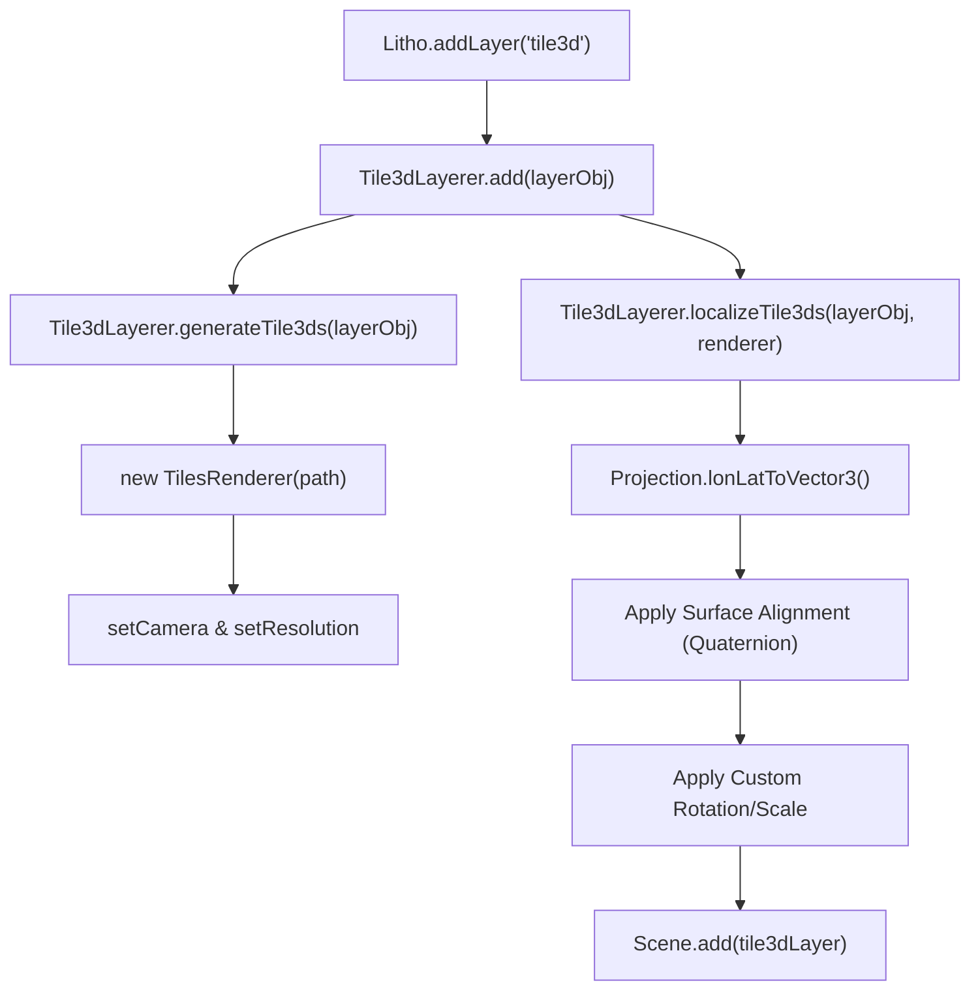
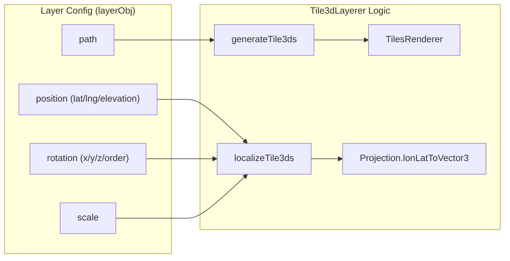

# 3D Tile Layers (tile3d)

<details>
<summary>Relevant source files</summary>

The following files were used as context for generating this wiki page:

- [dist/src/layers/tile3d.d.ts](dist/src/layers/tile3d.d.ts)
- [docs/pages/Layers/Tile3D/tile3d.markdown](docs/pages/Layers/Tile3D/tile3d.markdown)

</details>


The `tile3d` layer type provides integration for the **OGC 3D Tiles** specification within LithoSphere. It leverages the `3d-tiles-renderer` (specifically [3DTilesRendererJS](https://github.com/NASA-AMMOS/3DTilesRendererJS)) to load massive 3D mesh datasets via `tileset.json` files. This system manages Level of Detail (LOD) independently of the standard planet raster tiles, allowing for high-fidelity 3D reconstructions (e.g., Martian terrain from rover photogrammetry) to be localized and rendered on the planetary surface.

## Implementation Overview

The `Tile3dLayerer` class handles the lifecycle of 3D tile layers. Unlike standard raster tiles that are managed by the `TiledWorld` state machine, 3D tiles use a separate renderer instance that updates based on the camera's frustum and resolution.

### Data Flow and Initialization
When a layer is added via `Litho.addLayer('tile3d', options)`, the `Tile3dLayerer` performs the following steps:
1.  **Validation**: Checks for required properties: `name`, `on`, `path`, `opacity`, `minZoom`, and `maxZoom` [dist/src/layers/tile3d.d.ts:4-7]().
2.  **Renderer Instantiation**: Creates a new `TilesRenderer` pointing to the `tileset.json` URL via the private `generateTile3ds` method [dist/src/layers/tile3d.d.ts:8]().
3.  **Localization**: Converts geographic coordinates (lat/lng/elev) to 3D Cartesian space and aligns the model's "up" vector with the planet's surface normal via `localizeTile3ds` [dist/src/layers/tile3d.d.ts:9]().
4.  **Scene Integration**: Adds the resulting `Object3D` to the scene hierarchy.

### Localization Logic
Because 3D tilesets often use local coordinate systems, `Tile3dLayerer` must "anchor" the tileset to the globe. It uses the `Projection` class to calculate the target `Vector3` position based on the `position` object provided in the layer configuration [docs/pages/Layers/Tile3D/tile3d.markdown:24-28](). To ensure the model sits flat on the surface, it calculates the surface normal and applies a rotation to match the planet's curvature.

**3D Tile Layer Initialization Flow**

Sources: [dist/src/layers/tile3d.d.ts:1-10](), [docs/pages/Layers/Tile3D/tile3d.markdown:15-37]()

---

## Key Functions and Classes

### `Tile3dLayerer`
Located in `dist/src/layers/tile3d.d.ts`, this class manages the collection of 3D tilesets.

| Function | Description |
| :--- | :--- |
| `add(layerObj)` | Validates the configuration and initializes the `TilesRenderer` lifecycle [dist/src/layers/tile3d.d.ts:4](). |
| `generateTile3ds(layerObj)` | Private method that creates the `3d-tiles-renderer` instance and links it to the main camera and WebGL renderer [dist/src/layers/tile3d.d.ts:8](). |
| `localizeTile3ds(layerObj, renderer)` | Private method that handles coordinate transformation, surface normal alignment, and custom rotations/scaling [dist/src/layers/tile3d.d.ts:9](). |
| `setOpacity(name, opacity)` | Updates the opacity of the 3D tileset by traversing its child meshes [dist/src/layers/tile3d.d.ts:6](). |
| `toggle(name, on)` | Switches the visibility of the tileset [dist/src/layers/tile3d.d.ts:5](). |
| `remove(name)` | Cleans up the renderer and removes the tileset from the scene [dist/src/layers/tile3d.d.ts:7](). |

### Configuration Options
The `layerObj` for a `tile3d` layer supports specific spatial parameters:
*   `path`: URL to the `tileset.json` [docs/pages/Layers/Tile3D/tile3d.markdown:19-20]().
*   `position`: Contains `longitude`, `latitude`, and `elevation`. These define the anchor point on the planet [docs/pages/Layers/Tile3D/tile3d.markdown:24-28]().
*   `rotation`: Supports an `order` string (e.g., 'ZXY') and `x, y, z` values in radians to orient the model relative to the surface normal [docs/pages/Layers/Tile3D/tile3d.markdown:30-35]().
*   `scale`: Uniform scaling factor for the tileset [docs/pages/Layers/Tile3D/tile3d.markdown:29]().

**Entity Mapping: Layer Config to Code Logic**

Sources: [dist/src/layers/tile3d.d.ts:8-9](), [docs/pages/Layers/Tile3D/tile3d.markdown:15-37]()

---

## Comparison with Standard Raster Layers

Standard Tile Layers (`tile`) and 3D Tile Layers (`tile3d`) differ significantly in their rendering lifecycle and data structure.

| Feature | Raster Tile Layers (`tile`) | 3D Tile Layers (`tile3d`) |
| :--- | :--- | :--- |
| **Core Engine** | `TiledWorld` | `3d-tiles-renderer` [dist/src/layers/tile3d.d.ts:1]() |
| **LOD Management** | Quadtree based on zoom levels | Geometric Error based on camera distance [docs/pages/Layers/Tile3D/tile3d.markdown:22-23]() |
| **Geometry** | Plane meshes displaced by DEM | Arbitrary 3D meshes (B3DM, I3DM) |
| **Lifecycle** | Re-drawn every frame via global loop | Self-managing via internal `TilesRenderer` |
| **Localization** | Implicit via Tile XYZ addressing | Explicit via Geodetic-to-Cartesian transform [docs/pages/Layers/Tile3D/tile3d.markdown:24-28]() |

## Usage Example

```javascript
Litho.addLayer('tile3d', {
    name: '3dTileExample',
    order: 3,
    on: true,
    path: 'https://example.com/tileset.json',
    opacity: 0.6,
    minZoom: 11,
    maxZoom: 18,
    position: {
        longitude: 137.4091927368641,
        latitude: -4.626571631163808,
        elevation: -4470,
    },
    scale: 2,
    rotation: {
        x: 0,
        y: -Math.PI / 2,
        z: Math.PI / 4,
        order: 'ZXY',
    },
})
```
Sources: [docs/pages/Layers/Tile3D/tile3d.markdown:15-37]()
