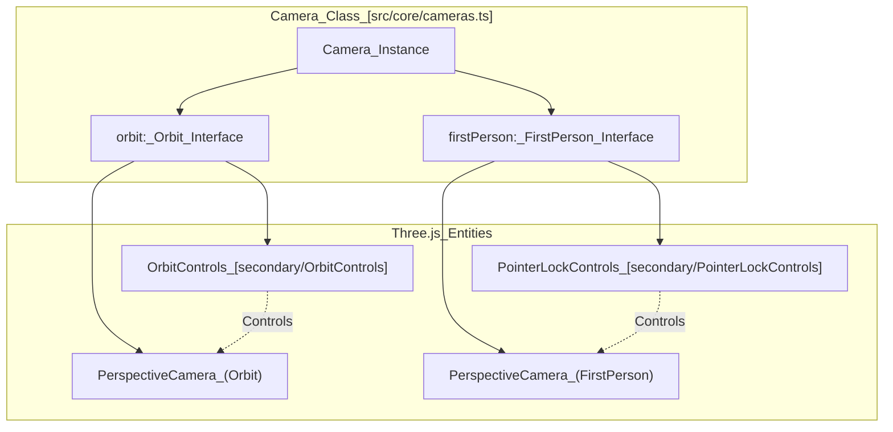
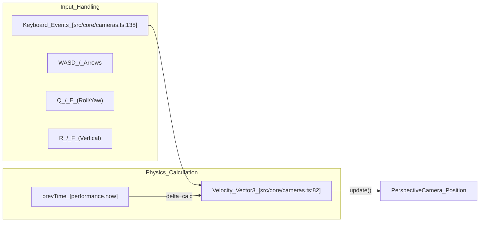

# Camera System

Relevant source files

The following files were used as context for generating this wiki page:

- [dist/src/core/cameras.d.ts](dist/src/core/cameras.d.ts)
- [dist/src/core/events.d.ts](dist/src/core/events.d.ts)
- [dist/src/secondary/OrbitControls.d.ts](dist/src/secondary/OrbitControls.d.ts)
- [dist/src/secondary/PointerLockControls.d.ts](dist/src/secondary/PointerLockControls.d.ts)
- [package-lock.json](package-lock.json)
- [src/core/cameras.ts](src/core/cameras.ts)
- [webpack.config.js](webpack.config.js)

The Camera System in LithoSphere provides a dual-mode navigation architecture designed to handle both global planetary observation and localized surface-level exploration. It manages two distinct camera setups—**Orbit** and **FirstPerson**—and handles the complex transitions, input bindings, and clipping plane adjustments required for seamless movement from space to the ground.

## Architecture Overview

The system is encapsulated in the `Camera` class, which maintains separate state for two camera modes. It uses `OrbitControls` for global rotation/zoom and `PointerLockControls` for a "walk" mode experience.

### Dual-Mode Camera Configuration
| Mode | Control Class | Primary Use Case | Clipping Planes (Near/Far) |
| :--- | :--- | :--- | :--- |
| **Orbit** | `OrbitControls` | Global navigation, rotating the planet, and zooming out to space. | `0.1` / `150,000,000,000` [src/core/cameras.ts:61-62]() |
| **FirstPerson** | `PointerLockControls` | Surface-level exploration, "walking" at eye-level. | `0.1` / `150,000,000` [src/core/cameras.ts:116-117]() |

### Camera Mode Logic
The following diagram illustrates the relationship between the `Camera` class and its underlying Three.js and control components.

**Camera System Entity Map**

Sources: [src/core/cameras.ts:25-42](), [src/core/cameras.ts:87-128]()

---

## Implementation Details

### Initialization and Setup
During the `_init` call, both cameras are instantiated as `PerspectiveCamera` objects with a 60-degree Field of View (FOV) [src/core/cameras.ts:87-128](). 

*   **Orbit Setup**: The camera's "up" vector is inverted to `(0, -1, 0)` to accommodate the coordinate system [src/core/cameras.ts:94](). Damping is enabled by default with a factor of `0.2` [src/core/cameras.ts:103-104](). The target is slightly offset to `y = 1` [src/core/cameras.ts:105]().
*   **FirstPerson Setup**: The camera object is added to the scene within a wrapper provided by `PointerLockControls` [src/core/cameras.ts:128](). A crosshair element is dynamically created and appended to the container to assist with center-screen targeting [src/core/cameras.ts:175-189]().

### Mode Switching (The `swap` Function)
Switching between modes is handled by the `swap` method [src/core/cameras.ts:143-154]().
1.  **Orbit to FirstPerson**: Calls `inToFirstPerson()`, which enables the crosshair, assigns the FirstPerson camera as the active camera, and resets the Orbit position [src/core/cameras.ts:156-163]().
2.  **FirstPerson to Orbit**: Calls `outFromFirstPerson()`, which disables the crosshair, disables the pointer lock, and reverts the active camera/controls to the Orbit instances [src/core/cameras.ts:164-170]().

### Pointer Lock Management
The system utilizes the Browser's Pointer Lock API to capture the mouse cursor during FirstPerson mode. This is managed via listeners for `pointerlockchange` [src/core/cameras.ts:199-205](). When the lock is acquired, the system automatically enters FirstPerson mode; when the lock is lost (e.g., by pressing ESC), it reverts to Orbit mode.

---

## Movement and Keyboard Bindings

LithoSphere implements a robust keyboard interaction system for both modes, with specialized logic for "walking" in FirstPerson mode.

### Movement Logic Flow

Sources: [src/core/cameras.ts:81-82](), [src/core/cameras.ts:138](), [src/core/cameras.ts:43-45]()

### Key Bindings Table
| Keys | Action (Orbit Mode) | Action (FirstPerson Mode) |
| :--- | :--- | :--- |
| **W / Up** | Pan Up / Zoom In | Move Forward |
| **S / Down** | Pan Down / Zoom Out | Move Backward |
| **A / Left** | Pan Left | Move Left |
| **D / Right** | Pan Right | Move Right |
| **Q / E** | Roll / Rotate | Look Left / Right |
| **R / F** | N/A | Move Up / Down |
| **T / G** | N/A | Tilt Up / Down |
| **Shift** | Increase speed multiplier | Increase movement speed |

Sources: [src/core/cameras.ts:34-38](), [src/core/cameras.ts:75-79](), [src/core/cameras.ts:44-45]()

---

## Plane Management

The system dynamically manages near and far clipping planes to prevent "Z-fighting" and ensure that both massive planetary scales and tiny surface details are visible.

*   **Near Plane**: Generally kept at `0.1` units to allow the camera to get very close to terrain or models [src/core/cameras.ts:61]().
*   **Far Plane**: The Orbit camera uses a massive far plane (`150,000,000,000`) to ensure the starsphere and distant planetary horizons are not clipped [src/core/cameras.ts:62]().
*   **Update Loop**: The camera's `update` method (typically called within the main rendering loop) calculates the `delta` time using `performance.now()` to ensure smooth, frame-rate independent movement [src/core/cameras.ts:81]().

Sources: [src/core/cameras.ts:58-69](), [src/core/cameras.ts:81](), [src/core/cameras.ts:47]()
