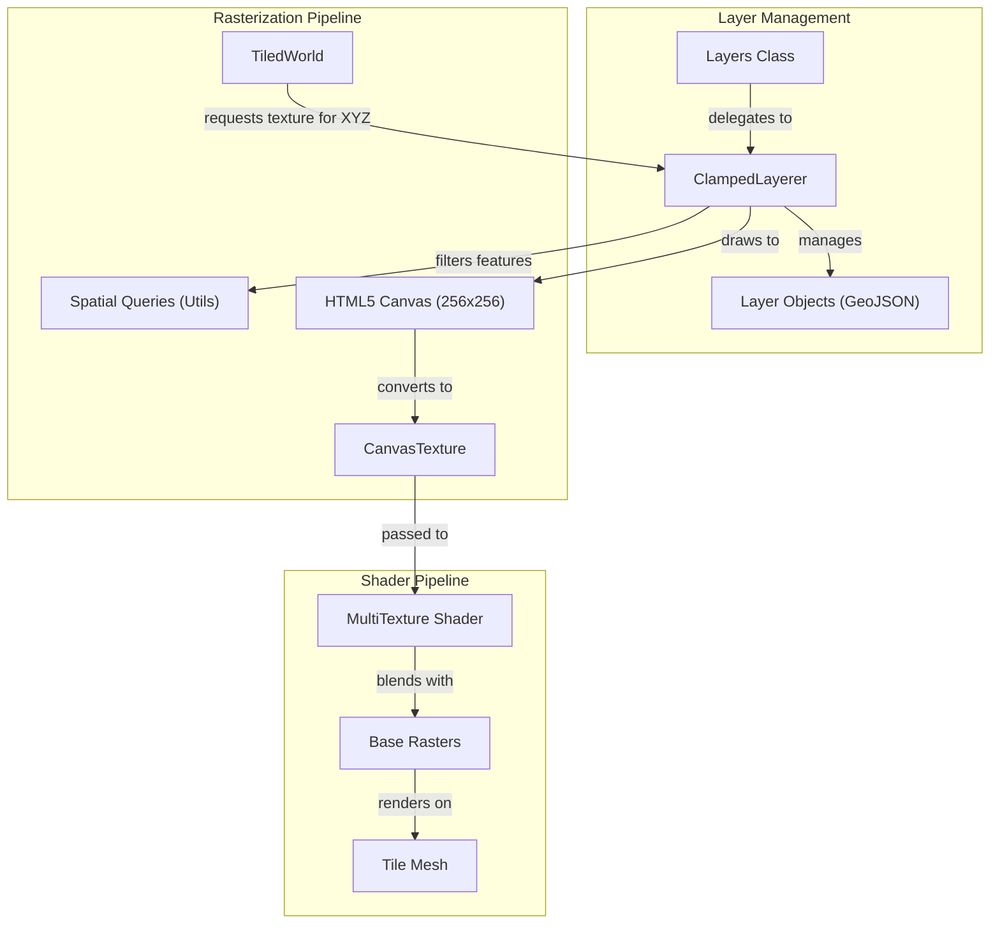
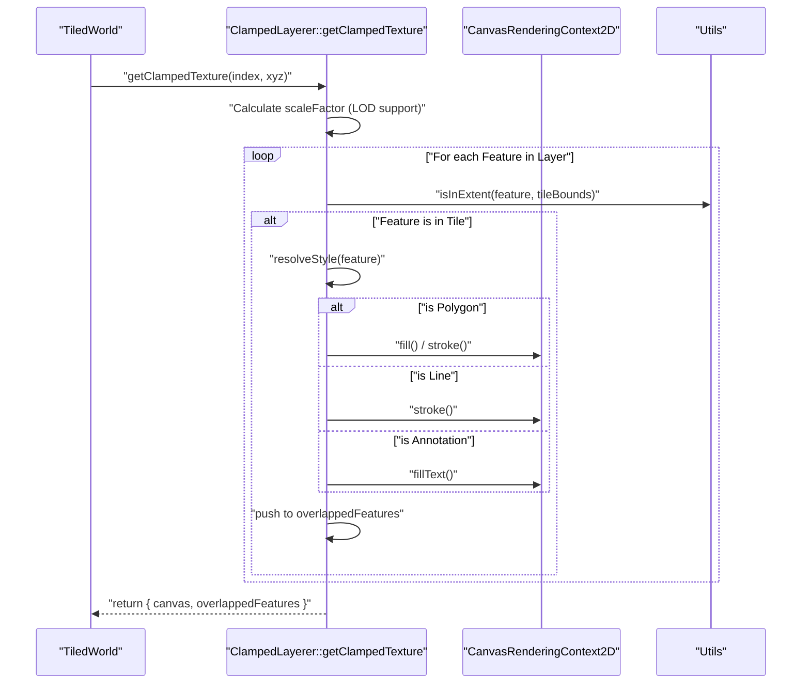

# Clamped Layers

Relevant source files

The following files were used as context for generating this wiki page:

- [docs/pages/Layers/Clamped/clamped.markdown](docs/pages/Layers/Clamped/clamped.markdown)
- [src/layers/clamped.ts](src/layers/clamped.ts)

Clamped layers provide a mechanism for rendering vector data (GeoJSON) directly onto the planet's terrain surface. Unlike standard 3D vector overlays, clamped layers are rasterized on-the-fly into 256×256 pixel canvases and blended into the tile textures via the shader pipeline. This ensures that features perfectly follow the topography of the terrain without depth-fighting or floating artifacts.

### Overview and Purpose

The `ClampedLayerer` class manages the lifecycle and rendering of these "Vector-As-Tile" (VAT) layers. It supports Polygons, LineStrings, and Points (including text annotations and bearing indicators). The primary advantage of this approach is performance for complex datasets and visual fidelity, as the features are "clamped" to the displaced terrain geometry.

### Data Flow and Lifecycle

When a clamped layer is added, the system either fetches GeoJSON data or uses provided objects. For every visible tile in the `TiledWorld`, the `ClampedLayerer` generates a unique texture for that specific tile's spatial extent.

#### Layer Management
- **Add/Remove**: Layers are added via `add` [src/layers/clamped.ts:15-83](), which can fetch remote GeoJSON via XHR [src/layers/clamped.ts:59-74]().
- **Visibility & Opacity**: Toggling visibility [src/layers/clamped.ts:85-101]() or changing opacity [src/layers/clamped.ts:124-146]() triggers a refresh of the `TiledWorld` rasters via `updateAllRasters` [src/layers/clamped.ts:97]().
- **Ordering**: The `orderLayers` function [src/layers/clamped.ts:103-122]() sorts the `clamped` array, which determines the drawing stack on the canvas [src/layers/clamped.ts:32]().

### Tile Rasterization Process

The core logic resides in `getClampedTexture` [src/layers/clamped.ts:170-205](). This function is called for each tile `XYZ` to produce a data URL or canvas representing the vector features within that tile's bounds.

#### 1. Canvas Setup & Scaling
A 256x256 canvas is initialized with `canvas.id = 'vectorsastile'` [src/layers/clamped.ts:174-175](). A `scaleFactor` is applied to handle Level of Detail (LOD) tiles, ensuring that as the camera zooms, the resolution of the rasterized vector remains consistent with the tile grid [src/layers/clamped.ts:171-181]().

#### 2. Feature Filtering
The system iterates through all GeoJSON features in the layer. It uses spatial utilities to determine if a feature's geometry intersects the current tile's bounding box [src/layers/clamped.ts:220-230]().

#### 3. Style Resolution
Styles are determined by a hierarchy:
1.  **Feature Properties**: If `letPropertiesStyleOverride` is true, it looks for a `style` object on the feature [docs/pages/Layers/Clamped/clamped.markdown:53-54]().
2.  **Layer Defaults**: The `style.default` object provided during layer creation [docs/pages/Layers/Clamped/clamped.markdown:55-63]().
3.  **Property-based Styling**: `byProp` rules can apply styles based on specific feature attributes [docs/pages/Layers/Clamped/clamped.markdown:70-72]().

#### 4. Drawing Geometry
- **Polygons**: Rendered using standard Canvas API `fill()` and `stroke()` [docs/pages/Layers/Clamped/clamped.markdown:66-69]().
- **Lines**: Rendered with `stroke()`, supporting `weight` and `color` [docs/pages/Layers/Clamped/clamped.markdown:64-65]().
- **Points**: Can be rendered as circles (using `radius`) or specialized indicators [docs/pages/Layers/Clamped/clamped.markdown:64-65]().

### Advanced Rendering Features

#### Annotations and Text
Clamped layers support text labels that follow the terrain. If a point feature has `properties.annotation: true`, the system uses `drawTextBorder` and `fillText` to render the label directly onto the tile canvas [docs/pages/Layers/Clamped/clamped.markdown:12-38]().

#### Bearing Indicators
For directional data (e.g., rover orientation), a bearing indicator can be drawn. This uses an `angleProp` (in radians or degrees) to rotate a directional sprite or shape at the feature's coordinate [docs/pages/Layers/Clamped/clamped.markdown:73-77]().

#### Overlapped Feature Tracking
The `getClampedTexture` function maintains an `overlappedFeatures` array [src/layers/clamped.ts:186](). This tracks which GeoJSON features were drawn onto a specific tile, enabling the `Events` system to perform raycasting against the rasterized features for hover and click interactions.

### System Architecture Diagram

This diagram shows the relationship between the `ClampedLayerer` and the rendering components.

**Clamped Layer Integration**

Sources: [src/layers/clamped.ts:7-13](), [src/layers/clamped.ts:170-182](), [docs/pages/Layers/Clamped/clamped.markdown:1-10]()

### Code Entity Mapping

The following diagram maps the logical rendering steps to the specific functions and properties within `clamped.ts`.

**Rasterization Logic Flow**

Sources: [src/layers/clamped.ts:170-205](), [src/layers/clamped.ts:15-83]()

### Configuration Reference

| Property | Type | Description |
| :--- | :--- | :--- |
| `geojsonPath` | `string` | URL to a GeoJSON file to be fetched and rasterized [src/layers/clamped.ts:50](). |
| `geojson` | `object` | Direct GeoJSON object [src/layers/clamped.ts:51](). |
| `style` | `object` | Styling rules including `default`, `point`, `line`, and `polygon` [docs/pages/Layers/Clamped/clamped.markdown:52-78](). |
| `preDrawn` | `boolean` | If true, bypasses vector drawing and uses pre-rendered tile data [src/layers/clamped.ts:49](). |
| `order` | `number` | Z-index relative to other clamped layers [src/layers/clamped.ts:32](). |
| `opacity` | `number` | Alpha transparency (0.0 to 1.0) of the rasterized layer [src/layers/clamped.ts:124](). |

Sources: [src/layers/clamped.ts:46-52](), [docs/pages/Layers/Clamped/clamped.markdown:42-95]()
