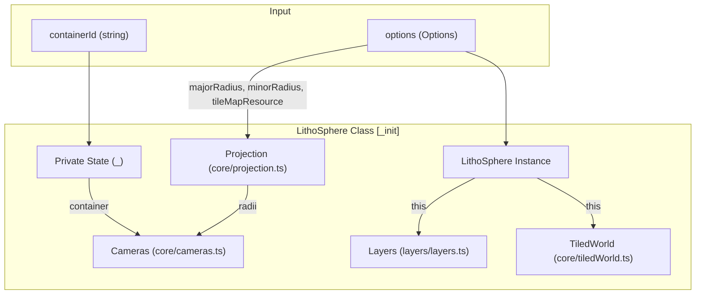
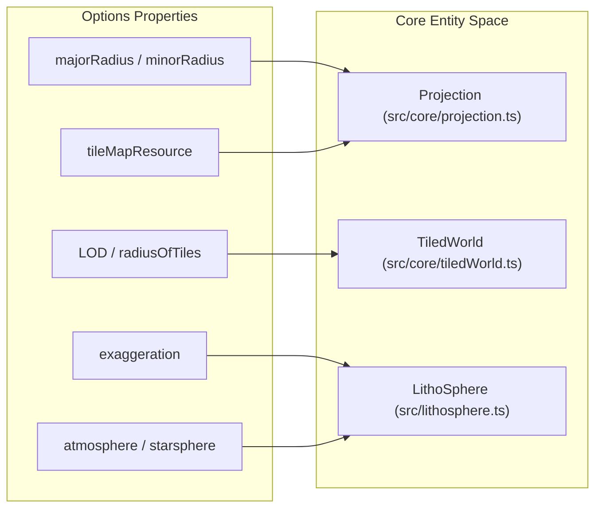

# Constructor & Configuration Options

<details>
<summary>Relevant source files</summary>

The following files were used as context for generating this wiki page:

- [dist/src/constants.d.ts](dist/src/constants.d.ts)
- [dist/src/lithosphere.d.ts](dist/src/lithosphere.d.ts)
- [docs/favicon.ico](docs/favicon.ico)
- [docs/pages/Constructor/constructor.markdown](docs/pages/Constructor/constructor.markdown)
- [src/generalTypes.d.ts](src/generalTypes.d.ts)
- [src/lithosphere.ts](src/lithosphere.ts)

</details>


The `LithoSphere` class is the entry point for the library. It orchestrates the initialization of the rendering engine, coordinate projections, tile management, and user interactions. Instantiation requires a target HTML container and a configuration object that defines the planetary physical properties and rendering behaviors.

## The LithoSphere Constructor

The constructor initializes the internal state, sets up the Three.js scenes (including Level of Detail layers), and triggers the core subsystem initialization sequence [src/lithosphere.ts:95-168](). It also creates a sub-container `_lithosphere_scene` within the provided element to host the WebGL canvas [src/lithosphere.ts:97-102]().

```typescript
new LithoSphere(containerId: string, options: Options)
```

| Parameter | Type | Required | Description |
| :--- | :--- | :--- | :--- |
| `containerId` | `string` | Yes | The ID of the HTML element where LithoSphere will draw [src/lithosphere.ts:95-98](). |
| `options` | `Options` | No | Top-level configurations for the globe and renderer [src/lithosphere.ts:143-165](). |

### Data Flow: Initialization Sequence
The diagram below illustrates how the constructor parameters flow into the internal systems during the `_init()` call [src/lithosphere.ts:170-211]().

**Constructor Data Flow**

Sources: [src/lithosphere.ts:95-131](), [src/lithosphere.ts:181-211]()

---

## Configuration Options (`Options` Interface)

The `Options` interface defines the physical parameters of the planet and the technical constraints of the tile engine.

### Planetary & Projection Settings
These settings define the shape of the world and how coordinates are mapped.

*   **`majorRadius`** (`number`): Semi-major planetary radius in meters. Defaults to 6,371,000 (Earth) [src/generalTypes.d.ts:94](), [docs/pages/Constructor/constructor.markdown:35]().
*   **`minorRadius`** (`number`): Semi-minor planetary radius. Defaults to `majorRadius` if not specified [src/generalTypes.d.ts:95](), [docs/pages/Constructor/constructor.markdown:36]().
*   **`tileMapResource`** (`TileMapResource`): Configures the projection, CRS (Coordinate Reference System), and tile bounds [src/generalTypes.d.ts:99](), [src/generalTypes.d.ts:1-9]().
*   **`exaggeration`** (`number`): Multiplier for terrain elevation. Default is `1` [src/lithosphere.ts:158](), [src/generalTypes.d.ts:124]().
*   **`demFallback`** (`object`): A DEM configuration to use if a specific layer's DEM fails to load [docs/pages/Constructor/constructor.markdown:40]().

### Level of Detail (LOD) & Performance
*   **`useLOD`** (`boolean`): Enables rendering of background LOD tiles. Default `true` [src/lithosphere.ts:148]().
*   **`LOD`** (`object[]`): Array defining LOD steps. Each step specifies `radiusOfTiles` (distance) and `zoomsUp` (zoom level offset) [src/lithosphere.ts:149-153]().
*   **`tileResolution`** (`number`): Vertices per side for tile geometry. Default `32` [src/lithosphere.ts:154]().
*   **`trueTileResolution`** (`number`): Pixel dimension of source image tiles. Default `256` [src/lithosphere.ts:155]().
*   **`renderOnlyWhenOpen`** (`boolean`): Skips updates if the container has zero area. Default `true` [src/lithosphere.ts:159]().

### View & Camera
*   **`initialView`** (`LatLngZ`): Starting `lat`, `lng`, and `zoom` [src/generalTypes.d.ts:89]().
*   **`initialCamera`** (`InitialCamera`): Explicit world-space `position` and `target` for the camera [src/generalTypes.d.ts:90](), [src/generalTypes.d.ts:34-45]().

### Environment & Visuals
*   **`starsphere`** (`object`): Background star field texture `url` and fallback `color` [src/generalTypes.d.ts:101-104]().
*   **`atmosphere`** (`object`): Fresnel glow effect `color` [src/generalTypes.d.ts:105-107]().
*   **`loadingScreen`** (`boolean`): Shows a blur overlay until initial content loads [src/lithosphere.ts:144]().
*   **`wireframeMode`** (`boolean`): Renders terrain as lines for debugging [src/lithosphere.ts:157]().

---

## Entity Mapping: Configuration to Code

This diagram maps specific configuration properties to the core classes that ingest and manage them.

**Configuration Entity Mapping**

Sources: [src/lithosphere.ts:181-187](), [src/lithosphere.ts:211](), [src/lithosphere.ts:232-255]()

---

## Implementation Details

### Scene Hierarchy
The constructor initializes a multi-scene hierarchy to handle different rendering priorities and LOD layers [src/lithosphere.ts:135-141]():

1.  **`sceneBack`**: Background layer for `starsphere` and `atmosphere`.
2.  **`scenesLOD`**: An array of three scenes used for background LOD tiles to prevent flickering and manage depth.
3.  **`scene`**: The main scene containing the primary `planet` object.
4.  **`sceneFront`**: Foreground layer for the `frontGroup` (UI, markers, overlays).

### Default Options Reference
The library applies a set of default values if the `options` object is incomplete [src/lithosphere.ts:143-163]():

| Option | Default Value |
| :--- | :--- |
| `radiusOfTiles` | 4 |
| `useLOD` | true |
| `tileResolution` | 32 |
| `trueTileResolution` | 256 |
| `exaggeration` | 1 |
| `loadingScreen` | true |
| `highlightColor` | 'yellow' |
| `activeColor` | 'red' |

Sources: [src/lithosphere.ts:95-168](), [src/generalTypes.d.ts:88-131](), [docs/pages/Constructor/constructor.markdown:22-55]()
