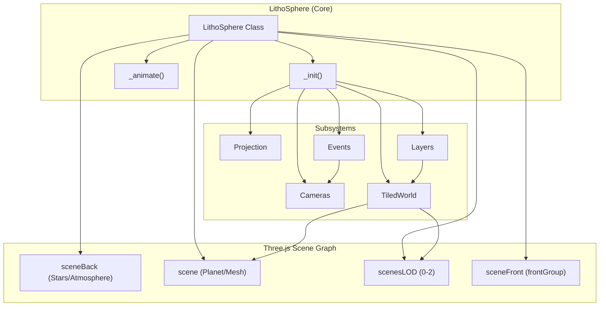
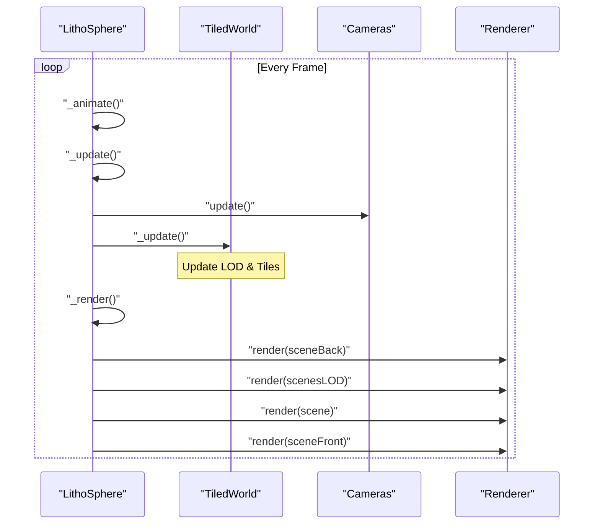

# Core Architecture

Relevant source files

The following files were used as context for generating this wiki page:

- [dist/src/controls/link.d.ts](dist/src/controls/link.d.ts)
- [dist/src/controls/observe.d.ts](dist/src/controls/observe.d.ts)
- [dist/src/core/renderer.d.ts](dist/src/core/renderer.d.ts)
- [dist/src/core/shaders.d.ts](dist/src/core/shaders.d.ts)
- [dist/src/layers/vector.d.ts](dist/src/layers/vector.d.ts)
- [dist/src/lithosphere.d.ts](dist/src/lithosphere.d.ts)
- [dist/src/secondary/sprites.d.ts](dist/src/secondary/sprites.d.ts)
- [src/core/renderer.ts](src/core/renderer.ts)
- [src/lithosphere.ts](src/lithosphere.ts)

The `LithoSphere` class serves as the central orchestrator for the entire library. It manages the lifecycle of the Three.js rendering engine, coordinates the tiled world's Level of Detail (LOD) system, and provides a unified API for layer management, camera control, and geospatial projections.

### The LithoSphere Class

The `LithoSphere` constructor initializes several core subsystems and creates a multi-scene structure to handle different rendering priorities (e.g., background stars vs. foreground UI elements). It maintains a `Private` state object (`_`) to track internal counters, camera states, and the `TiledWorld` instance.

**Key Responsibilities:**
*   **Scene Management**: Maintains `sceneBack` (atmosphere/stars), `scene` (the planet), `scenesLOD` (multi-resolution tiles), and `sceneFront` (overlays) [src/lithosphere.ts:135-141]().
*   **API Exposure**: Proxies essential methods from the `Layers` and `Controls` subsystems to the top-level instance for developer convenience [src/lithosphere.ts:199-208]().
*   **Lifecycle Control**: Orchestrates the `_animate` -> `_update` -> `_render` loop [src/lithosphere.ts:67-69]().

**Sources:** [src/lithosphere.ts:63-142](), [dist/src/lithosphere.d.ts:34-64]()

---

### System Component Overview

The following diagram illustrates how the `LithoSphere` class integrates various internal modules and Three.js entities.

**LithoSphere Component Relationship**

**Sources:** [src/lithosphere.ts:170-212](), [src/lithosphere.ts:135-141]()

---

### Core Subsystems

#### [Rendering Pipeline](#2.1)
LithoSphere uses a custom rendering loop that manages multiple Three.js scenes to optimize depth testing and visual layering. The `Renderer` class wraps the `WebGLRenderer` [src/core/renderer.ts:29-33](), while the main loop uses `requestAnimationFrame` to trigger updates. To maintain performance, some calculations are throttled via `updateEveryNthRender` [src/lithosphere.ts:118]().
*   **For details, see [Rendering Pipeline](#2.1)**

#### [Projection & Coordinate Systems](#2.2)
The `Projection` class handles the conversion between Geodetic coordinates (Lat/Lng/Height) and 3D Cartesian space (X, Y, Z). It accounts for planetary radii (`majorRadius`, `minorRadius`) and flattening factors, and supports various tile addressing schemes via the `tileMapResource` [src/lithosphere.ts:181-187]().
*   **For details, see [Projection & Coordinate Systems](#2.2)**

#### [Tiled World & LOD System](#2.3)
The `TiledWorld` class manages the lifecycle of terrain tiles. It implements a state machine to handle asynchronous tile loading, vertex displacement for Digital Elevation Models (DEM), and multi-texture blending for imagery layers using `radiusOfTiles` and `LOD` configurations [src/lithosphere.ts:147-153]().
*   **For details, see [Tiled World & LOD System](#2.3)**

#### [Camera System](#2.4)
The `Cameras` subsystem provides a dual-mode interface: `Orbit` for global globe-view navigation and `FirstPerson` (PointerLock) for surface-level exploration [src/lithosphere.ts:190-195](). It dynamically adjusts near/far clipping planes based on altitude.
*   **For details, see [Camera System](#2.4)**

#### [Events & Interaction](#2.5)
The `Events` class manages user input, including mouse interactions, touch gestures, and keyboard shortcuts. It implements a `Raycaster` pipeline to detect features on the planet surface and handles globe rotation damping [src/lithosphere.ts:113-117]().
*   **For details, see [Events & Interaction](#2.5)**

#### [Shaders & Materials](#2.6)
The `Shaders` factory generates dynamic GLSL code for the `multiTexture` material. This allows for real-time adjustments of brightness, contrast, and saturation across multiple imagery layers, as well as atmospheric Fresnel effects [dist/src/core/shaders.d.ts:2-6]().
*   **For details, see [Shaders & Materials](#2.6)**

---

### Data Flow & Execution Loop

The execution flow starts in `_animate`, which coordinates the update of physics/logic and the final draw call.

**Main Loop Execution Flow**

| Method | File | Purpose |
| :--- | :--- | :--- |
| `_animate` | [src/lithosphere.ts:67]() | Entry point for `requestAnimationFrame`. |
| `_update` | [src/lithosphere.ts:69]() | Updates camera matrices, `TiledWorld` LOD, and `Events`. |
| `_render` | [src/lithosphere.ts:68]() | Executes the multi-pass rendering for all scenes. |

**Sources:** [src/lithosphere.ts:67-69](), [dist/src/lithosphere.d.ts:67-69](), [src/core/renderer.ts:60-65]()
