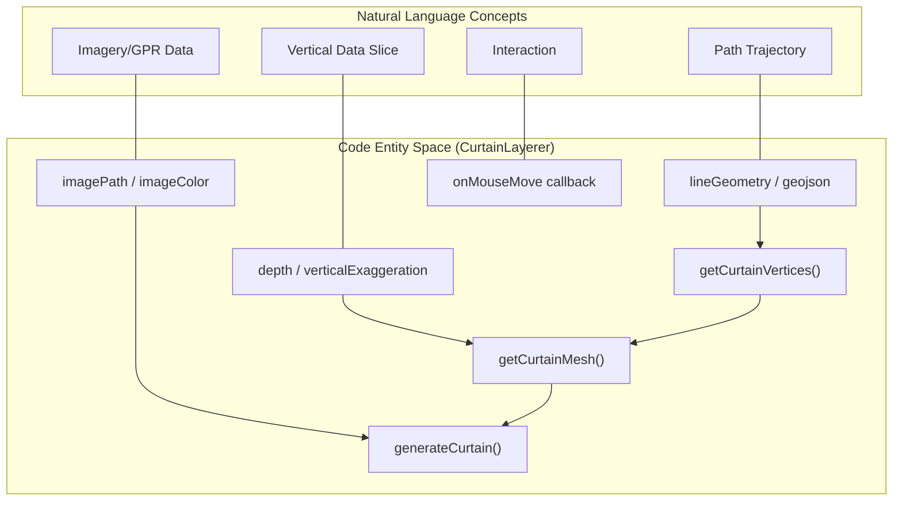
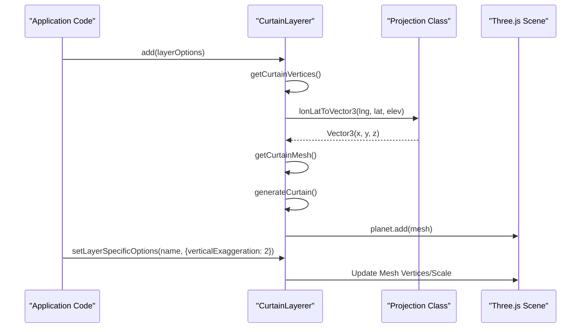

# Curtain Layers

Relevant source files

The following files were used as context for generating this wiki page:

- [dist/src/layers/curtain.d.ts](dist/src/layers/curtain.d.ts)
- [dist/src/secondary/loadingScreen.d.ts](dist/src/secondary/loadingScreen.d.ts)
- [docs/pages/Layers/Curtain/curtain.markdown](docs/pages/Layers/Curtain/curtain.markdown)

The **Curtain Layer** is a specialized vertical data slice layer used to render 2D imagery—such as ground-penetrating radar (GPR) radargrams or cross-sectional seismic data—draped along a 3D path defined by a GeoJSON `LineString`. Unlike standard tile layers that lie flat on the terrain, Curtain layers extend vertically downwards (or upwards) from a specific geographic trajectory.

## Implementation Overview

The `CurtainLayerer` class manages the lifecycle of these vertical meshes. It handles the conversion of geographic coordinates into a 3D "curtain" mesh, applies texture mapping (UVs), and provides hooks for spatial interaction.

### System Flow: Natural Language to Code Entities

The following diagram illustrates how high-level curtain concepts map to specific class methods and properties within the `CurtainLayerer` implementation.

**Curtain Layer Mapping**

Sources: [dist/src/layers/curtain.d.ts:1-12](), [docs/pages/Layers/Curtain/curtain.markdown:14-25]()

## Mesh Construction

The curtain is constructed as a vertical strip of geometry. The top edge of the strip follows the coordinates provided in the `lineGeometry` or `geojson` parameters.

### Vertex Generation
The `getCurtainVertices` method calculates the 3D Cartesian positions for the mesh. For every point in the input `LineString`, two vertices are created:
1.  **Top Vertex**: Positioned at the exact longitude, latitude, and elevation provided in the GeoJSON.
2.  **Bottom Vertex**: Positioned at the same longitude and latitude, but with the elevation offset by the `depth` parameter (multiplied by `verticalExaggeration`).

### Geometry and UV Mapping
The `getCurtainMesh` function assembles these vertices into a mesh. 
*   **UV Mapping**: The horizontal `U` coordinate (0 to 1) is distributed along the length of the `LineString`. The vertical `V` coordinate (0 to 1) spans from the top vertex to the bottom vertex. This allows a 2D image to be perfectly "draped" as a vertical wall.
*   **Materials**: If an `imagePath` is provided, a `TextureLoader` is used [docs/pages/Layers/Curtain/curtain.markdown:36-37](). If `imageColor` is an array, the system can generate a vertical gradient [docs/pages/Layers/Curtain/curtain.markdown:20-20]().

Sources: [dist/src/layers/curtain.d.ts:9-11](), [docs/pages/Layers/Curtain/curtain.markdown:29-69]()

## Interaction and Callbacks

Curtain layers support a specific `onMouseMove` callback. When the user's mouse intersects the curtain mesh, the raycasting engine returns detailed intersection data [docs/pages/Layers/Curtain/curtain.markdown:58-68]().

| Callback Argument | Description |
| :--- | :--- |
| `intersection.uv` | The normalized (0-1) coordinates on the 2D image where the mouse is pointing. |
| `intersectedLngLat` | The geographic coordinate projected onto the curtain surface. |
| `intersectionXYZ` | The raw 3D Cartesian coordinates of the intersection. |

This is particularly useful for scientific data, allowing users to find the exact depth and geographic location of features within a radargram.

Sources: [docs/pages/Layers/Curtain/curtain.markdown:58-68]()

## Layer Management

The `CurtainLayerer` provides standard methods for managing the state of curtain meshes within the `Three.js` scene.

### Key Methods

| Method | Description |
| :--- | :--- |
| `add(layerObj, callback)` | Validates the GeoJSON and imagery, generates the mesh, and adds it to the planet scene [dist/src/layers/curtain.d.ts:4-4](). |
| `toggle(name, on)` | Switches the `visible` property of the curtain mesh [dist/src/layers/curtain.d.ts:5-5](). |
| `setOpacity(name, opacity)` | Updates the `material.opacity` of the mesh [dist/src/layers/curtain.d.ts:6-6](). |
| `setLayerSpecificOptions(name, options)` | Dynamically updates `verticalExaggeration` or `verticalOffset` without recreating the entire layer [dist/src/layers/curtain.d.ts:8-8](). |

**Internal Data Flow**

Sources: [dist/src/layers/curtain.d.ts:4-8](), [docs/pages/Layers/Curtain/curtain.markdown:76-80]()

## Configuration Options

| Parameter | Type | Description |
| :--- | :--- | :--- |
| `depth` | `number` | The vertical height of the curtain in meters [docs/pages/Layers/Curtain/curtain.markdown:21-21](). |
| `lineGeometry` | `GeoJSON` | The path for the top of the curtain. Supports 3D coordinates `[lng, lat, elev]` [docs/pages/Layers/Curtain/curtain.markdown:23-23](). |
| `verticalExaggeration` | `number` | Multiplier for the `depth`. Part of the `options` object [docs/pages/Layers/Curtain/curtain.markdown:45-45](). |
| `verticalOffset` | `number` | Shifts the entire curtain vertically [docs/pages/Layers/Curtain/curtain.markdown:46-46](). |

Sources: [docs/pages/Layers/Curtain/curtain.markdown:14-25](), [docs/pages/Layers/Curtain/curtain.markdown:43-47]()
