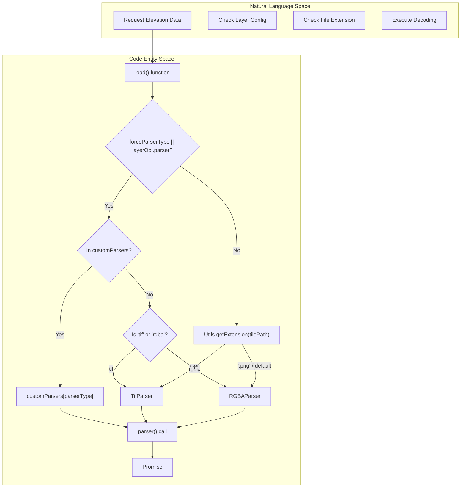
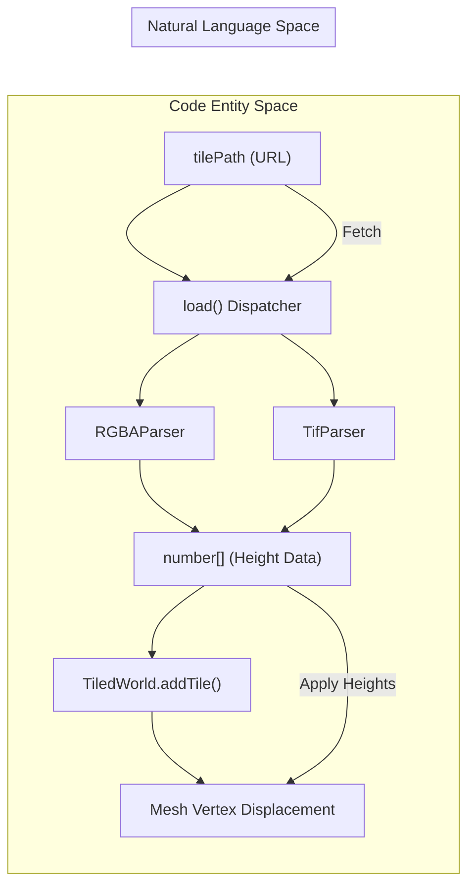

# Data Parsers

Relevant source files

The following files were used as context for generating this wiki page:

- [dist/src/parsers/demt.d.ts](dist/src/parsers/demt.d.ts)
- [src/parsers/index.ts](src/parsers/index.ts)

The **Data Parsers** subsystem is responsible for converting remote Digital Elevation Model (DEM) data into numerical height arrays. These arrays are utilized by the `TiledWorld` system to perform vertex displacement on tile meshes, creating realistic 3D terrain. The pipeline abstracts the differences between various storage formats—such as bit-packed PNGs and raw GeoTIFFs—into a unified interface that returns a `Promise<number[]>`.

## Parser Dispatch Logic

The entry point for all elevation data decoding is the `load` function defined in `src/parsers/index.ts`. This function acts as a dispatcher, determining which specific parser to instantiate based on layer configuration, explicit overrides, or file extensions.

The dispatch logic follows a specific hierarchy of precedence:
1.  **Custom Parsers**: If a `forceParserType` or `layerObj.parser` is provided and exists in the `customParsers` registry, it is used first [[src/parsers/index.ts:19-22]]().
2.  **Explicit Default Parsers**: If the `parserType` matches "tif" or "rgba", the corresponding internal parser is selected [[src/parsers/index.ts:23-35]]().
3.  **File Extension Inference**: If no parser type is specified, the system uses `Utils.getExtension` to infer the format from the `tilePath`. `.tif` files default to the GeoTIFF parser, while `.png` files (and all other fallbacks) default to the RGBA parser [[src/parsers/index.ts:38-49]]().

### Parser Dispatcher Flow

The following diagram illustrates how the `load` function resolves which parser to execute for a given tile request.

"Parser Dispatcher Flow"

Sources: [src/parsers/index.ts:6-59](), [src/parsers/index.ts:19-22](), [src/parsers/index.ts:38-49]()

## Supported Formats

LithoSphere provides two primary built-in parsers to handle different data delivery strategies.

### RGBA Parser
The `RGBAParser` is the default mechanism for elevation data in LithoSphere [[src/parsers/index.ts:33]](). It decodes 32-bit floating-point elevation values that have been encoded into the Red, Green, Blue, and Alpha channels of a standard PNG image. This format is highly efficient for web delivery as it leverages browser-native image loading before performing bit-manipulation to reconstruct the height values.

For details on the bit-packing algorithm and PNG.js integration, see **[RGBA Parser](#5.1)**.

### GeoTIFF (TIF) Parser
The `TifParser` handles raw raster data stored in GeoTIFF format [[src/parsers/index.ts:29]](). Unlike the RGBA parser, which requires a custom encoding step during tiling, the GeoTIFF parser can read 32-bit floating-point or integer samples directly. It utilizes the `geotiff` secondary library to parse the file structure and extract the raster grid.

For details on how raw raster data is mapped to the vertex grid, see **[GeoTIFF (TIF) Parser](#5.2)**.

## Parser Interface

All parsers, whether internal or custom, must conform to the signature expected by the `load` function [[src/parsers/index.ts:6-14]](). This ensures that the `TiledWorld` displacement logic remains decoupled from the underlying file format.

| Parameter | Type | Description |
| :--- | :--- | :--- |
| `tilePath` | `string` | The URL or path to the DEM tile resource. |
| `layerObj` | `any` | The configuration object for the layer (contains parser settings). |
| `xyz` | `any` | The tile coordinates (x, y, z). |
| `tileResolution` | `number` | The pixel resolution of the tile (e.g., 256). |
| `numberOfVertices` | `number` | The target size of the output array (matching the mesh geometry). |

Sources: [src/parsers/index.ts:6-14](), [src/parsers/index.ts:51]()

## Integration with Tiled World

The elevation data returned by these parsers is a flat array of numbers representing the height at each vertex of a tile's plane geometry. The `TiledWorld` system awaits the `Promise` returned by the `load` function and then applies these values to the mesh geometry, adjusted by the global `exaggeration` factor.

"Data Flow from Parser to Mesh"

Sources: [src/parsers/index.ts:14-15](), [src/parsers/index.ts:51-54]()
