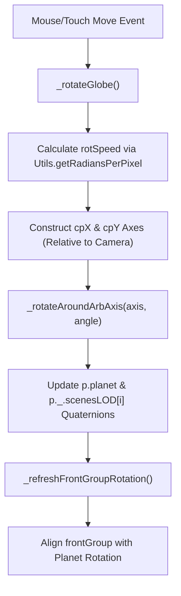
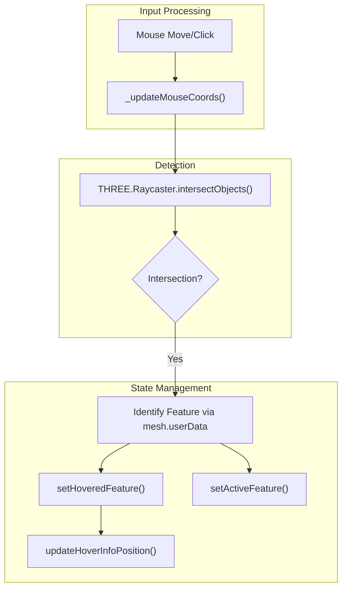

# Events & Interaction

Relevant source files

The following files were used as context for generating this wiki page:

- [dist/src/layers/model.d.ts](dist/src/layers/model.d.ts)
- [docs/pages/Layers/Model/model.markdown](docs/pages/Layers/Model/model.markdown)
- [src/core/events.ts](src/core/events.ts)
- [src/layers/model.ts](src/layers/model.ts)
- [src/secondary/loadingScreen.ts](src/secondary/loadingScreen.ts)

The `Events` class is the central hub for handling user input and translating it into planetary interactions. It manages the lifecycle of mouse, touch, and keyboard events to drive globe rotation, zooming, feature selection via raycasting, and dynamic UI feedback such as tooltips and sprite attenuation.

## Event Initialization and Binding

The `Events` class initializes by attaching listeners to the `sceneContainer` and the global `window` object [src/core/events.ts:56-111](). It coordinates with the `Camera` and `Controls` subsystems to ensure that interactions (like rotating the globe) respect the current camera mode (Orbit vs. First Person) [src/core/events.ts:127-136]().

| Event Type | Handler | Purpose |
| :--- | :--- | :--- |
| `mousewheel` / `wheel` | `_onZoom` | Handles incremental zooming and `desiredZoom` logic [src/core/events.ts:60-70](). |
| `mousedown` | `_rotateGlobe_MouseDown` | Initiates globe rotation or panning [src/core/events.ts:78-81](). |
| `mousemove` | `_onMouseMove` | Updates coordinates, handles hover detection, and tooltips [src/core/events.ts:84-88](). |
| `click` | `_onClick` | Triggers feature selection and "Active Feature" state [src/core/events.ts:89-89](). |
| `keydown` | `_onKeyDown` | Handles keyboard shortcuts for camera and UI [src/core/events.ts:106-106](). |
| `touchend` | `_onTouchZoom` | Manages pinch-to-zoom and touch interactions [src/core/events.ts:76-76](). |

Sources: [src/core/events.ts:56-111](), [src/core/events.ts:127-136]()

## Globe Rotation & Damping

LithoSphere implements a custom rotation model for the globe when in Orbit mode. Instead of rotating the camera around the object, the system rotates the planet itself (and its associated LOD groups) around arbitrary axes relative to the camera's view [src/core/events.ts:113-182]().

### Rotation Logic
The `_rotateGlobe` function calculates a `rotSpeed` based on the current `trueZoom` and planetary radius [src/core/events.ts:139-142](). It determines two perpendicular vectors (`cpX` and `cpY`) relative to the camera's forward vector to serve as rotation axes [src/core/events.ts:148-160]().

### Damping
When the user releases the mouse after a drag, `_rotateGlobe_MouseUp` calculates the velocity of the final movement [src/core/events.ts:246-258](). If the velocity exceeds a threshold, a `rotationDampingInterval` is set to continue the rotation, gradually decaying the speed until it stops [src/core/events.ts:260-276]().

### Coordinate Mapping: Interaction to Code
The following diagram shows how physical mouse movements are translated into 3D transformations within the `Events` class.

**Globe Rotation Pipeline**

Sources: [src/core/events.ts:113-182](), [src/core/events.ts:246-276](), [src/core/events.ts:311-325]()

## Zoom Management

LithoSphere uses a "Desired Zoom" system to prevent excessive tile loading during rapid scroll actions.

- **`desiredZoom`**: When a user scrolls, the target zoom level is stored in `_ .desiredZoom` [src/core/events.ts:413-418]().
- **`zoomWait`**: The system waits for a specific number of frames (`zoomWait`, default 30) after the last scroll event before triggering a heavy `refreshTiles` call [src/core/events.ts:47-47](), [src/core/events.ts:381-402]().
- **`zCutOff`**: A threshold that determines when the camera target should snap to the globe center vs. the surface elevation [src/core/events.ts:193-205]().

Sources: [src/core/events.ts:47-47](), [src/core/events.ts:193-205](), [src/core/events.ts:381-418]()

## Raycasting & Feature Detection

Feature interaction is handled through a raycasting pipeline in `_onMouseMove` and `_onClick`.

1.  **Mouse Projection**: `_updateMouseCoords` converts screen pixels to normalized device coordinates (NDC) [src/core/events.ts:611-618]().
2.  **Raycasting**: The system uses `THREE.Raycaster` to detect intersections with meshes in the scene.
3.  **Feature Identification**: If an intersection is found, the system checks for associated GeoJSON metadata.
    -   **Hover**: Sets `hoveredFeature` and renders a tooltip via `updateHoverInfoPosition` [src/core/events.ts:635-650]().
    -   **Click**: Sets `activeFeature` and triggers the `onFeatureClick` callback defined in the layer options [src/core/events.ts:513-540]().

**Feature Selection Logic**

Sources: [src/core/events.ts:513-540](), [src/core/events.ts:611-650]()

## Sprite Attenuation

To maintain visual clarity, sprites (markers) are attenuated based on their distance from the camera. The `_attenuate` function iterates through objects in the scene and adjusts their scale [src/core/events.ts:806-832](). This ensures that markers do not appear too large when zoomed out or too small when zoomed in, providing a consistent UI experience across different scales.

Sources: [src/core/events.ts:806-832]()

## Tooltip Rendering

The `hoverInfo` element is a dynamic HTML overlay managed by the `Events` class [src/core/events.ts:31-31]().
-   **Content**: Populated using the `variables` mapping defined in the layer configuration during hover detection [src/core/events.ts:643-648]().
-   **Positioning**: The `updateHoverInfoPosition` method calculates the 2D screen position from the 3D intersection point and updates the CSS `top`/`left` properties of the `hoverInfo` div [src/core/events.ts:620-633]().

Sources: [src/core/events.ts:31-31](), [src/core/events.ts:620-650]()
