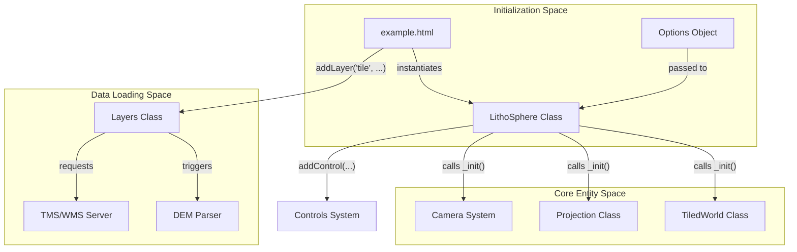
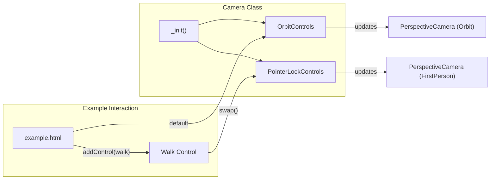

# Examples & Demo

Relevant source files

The following files were used as context for generating this wiki page:

- [dist/src/core/projection.d.ts](dist/src/core/projection.d.ts)
- [docs/Gemfile](docs/Gemfile)
- [docs/pages/Demo/demo.html](docs/pages/Demo/demo.html)
- [public/examples/demo.html](public/examples/demo.html)
- [public/examples/example.html](public/examples/example.html)
- [public/examples/exampleProj.html](public/examples/exampleProj.html)
- [public/examples/exampleWMS.html](public/examples/exampleWMS.html)
- [public/examples/exampleWMSPolar.html](public/examples/exampleWMSPolar.html)
- [public/examples/exampleWMSwithDEM.html](public/examples/exampleWMSwithDEM.html)
- [public/examples/exampleWMSwithDEMGlobal.html](public/examples/exampleWMSwithDEMGlobal.html)
- [public/examples/juno_test.html](public/examples/juno_test.html)
- [src/core/projection.ts](src/core/projection.ts)
- [src/layers/gradient.ts](src/layers/gradient.ts)

This page provides a technical walkthrough of the bundled HTML examples in the LithoSphere repository. These examples demonstrate real-world usage patterns, including handling various planetary radii, integrating Web Map Services (WMS), managing complex projections, and implementing custom data parsers.

The examples serve as both functional tests and integration templates for developers. They are located in the `public/examples/` directory and rely on the bundled `lithosphere.js` artifact.

## Core Integration Patterns

The following diagram illustrates the standard data flow and initialization sequence shared across all examples.

**Initialization and Layer Management Flow**

Sources: [public/examples/example.html:37-109](), [src/core/projection.ts:31-113]().

---

## 1. Standard Demo (example.html & demo.html)

The `example.html` and `demo.html` files provide the most comprehensive look at LithoSphere's capabilities using Martian datasets (Gale Crater).

### Key Features
*   **Planetary Configuration**: Sets a `majorRadius` of 3,396,190m for Mars [public/examples/example.html:62]().
*   **Custom Parsers**: Demonstrates the `customParsers` option, where a function `All500` is defined to return a flat elevation array of 500m for any tile path [public/examples/example.html:64-75]().
*   **Multi-Layer Blending**: Adds multiple tile layers (`Aeolis` and `HiRISE`) with different `minZoom`/`maxZoom` and `boundingBox` constraints [public/examples/example.html:113-167]().
*   **LOD Management**: `example.html` enables `useLOD: true` [public/examples/example.html:95](), while `demo.html` disables it to show a fixed-resolution view [public/examples/demo.html:77]().

### Clamped Vector Data
`demo.html` showcases the `clamped` layer type, which renders GeoJSON features (Waypoints) directly onto the planetary surface tiles [public/examples/demo.html:118-156](). It demonstrates:
*   **Property Mapping**: Mapping GeoJSON properties to visual styles (e.g., `radius: 'prop=radius'`) [public/examples/demo.html:135]().
*   **Bearing Indicators**: Using `yaw_rad` to rotate symbols on the map [public/examples/demo.html:145-149]().

### Gradient Layers
The examples also support the `gradient` layer type, which utilizes `GradientLayerer` to render 3D polylines with per-vertex color ramps [src/layers/gradient.ts:32-40](). This layerer features:
*   **Async Geometry Generation**: Uses `generateGradientLinesAsync` with a `FRAME_BUDGET_MS` of 10ms to prevent UI blocking during large dataset processing [src/layers/gradient.ts:166-182]().
*   **Property-Based Coloring**: Colors segments based on a specific property using `buildColorStops` and `interpolateMultipleColors` [src/layers/gradient.ts:208-209]().

Sources: [public/examples/example.html:37-170](), [public/examples/demo.html:37-160](), [src/layers/gradient.ts:166-210]().

---

## 2. WMS & Projection Examples

LithoSphere supports complex non-WGS84 projections and OGC WMS (Web Map Service) integration.

### WMS with DEM (exampleWMSwithDEM.html)
This example connects to a `lunaserv` instance to fetch lunar imagery and 32-bit floating-point GeoTIFF DEMs [public/examples/exampleWMSwithDEM.html:69-90]().
*   **Projection**: Uses a stereographic projection (`+proj=stere`) centered at the lunar south pole [public/examples/exampleWMSwithDEM.html:50]().
*   **Seam Correction**: Sets `correctSeams: true` in `demFormatOptions`. This causes the engine to query a tile 1px larger than requested to interpolate values at the boundaries, preventing visual "cracks" in the terrain [public/examples/exampleWMSwithDEM.html:82]().
*   **TIF Parser**: Explicitly sets `parser: 'tif'` to handle the 32-bit elevation data [public/examples/exampleWMSwithDEM.html:86]().

### Polar & Global Projections
*   **exampleWMSPolar.html**: Configures the `tileMapResource` for a South Pole stereographic projection with a `crsCode` of `IAU2000:30166,-89.9,0` [public/examples/exampleWMSPolar.html:44-52]().
*   **exampleProj.html**: Demonstrates handling custom `bounds` and `origin` for local coordinate systems [public/examples/exampleProj.html:44-53]().

Sources: [public/examples/exampleWMSwithDEM.html:45-90](), [public/examples/exampleWMSPolar.html:44-52](), [src/core/projection.ts:172-202]().

---

## 3. Juno/Jupiter Global DEM Test

The `juno_test.html` file demonstrates LithoSphere's ability to handle massive planetary scales and global datasets.

| Parameter | Value | Description |
| :--- | :--- | :--- |
| `majorRadius` | 71,492,000 | Jupiter's equatorial radius in meters [public/examples/juno_test.html:43](). |
| `minorRadius` | 71,492,000 | Jupiter's polar radius (set equal for sphere) [public/examples/juno_test.html:44](). |
| `initialView.zoom` | 1 | Global view zoom level [public/examples/juno_test.html:41](). |
| `radiusOfTiles` | 4 | Number of tiles to render around the center [public/examples/juno_test.html:46](). |

This example loads JIRAM (Jovian Infrared Auroral Mapper) data from JUNO mission layers, showing that the `Projection` class correctly scales the rendering environment even when radii exceed standard WebGL precision limits by using `radiusScale` [src/core/projection.ts:139-140]().

Sources: [public/examples/juno_test.html:37-76](), [src/core/projection.ts:136-143]().

---

## 4. Technical Implementation Detail: Camera & Interaction

All examples implement a dual-mode camera system.

**Camera System Logic**

### Key Functionalities in Examples:
1.  **Orbit Mode**: Standard behavior in `example.html`.
2.  **First Person (Walk) Mode**: Enabled via `Litho.addControl('myWalk', Litho.controls.walk)` [public/examples/juno_test.html:82]().
3.  **Coordinate Tracking**: The `coordinates` control is often added to link the 3D mouse position back to Geodetic coordinates using `projection.vector3ToLatLng` [public/examples/juno_test.html:84](). The `Projection` class handles the conversion from 3D Cartesian space to Geodetic `LatLngH` [src/core/projection.ts:251-260]().

Sources: [public/examples/juno_test.html:78-86](), [src/core/projection.ts:251-260]().
