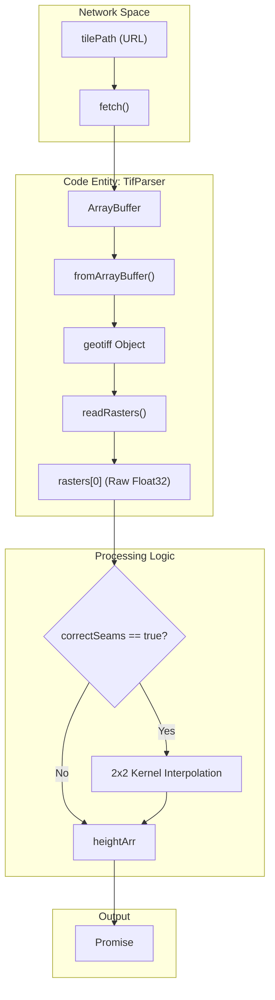
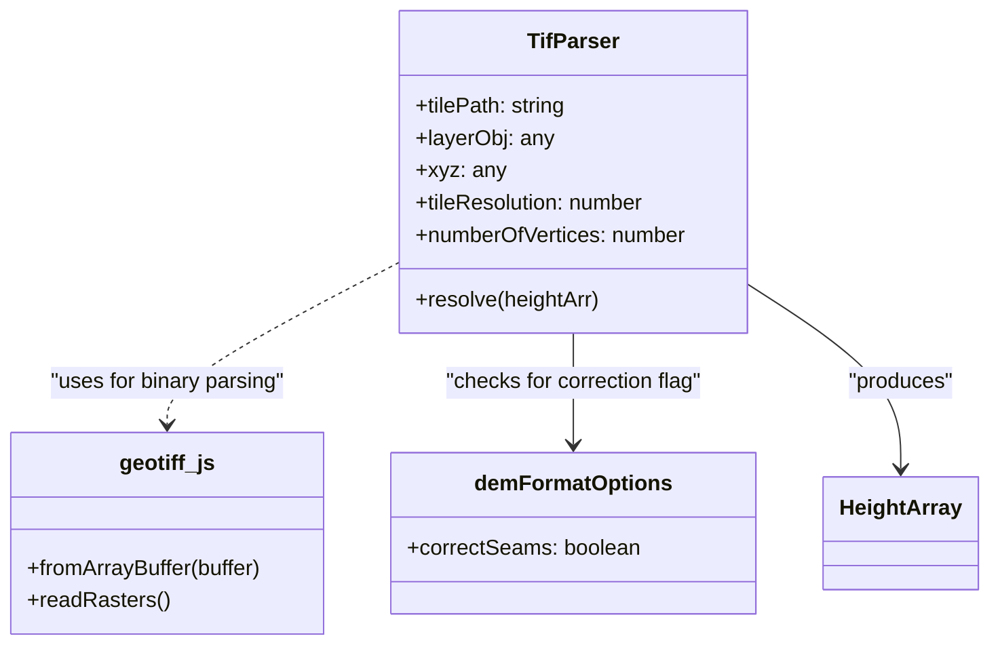

# GeoTIFF (TIF) Parser

Relevant source files

The following files were used as context for generating this wiki page:

- [dist/src/parsers/tif.d.ts](dist/src/parsers/tif.d.ts)
- [src/parsers/tif.ts](src/parsers/tif.ts)

The **GeoTIFF (TIF) Parser** is a specialized elevation data decoder within LithoSphere's data pipeline. It handles the ingestion of standard 32-bit floating-point raster data stored in `.tif` files, typically served by external map servers or GIS backends. Unlike the RGBA PNG parser which requires bit-shifting from color channels, the TIF parser extracts raw numerical values directly from the raster bands to generate the height arrays required for `TiledWorld` vertex displacement.

### Overview and Implementation

The parser is implemented as a standalone function `TifParser` that leverages a bundled secondary library, `geotiff.js`, to handle the complexities of the TIFF file format. It operates asynchronously, fetching the binary data and returning a promise that resolves to a flat array of elevation values.

| Component | Responsibility |
| :--- | :--- |
| **Fetch API** | Retrieves the raw `.tif` file as an `ArrayBuffer`. |
| **geotiff.js** | Parses the binary buffer and extracts raster bands. |
| **Seam Correction** | Optional interpolation logic to smooth edges between adjacent tiles. |
| **Resolution Mapping** | Maps the extracted raster grid to the `numberOfVertices` expected by the terrain mesh. |

Sources: `[src/parsers/tif.ts:1-15]()`, `[src/parsers/tif.ts:16-22]()`

### Data Flow: From Raster to Height Array

The following diagram illustrates the flow of data from the initial tile request to the final height array used for 3D terrain generation.

**TIF Parsing Pipeline**

Sources: `[src/parsers/tif.ts:16-23]()`, `[src/parsers/tif.ts:26-30]()`, `[src/parsers/tif.ts:59]()`

### Seam Correction and Interpolation

A common issue with tiled elevation data is the appearance of visible gaps or "seams" at the borders of tiles. The `TifParser` includes an optional correction mechanism triggered by the `correctSeams` flag in the `layerObj.demFormatOptions`.

When `correctSeams` is enabled, the parser assumes the input raster has been "buffered" (queried with a 1-pixel overlap in all directions). It performs a simple 2x2 kernel averaging to interpolate the values back to the target resolution.

1.  **Resolution Adjustment**: The `tileResolution` is decremented to account for the buffer `[src/parsers/tif.ts:34-34]()`.
2.  **Buffer Calculation**: The source grid is treated as having dimensions `tileResolution + 2` `[src/parsers/tif.ts:36-36]()`.
3.  **Kernel Averaging**: For every target pixel `(x, y)`, the parser averages four neighboring pixels from the source `heightArr`:
    *   `heightArr[y * tr2 + x]`
    *   `heightArr[y * tr2 + x + 1]`
    *   `heightArr[(y + 1) * tr2 + x]`
    *   `heightArr[(y + 1) * tr2 + x + 1]`

Sources: `[src/parsers/tif.ts:25-58]()`

### Code Entity Mapping

This diagram maps the natural language requirements of the GeoTIFF parser to the specific code entities found in `src/parsers/tif.ts`.

**Entity Relationship Diagram**

Sources: `[src/parsers/tif.ts:7-15]()`, `[src/parsers/tif.ts:26-30]()`

### Key Functions and Parameters

| Parameter | Type | Description |
| :--- | :--- | :--- |
| `tilePath` | `string` | The URL to the `.tif` tile. |
| `layerObj` | `any` | The configuration object for the layer, containing `demFormatOptions`. |
| `xyz` | `any` | The tile coordinates (z/x/y) for the current request. |
| `tileResolution` | `number` | The expected resolution of the output height array. |
| `numberOfVertices` | `number` | The number of vertices per side of the terrain mesh. |

The function returns a `Promise<number[]>` where the array contains raw elevation values in a row-major format, ready for the `TiledWorld` displacement shader.

Sources: `[src/parsers/tif.ts:9-15]()`, `[dist/src/parsers/tif.d.ts:1-1]()`
