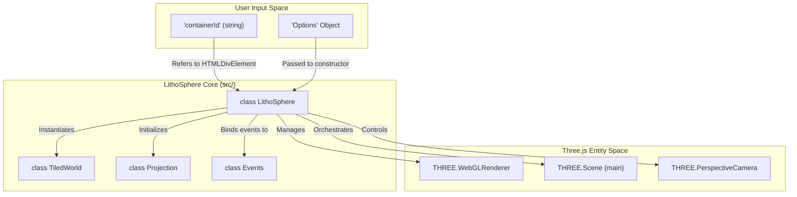
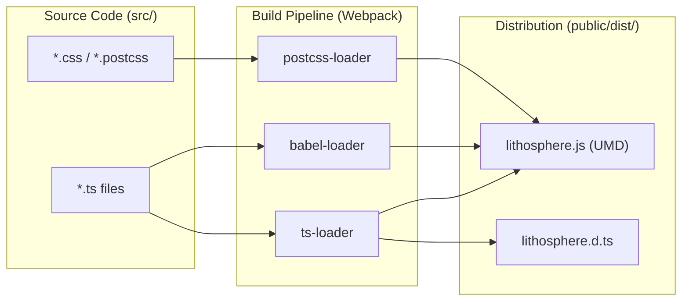

# Getting Started

<details>
<summary>Relevant source files</summary>

The following files were used as context for generating this wiki page:

- [.eslintrc.js](.eslintrc.js)
- [README.md](README.md)
- [demo.server.js](demo.server.js)
- [dist/src/core/crs.d.ts](dist/src/core/crs.d.ts)
- [dist/src/layers/gradient.d.ts](dist/src/layers/gradient.d.ts)
- [dist/src/utils/coordProperties.d.ts](dist/src/utils/coordProperties.d.ts)
- [dist/src/utils/gradientUtils.d.ts](dist/src/utils/gradientUtils.d.ts)
- [docs/assets/images/screenshot1.png](docs/assets/images/screenshot1.png)
- [docs/pages/Getting-Started/getting_started.markdown](docs/pages/Getting-Started/getting_started.markdown)
- [package.json](package.json)
- [travis.yml](travis.yml)

</details>


LithoSphere is a GIS JavaScript library designed for building 3D tile-based globes and planetary visualizations in the web browser. Originally developed as part of the **NASA-AMMOS MMGIS** project, it has been refactored into a standalone, mapping-focused library built on top of **Three.js** [README.md:19-20]().

This page covers the installation, build configuration, and the basic steps required to instantiate a LithoSphere instance.

## Installation

LithoSphere is distributed via NPM and can be integrated into modern JavaScript workflows or used as a standalone script.

### NPM (Recommended)
To install the latest version of LithoSphere and its peer dependencies:

```bash
npm install lithosphere
```

### Manual Installation
Alternatively, you can include the pre-compiled bundle from the repository.
1. Locate `lithosphere.js` in the `/public/dist` directory [package.json:11-11](), [docs/pages/Getting-Started/getting_started.markdown:36-36]().
2. Include it in your HTML:
   ```html
   <script src="path/to/lithosphere.js"></script>
   ```

**Sources:** [package.json:2-3](), [README.md:27-27](), [docs/pages/Getting-Started/getting_started.markdown:14-18]()

---

## Build Setup

LithoSphere uses **Webpack** and **TypeScript** for its build pipeline. If you are contributing to the library or building from source, the following configurations are relevant.

### Webpack Configuration
The project utilizes `ts-loader` for TypeScript compilation and `babel-loader` for backward compatibility [package.json:81-97](). The build process generates a UMD bundle and TypeScript declaration files in the `public/dist` folder [package.json:11-14]().

### Available Scripts
The following scripts are defined in `package.json`:

| Script | Command | Purpose |
| :--- | :--- | :--- |
| `npm run start:dev` | `webpack --mode=development --watch --progress` | Starts a development build with file watching [package.json:18-18](). |
| `npm run build` | `webpack --mode=production` | Generates a minified production bundle [package.json:22-22](). |
| `npm run start:demo` | `node demo.server.js` | Runs a local Express server to view examples [package.json:19-19](). |
| `npm test` | `jest` | Executes the test suite using Jest and `jest-canvas-mock` [package.json:27-27](). |
| `npm run lint` | `eslint "{src,apps,libs,test}/**/*.ts"` | Runs ESLint for code quality checks [package.json:24-24](). |

**Sources:** [package.json:16-31](), [package.json:75-102]()

---

## Running the Demo Server

LithoSphere includes a demonstration environment to showcase various layer types and projections.

1. **Install dependencies:** `npm install`
2. **Start the server:** `npm run start:demo` [package.json:19-19]()
3. **Access the dashboard:** Navigate to `http://localhost:9000` [demo.server.js:6-6]().

The demo server is a simple **Express** application [demo.server.js:5-6]() that serves the `public` directory [demo.server.js:12-12](). It provides an entry point via `public/index.html` [demo.server.js:16-17]().

**Sources:** [demo.server.js:1-26](), [package.json:19-19]()

---

## Minimal Working Example

To initialize LithoSphere, you need a container element and a configuration object. The library requires `three` as a peer dependency [package.json:103-105]().

### HTML Structure
```html
<div id="lithosphere-container" style="width: 100%; height: 100vh;"></div>
```

### JavaScript Implementation
```javascript
import LithoSphere from 'lithosphere';

// 1. Define the options for the globe
const options = {
    initialView: {
        lng: 0,
        lat: 0,
        zoom: 2
    },
    // Configuration for the base planetary body
    majorRadius: 6378137, // Earth's major radius in meters
    minorRadius: 6356752, // Earth's minor radius in meters
    tileMapResource: 'tms',
};

// 2. Instantiate the core class
// The first argument is the ID of the HTML container
const Litho = new LithoSphere('lithosphere-container', options);

// 3. Add a base tile layer
Litho.addLayer('tile', {
    name: 'Base Map',
    on: true,
    path: 'https://example.com/tiles/{z}/{x}/{y}.png',
    format: 'tms'
});
```

**Sources:** [docs/pages/Getting-Started/getting_started.markdown:23-30](), [package.json:111-112]()

---

## System Initialization Flow

The following diagram illustrates the relationship between the developer's configuration, the `LithoSphere` core class, and the underlying rendering entities.

### Initialization Architecture
"Associations between NL concepts and Code Entities"


**Sources:** [docs/pages/Getting-Started/getting_started.markdown:28-28](), [package.json:109-112]()

### Build and Distribution Flow
"Code Entity Space to Artifact Space"


**Sources:** [package.json:11-14](), [package.json:81-101]()
