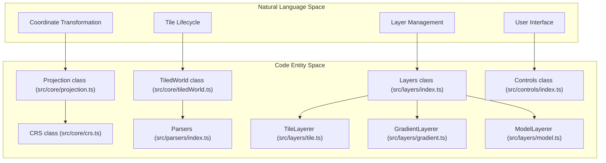

# Glossary

<details>
<summary>Relevant source files</summary>

The following files were used as context for generating this wiki page:

- [.eslintrc.js](.eslintrc.js)
- [CHANGELOG.md](CHANGELOG.md)
- [README.md](README.md)
- [dist/src/core/cameras.d.ts](dist/src/core/cameras.d.ts)
- [dist/src/core/events.d.ts](dist/src/core/events.d.ts)
- [dist/src/core/projection.d.ts](dist/src/core/projection.d.ts)
- [dist/src/layers/index.d.ts](dist/src/layers/index.d.ts)
- [dist/src/layers/model.d.ts](dist/src/layers/model.d.ts)
- [docs/Gemfile](docs/Gemfile)
- [docs/assets/images/screenshot1.png](docs/assets/images/screenshot1.png)
- [docs/pages/Layers/Model/model.markdown](docs/pages/Layers/Model/model.markdown)
- [package-lock.json](package-lock.json)
- [public/dist/lithosphere.js](public/dist/lithosphere.js)
- [public/examples/demo.html](public/examples/demo.html)
- [public/examples/juno_test.html](public/examples/juno_test.html)
- [src/core/events.ts](src/core/events.ts)
- [src/core/projection.ts](src/core/projection.ts)
- [src/layers/gradient.ts](src/layers/gradient.ts)
- [src/layers/index.ts](src/layers/index.ts)
- [src/layers/model.ts](src/layers/model.ts)
- [src/secondary/loadingScreen.ts](src/secondary/loadingScreen.ts)
- [travis.yml](travis.yml)
- [webpack.config.js](webpack.config.js)

</details>


This glossary defines technical terms, domain concepts, and codebase-specific identifiers used within the LithoSphere engine. LithoSphere is a tile-based 3D globe renderer built on [Three.js](https://threejs.org/), originally derived from the NASA-AMMOS MMGIS project [README.md:19-19]().

### Core Domain Concepts

| Term | Definition | Code Reference |
| :--- | :--- | :--- |
| **DEM** | Digital Elevation Model. Raster data where pixel values represent surface elevation, used for vertex displacement. | [src/core/tiledWorld.ts:13-13]() |
| **LOD** | Level of Detail. A system that renders higher-resolution tiles near the camera and lower-resolution tiles further away. | [src/lithosphere.ts:148-153]() |
| **Major/Minor Radius** | The semi-major and semi-minor axes of the planetary ellipsoid (in meters). | [src/core/projection.ts:8-15]() |
| **TMS / WMTS / WMS** | Tile Map Service, Web Map Tile Service, and Web Map Service. Standards for requesting georeferenced map tiles. | [public/examples/demo.html:103-103]() |
| **Flattening Factor** | A measure of the compression of a circle or sphere along a diameter to form an ellipse or ellipsoid. | [src/core/projection.ts:29-29]() |
| **Curtain Layer** | A vertical data slice layer (e.g., ground-penetrating radar) draped along a GeoJSON LineString. | [src/layers/index.ts:7-7](), [src/layers/curtain.ts:1-1]() |
| **Gradient Layer** | A 3D polyline layer that interpolates colors along segments based on a numeric feature property. | [src/layers/gradient.ts:32-32]() |

**Sources:** [README.md:19-19](), [src/core/tiledWorld.ts:13-13](), [src/lithosphere.ts:148-153](), [src/core/projection.ts:8-15](), [src/layers/gradient.ts:32-32](), [public/examples/demo.html:103-103]()

---

### Code Entity Space: Architecture & State

The following diagram maps high-level system concepts to the specific classes and files that implement them.

**System Mapping: Natural Language to Code Entities**

**Sources:** [src/lithosphere.ts:1-27](), [src/core/projection.ts:17-17](), [src/core/tiledWorld.ts:25-25](), [src/layers/index.ts:11-21](), [src/layers/gradient.ts:32-32](), [src/layers/model.ts:13-13]()

---

### Technical Terms

#### **Atmosphere**
A visual effect simulating planetary gas layers using a Fresnel glow shader. Configured via the `atmosphere` option in the constructor [src/lithosphere.ts:105-107](). It is rendered in the `sceneBack` to ensure it appears behind surface features [src/lithosphere.ts:137-137]().

#### **BoundingBox / BoundingBoxEN**
Spatial constraints for layers. `boundingBox` uses Geodetic coordinates `[lng, lat, lng, lat]`, while `boundingBoxEN` uses projected Easting/Northing coordinates `[minE, minN, maxE, maxN]` [CHANGELOG.md:87-87]().

#### **Exaggeration**
A vertical scaling factor applied to DEM data. It multiplies the displacement of vertices to make terrain features more prominent [src/lithosphere.ts:92-92](), [public/examples/demo.html:75-75]().

#### **MajorRadius / MinorRadius**
The dimensions of the planetary ellipsoid. If `majorRadius` exceeds the `radiusCutoff` (default Infinity), the system applies a `radiusScale` to prevent floating-point precision issues in the Three.js coordinate space [src/core/projection.ts:38-40](), [src/core/projection.ts:139-140]().

#### **TiledWorld State Machine**
The `TiledWorld` class manages tiles through four primary arrays:
1.  `tilesWanted`: Tiles required by the current camera view and LOD settings [src/core/tiledWorld.ts:30-30]().
2.  `tilesToBeDrawn`: A queue of tiles waiting for resources/worker processing [src/core/tiledWorld.ts:32-32]().
3.  `tilesBeingDrawn`: Tiles currently being fetched or parsed [src/core/tiledWorld.ts:34-34]().
4.  `tilesDrawn`: Tiles currently active in the Three.js scene [src/core/tiledWorld.ts:28-28]().

**Tile Processing Flow**
```mermaid
flowchart LR
    "updateDesiredTiles()" -- "Populate" --> TW["tilesWanted"]
    TW -- "Diff against tilesDrawn" --> TBD["tilesToBeDrawn"]
    TBD -- "addTile()" --> BD["tilesBeingDrawn"]
    BD -- "Parsing/Loading Complete" --> D["tilesDrawn"]
    D -- "Out of View" --> "removeTile()"
```
**Sources:** [src/core/tiledWorld.ts:25-53](), [src/core/tiledWorld.ts:56-101](), [src/core/tiledWorld.ts:181-183]()

#### **TileMapResource**
An interface defining the projection metadata for a tileset, including `crsCode`, `proj` (Proj4 string), `origin`, and `resunitsperpixel` [src/core/projection.ts:46-54](). This is used by the `Projection` class to initialize the `CRS` (Coordinate Reference System) [src/core/projection.ts:75-112]().

#### **zCutOff**
The zoom level threshold where the interaction logic changes behavior, such as switching between global orbital movement and local surface interactions [src/lithosphere.ts:58-58](). In `Events`, it triggers the snapping of the camera look-at point to the globe center [src/core/events.ts:193-197]().

#### **Model Cache**
A mechanism in `ModelLayerer` that stores cloned Three.js objects to avoid redundant network requests and parsing when the same model is used multiple times [src/layers/model.ts:16-16](), [src/layers/model.ts:109-112]().

---

### Utility Functions Reference

| Function | Description | File |
| :--- | :--- | :--- |
| `getIn` | Safely traverses an object with an array of keys to avoid null pointer errors. | [src/utils/index.ts:10-20]() |
| `isInExtent` | Checks if a tile's XYZ coordinates fall within a lat/lng bounding box. | [src/utils/index.ts:49-105]() |
| `tileXYZ2LatLng` | Converts tile coordinates (x, y, z) to geographic (lat, lng). | [src/core/projection.ts:204-215]() |
| `setAllMaterialOpacity` | Recursively sets the opacity for all materials in a 3D model group. | [src/layers/model.ts:86-86](), [src/utils/index.ts:145-155]() |
| `getRadiansPerPixel` | Calculates the angular resolution of a pixel at a specific zoom level. | [src/utils/index.ts:177-179]() |
| `buildColorStops` | Parses a color ramp string into an array of stops for gradient interpolation. | [src/layers/gradient.ts:209-209]() |

**Sources:** [src/utils/index.ts:4-179](), [src/core/projection.ts:204-215](), [src/layers/model.ts:86-86](), [src/layers/gradient.ts:209-209]()
