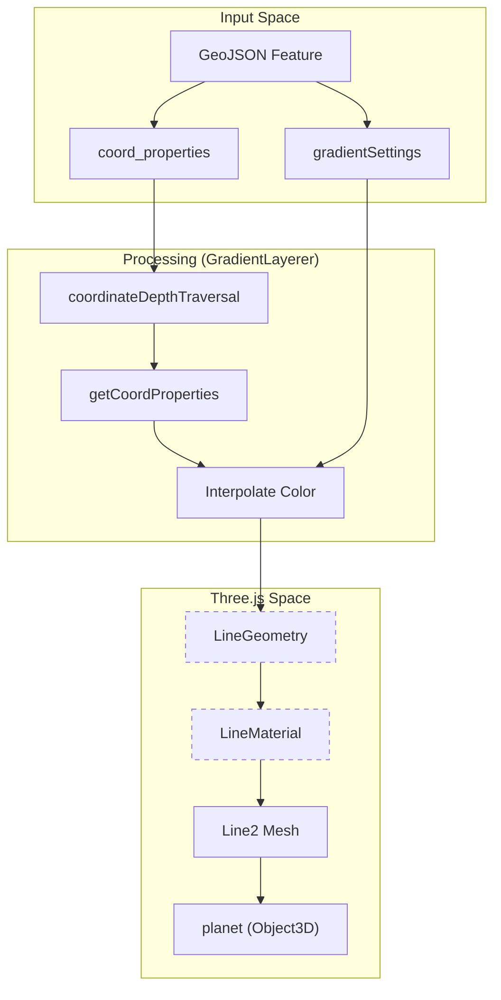
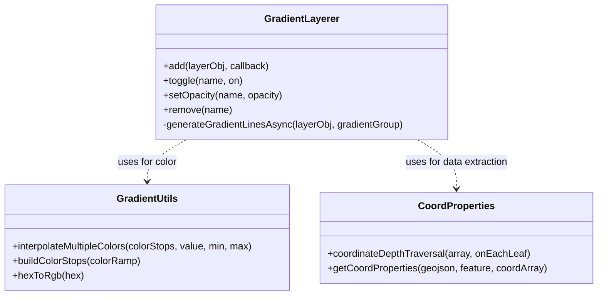

# Gradient Layers

<details>
<summary>Relevant source files</summary>

The following files were used as context for generating this wiki page:

- [public/examples/demo.html](public/examples/demo.html)
- [src/layers/gradient.ts](src/layers/gradient.ts)
- [src/utils/coordProperties.ts](src/utils/coordProperties.ts)
- [src/utils/gradientUtils.ts](src/utils/gradientUtils.ts)

</details>


The **Gradient Layer** system in LithoSphere is designed for rendering high-fidelity 3D polylines with per-vertex color interpolation based on numeric data properties. Unlike standard vector lines, gradient layers utilize `Line2` geometry from Three.js to provide consistent screen-space thickness and smooth color ramps across segments.

## Overview and Purpose

Gradient layers are specifically optimized for datasets where a value changes along a path (e.g., rover telemetry, temperature gradients, or elevation profiles). The system handles:
*   **Async Geometry Generation**: Heavy GeoJSON processing is distributed across multiple frames to maintain a 60FPS UI [src/layers/gradient.ts:166-182]().
*   **Color Ramps**: Mapping numeric properties to multi-stop color interpolations [src/utils/gradientUtils.ts:33-38]().
*   **Precision Management**: Utilizing a `firstPos` offset to bypass 32-bit float precision issues in WebGL [src/layers/gradient.ts:286-291]().

### Data Flow: GeoJSON to Gradient Mesh

The following diagram illustrates the transformation from raw GeoJSON data to the specialized `Line2` meshes rendered in the scene.

**Gradient Layer Data Flow**

**Sources:** [src/layers/gradient.ts:32-40](), [src/utils/coordProperties.ts:13-15](), [src/utils/gradientUtils.ts:33-35]()

---

## Technical Implementation

### Frame-Budgeted Async Generation
To prevent the browser main thread from locking up during the processing of large GeoJSON files, the `GradientLayerer` uses a frame-budgeting approach in `generateGradientLinesAsync`.

*   **Budget**: It allows 10ms of execution time per frame (`FRAME_BUDGET_MS`) [src/layers/gradient.ts:170]().
*   **Yielding**: Every 50 iterations (`CHECK_INTERVAL`), it checks the current time. If the budget is exceeded, it calls `requestAnimationFrame` to yield control back to the browser [src/layers/gradient.ts:171-181]().
*   **Stale Check**: Since the process is async, the system checks if the layer was removed or modified during generation to avoid adding orphaned meshes [src/layers/gradient.ts:185-191]().

### Midpoint Splitting and Interpolation
The system processes lines by iterating through vertices and calculating colors based on a specific property defined in `colorWithProp` [src/layers/gradient.ts:208]().

1.  **Coordinate Traversal**: Uses `coordinateDepthTraversal` to handle nested GeoJSON arrays (LineStrings or MultiLineStrings) [src/utils/coordProperties.ts:13-38]().
2.  **Property Resolution**: `getCoordProperties` zips `coord_properties` keys with coordinate values to resolve the numeric value at a specific vertex [src/utils/coordProperties.ts:64-87]().
3.  **Midpoint Logic**: To create a smooth gradient, the system often calculates midpoints between segments to ensure the color ramp transitions naturally [src/layers/gradient.ts:241-260]().

### Precision Handling (firstPos)
Because planetary scales involve very large coordinate values, standard 32-bit GPU floats lack the precision to render thin lines without "jitter." LithoSphere solves this by:
1.  Storing the first vertex of a feature as `firstPos` [src/layers/gradient.ts:286]().
2.  Calculating all subsequent vertices in that feature as offsets relative to `firstPos` [src/layers/gradient.ts:293-298]().
3.  Passing the `firstPos` to the shader (via `Line2` material) to reconstruct the world position [src/layers/gradient.ts:303-305]().

**Sources:** [src/layers/gradient.ts:166-310](), [src/utils/coordProperties.ts:1-88]()

---

## Configuration Options

Gradient layers are added via `Litho.addLayer('gradient', options)`.

| Option | Type | Description |
| :--- | :--- | :--- |
| `name` | `string` | Unique identifier for the layer [src/layers/gradient.ts:79](). |
| `geojsonPath` | `string` | URL to the GeoJSON source [src/layers/gradient.ts:85](). |
| `gradientSettings` | `Object` | Configuration for the color ramp and property mapping [src/layers/gradient.ts:82](). |
| `gradientSettings.colorWithProp` | `string` | The property name to use for color lookup [src/layers/gradient.ts:208](). |
| `gradientSettings.colorRamp` | `string[]` | Array of colors (hex/rgb) forming the ramp [src/layers/gradient.ts:209](). |
| `gradientSettings.weight` | `number` | Thickness of the line in pixels [src/layers/gradient.ts:210](). |

### Example Configuration
```javascript
Litho.addLayer('gradient', {
    name: 'RoverPath',
    order: 10,
    on: true,
    opacity: 1,
    geojsonPath: './data/path.json',
    gradientSettings: {
        colorWithProp: 'velocity',
        colorRamp: ['#0000ff', '#00ff00', '#ff0000'],
        weight: 5
    }
});
```
**Sources:** [src/layers/gradient.ts:78-112](), [public/examples/demo.html:118-160]()

---

## Class Structure and Logic

**GradientLayerer Entity Map**


### Key Functions
*   **`add(layerObj)`**: Initializes the layer. If a `geojsonPath` is provided, it performs an `XMLHttpRequest` before triggering the async builder [src/layers/gradient.ts:40-112]().
*   **`setOpacity(name, opacity)`**: Iterates through all `Line2` children in the layer's `Object3D` group and updates their `material.opacity` [src/layers/gradient.ts:129-144]().
*   **`interpolateMultipleColors`**: Normalizes the vertex value between the dataset's min/max and finds the appropriate segment in the `colorRamp` [src/utils/gradientUtils.ts:33-73]().

**Sources:** [src/layers/gradient.ts:32-157](), [src/utils/gradientUtils.ts:1-90](), [src/utils/coordProperties.ts:1-88]()
