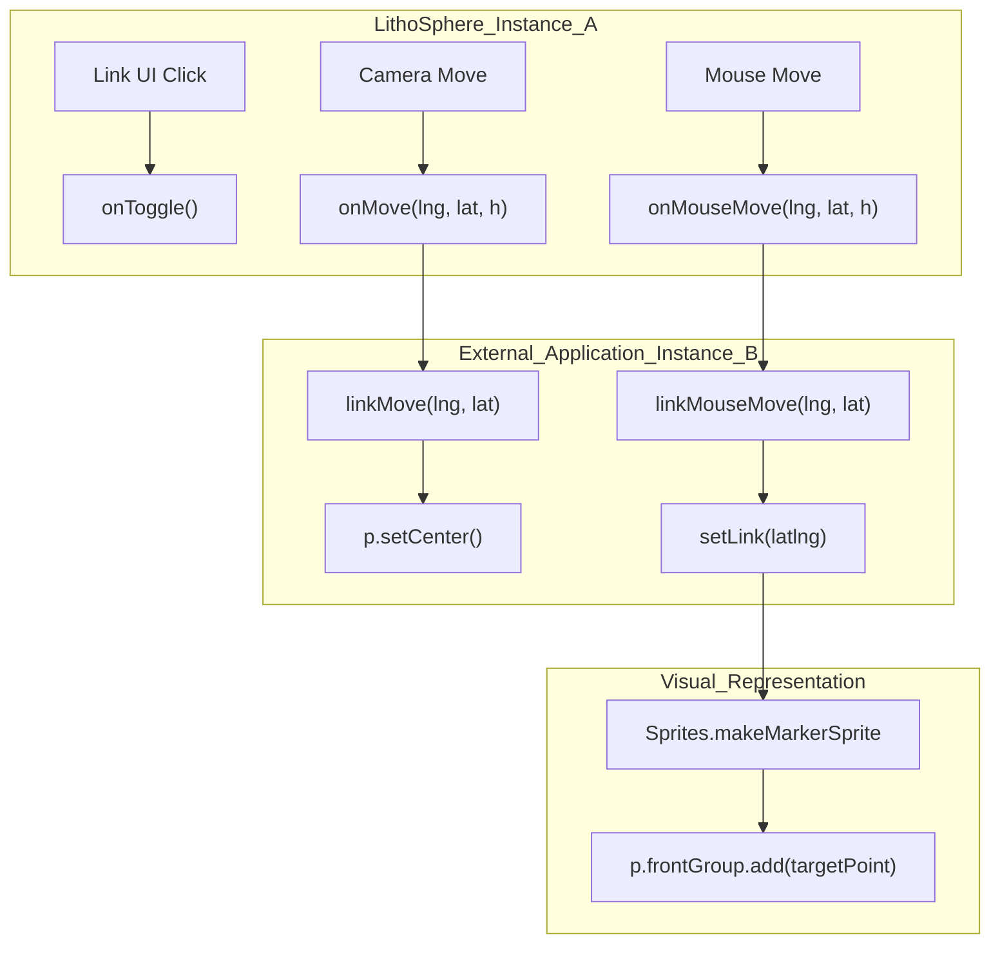
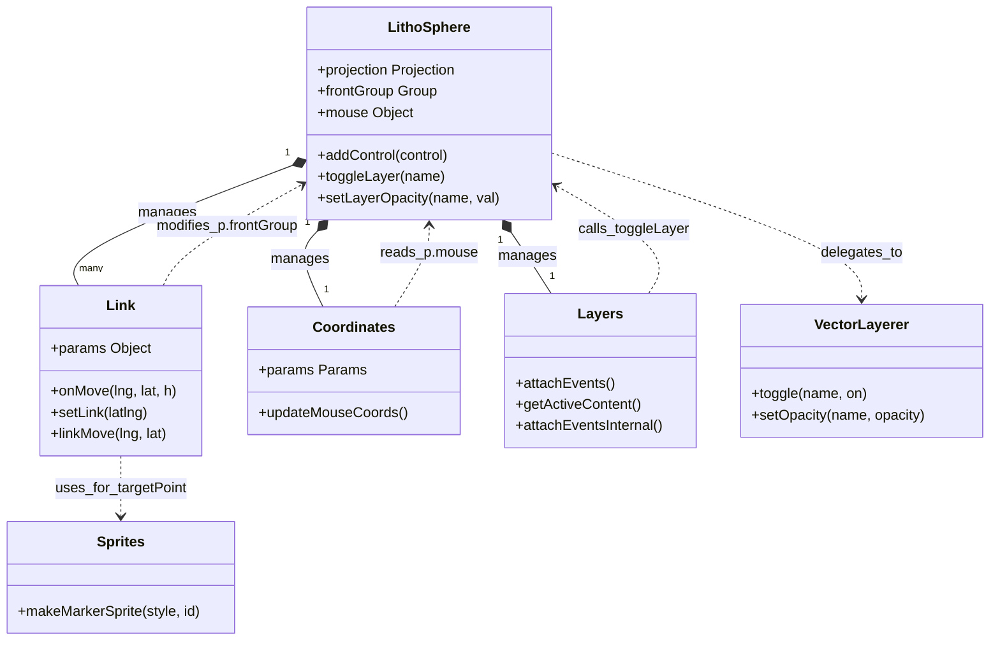

# Informational & Utility Controls

Relevant source files

The following files were used as context for generating this wiki page:

- [dist/src/controls/altitude.d.ts](dist/src/controls/altitude.d.ts)
- [dist/src/controls/crop.d.ts](dist/src/controls/crop.d.ts)
- [dist/src/controls/layers.d.ts](dist/src/controls/layers.d.ts)
- [src/controls/coordinates.ts](src/controls/coordinates.ts)
- [src/controls/exaggerate.ts](src/controls/exaggerate.ts)
- [src/controls/layers.ts](src/controls/layers.ts)
- [src/controls/link.ts](src/controls/link.ts)
- [src/controls/observe.ts](src/controls/observe.ts)
- [src/controls/walk.ts](src/controls/walk.ts)
- [src/layers/vector.ts](src/layers/vector.ts)

Informational and Utility controls provide the user interface and logic for data visualization, cross-instance synchronization, and environmental status. These controls extend the `LithoSphere` UI system by offering real-time coordinate tracking, layer management, and multi-view linking capabilities.

## Coordinates Control

The `Coordinates` control provides a real-time display of the cursor's geographic position (Longitude, Latitude) and the surface elevation at that point.

### Implementation and Data Flow
The control operates by listening to the `onUpdate` lifecycle hook of the renderer [src/controls/coordinates.ts:45-48](). It checks if the mouse is currently within the scene or if the camera is in First Person mode [src/controls/coordinates.ts:46](). 

The coordinate values are retrieved from the `p.mouse` object, which is populated by the core `Events` raycasting system. The display updates the DOM element `_lithosphere_control_coordinate_root` with formatted strings [src/controls/coordinates.ts:51-64]().

### Configuration Options
The `Coordinates` control accepts a `Params` object [src/controls/coordinates.ts:5-12]():
*   `existingDivId`: If provided, the control redirects its output to an external HTML element instead of creating its own [src/controls/coordinates.ts:66-72]().
*   `hideElement`: Hides the default UI while still allowing the `onChange` callback to fire [src/controls/coordinates.ts:31-35]().
*   `onChange`: A callback function `(lng, lat, elev) => void` triggered whenever the coordinates change [src/controls/coordinates.ts:74-79]().

**Sources:** [src/controls/coordinates.ts:1-82]()

---

## Link Control

The `Link` control facilitates synchronization between multiple LithoSphere instances or between LithoSphere and other mapping libraries (e.g., Leaflet or MMGIS). It supports bi-directional communication for panning, hovering, and state toggling.

### Synchronization Mechanism
The control maintains an `isLinked` state [src/controls/link.ts:31](). When active, it triggers callbacks based on user interaction:
1.  **onMove**: Fired when the camera moves, sending `(lng, lat, height)` to external listeners [src/controls/link.ts:76-87]().
2.  **onMouseMove**: Fired during mouse movement over the globe [src/controls/link.ts:89-95]().
3.  **onToggle**: Fired when the link state is enabled/disabled via the UI [src/controls/link.ts:66-68]().

### Target Point Sprite
When a linked instance receives a `linkMouseMove` event, it calls `setLink()` to render a visual indicator at the target coordinates [src/controls/link.ts:114-154]().
*   It calculates the 3D position using `projection.lonLatToVector3`, accounting for surface elevation and vertical exaggeration [src/controls/link.ts:127-131]().
*   It generates a marker using `Sprites.makeMarkerSprite` [src/controls/link.ts:141]().
*   The marker is added to the `frontGroup` to ensure it renders on top of planet geometry [src/controls/link.ts:150]().

### Link Control Data Flow
Title: "Link Control Interaction Flow"

**Sources:** [src/controls/link.ts:1-165](), [src/secondary/sprites.ts:1-10]()

---

## Layers Control

The `Layers` control provides a toggleable panel for managing the visibility and opacity of all layers registered in the system.

### Functional Components
*   **Visibility Toggling**: Iterates through `this.p.layers.all` to provide checkboxes for every registered layer [src/controls/layers.ts:67-77]().
*   **Opacity Management**: Provides a range slider for each layer [src/controls/layers.ts:78-81]().
*   **Internal State**: Uses `getInactiveContent` and `getActiveContent` to handle the UI transition between a collapsed icon and an expanded list [src/controls/layers.ts:55-101]().
*   **Layer Interaction**: When a user interacts with the UI, the control calls `this.p.toggleLayer` or `this.p.setLayerOpacity` [src/controls/layers.ts:107-130](). These calls are delegated to specialized layerers, such as `VectorLayerer.toggle` [src/layers/vector.ts:86-100]() or `VectorLayerer.setOpacity` [src/layers/vector.ts:102-116]().

**Sources:** [src/controls/layers.ts:1-133](), [src/layers/vector.ts:86-116]()

---

## Altitude and Crop Controls

These utility controls provide specialized environmental and data manipulation features.

| Control | Purpose | Key Logic |
| :--- | :--- | :--- |
| **Altitude** | Displays/Controls camera altitude relative to the surface. | Interacts with `p.cameras` to set or get height values. |
| **Crop** | Allows users to define a spatial bounding box for data export or visual focus. | Often used in conjunction with tiling scripts or data extraction workflows. |

**Sources:** [dist/src/controls/altitude.d.ts:1](), [dist/src/controls/crop.d.ts:1]()

---

## System Integration Diagram

The following diagram illustrates how Informational and Utility controls bridge the gap between the core `LithoSphere` engine and the DOM/External API.

Title: "Control Entity Relationships"

**Sources:** [src/controls/link.ts:114-154](), [src/controls/coordinates.ts:50-64](), [src/layers/vector.ts:203-208](), [src/controls/layers.ts:103-131]()
