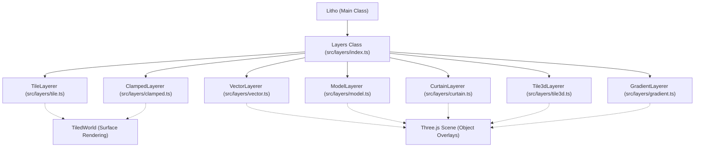
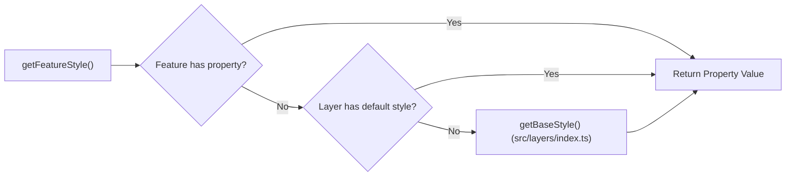

# Layer System

Relevant source files

The following files were used as context for generating this wiki page:

- [dist/src/layers/index.d.ts](dist/src/layers/index.d.ts)
- [docs/pages/Layers/layers.markdown](docs/pages/Layers/layers.markdown)
- [src/layers/index.ts](src/layers/index.ts)
- [src/layers/tile3d.ts](src/layers/tile3d.ts)

The `Layers` class serves as the central hub for managing all data overlays on the globe. It utilizes a delegation pattern, where high-level requests (adding, removing, or toggling layers) are routed to specialized "layerer" classes. Each layerer handles the specific rendering logic, lifecycle, and data fetching requirements for its type [src/layers/index.ts:38-48]().

## Architecture Overview

The system distinguishes between layers that are "baked" into the planetary surface (Tile and Clamped) and those that exist as independent 3D objects in the scene (Vector, Model, Curtain, Gradient, and 3D Tiles).

### Layer Delegation
The `Layers` class maintains an internal mapping of specialized layerer instances:
- `tile`: `TileLayerer` [src/layers/index.ts:41]()
- `tile3d`: `Tile3dLayerer` [src/layers/index.ts:40]()
- `clamped`: `ClampedLayerer` [src/layers/index.ts:42]()
- `vector`: `VectorLayerer` [src/layers/index.ts:43]()
- `curtain`: `CurtainLayerer` [src/layers/index.ts:44]()
- `model`: `ModelLayerer` [src/layers/index.ts:45]()
- `gradient`: `GradientLayerer` [src/layers/index.ts:46]()

### Entity Relationship Diagram
The following diagram illustrates how the `Layers` class orchestrates the specialized layerers and how they interact with the core `Litho` (parent) object and the scene.

**Layer System Delegation**

Sources: [src/layers/index.ts:11-21](), [src/layers/index.ts:36-50]()

---

## Core Operations

### Adding and Removing Layers
Layers are added via `addLayer(type, layerObj, callback)`. The `layerObj` must contain a unique `name`. The method automatically handles boolean conversion for the `on` state (supporting `1/0`) and assigns an internal `_type` [src/layers/index.ts:76-89]().

### Draw Ordering
LithoSphere uses an explicit ordering system. For surface-clamped layers (Tile and Clamped), the `order` property determines the stack. 
- **Rule**: Clamped layers (vector-to-raster) are always drawn on top of standard Tile layers [src/layers/index.ts:134-135]().
- **Reordering**: The `orderLayers(ordering: string[])` method accepts an array of names. If an order change occurs, the system calls `removeAllTiles()` on `TiledWorld` to force a visual refresh with the new stack [src/layers/index.ts:137-163]().

### Zoom Constraints
The `Layers` class tracks the global zoom limits across all active layers. `findHighestMaxZoom()` and `findLowestMinZoom()` inform the `TiledWorld` when it should stop requesting new tiles or when to lock the current LOD [dist/src/layers/index.d.ts:40-41]().

### Styling Pipeline
The `getFeatureStyle` method [src/layers/index.ts:1062]() is a critical pipeline for vector and clamped layers. It resolves feature-level properties (like `fillColor`, `weight`, or `radius`) by checking:
1. The individual GeoJSON feature's `properties`.
2. The layer's default `style` configuration.
3. The system's global base styles [src/layers/index.ts:1062-1088]().

**Styling Logic Flow**

Sources: [src/layers/index.ts:1044-1088](), [dist/src/layers/index.d.ts:44-46]()

---

## Layer Types

### [Tile Layers](#3.1)
Standard raster imagery (TMS, WMTS, WMS). These are blended in the planet shader using brightness, contrast, and saturation filters.
For details, see [Tile Layers](#3.1).

### [Clamped Layers](#3.2)
Vector data (GeoJSON) that is rendered onto a hidden canvas and then applied as a texture to the globe tiles. This ensures lines and polygons perfectly follow the terrain curvature.
For details, see [Clamped Layers](#3.2).

### [Vector Layers](#3.3)
True 3D vector overlays. Points are rendered as sprites, and lines are rendered as 3D meshes (e.g., `Line2`). These can be "floated" above the surface using exaggeration.
For details, see [Vector Layers](#3.3).

### [Model Layers](#3.4)
Loads 3D assets (GLTF, OBJ, DAE). Supports "arrayed" placement where one layer object can place hundreds of instances across geographic coordinates.
For details, see [Model Layers](#3.4).

### [Curtain Layers](#3.5)
Vertical "fences" of data, typically used for profiles or ground-penetrating radar. It drapes a 2D image along a geographic path.
For details, see [Curtain Layers](#3.5).

### [3D Tile Layers (tile3d)](#3.6)
Integration with OGC 3D Tiles. Uses the `3d-tiles-renderer` to manage massive datasets with their own internal LOD and hierarchical culling [src/layers/tile3d.ts:1-22]().
For details, see [3D Tile Layers (tile3d)](#3.6).

### [Gradient Layers](#3.7)
Specialized 3D polyline layers where vertex colors are interpolated based on a numeric property in the GeoJSON data.
For details, see [Gradient Layers](#3.7).

Sources: [src/layers/index.ts:11-21](), [docs/pages/Layers/layers.markdown:9-30](), [src/layers/tile3d.ts:4-56]()
