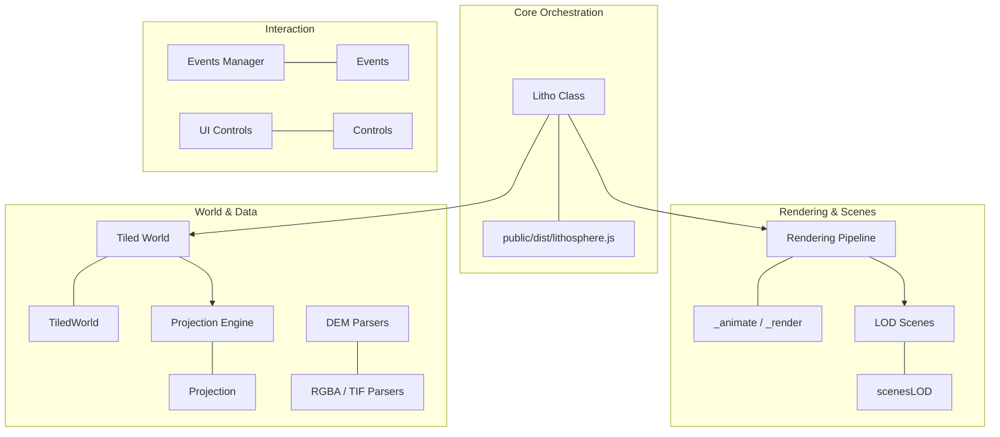
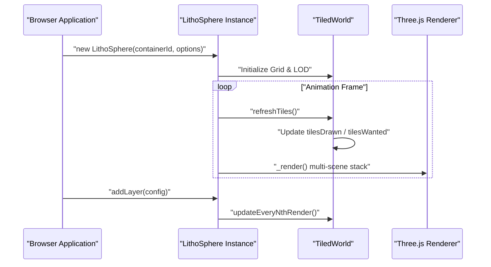

# LithoSphere Overview

Relevant source files

The following files were used as context for generating this wiki page:

- [.eslintrc.js](.eslintrc.js)
- [CHANGELOG.md](CHANGELOG.md)
- [README.md](README.md)
- [docs/assets/images/screenshot1.png](docs/assets/images/screenshot1.png)
- [package.json](package.json)
- [public/dist/lithosphere.js](public/dist/lithosphere.js)
- [travis.yml](travis.yml)

LithoSphere is a free and open-source, tile-based 3D globe renderer built on top of **Three.js**. Originally developed as the 3D visualization component for NASA-AMMOS's [MMGIS](https://github.com/NASA-AMMOS/MMGIS) (Multi-Mission Geographic Information System), it has been refactored into a standalone JavaScript library specialized in mapping and planetary science visualization [README.md:19-20]().

The library provides a high-performance rendering pipeline for multi-resolution terrain (DEM), satellite imagery, vector overlays, and 3D models, supporting both Earth-based and non-terrestrial planetary coordinate systems [README.md:37-67]().

## Key Capabilities

LithoSphere is designed for flexibility in geospatial contexts, offering:
*   **Multi-Projection Support**: Native support for TMS, WMTS, and WMS tile formats with full Proj4 integration to handle non-standard planetary projections [README.md:49-53]().
*   **Terrain Visualization**: Dynamic vertex displacement using Digital Elevation Models (DEM) encoded in RGBA PNG or GeoTIFF formats [README.md:48-54]().
*   **Extensible Layering**: Seven distinct layer types including raster tiles, clamped vector data, 3D models (GLTF/OBJ), 3D Tiles (OGC), and vertical "curtain" slices [README.md:39-46](), [CHANGELOG.md:97]().
*   **Planetary Customization**: Adjustable major and minor radii to support oblate spheroids (e.g., Mars, Jupiter) [README.md:47]().
*   **Interactive Controls**: A pluggable UI suite for navigation, coordinates display, and camera mode switching [README.md:54-64]().

**Sources:** [README.md:19-67](), [package.json:109](), [CHANGELOG.md:97]()

## Architecture Summary

LithoSphere organizes the 3D environment into a series of nested scenes and specialized managers. At the top level, the main class orchestrates the lifecycle of the renderer, camera, and world entities.

### System Mapping: Natural Language to Code Entities

The following diagram maps high-level system concepts to their specific implementations in the codebase.

**System Entity Mapping**

**Sources:** [package.json:11-12](), [CHANGELOG.md:159](), [README.md:54-64]()

### High-Level Component Interaction

LithoSphere utilizes a specialized rendering loop that manages multiple Three.js scenes to handle different levels of detail (LOD) and UI overlays.

**Core Interaction Flow**

**Sources:** [README.md:19-20](), [CHANGELOG.md:124](), [package.json:104]()

## Subsections

LithoSphere is divided into several major functional areas. Detailed documentation for each can be found in the following child pages:

### [Getting Started](#1.1)
Covers installation via NPM, setting up a Webpack build pipeline, and a minimal code example to get a globe rendering in a div. For details, see [Getting Started](#1.1).
*   **Key Files:** `package.json`, `webpack.config.js`.

### [Constructor & Configuration Options](#1.2)
A detailed reference for the `Options` interface. Learn how to configure `initialView`, `majorRadius`, `minorRadius`, and environment settings like `starsphere` and `atmosphere`. For details, see [Constructor & Configuration Options](#1.2).
*   **Key Entities:** `Litho` constructor, `initialCamera`, `demFallback`.

### [Examples & Demo](#1.3)
A walkthrough of the bundled examples including global DEMs, WMS integration, and specialized planetary tests (e.g., the Juno/Jupiter example). For details, see [Examples & Demo](#1.3).
*   **Key Files:** `example.html`, `demo.html`, `demo.server.js`.

## Development & Distribution

LithoSphere is written in TypeScript and distributed via NPM. The build process uses Webpack to produce a bundled library and type definitions.

| Attribute | Value |
| :--- | :--- |
| **Version** | 1.6.0 [package.json:3]() |
| **License** | Apache-2.0 [package.json:6]() |
| **Core Dependency** | Three.js (>=0.122.0) [package.json:111]() |
| **Main Entry** | `./public/dist/lithosphere.js` [package.json:11]() |
| **Build Command** | `npm run build` [package.json:21]() |

**Sources:** [package.json:1-113](), [CHANGELOG.md:1-168]()
