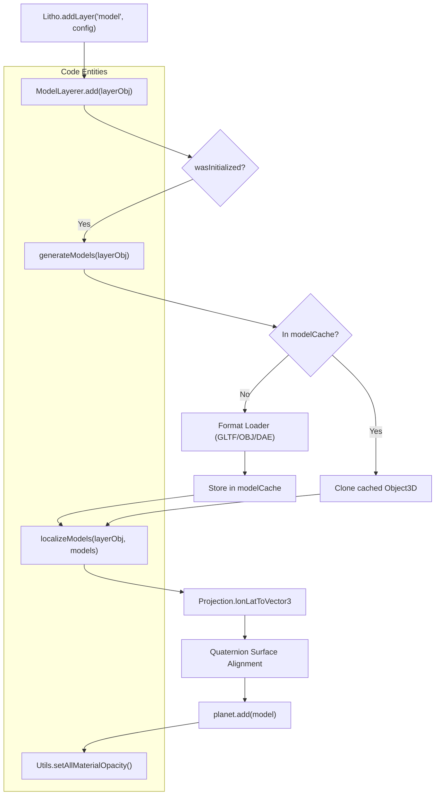
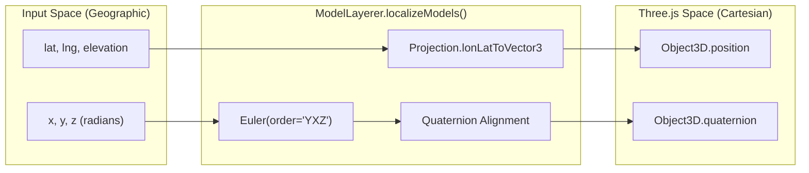

# Model Layers

Relevant source files

The following files were used as context for generating this wiki page:

- [dist/src/layers/model.d.ts](dist/src/layers/model.d.ts)
- [docs/pages/Layers/Model/model.markdown](docs/pages/Layers/Model/model.markdown)
- [src/core/events.ts](src/core/events.ts)
- [src/layers/model.ts](src/layers/model.ts)
- [src/secondary/loadingScreen.ts](src/secondary/loadingScreen.ts)

Model Layers provide the capability to load and place 3D assets within the LithoSphere scene. This layer type supports common 3D formats and handles the complex task of localizing assets from geographic coordinates (longitude, latitude, elevation) to the planet's Cartesian coordinate system, including surface alignment and custom rotation orders.

## Asset Loading & Formats

The `ModelLayerer` class utilizes standard Three.js loaders to handle various 3D file formats [src/layers/model.ts:2-11](). The class is instantiated within the `Layers` system and maintains its own state for model management.

Supported formats include:
*   **GLTF/GLB**: Loaded via `GLTFLoader` [src/layers/model.ts:5](). This is the recommended format for modern web 3D.
*   **OBJ + MTL**: Loaded via `OBJLoader` and `MTLLoader` [src/layers/model.ts:2-3](). Supports external material files via `mtlLoader.load` [src/layers/model.ts:162-180]().
*   **Collada (DAE)**: Loaded via `ColladaLoader` [src/layers/model.ts:4]().

### Model Caching
To optimize performance, especially when using the `isArrayed` feature for multiple instances, `ModelLayerer` maintains a `modelCache` object [src/layers/model.ts:20](). When a model path is requested again, the system returns a `clone()` of the cached `Object3D` instead of re-fetching and re-parsing the asset [src/layers/model.ts:109-112](). Caching can be disabled per layer by setting `cache: false` [src/layers/model.ts:115-117]().

Sources: [src/layers/model.ts:1-21](), [src/layers/model.ts:105-143]()

## Data Flow: Asset to Planet
The following diagram illustrates how a model definition is processed from the initial `add` call to its final placement in the Three.js scene.

**Model Placement Pipeline**

Sources: [src/layers/model.ts:23-60](), [src/layers/model.ts:105-143](), [src/layers/model.ts:13-14]()

## Multi-Instance Placement (isArrayed)

The `isArrayed` property allows for efficient placement of multiple instances of a model (or multiple different models) within a single layer [docs/pages/Layers/Model/model.markdown:26-29]().

*   **Configuration**: If `isArrayed` is true, properties like `path`, `position`, `scale`, and `rotation` can be provided as arrays.
*   **Index Matching**: The system iterates through these arrays and matches them by index to create a series of model instances. `generateModels` handles the array of paths [src/layers/model.ts:146-154](), while `localizeModels` applies the corresponding transformations.
*   **Ordering**: Models are sorted by their `order` property within the internal `this.p.model` array [src/layers/model.ts:48]().

## Localization and Alignment

Models are localized using the `localizeModels` function [src/layers/model.ts:13](). This process ensures the model is correctly positioned and oriented relative to the planetary surface.

1.  **Translation**: Converting `longitude`, `latitude`, and `elevation` into a 3D `Vector3` using the `Projection` class [docs/pages/Layers/Model/model.markdown:30-34]().
2.  **Surface Alignment**: Models are oriented so that the "Up" vector (Y-axis) points away from the planet's center. This is typically achieved via `Quaternion` math to align the model's local up vector with the surface normal at that geographic coordinate.
3.  **Custom Rotation**: Users can specify rotations in radians. The default rotation order is `YXZ` [docs/pages/Layers/Model/model.markdown:41]().
    *   **X**: Pitch (tilting forward/backward)
    *   **Y**: Yaw (heading/bearing)
    *   **Z**: Roll (tilting side-to-side)

**Coordinate Mapping Entity Relationship**

Sources: [src/layers/model.ts:13](), [docs/pages/Layers/Model/model.markdown:30-42]()

## Material Management

The `ModelLayerer` provides utility functions to manage the visual state of loaded assets:

*   **Visibility**: The `toggle` method updates the `visible` property of the `Object3D` group representing the layer [src/layers/model.ts:62-75]().
*   **Opacity**: The `setOpacity` method uses `Utils.setAllMaterialOpacity` to recursively traverse the model's children and update the `opacity` and `transparent` properties of every material found [src/layers/model.ts:77-91]().
*   **Removal**: The `remove` method disposes of the model by removing it from the `planet` scene and cleaning up the internal layer list [src/layers/model.ts:93-103]().

## Configuration Reference

| Property | Type | Description |
| :--- | :--- | :--- |
| `name` | `string` | Unique identifier for the layer [src/layers/model.ts:28](). |
| `on` | `boolean` | Initial visibility state [src/layers/model.ts:29](). |
| `path` | `string \| string[]` | Path to the model file(s) (.glb, .gltf, .dae, .obj) [src/layers/model.ts:30](). |
| `mtlPath` | `string \| string[]` | Path to material file(s) (required for OBJ formats) [src/layers/model.ts:126-127](). |
| `position` | `object \| object[]` | Geographic location: `{ longitude, latitude, elevation }` [docs/pages/Layers/Model/model.markdown:30-34](). |
| `scale` | `number \| number[]` | Uniform scale factor (default: 1) [docs/pages/Layers/Model/model.markdown:35](). |
| `rotation` | `object \| object[]` | Rotation: `{ x, y, z, order }`. Default order is 'YXZ' [docs/pages/Layers/Model/model.markdown:36-42](). |
| `isArrayed` | `boolean` | If true, enables multi-instance placement via arrayed properties [docs/pages/Layers/Model/model.markdown:26-29](). |
| `cache` | `boolean` | Whether to use the `modelCache` (default: true) [src/layers/model.ts:115](). |
| `opacity` | `number` | Alpha value from 0 to 1 [src/layers/model.ts:49-50](). |

Sources: [src/layers/model.ts:23-60](), [docs/pages/Layers/Model/model.markdown:17-44]()
