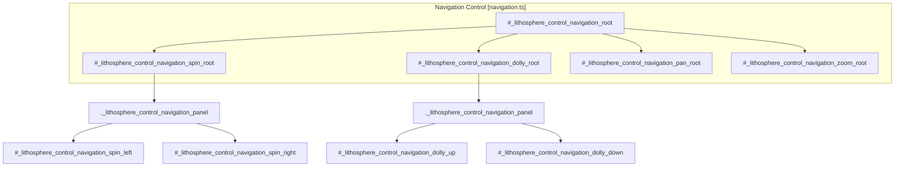
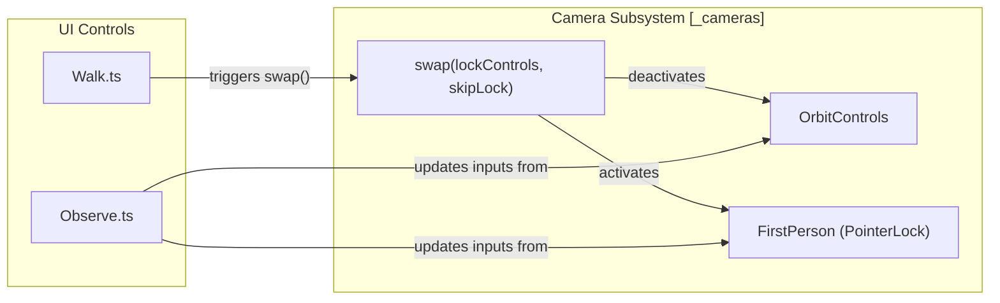

# Navigation & Camera Controls

Relevant source files

The following files were used as context for generating this wiki page:

- [dist/src/controls/compass.d.ts](dist/src/controls/compass.d.ts)
- [dist/src/controls/exaggerate.d.ts](dist/src/controls/exaggerate.d.ts)
- [dist/src/controls/home.d.ts](dist/src/controls/home.d.ts)
- [dist/src/controls/walk.d.ts](dist/src/controls/walk.d.ts)
- [src/controls/compass.ts](src/controls/compass.ts)
- [src/controls/coordinates.ts](src/controls/coordinates.ts)
- [src/controls/exaggerate.ts](src/controls/exaggerate.ts)
- [src/controls/home.ts](src/controls/home.ts)
- [src/controls/layers.ts](src/controls/layers.ts)
- [src/controls/navigation.css](src/controls/navigation.css)
- [src/controls/navigation.ts](src/controls/navigation.ts)
- [src/controls/observe.ts](src/controls/observe.ts)
- [src/controls/walk.ts](src/controls/walk.ts)

The Navigation and Camera controls provide the primary user interface for manipulating the LithoSphere viewport. These controls are implemented as pluggable UI components that interact with the core `LithoSphere` instance to modify camera states, terrain rendering, and orientation displays.

## Navigation Control

The `Navigation` control provides a multi-panel UI for explicit camera manipulation, including spinning (rotation), tilting (dolly), panning, and zooming.

### Implementation Details
The control is structured as a root container `_lithosphere_control_navigation_root` containing four functional blocks: Spin, Dolly (Tilt), Pan, and Zoom [src/controls/navigation.ts:24-112](). Each block uses a "hover-to-expand" panel mechanism managed via CSS transitions [src/controls/navigation.css:28-50]().

*   **Spin:** Rotates the camera around the current target.
*   **Tilt (Dolly):** Adjusts the vertical angle (pitch) of the camera.
*   **Pan:** Translates the camera across the horizontal plane.
*   **Zoom:** Adjusts the camera's distance or focal length.

### UI Interaction Flow
The panels use CSS classes to handle visibility. The `._lithosphere_control_navigation_panel` has an initial `max-height: 0px` and `opacity: 0` [src/controls/navigation.css:28-40](). Upon hovering over the parent `div`, or when the `active` class is applied, the panel expands to `max-height: 100px` with a `0.2s` ease-out transition [src/controls/navigation.css:42-50]().

**Navigation UI Structure**

Sources: [src/controls/navigation.ts:7-112](), [src/controls/navigation.css:1-104]()

## Compass & Orientation

The `Compass` class provides a visual representation of the camera's current azimuth and Field of View (FOV).

### Technical Implementation
*   **Update Loop:** The `Compass` implements `onUpdate()`, which calls `setDirection()` during the main render loop [src/controls/compass.ts:51-53]().
*   **Coordinate Calculation:** It retrieves the camera state from `this.p._.cameras` [src/controls/compass.ts:56-58](). 
    *   In **First Person** mode, it calculates rotation from the `PointerLockControls` object via `camera.controls.getObject().rotation.y` [src/controls/compass.ts:63-70]().
    *   In **Orbit** mode, it calculates the angle using `Math.atan2(x, z)` of the camera position relative to the planet center [src/controls/compass.ts:72-75]().
*   **FOV Visualization:** The control draws an SVG arc representing the camera's FOV using the `describeArc` helper [src/controls/compass.ts:78-85](). The arc dynamically updates its start and end angles based on the current `camera.camera.fov` [src/controls/compass.ts:76-80]().

Sources: [src/controls/compass.ts:5-91]()

## View Management (Home & Exaggerate)

### Home Control
The `Home` control provides a "Reset View" button. When clicked, it invokes `this.p.setCenter()` using the `initialView` configuration defined during LithoSphere initialization [src/controls/home.ts:32-34](). This typically resets the camera to the default latitude, longitude, and zoom level.

### Exaggerate Control
The `Exaggerate` control allows users to scale the vertical dimension of the terrain (DEM).
*   **Implementation:** It presents a UI with multipliers (1x, 2x, 5x) [src/controls/exaggerate.ts:97-99]().
*   **Data Flow:** When a multiplier is selected, `setExaggeration(multiplier)` is called. This updates `this.p.options.exaggeration` and triggers `this.p._.tiledWorld.removeAllTiles()` [src/controls/exaggerate.ts:106-109]().
*   **Re-rendering:** Removing all tiles forces the `TiledWorld` to regenerate geometry. During regeneration, the elevation values fetched from DEM tiles are multiplied by the new exaggeration factor before being applied to vertex displacement.

Sources: [src/controls/home.ts:5-36](), [src/controls/exaggerate.ts:5-110]()

## Camera Modes: Walk & Observe

LithoSphere supports two specialized camera modes toggled via UI controls, allowing users to switch between a global "god-view" and a surface-level perspective.

### Walk Mode
The `Walk` control switches the system to a First-Person "walk" mode using `PointerLockControls`.
*   **Camera Swap:** Calls `this.p._.cameras.swap(false)` to transition from Orbit to First-Person [src/controls/walk.ts:62-63]().
*   **UI Overlay:** Displays a help panel (`_lithosphere_control_walk_help`) showing keyboard bindings: WASD for movement, Shift for speed, and ESC to quit [src/controls/walk.ts:42-58]().
*   **Pointer Lock:** Listens for `pointerlockchange` events to clean up the UI when the user exits the mode (e.g., by pressing ESC) [src/controls/walk.ts:64-77]().

### Observe Mode
The `Observe` control provides an advanced interface for precise camera telemetry and settings, often used for scientific observation or screenshot alignment.
*   **Active Content:** When active, it displays a detailed panel (`_lithosphere_WalkSettingsPanel`) [src/controls/observe.ts:51]().
*   **Telemetry Fields:** Provides inputs for Field of View, Focal Length, Azimuth, Elevation, and Geographic Coordinates (Lat/Lng) [src/controls/observe.ts:53-91](). It initializes these fields using `this.p.getCenter()` [src/controls/observe.ts:44]().

**Camera Mode Control Logic**

Sources: [src/controls/walk.ts:5-93](), [src/controls/observe.ts:5-91]()

## Coordinate Display
The `Coordinates` control provides real-time feedback of the mouse position on the planetary surface.
*   **Logic:** It listens for updates and checks if the mouse is within the scene or if the camera is in First-Person mode [src/controls/coordinates.ts:45-46]().
*   **Data Source:** It reads `this.p.mouse.lng`, `lat`, and `elev` which are updated via raycasting in the core `Events` system [src/controls/coordinates.ts:52-59]().
*   **External Integration:** Can pipe coordinate changes to an external callback via `params.onChange` [src/controls/coordinates.ts:74-79]().

Sources: [src/controls/coordinates.ts:14-81]()

## Control Placement
All navigation and camera controls implement the `corner` property from `generalTypes.d.ts` to determine their position in the UI:
*   **TopRight:** `Navigation` [src/controls/navigation.ts:18](), `Layers` [src/controls/layers.ts:18]().
*   **TopLeft:** `Exaggerate` [src/controls/exaggerate.ts:19](), `Walk` [src/controls/walk.ts:18](), `Home` [src/controls/home.ts:16](), `Observe` [src/controls/observe.ts:19]().
*   **BottomLeft:** `Compass` [src/controls/compass.ts:16]().
*   **BottomRight:** `Coordinates` [src/controls/coordinates.ts:27]().

Sources: [src/controls/navigation.ts:18](), [src/controls/compass.ts:16](), [src/controls/home.ts:16](), [src/controls/exaggerate.ts:19](), [src/controls/walk.ts:18](), [src/controls/observe.ts:19](), [src/controls/coordinates.ts:27]()
