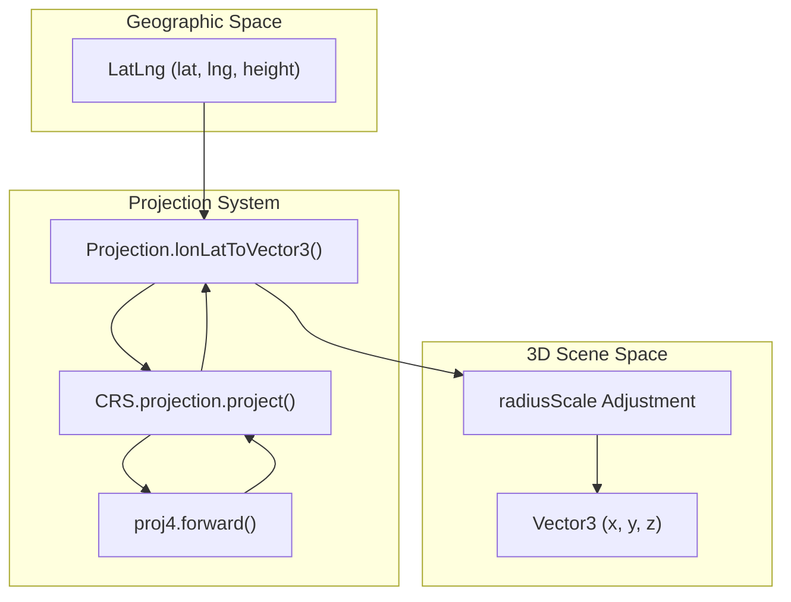
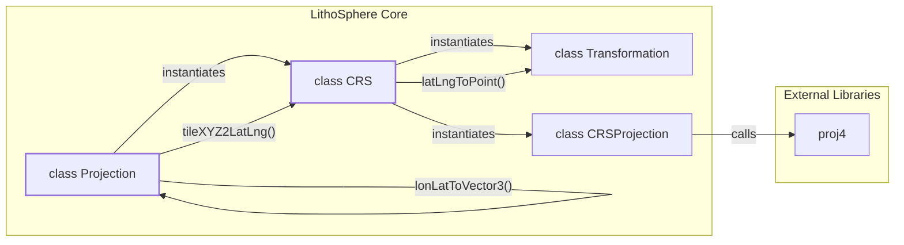

# Projection & Coordinate Systems

<details>
<summary>Relevant source files</summary>

The following files were used as context for generating this wiki page:

- [dist/src/core/CRS.d.ts](dist/src/core/CRS.d.ts)
- [dist/src/core/projection.d.ts](dist/src/core/projection.d.ts)
- [docs/Gemfile](docs/Gemfile)
- [public/examples/juno_test.html](public/examples/juno_test.html)
- [src/core/crs.ts](src/core/crs.ts)
- [src/core/projection.ts](src/core/projection.ts)

</details>


The `Projection` class is the mathematical engine of LithoSphere. It manages the conversion between different coordinate spaces: Geodetic (latitude, longitude, height), Tile XYZ (slippy map tiles), and 3D Cartesian space (Three.js world coordinates). It handles planetary ellipsoids, scaling for large celestial bodies, and integrates with Proj4 for Coordinate Reference System (CRS) support.

## The Projection Class

The `Projection` class encapsulates the planetary shape and the logic required to map a 2D grid onto a 3D sphere or ellipsoid. It is initialized during the LithoSphere constructor using planetary radii and optional `TileMapResource` metadata [src/core/projection.ts:31-37]().

### Planetary Radii & Scaling
LithoSphere supports non-spherical bodies by defining major and minor radii.
- **Major/Minor Radii**: Set via `setRadius`. If only a major radius is provided, the body is treated as a sphere [src/core/projection.ts:136-143]().
- **radiusScale**: If a planetary radius exceeds the `radiusCutoff` (default `Infinity`), LithoSphere calculates a `radiusScale` to shrink the 3D world coordinates. This prevents floating-point precision issues in Three.js when rendering massive bodies like Jupiter [src/core/projection.ts:38-40, 139-140]().
- **Flattening Factor**: Used to calculate the eccentricity of the ellipsoid for accurate geodetic-to-cartesian conversions [src/core/projection.ts:27-29]().

### Coordinate Space Conversions

| Conversion | Function | Description |
| :--- | :--- | :--- |
| **Geodetic to Cartesian** | `lonLatToVector3` | Converts `lon/lat/h` to 3D world coordinates `(x, y, z)` [src/core/projection.ts:44](). |
| **Cartesian to Geodetic** | `vector3ToLatLng` | Converts 3D world coordinates back to `lat/lng/h` [src/core/projection.ts:43](). |
| **Tile to Geodetic** | `tileXYZ2LatLng` | Converts a specific tile's `x/y/z` to `lat/lng`. Supports custom Proj4 strings or standard Mercator math [src/core/projection.ts:204-216](). |
| **Geodetic to Tile** | `latLngZ2TileXYZ` | Determines which tile `x/y` contains a specific `lat/lng` at zoom `z` [src/core/projection.ts:42](). |
| **Tile to Bounds** | `tileXYZ2NwSe` | Calculates the North-West and South-East corners of a tile in geographic coordinates [src/core/projection.ts:172-177](). |

**Sources:** [src/core/projection.ts:17-113](), [src/core/projection.ts:136-143](), [dist/src/core/projection.d.ts:41-44]()

---

## TileMapResource & CRS Integration

LithoSphere uses a `TileMapResource` object to define the tiling scheme and spatial reference system. This is heavily influenced by the OSGeo Tile Map Service (TMS) specification.

### TileMapResource Interface
The resource defines how tiles are addressed and projected [src/core/projection.ts:46-54]():
- `crsCode`: The EPSG string (e.g., `"EPSG:4326"` or `"EPSG:3857"`).
- `proj`: A Proj4 string defining the projection parameters.
- `origin`: The coordinate of the `(0,0)` tile.
- `resunitsperpixel`: The resolution at a specific zoom level.
- `bounds`: The spatial extent of the resource [src/core/projection.ts:90-103]().

### CRS and Proj4
The `CRS` class [src/core/crs.ts:5]() acts as a bridge to `proj4js`. It handles:
1. **Transformations**: Scaling and shifting points based on the tile grid origin using the `Transformation` helper class [src/core/crs.ts:15-23, 121-161]().
2. **Projections**: The `CRSProjection` sub-class uses `proj4.forward` and `proj4.inverse` to swap between projected coordinates (meters/degrees) and geographic coordinates [src/core/crs.ts:94-102]().

### Addressing Modes: TMS vs WMTS
LithoSphere supports different tile addressing schemes via the `invertY` logic:
- **TMS**: The Y-axis starts at the bottom.
- **WMTS/WMS**: The Y-axis starts at the top.
The `invertY` function standardizes these inputs based on the `crsCode` and tile bounds. If `EPSG:4326` is detected, it uses a standard power-of-two flip [src/core/projection.ts:145-155]().

**Sources:** [src/core/projection.ts:46-113](), [src/core/crs.ts:1-42](), [src/core/crs.ts:85-119]()

---

## Data Flow: From Lat/Lng to 3D Scene

The following diagram illustrates how the `Projection` and `CRS` classes collaborate to transform a geographic location into a renderable 3D position.

### Coordinate Transformation Pipeline

**Sources:** [src/core/projection.ts:44](), [src/core/crs.ts:44-46](), [src/core/crs.ts:94-97]()

---

## Entity Mapping: Internal Logic

This diagram maps the conceptual coordinate systems to the specific classes and methods that implement them in the codebase.

### System Entity Map

**Sources:** [src/core/projection.ts:17](), [src/core/crs.ts:5](), [src/core/crs.ts:85](), [src/core/crs.ts:121]()

---

## Implementation Details

### Resolution Calculation
If a `TileMapResource` provides `resunitsperpixel` and `reszoomlevel`, the `Projection` class pre-calculates an array of 32 resolution levels. This ensures that tile sizes are consistent across different zoom depths [src/core/projection.ts:61-73]().

### The InvertY Logic
Standard `EPSG:4326` tiles in LithoSphere follow a specific power-of-two grid. For custom projections, the `CRS` transformation is used to determine the maximum Y-index to correctly flip the tile coordinate for the requested service [src/core/projection.ts:145-155]().

```typescript
// Logic from src/core/projection.ts:145-155
invertY = (y: number, z: number): number => {
    const b = this.crs.projection.bounds
    if (this.tileMapResource.crsCode === 'EPSG:4326') {
        // Map uses default projection
        return Math.pow(2, z) - 1 - y
    }
    const s = this.crs.scale(z)
    const max = this.crs.transformation.transform(b.min, s)
    const yMax = Math.ceil(max.y / 256) - 1
    return yMax - y
}
```

### Radius Management
The `setRadius` method allows dynamic updates to the planetary dimensions. This is critical for missions involving multiple bodies or highly ellipsoidal shapes [src/core/projection.ts:136-143](). In the `juno_test.html` example, a large radius of `71492000` meters is used for Jupiter [public/examples/juno_test.html:43-44]().

**Sources:** [src/core/projection.ts:61-73](), [src/core/projection.ts:145-155](), [src/core/crs.ts:65-82](), [public/examples/juno_test.html:43-44]()
