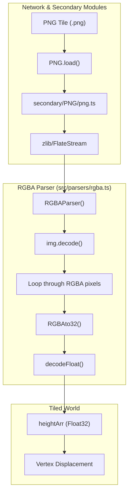
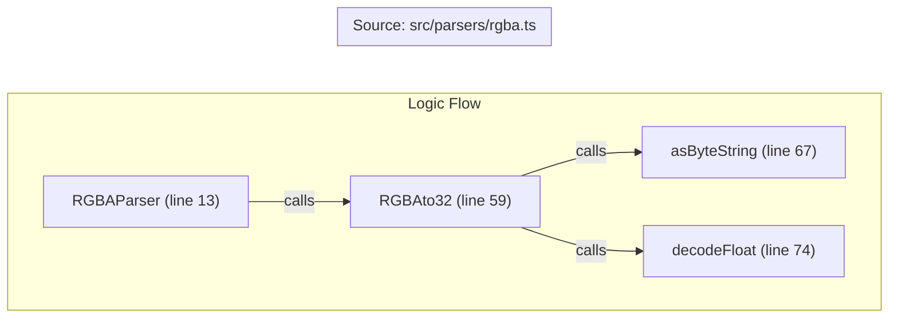

# RGBA Parser

Relevant source files

The following files were used as context for generating this wiki page:

- [dist/src/parsers/rgba.d.ts](dist/src/parsers/rgba.d.ts)
- [dist/src/secondary/PNG/png.d.ts](dist/src/secondary/PNG/png.d.ts)
- [dist/src/secondary/PNG/zlib.d.ts](dist/src/secondary/PNG/zlib.d.ts)
- [src/parsers/rgba.ts](src/parsers/rgba.ts)
- [src/secondary/PNG/png.ts](src/secondary/PNG/png.ts)

The **RGBA Parser** is a specialized elevation data decoder within LithoSphere. It is designed to handle Digital Elevation Model (DEM) tiles where 32-bit floating-point elevation values are encoded across the Red, Green, Blue, and Alpha channels of a standard PNG image. This encoding scheme allows high-precision terrain data to be transmitted over the network using standard image formats and decoded efficiently on the client side for vertex displacement in the 3D scene.

## Overview and Data Flow

The parser is typically invoked when a tile layer defines a `demPath` pointing to assets generated by the `gdal2customtiles` script using the `--dem` flag [src/parsers/rgba.ts:1-6](). The data flow begins with a network request for a PNG tile and ends with a flat array of floating-point meters used by the `TiledWorld` system.

### Data Decoding Pipeline

The following diagram illustrates the transition from a binary PNG stream to a usable height array.

**DEM Decoding Pipeline**

Sources: [src/parsers/rgba.ts:13-57](), [src/secondary/PNG/png.ts:44-63](), [dist/src/secondary/PNG/png.d.ts:1-16]()

## The RGBAto32 Algorithm

The core of the parser is the conversion of four 8-bit channels (0-255) into a single 32-bit IEEE 754 floating-point number. This is achieved by concatenating the bit-strings of each channel and manually parsing the resulting 32-bit sequence.

### Bit Manipulation Steps
1.  **Byte Extraction**: The `rgbaArr` (returned by `img.decode()`) is iterated in steps of 4 [src/parsers/rgba.ts:32-43]().
2.  **Bit String Conversion**: Each channel (`r`, `g`, `b`, `a`) is converted to a base-2 string.
3.  **Padding**: The `asByteString` function ensures each channel is exactly 8 bits by prepending zeros [src/parsers/rgba.ts:67-73]().
4.  **Concatenation**: The strings are joined in order: `R + G + B + A` [src/parsers/rgba.ts:61-64]().
5.  **Float Reconstruction**: The `decodeFloat` function parses the 32-bit string [src/parsers/rgba.ts:74-102]():
    *   **Sign**: Bit 0 (1 for negative, 0 for positive) [src/parsers/rgba.ts:79]().
    *   **Exponent**: Bits 1-8, adjusted by a bias of 127 [src/parsers/rgba.ts:80]().
    *   **Significand (Mantissa)**: Bits 9-31, handled with an implicit leading 1 (unless the exponent is -127, indicating a subnormal number or zero) [src/parsers/rgba.ts:81-93]().

**Code Entity Mapping: Parser Logic**

Sources: [src/parsers/rgba.ts:13-102]()

## PNG.js Integration

LithoSphere includes a bundled version of `PNG.js` (originally by Devon Govett) in the `secondary` directory to handle browser-side PNG decoding without relying on the DOM's `Image` object for raw data access.

### Key Capabilities
*   **Asynchronous Loading**: `PNG.load(url, options, callback)` uses `XMLHttpRequest` with `responseType = 'arraybuffer'` to fetch the raw bytes [src/secondary/PNG/png.ts:44-63]().
*   **Chunk Parsing**: The constructor iterates through PNG chunks such as `IHDR` (header), `PLTE` (palette), and `IDAT` (image data) [src/secondary/PNG/png.ts:77-143]().
*   **Decompression**: It utilizes `FlateStream` from the bundled `zlib` module to decompress the `IDAT` stream [src/secondary/PNG/png.ts:23](), [dist/src/secondary/PNG/zlib.d.ts:1-4]().
*   **Pixel Decoding**: The `decode()` method processes the decompressed stream, applying PNG filters to return a `Uint8Array` of raw RGBA values [dist/src/secondary/PNG/png.d.ts:7-10]().

Sources: [src/secondary/PNG/png.ts:44-143](), [dist/src/secondary/PNG/png.d.ts:1-16](), [dist/src/secondary/PNG/zlib.d.ts:1-4]()

## Tiling Workflow: gdal2customtiles

The elevation tiles consumed by this parser are generated using the `gdal2customtiles` Python script (or similar variants like `gdal2customtiles_v3.py`).

| Step | Process | Description |
| :--- | :--- | :--- |
| **Input** | GeoTIFF / DEM | A raw raster containing 32-bit or 16-bit elevation values. |
| **Processing** | `--dem` flag | The script reads the raw floating-point value for each pixel and splits it into four 8-bit components. |
| **Encoding** | Bit-shifting | The 32-bit float is bit-shifted into R, G, B, and A channels respectively. |
| **Output** | PNG Tiles | A standard TMS/WMTS directory structure of `.png` files that look like colorful noise but contain high-precision data. |

This workflow is critical because standard 8-bit grayscale PNGs (0-255) do not provide enough vertical resolution for planetary terrain. By using all 4 channels, the system achieves the full 32-bit precision of the original source data.

Sources: [src/parsers/rgba.ts:1-6]()

## Technical Implementation Details

### Handling No-Data Values
The parser includes logic (which may be toggled via `layerObj` properties) to map specific `noDataValue` markers defined in the layer configuration to an internal constant. This prevents "spikes" or "holes" in the 3D mesh where data is missing [src/parsers/rgba.ts:45-49]().

### Interface Reference
The `RGBAParser` function adheres to the following signature:
`RGBAParser(tilePath: string, layerObj?: any, xyz?: any, tileResolution?: number, numberOfVertices?: number): Promise<number[]>` [dist/src/parsers/rgba.d.ts:1]().

*   **tilePath**: The URL of the PNG tile.
*   **layerObj**: Configuration object containing metadata like `noDataValue`.
*   **xyz**: The tile coordinates (zoom, x, y).
*   **Returns**: A Promise resolving to an array of floating-point elevation values.

Sources: [src/parsers/rgba.ts:13-19](), [dist/src/parsers/rgba.d.ts:1]()
