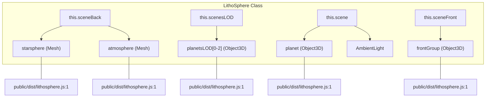
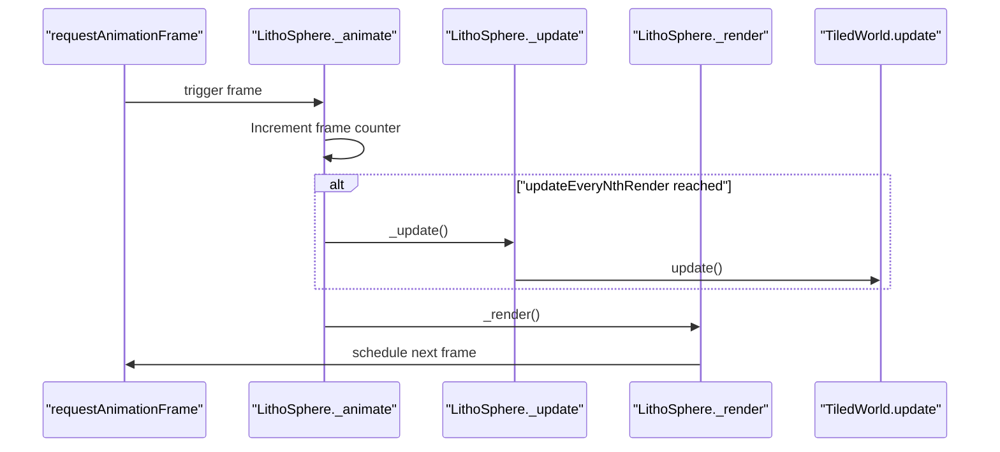
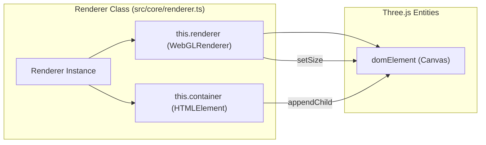

# Rendering Pipeline

Relevant source files

The following files were used as context for generating this wiki page:

- [public/dist/lithosphere.js](public/dist/lithosphere.js)
- [src/core/renderer.ts](src/core/renderer.ts)
- [src/core/shaders.ts](src/core/shaders.ts)

The LithoSphere rendering pipeline is a multi-scene architecture built on Three.js that facilitates the simultaneous rendering of planetary terrain, atmospheric effects, celestial backgrounds, and screen-space overlays. It utilizes a layered scene approach to manage depth contention and Level of Detail (LOD) transitions across vast spatial scales.

## Scene Architecture

LithoSphere manages several distinct `THREE.Scene` objects, each rendered in a specific sequence to ensure correct visual layering. This separation allows for different camera behaviors or post-processing effects to be applied to specific components of the world.

| Scene Name | Purpose | Implementation Entity |
| :--- | :--- | :--- |
| `sceneBack` | Background elements (Stars, Atmosphere) | `this.sceneBack` [public/dist/lithosphere.js:1]() |
| `scenesLOD` | Multi-level terrain LOD (0, 1, 2) | `this.scenesLOD` [public/dist/lithosphere.js:1]() |
| `scene` | Main planet scene and primary entities | `this.scene` [public/dist/lithosphere.js:1]() |
| `sceneFront` | Screen-space or front-most overlays | `this.sceneFront` [public/dist/lithosphere.js:1]() |

### Code Entity Space: Scene Management
The following diagram maps the logical rendering layers to their corresponding code properties within the `LithoSphere` class.

Sources: [public/dist/lithosphere.js:1]()

---

## The Render Loop

The rendering process is driven by a `requestAnimationFrame` loop, encapsulated within the `_animate` and `_render` methods.

### Animation and Update Logic
The loop performs two primary tasks:
1.  **Update**: Calculating camera movements, tile visibility, and interaction states.
2.  **Render**: Drawing the scenes to the WebGL context.

To optimize performance, LithoSphere can skip update cycles using `updateEveryNthRender`. If set to a value greater than 1, the heavy logic in `_update` (such as tile management in `TiledWorld`) only runs periodically, while the `_render` call continues at the monitor's refresh rate to maintain smooth motion.

Sources: [public/dist/lithosphere.js:1]()

### Render Sequence
The `Renderer` class configures the `WebGLRenderer` with `autoClear = false` [src/core/renderer.ts:36](), allowing LithoSphere to manually clear the depth buffer or color buffer between scene passes if necessary.

1.  **Clear**: The renderer clears the buffers.
2.  **Back Scene**: Renders `sceneBack` (stars and atmosphere).
3.  **LOD Scenes**: Renders the `scenesLOD` array.
4.  **Main Scene**: Renders the primary `scene` containing the high-resolution planet.
5.  **Front Scene**: Renders `sceneFront` for UI elements or markers that must never be occluded by terrain.

Sources: [public/dist/lithosphere.js:1](), [src/core/renderer.ts:29-37]()

---

## Renderer Configuration

The `Renderer` class initializes the WebGL context with specific performance and visual parameters.

*   **Logarithmic Depth Buffer**: Set to `false` by default [src/core/renderer.ts:30]() to maintain compatibility and performance, though this requires management of near/far planes.
*   **Alpha**: Enabled to allow the container background to show through if the clear color alpha is set to 0 [src/core/renderer.ts:31-34]().
*   **Power Preference**: Set to `high-performance` [src/core/renderer.ts:32]().
*   **Device Pixel Ratio**: The renderer automatically adjusts to `window.devicePixelRatio` for high-DPI displays [src/core/renderer.ts:42]().

### Code Entity Space: Renderer Implementation
This diagram associates the `Renderer` helper class with the browser's DOM and Three.js entities.

Sources: [src/core/renderer.ts:3-11](), [src/core/renderer.ts:40](), [src/core/renderer.ts:60-65]()

---

## Shader Integration in the Pipeline

The pipeline uses specialized shaders to handle the multi-layered nature of the planet's surface. The `Shaders.multiTexture` function generates GLSL code dynamically based on the number of active layers.

### Multi-Texture Shader Data Flow
When a tile is rendered, the `multiTexture` shader processes several uniforms per layer:
*   `t[i]`: The `sampler2D` texture [src/core/shaders.ts:52]().
*   `tA[i]`: Layer opacity [src/core/shaders.ts:53]().
*   `fbrightness[i]`, `fcontrast[i]`, `fsaturation[i]`: Per-layer color adjustments [src/core/shaders.ts:54-56]().
*   `fblendCode[i]`: Determines the blending mode (e.g., Overlay, SetLum) [src/core/shaders.ts:57]().

The shader iterates through these layers, calculating the final `gl_FragColor` by blending each layer's RGB values based on its alpha channel and the specified `blendCode` [src/core/shaders.ts:114]().

### Atmospheric Effects
The `atmosphere` shader provides a Fresnel-based glow. It uses `vVertexNormal` and `vVertexWorldPosition` to calculate the intensity of the atmospheric halo relative to the camera position [src/core/shaders.ts:170-184]().

Sources: [src/core/shaders.ts:29-58](), [src/core/shaders.ts:142-155](), [src/core/shaders.ts:165-185]()
