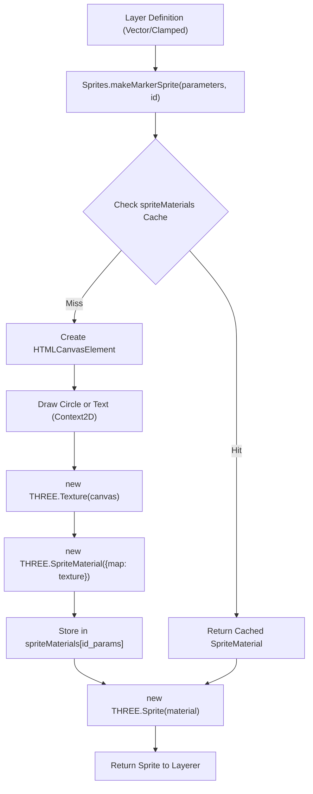
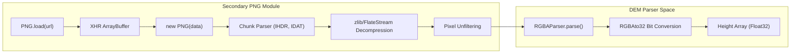

# Secondary Modules (Sprites, OrbitControls, PNG)

Relevant source files

The following files were used as context for generating this wiki page:

- [LICENSE](LICENSE)
- [dist/src/controls/coordinates.d.ts](dist/src/controls/coordinates.d.ts)
- [dist/src/controls/link.d.ts](dist/src/controls/link.d.ts)
- [dist/src/controls/observe.d.ts](dist/src/controls/observe.d.ts)
- [dist/src/core/renderer.d.ts](dist/src/core/renderer.d.ts)
- [dist/src/core/shaders.d.ts](dist/src/core/shaders.d.ts)
- [dist/src/layers/curtain.d.ts](dist/src/layers/curtain.d.ts)
- [dist/src/layers/vector.d.ts](dist/src/layers/vector.d.ts)
- [dist/src/secondary/OrbitControls.d.ts](dist/src/secondary/OrbitControls.d.ts)
- [dist/src/secondary/PointerLockControls.d.ts](dist/src/secondary/PointerLockControls.d.ts)
- [dist/src/secondary/loadingScreen.d.ts](dist/src/secondary/loadingScreen.d.ts)
- [dist/src/secondary/sprites.d.ts](dist/src/secondary/sprites.d.ts)
- [docs/Gemfile.lock](docs/Gemfile.lock)
- [docs/assets/js/lithosphere.js](docs/assets/js/lithosphere.js)
- [src/secondary/PNG/png.ts](src/secondary/PNG/png.ts)
- [src/secondary/sprites.ts](src/secondary/sprites.ts)

This section details the auxiliary modules and third-party integrations bundled within LithoSphere. These modules provide essential support for visual markers, camera manipulation, client-side data decoding, and user interface feedback.

## Sprites and Markers

The `Sprites` module is a utility for generating 2D markers and text annotations as Three.js `Sprite` objects. It utilizes a canvas-based approach to create textures dynamically and includes a caching mechanism to reuse materials across multiple features.

### Implementation Details
- **`makeMarkerSprite`**: Creates a new `Sprite` object [src/secondary/sprites.ts:20](). It internally calls `makeMarkerMaterial` to obtain the material [src/secondary/sprites.ts:21-26]() and assigns a style radius to the sprite for attenuation calculations [src/secondary/sprites.ts:32-34]().
- **`makeMarkerMaterial`**: Generates a `SpriteMaterial`. It checks the `spriteMaterials` cache using a key composed of the `id` and a stringified version of the `parameters` to avoid redundant canvas operations [src/secondary/sprites.ts:44-52]().
- **Canvas Generation**: 
    - **Annotations**: If `options.annotation` is true, it calculates text metrics using `ctx.measureText` [src/secondary/sprites.ts:100-104]() and draws the text with a background border using `Utils.drawTextBorder` [src/secondary/sprites.ts:123-125]().
    - **Standard Markers**: Draws a circle with configurable `fillColor`, `strokeColor`, and `weight` [src/secondary/sprites.ts:131-177]().
- **Texture Configuration**: Generated textures use `NearestFilter` for both `magFilter` and `minFilter` [src/secondary/sprites.ts:183-184]() and `ClampToEdgeWrapping` to prevent tiling artifacts [src/secondary/sprites.ts:185]().

### Data Flow: Sprite Generation
The following diagram illustrates how raw parameters are transformed into a rendered Three.js Sprite.

**Sprite Creation Pipeline**

Sources: [src/secondary/sprites.ts:11-207](), [dist/src/secondary/sprites.d.ts:2-6]()

---

## Camera Controls (Orbit & PointerLock)

LithoSphere wraps standard Three.js control schemes to provide different navigation modes. These are managed primarily by the `Camera` system to switch between global and surface-level views.

### OrbitControls
Used for "Observe" mode, allowing the user to rotate around a target point on the planet.
- The module provides a wrapper for the `OrbitControls` class which attaches to a camera and a DOM element [dist/src/secondary/OrbitControls.d.ts:1-5]().
- It handles mouse-driven rotation, panning, and zooming relative to the planetary center.

### PointerLockControls
Used for "Walk" (First Person) mode, locking the cursor to the browser window to allow FPS-style navigation.
- It provides a wrapper for the camera to respond to mouse movement without a visible cursor [dist/src/secondary/PointerLockControls.d.ts:1-2]().
- This is critical for ground-level exploration where the camera orientation is decoupled from the globe's center.

Sources: [dist/src/secondary/OrbitControls.d.ts:1-5](), [dist/src/secondary/PointerLockControls.d.ts:1-2]()

---

## PNG.js and Client-Side Decoding

LithoSphere includes a custom implementation of `PNG.js` to decode PNG files directly in the browser's memory. This is critical for the `RGBA` DEM parser, which extracts 32-bit elevation data from PNG color channels without relying on canvas `getImageData` which can be subject to browser-specific color profile shifts.

### Key Functions
- **`PNG.load(url, ...)`**: Performs an `XMLHttpRequest` with `arraybuffer` response type to fetch raw PNG data [src/secondary/PNG/png.ts:44-63]().
- **`constructor(data)`**: Parses the PNG structure by iterating through chunks like `IHDR` (header), `PLTE` (palette), `IDAT` (image data), and `tRNS` (transparency) [src/secondary/PNG/png.ts:65-175]().
- **`decodePixels()`**: Decompresses the `IDAT` chunks and applies PNG filters (Sub, Up, Average, Paeth) to reconstruct the raw pixel values [src/secondary/PNG/png.ts:241-333]().

### PNG to Elevation Data Flow
This diagram shows how the secondary PNG module supports the DEM parsing system.

**PNG Decoding for DEM**

Sources: [src/secondary/PNG/png.ts:43-175]()

---

## Loading Screen

The `LoadingScreen` module provides visual feedback during the initial scene setup and tile loading. It is managed by the `Controls` class to block interaction until the environment is ready.

### Features
- **Blur Overlay**: Upon initialization, it applies a `blur(10px)` and `brightness(0.5)` CSS filter to the `sceneContainer` [dist/src/secondary/loadingScreen.d.ts:4-5]().
- **DOM Management**: It tracks a `loadingContainer` element that is injected into the document [dist/src/secondary/loadingScreen.d.ts:4]().
- **Transition**: The `end()` method removes the loading UI and clears the blur from the scene [dist/src/secondary/loadingScreen.d.ts:6]().

| Method | Description |
| :--- | :--- |
| `constructor` | Initializes the loading UI and applies scene blur [dist/src/secondary/loadingScreen.d.ts:5](). |
| `end` | Fades out the UI and clears filters from the scene container [dist/src/secondary/loadingScreen.d.ts:6](). |

Sources: [dist/src/secondary/loadingScreen.d.ts:1-8]()
