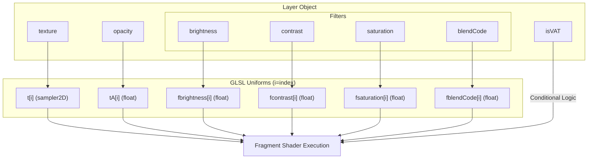
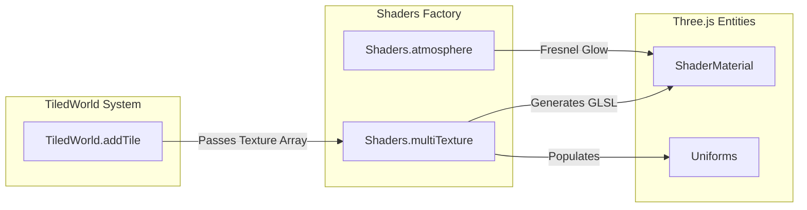

# Shaders & Materials

Relevant source files

The following files were used as context for generating this wiki page:

- [src/core/shaders.ts](src/core/shaders.ts)

The Shaders factory in LithoSphere is responsible for generating specialized `Three.ShaderMaterial` instances. Its primary role is to handle the complex blending of multiple raster tile layers, apply per-layer image filters (brightness, contrast, saturation), and provide atmospheric visual effects.

## The Multi-Texture Shader

The `multiTexture` function is the core of LithoSphere's rendering engine. It dynamically generates GLSL code based on the number of active textures for a specific tile. This allows for efficient, single-pass rendering of multiple overlapping map layers [src/core/shaders.ts:29-30]().

### Dynamic GLSL Generation
The shader is built by iterating through the `textures` array. For each texture, a set of uniforms is declared using a standard naming convention:
*   `t[i]`: The `sampler2D` texture unit [src/core/shaders.ts:52]().
*   `tA[i]`: The opacity (alpha) of the layer [src/core/shaders.ts:53]().
*   `fbrightness[i]`: Brightness adjustment [src/core/shaders.ts:54]().
*   `fcontrast[i]`: Contrast adjustment [src/core/shaders.ts:55]().
*   `fsaturation[i]`: Saturation adjustment [src/core/shaders.ts:56]().
*   `fblendCode[i]`: The blending mode algorithm to use [src/core/shaders.ts:57]().

Sources: [src/core/shaders.ts:49-58](), [src/core/shaders.ts:142-155]()

### Image Processing Pipeline
For every pixel, the shader performs the following operations in order for each layer:
1.  **Texture Sampling**: Fetches the color from the current sampler [src/core/shaders.ts:75]().
2.  **VAT Check**: If the `isVAT` (Vector As Tile) flag is set to `0`, image filters are applied. If truthy, filters are bypassed to preserve the integrity of vector-derived colors [src/core/shaders.ts:76-112]().
3.  **Saturation**: Adjusted using a weighted color matrix calculation involving `fsaturation` [src/core/shaders.ts:78-84]().
4.  **Brightness**: Multiplied against the RGB channels via `fbrightness` [src/core/shaders.ts:86]().
5.  **Contrast**: Calculated by scaling the color range relative to a 0.5 midpoint using `fcontrast` [src/core/shaders.ts:88]().
6.  **Blending**: The layer is merged with the accumulated background color `C` using standard alpha compositing or advanced blend modes [src/core/shaders.ts:91-114]().

### Blend Modes
The shader supports specific blend modes via `fblendCode`:
*   **Normal (0.0)**: Standard alpha blending.
*   **Overlay (1.0)**: Uses a `Screen` function for highlights and standard multiplication for shadows [src/core/shaders.ts:91-107]().
*   **Luminosity (2.0)**: Sets the luminosity of the current layer to match the backdrop using `SetLum` and `Lum` helper functions [src/core/shaders.ts:108-110]().

### Data Flow: Texture to Uniforms

The following diagram illustrates how layer properties are mapped to the dynamic GLSL uniforms.

"Shader Uniform Mapping"

Sources: [src/core/shaders.ts:142-155](), [src/core/shaders.ts:49-58](), [src/core/shaders.ts:76]()

## Atmosphere Shader

The `atmosphere` function creates a Fresnel-based glow effect to simulate a planetary atmosphere [src/core/shaders.ts:165-166]().

*   **Implementation**: It uses the dot product between the vertex normal and the view vector to determine the "rim" of the sphere [src/core/shaders.ts:170-171]().
*   **Visuals**: It produces a soft glow that intensifies at the edges of the planet.
*   **Configuration**: The color is passed as a hex string and converted to a `Three.Color` uniform [src/core/shaders.ts:165](), [src/core/shaders.ts:193]().

Sources: [src/core/shaders.ts:165-195]()

## Simple Point Shader

The `simplePoint` material is a basic utility for rendering point primitives with a fixed size and color.

*   **Vertex Shader**: Sets a constant `gl_PointSize` of 50.0 [src/core/shaders.ts:12]().
*   **Fragment Shader**: Outputs a static cyan color `vec4(0.0, 1.0, 1.0, 0.0)` [src/core/shaders.ts:18]().

Sources: [src/core/shaders.ts:6-27]()

## Implementation Details

### VAT (Vector As Tile) Flag
The `isVAT` flag is critical for layers that represent vector data rendered onto a canvas (clamped layers). When `isVAT` is truthy (checked as `textures[i].isVAT === 0` for applying filters), the shader skips the brightness, contrast, and saturation logic [src/core/shaders.ts:76](). This prevents the "bleeding" or distortion of sharp vector lines and labels that might occur if they were treated as photographic raster data.

### Transparency & Discarding
The `multiTexture` shader includes a `discard` logic block. If every texture sample at a specific UV coordinate has an alpha of 0.0, the fragment is discarded entirely [src/core/shaders.ts:123-134](). This ensures that the underlying globe or background is visible through transparent areas of the tile stack.

### System Interaction Diagram

"Shader Factory Integration"

Sources: [src/core/shaders.ts:29-30](), [src/core/shaders.ts:165]()
