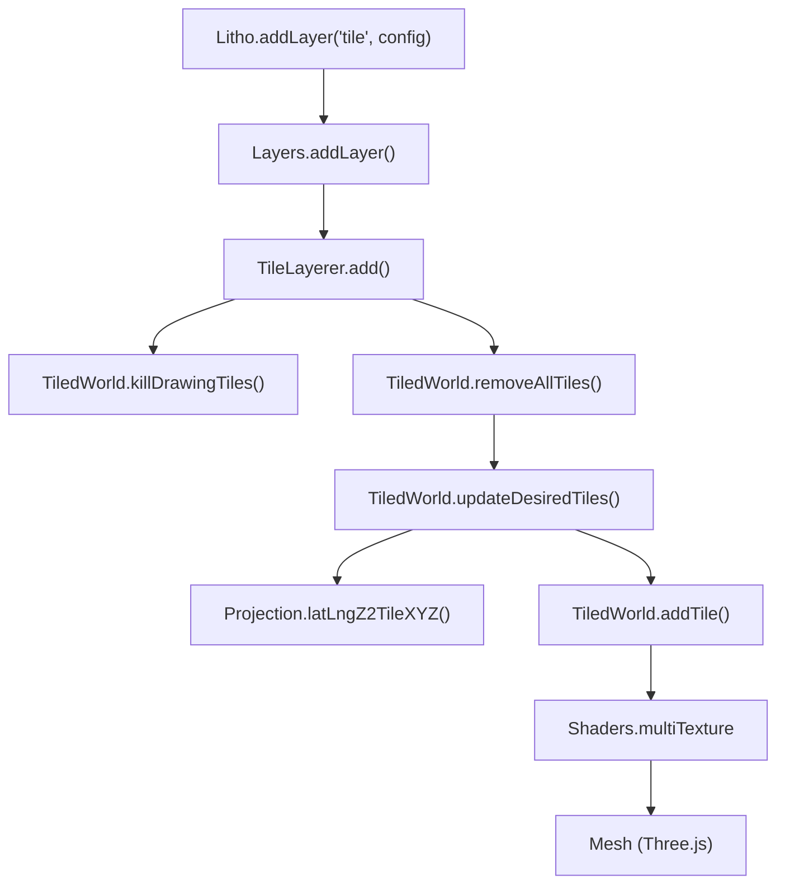
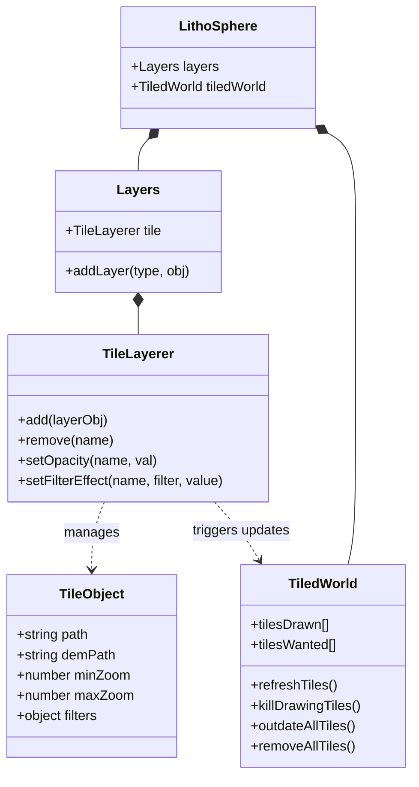

# Tile Layers

Relevant source files

The following files were used as context for generating this wiki page:

- [.gitattributes](.gitattributes)
- [dist/src/layers/clamped.d.ts](dist/src/layers/clamped.d.ts)
- [dist/src/layers/tile.d.ts](dist/src/layers/tile.d.ts)
- [docs/pages/Functions/functions.markdown](docs/pages/Functions/functions.markdown)
- [docs/pages/Layers/Tile/tile.markdown](docs/pages/Layers/Tile/tile.markdown)
- [src/core/tiledWorld.ts](src/core/tiledWorld.ts)
- [src/layers/tile.ts](src/layers/tile.ts)

Tile layers are the foundational raster data source for LithoSphere, providing both visual imagery and Digital Elevation Model (DEM) data for terrain displacement. These layers are managed by the `TileLayerer` class and rendered onto the geometry maintained by the `TiledWorld` system.

## Overview and Configuration

A Tile Layer consists of a set of raster tiles (typically PNG or JPG) organized by zoom, x, and y coordinates. LithoSphere supports standard tiling schemes including TMS, WMTS, and WMS.

### Layer Options
The following properties are required or optional when adding a tile layer via `Litho.addLayer('tile', options)` [docs/pages/Layers/Tile/tile.markdown:14-30]():

| Parameter | Type | Default | Description |
| :--- | :--- | :--- | :--- |
| `name` | string | Required | Unique identifier for the layer. |
| `path` | string | Required | URL template for raster tiles (e.g., `.../{z}/{x}/{y}.png`). |
| `demPath` | string | null | URL template for DEM tiles used for terrain displacement. |
| `format` | string | 'tms' | Raster format: `'tms'`, `'wmts'`, or `'wms'`. |
| `opacity` | number | Required | Initial opacity from 0 to 1. |
| `minZoom` | integer | Required | Minimum zoom level available in the tileset. |
| `maxZoom` | integer | Required | Maximum zoom level available in the tileset. |
| `filters` | object | null | Visual adjustments: `brightness`, `contrast`, `saturation`, `blendCode`. |
| `boundingBox` | number[4] | null | `[lng, lat, lng, lat]` (SW, NE) to restrict tile queries. |

### Visual Filters and Blending
Tile layers support dynamic GLSL-based filtering. The `blendCode` parameter determines how layers are composited [docs/pages/Functions/functions.markdown:50-58]():
*   **0**: No blending (Standard).
*   **1**: Overlay blend.
*   **2**: Color blend.

Sources: [docs/pages/Layers/Tile/tile.markdown:14-67](), [docs/pages/Functions/functions.markdown:50-65]().

## Implementation Architecture

The `TileLayerer` acts as a controller that interfaces between the `Layers` manager and the `TiledWorld` rendering engine.

### Tile Layer Data Flow
The following diagram illustrates how a tile layer request moves from the API to the rendered scene.

**Tile Layer Lifecycle and Rendering**

Sources: [src/layers/tile.ts:9-47](), [src/core/tiledWorld.ts:56-116](), [src/layers/tile.ts:1-7]().

## Lifecycle Management

The `TileLayerer` class manages the state of raster layers and triggers necessary refreshes in the `TiledWorld` to reflect changes in visibility, order, or data.

### 1. Adding and Updating Layers
When `add()` is called, the system checks if the layer already exists by name. If it is a new layer or an update to an existing one, the `TiledWorld` is signaled to clear current tiles so they can be recreated with the new layer configuration [src/layers/tile.ts:9-41](). This involves calling `killDrawingTiles()` to abort current operations [src/layers/tile.ts:12]().

### 2. Visibility and Outdating
Toggling a layer's visibility (`toggle()`) does not immediately destroy the tile geometry. Instead, it calls `tiledWorld.outdateAllTiles()`. This marks existing tiles as "outdated," allowing the system to keep them visible as placeholders while new tiles with the updated layer stack are fetched, ensuring a smooth visual transition [src/layers/tile.ts:49-67](), [src/core/tiledWorld.ts:149-153]().

### 3. Removal and Cleanup
Removing a layer involves:
*   Calling `killDrawingTiles()` to stop any active network requests or processing for tiles currently being generated [src/layers/tile.ts:129]().
*   Clearing the `tilesDrawn` array in `TiledWorld` by iterating through and calling `removeTile(0)` [src/layers/tile.ts:134-138]().
*   Recalculating the global `maxZoom` and `minNativeZoom` based on the remaining layers [src/layers/tile.ts:141-142]().

### 4. Tile Lifecycle State Machine
`TiledWorld` maintains several arrays to track tile status:
*   `tilesWanted`: Tiles that should be visible based on current camera/frustum [src/core/tiledWorld.ts:30]().
*   `tilesToBeDrawn`: A stack of tiles pending processing [src/core/tiledWorld.ts:32]().
*   `tilesBeingDrawn`: Tiles currently fetching assets or parsing DEM data [src/core/tiledWorld.ts:34]().
*   `tilesDrawn`: Tiles currently present in the Three.js scene [src/core/tiledWorld.ts:28]().

Sources: [src/layers/tile.ts:9-149](), [src/core/tiledWorld.ts:25-53]().

## Class Relationship Map

This diagram maps the natural language concepts of "Layers" and "Tiles" to the specific classes and properties used in the codebase.

**Entity Mapping: Tile System**

Sources: [src/layers/tile.ts:1-10](), [src/core/tiledWorld.ts:25-53](), [dist/src/layers/tile.d.ts:1-10]().

## DEM and Terrain
If a `demPath` is provided, the layer is treated as a terrain source. The `TiledWorld` uses a `Parser` (imported as `load`) to decode height values from the raster tiles [src/core/tiledWorld.ts:13](). These values are then applied as vertex displacements to the `PlaneBufferGeometry` of the tile [src/core/tiledWorld.ts:8]().

The `demFormatOptions` allow for specific behaviors like `correctSeams`, which queries tiles with a 1-pixel buffer to interpolate values and prevent gaps between adjacent terrain tiles [docs/pages/Layers/Tile/tile.markdown:45-50]().

Sources: [docs/pages/Layers/Tile/tile.markdown:40-50](), [src/core/tiledWorld.ts:1-15]().
