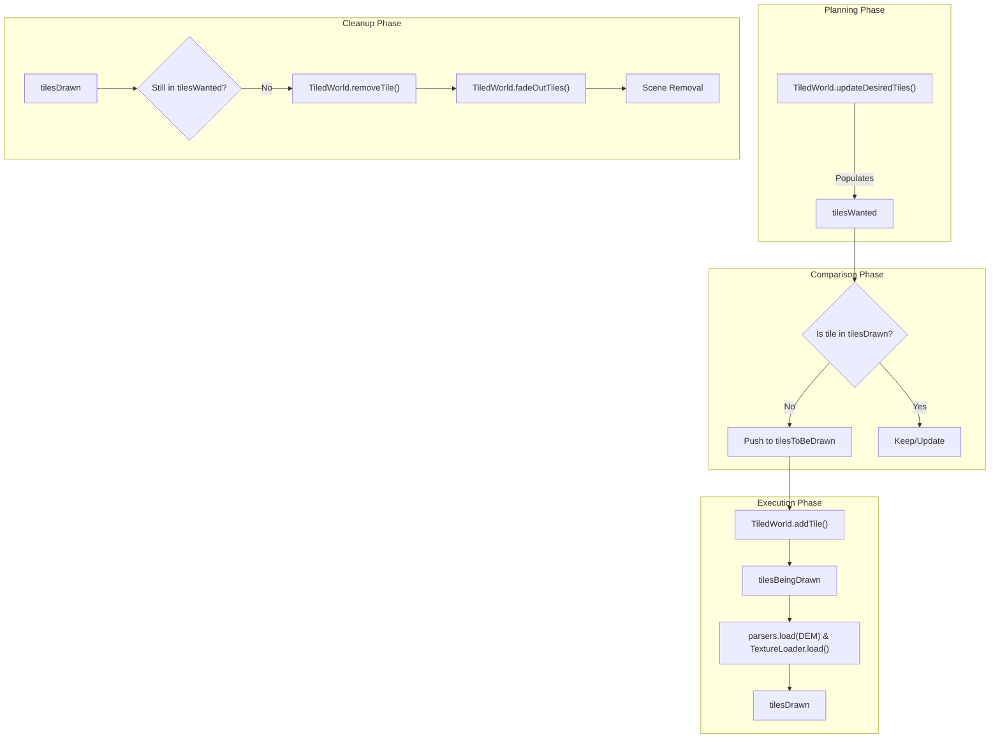
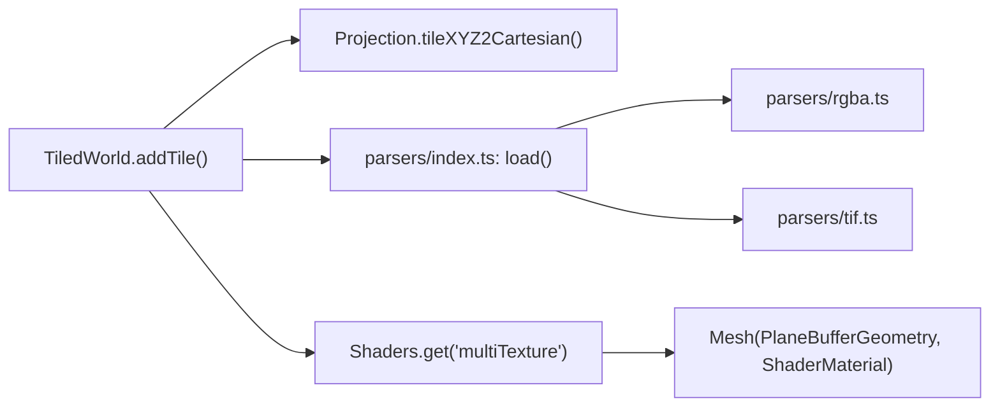

# Tiled World & LOD System

Relevant source files

The following files were used as context for generating this wiki page:

- [dist/src/core/tiledWorld.d.ts](dist/src/core/tiledWorld.d.ts)
- [docs/pages/Layers/Tile/tile.markdown](docs/pages/Layers/Tile/tile.markdown)
- [public/dist/lithosphere.js](public/dist/lithosphere.js)
- [src/core/tiledWorld.ts](src/core/tiledWorld.ts)

The `TiledWorld` class is the central orchestrator for the planetary surface rendering in LithoSphere. It manages a dynamic grid of tiles based on the camera's position and zoom level, handling the asynchronous lifecycle of fetching imagery, parsing elevation data (DEM), and performing vertex displacement.

### Tile Lifecycle State Machine

`TiledWorld` maintains four primary arrays to track the state of tiles within the system:

| State Array | Description |
| :--- | :--- |
| `tilesWanted` | Tiles that *should* be visible based on the current camera view and LOD settings [src/core/tiledWorld.ts:30](). |
| `tilesToBeDrawn` | A stack of tiles waiting to be initialized. Used to throttle processing [src/core/tiledWorld.ts:32](). |
| `tilesBeingDrawn` | Tiles currently fetching assets (textures/DEM) or generating geometry [src/core/tiledWorld.ts:34](). |
| `tilesDrawn` | Tiles successfully added to the Three.js scene and visible to the user [src/core/tiledWorld.ts:28](). |

The transition between these states is managed primarily by `refreshTiles` [src/core/tiledWorld.ts:56-178]().

#### Lifecycle Flow Diagram

The following diagram illustrates how `TiledWorld` moves tiles through the rendering pipeline.

**TiledWorld Lifecycle**

Sources: [src/core/tiledWorld.ts:25-178]()

### LOD Layers & Tile Selection

LithoSphere uses a Level of Detail (LOD) system that allows multiple resolutions of tiles to coexist. This is configured via `options.LOD` in the `LithoSphere` constructor.

*   **radiusOfTiles**: Determines how many tiles in each direction from the center are loaded [src/core/tiledWorld.ts:192-194]().
*   **zoomsUp**: Defines how many lower-resolution "background" zoom levels are maintained to prevent visual gaps during fast movement [src/core/tiledWorld.ts:208-212]().

The `updateDesiredTiles` function calculates the current center tile using `projection.latLngZ2TileXYZ` and then iterates through the `radiusOfTiles` to populate `tilesWanted` [src/core/tiledWorld.ts:181-226]().

Sources: [src/core/tiledWorld.ts:181-226](), [src/core/tiledWorld.ts:25-34]()

### The `addTile` Pipeline

When a tile is popped from `tilesToBeDrawn`, `addTile` [src/core/tiledWorld.ts:335-590]() performs the following technical steps:

1.  **Geometry Creation**: A `PlaneBufferGeometry` is created, usually with 32x32 segments to allow for smooth terrain displacement [src/core/tiledWorld.ts:360-370]().
2.  **DEM Fetching**: If a `demPath` exists for any active layer, the `load` parser is invoked to fetch and decode the elevation data [src/core/tiledWorld.ts:386-400]().
3.  **Vertex Displacement**: The Z-values of the plane's vertices are modified based on the decoded DEM values, multiplied by `options.exaggeration` [src/core/tiledWorld.ts:413-435]().
4.  **Multi-Texture Blending**: The tile's material is generated using `Shaders.get('multiTexture')`. This shader allows blending multiple raster layers (imagery, heatmaps, etc.) into a single draw call [src/core/tiledWorld.ts:468-520]().
5.  **Projection Mapping**: Each vertex is converted from local tile coordinates to planetary Cartesian coordinates using `projection.tileXYZ2Cartesian` [src/core/tiledWorld.ts:438-460]().

**Code Entity Association: Tile Construction**

Sources: [src/core/tiledWorld.ts:335-590](), [src/core/tiledWorld.ts:360-370](), [src/core/tiledWorld.ts:468-520]()

### Visual Transitions: Fading & Filtering

To ensure a smooth user experience, `TiledWorld` manages visual transitions:

*   **fadeInTiles()**: Newly added tiles start with `opacity: 0` and are incremented until they reach their target opacity [src/core/tiledWorld.ts:743-764]().
*   **fadeOutTiles()**: Tiles no longer in the `tilesWanted` list are not immediately deleted. They are moved to a fade-out queue to prevent "popping" [src/core/tiledWorld.ts:766-790]().
*   **filterEffects()**: Applies real-time adjustments for brightness, contrast, and saturation to the tile's shader uniforms [src/core/tiledWorld.ts:713-741]().

### Utility Functions for Spatial Queries

`TiledWorld` relies on `Utils` for spatial logic:
*   **isInExtent**: Checks if a tile's bounding box intersects the visible area [src/core/tiledWorld.ts:221-224]().
*   **tileContains / tileIsContained**: Used for LOD calculations to determine parent/child relationships between tiles of different zoom levels [src/core/tiledWorld.ts:230-240]().

Sources: [src/core/tiledWorld.ts:713-790](), [src/core/tiledWorld.ts:221-240]()
