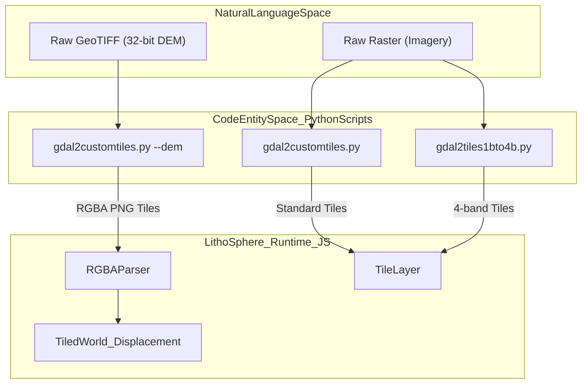
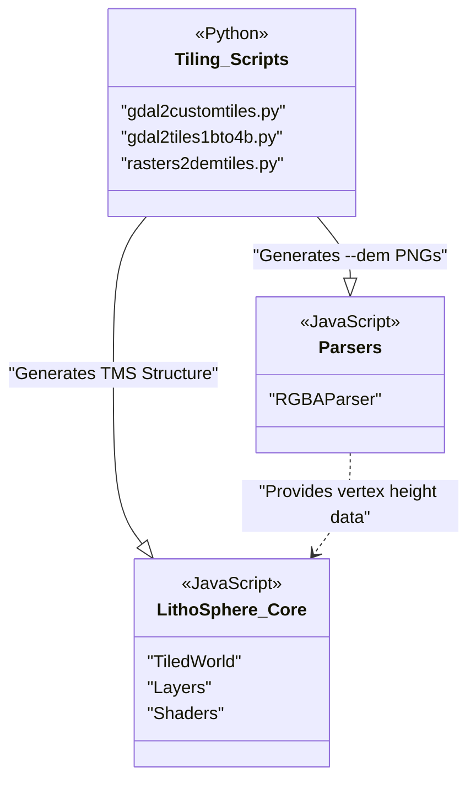

# Tiling Scripts

Relevant source files

The following files were used as context for generating this wiki page:

- [.eslintrc.js](.eslintrc.js)
- [README.md](README.md)
- [docs/assets/images/screenshot1.png](docs/assets/images/screenshot1.png)
- [package.json](package.json)
- [travis.yml](travis.yml)

LithoSphere includes a suite of Python-based pre-processing scripts designed to convert raw geospatial data into tile sets compatible with its 3D rendering engine. These scripts handle the conversion of standard rasters into Tile Map Service (TMS) structures and encode high-precision Digital Elevation Model (DEM) data into a specialized RGBA format for client-side terrain displacement.

### Overview of Tiler Families

The tiling scripts are categorized into three primary families based on their use case and the nature of the input data.

| Family | Primary Script | Purpose |
| :--- | :--- | :--- |
| **Custom Tiling** | `gdal2customtiles.py` | The most versatile script. Handles custom projections, global extents, and 32-bit DEM encoding. |
| **Band Conversion** | `gdal2tiles1bto4b.py` | Specialized for converting 1-band (grayscale) rasters into 4-band RGBA tiles for better browser compatibility. |
| **Batch DEM** | `rasters2demtiles.py` | Automates the pipeline for processing multiple DEM rasters into LithoSphere-compatible elevation tiles. |

Sources: [README.md:48-48](), [README.md:65-65](), [package.json:55-56]()

---

### Workflow Integration

The following diagram illustrates how these scripts bridge the gap between raw GIS data (GeoTIFFs) and the `LithoSphere` runtime environment.

**Data Processing Pipeline**

Sources: [README.md:48-52](), [README.md:65-65](), [package.json:52-56]()

---

### 6.1 gdal2customtiles — Raster & DEM Tiling
This is the primary utility for generating LithoSphere-ready datasets. Unlike standard `gdal2tiles`, this script supports the `--extentworld` flag, which is critical for aligning tiles with the planetary radii and projections used in the 3D globe.

Key features include:
*   **DEM Encoding**: Using the `--dem` flag, it converts 32-bit floating-point elevation values into 8-bit RGBA channels. This allows the browser to decode high-precision heights using the `RGBAParser`.
*   **Custom Projections**: Full support for non-standard planetary projections via GDAL, which is then handled at runtime by the `Projection` class.

For detailed parameters and examples, see [gdal2customtiles — Raster & DEM Tiling](#6.1).

---

### 6.2 1bto4b & demtiles Tilers
These scripts address specific edge cases in geospatial data preparation:

*   **gdal2tiles1bto4b**: Many scientific datasets are distributed as 1-band (grayscale) rasters. This script expands them to 4-band RGBA, ensuring they render correctly across all browsers and blend properly within the LithoSphere `Shaders` factory using multi-texture blending.
*   **rasters2demtiles**: A wrapper for batch processing. It streamlines the creation of elevation tile sets from large collections of source rasters, ensuring consistent zoom levels and tile boundaries for the `TiledWorld` manager.

For details on batch processing and band conversion, see [1bto4b & demtiles Tilers](#6.2).

---

### System Component Mapping

The relationship between the output of these scripts and the internal LithoSphere classes is shown below.

**Tiling Output to Class Mapping**

Sources: [README.md:48-65](), [package.json:52-57]()
