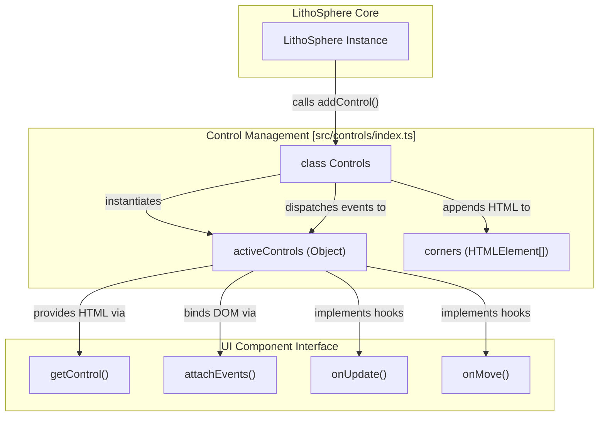
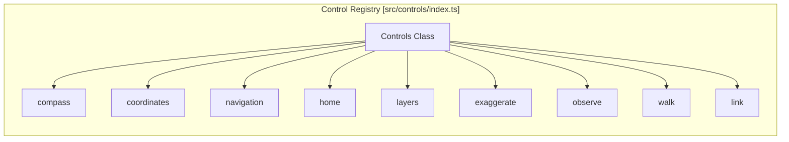

# UI Controls

<details>
<summary>Relevant source files</summary>

The following files were used as context for generating this wiki page:

- [dist/src/controls/controls.d.ts](dist/src/controls/controls.d.ts)
- [dist/src/controls/index.d.ts](dist/src/controls/index.d.ts)
- [docs/pages/Controls/controls.markdown](docs/pages/Controls/controls.markdown)
- [src/controls/index.ts](src/controls/index.ts)

</details>


The Controls system in LithoSphere provides a modular framework for adding interactive UI elements to the 3D viewport. These controls range from navigation aids and orientation displays to informational overlays and layer management tools. The system is designed to be pluggable, allowing developers to enable only the necessary components or integrate custom UI into the LithoSphere environment.

### Layout & API

Controls are managed by the `Controls` class, which creates a high-level container (`#_lithosphere_controls`) spanning the full width and height of the viewer [src/controls/index.ts:38-49](). This container is subdivided into four corner-based flexbox containers to ensure a clean, organized layout.

#### Corner Layout System
Controls can be placed in one of four corners defined by the `Corners` enum [src/controls/index.ts:51-56]():
- `TopLeft`
- `TopRight`
- `BottomLeft`
- `BottomRight`

#### The `addControl` API
To add a control, use the `addControl` method. This method instantiates the control class, generates its HTML via `getControl()`, and binds its logic via `attachEvents()` [src/controls/index.ts:121-159]().

```javascript
Litho.addControl(name, controlClass, options, corner);
```

| Parameter | Type | Description |
| :--- | :--- | :--- |
| `name` | `string` | A unique identifier for the control instance. |
| `controlClass` | `class` | The JavaScript class for the control (e.g., `Litho.controls.compass`). |
| `options` | `object` | Control-specific configuration parameters. |
| `corner` | `Corners` | Optional override for the default corner placement. |

**Sources:** [src/controls/index.ts:38-159](), [docs/pages/Controls/controls.markdown:12-22]()

### Control Lifecycle and Events

The `Controls` manager acts as a dispatcher, forwarding global LithoSphere events to all active controls that implement specific hook functions.

#### System Event Dispatching
The following table maps internal LithoSphere events to the control hooks they trigger:

| LithoSphere Event | Control Hook | Description |
| :--- | :--- | :--- |
| Render Loop Update | `onUpdate()` | Called every frame for animations or state checks [src/controls/index.ts:166-170](). |
| Camera Movement | `onMove()` | Triggered when the camera position or target changes [src/controls/index.ts:172-177](). |
| Mouse Interaction | `onMouseMove()` | For real-time coordinate tracking or hover effects [src/controls/index.ts:179-184](). |
| Viewport Exit | `onMouseOut()` | Triggered when the cursor leaves the canvas area [src/controls/index.ts:186-190](). |

#### Entity Relationship Diagram
This diagram illustrates how the `Controls` class bridges the main `LithoSphere` instance with individual UI components.


**Sources:** [src/controls/index.ts:13-32](), [src/controls/index.ts:121-190]()

---

### Navigation & Camera Controls

These controls provide the primary interface for manipulating the 3D scene. They include tools for standard orbital navigation (pan, tilt, zoom), orientation (compass), and specialized camera modes like "Walk" (First-Person) and "Observe."

*   **Navigation Panel:** On-screen buttons for manual camera manipulation (`Spin`, `Tilt`, `Pan`, `Zoom`).
*   **Compass:** A radial indicator showing the current azimuth and field of view.
*   **Camera Modes:** Toggles between `OrbitControls` (standard) and `PointerLockControls` (First-Person/Walk).
*   **Home & Exaggerate:** Tools to reset the view to `initialView` or scale the verticality of the terrain.

For implementation details and configuration options, see **[Navigation & Camera Controls](#4.1)**.

**Sources:** [docs/pages/Controls/controls.markdown:23-30](), [docs/pages/Controls/controls.markdown:47-61](), [docs/pages/Controls/controls.markdown:71-93]()

---

### Informational & Utility Controls

Informational controls provide context about the data being viewed, such as geographic coordinates or layer visibility. Utility controls facilitate cross-view synchronization and data cropping.

*   **Coordinates:** Displays real-time longitude, latitude, and elevation under the mouse cursor.
*   **Layers Control:** A management panel to toggle visibility and adjust the opacity of various data layers.
*   **Link Control:** Synchronizes multiple LithoSphere instances, allowing one viewer to drive the camera or cursor position of another via `onMove` and `onMouseMove` callbacks.
*   **Altitude & Crop:** Specialized tools for measuring height or isolating specific regions of the terrain.

For implementation details and configuration options, see **[Informational & Utility Controls](#4.2)**.

**Sources:** [docs/pages/Controls/controls.markdown:31-45](), [docs/pages/Controls/controls.markdown:63-69](), [src/controls/index.ts:118]()

---

### Available Controls Summary

The following table lists the pluggable controls available in the `Controls` class.



| Control | Class Reference | Purpose |
| :--- | :--- | :--- |
| **Compass** | `Litho.controls.compass` | Radial azimuth and FOV display [src/controls/index.ts:110](). |
| **Coordinates** | `Litho.controls.coordinates` | Lng/Lat/Elev display under cursor [src/controls/index.ts:111](). |
| **Navigation** | `Litho.controls.navigation` | On-screen Pan/Tilt/Zoom/Spin buttons [src/controls/index.ts:112](). |
| **Home** | `Litho.controls.home` | Reset camera to `initialView` [src/controls/index.ts:113](). |
| **Layers** | `Litho.controls.layers` | Layer visibility and opacity management [src/controls/index.ts:114](). |
| **Exaggerate** | `Litho.controls.exaggerate` | Slider for terrain vertical scaling [src/controls/index.ts:115](). |
| **Observe** | `Litho.controls.observe` | Camera parameter adjustment and placement [src/controls/index.ts:116](). |
| **Walk** | `Litho.controls.walk` | First-person surface navigation mode [src/controls/index.ts:117](). |
| **Link** | `Litho.controls.link` | Multi-view synchronization [src/controls/index.ts:118](). |

**Sources:** [src/controls/index.ts:110-118](), [docs/pages/Controls/controls.markdown:23-93]()
