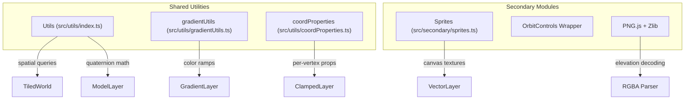
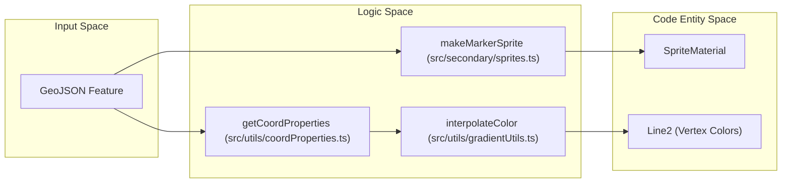

# Utilities & Secondary Modules

Relevant source files

The following files were used as context for generating this wiki page:

- [LICENSE](LICENSE)
- [dist/src/controls/coordinates.d.ts](dist/src/controls/coordinates.d.ts)
- [dist/src/utils/index.d.ts](dist/src/utils/index.d.ts)
- [docs/Gemfile.lock](docs/Gemfile.lock)
- [docs/assets/js/lithosphere.js](docs/assets/js/lithosphere.js)
- [src/secondary/sprites.ts](src/secondary/sprites.ts)
- [src/utils/coordProperties.ts](src/utils/coordProperties.ts)
- [src/utils/gradientUtils.ts](src/utils/gradientUtils.ts)
- [src/utils/index.ts](src/utils/index.ts)

LithoSphere includes a robust suite of shared utility functions and bundled third-party modules to handle tasks ranging from spatial tile queries and quaternion math to client-side PNG decoding and dynamic sprite generation. These modules support the core rendering and data parsing pipelines by providing optimized, reusable logic.

### System Overview

The following diagrams illustrate the relationship between the shared `Utils` library, specialized coordinate/gradient helpers, and the secondary modules integrated into the LithoSphere environment.

**Utility & Secondary Module Architecture**

Sources: [src/utils/index.ts:4-26](), [src/secondary/sprites.ts:11-205](), [src/utils/gradientUtils.ts:9-38](), [src/utils/coordProperties.ts:13-38]()

**Data Flow: From GeoJSON to Visual Entity**

Sources: [src/utils/coordProperties.ts:64-87](), [src/utils/gradientUtils.ts:9-28](), [src/secondary/sprites.ts:14-37]()

---

### 7.1 Utils Library
The `Utils` module is a collection of stateless helper functions used across the codebase for geometric calculations, object manipulation, and tile management. It centralizes complex logic like checking if a tile's geographic extent falls within a bounding box or recursively updating material properties across 3D model hierarchies.

**Key Capabilities:**
*   **Spatial Queries:** `isInExtent` and `isInExtentEN` determine if a tile (at a specific XYZ) intersects a bounding box using either Geodetic or Easting/Northing coordinates [src/utils/index.ts:49-123]().
*   **Tile Containment:** `tileContains` and `tileIsContained` manage hierarchical tile relationships, utilizing an internal LRU-style cache (`lastTileContains`) to optimize performance during frequent LOD updates [src/utils/index.ts:188-193]().
*   **3D Math & Traversal:** Provides `rotateAroundArbAxis` for quaternion-based object rotation [src/utils/index.ts:701-706]() and `setAllMaterialOpacity` for recursively applying transparency to complex 3D assets [src/utils/index.ts:718-724]().
*   **Data Access:** `getIn` allows for safe, nested property access within configuration objects, preventing null-pointer exceptions [src/utils/index.ts:10-20]().
*   **Specialized Helpers:** `gradientUtils.ts` provides `interpolateColor` and `buildColorStops` for linear color ramps [src/utils/gradientUtils.ts:9-90](), while `coordProperties.ts` handles "Extended GeoJSON" coordinate-level property zipping via `stitchArrays` [src/utils/coordProperties.ts:45-58]().

For detailed function signatures and implementation details, see [Utils Library](#7.1).

**Sources:** [src/utils/index.ts:4-20](), [src/utils/index.ts:49-123](), [src/utils/index.ts:188-193](), [src/utils/gradientUtils.ts:9-90](), [src/utils/coordProperties.ts:45-58]()

---

### 7.2 Secondary Modules (Sprites, Controls, PNG)
LithoSphere bundles several secondary modules and third-party libraries to extend the capabilities of the Three.js core. These modules handle specialized tasks like UI interaction, asset decoding, and dynamic texture generation.

**Core Secondary Components:**
*   **Sprites System:** The `Sprites` module (primarily `makeMarkerSprite` and `makeMarkerMaterial`) dynamically generates HTML5 Canvas-based textures for markers and annotations. It includes a `spriteMaterials` cache to prevent redundant texture creation for identical styles [src/secondary/sprites.ts:13-52]().
*   **Camera Controls:** Wrappers for `OrbitControls` and `PointerLockControls` facilitate the transition between global "Observe" mode and surface-level "Walk" mode.
*   **PNG & Zlib:** Integrated `PNG.js` and `zlib` allow the client to decode 32-bit elevation data stored in PNG RGBA channels, which is essential for the terrain displacement pipeline.
*   **Loading & UI Helpers:** Includes logic for the `loadingScreen` blur overlay and `drawTextBorder` for legible canvas annotations [src/secondary/sprites.ts:123-126]().

**Sprite Generation Logic**
| Entity | Role | Code Reference |
| :--- | :--- | :--- |
| `spriteMaterials` | LRU-style cache for generated `SpriteMaterial` objects | [src/secondary/sprites.ts:13-13]() |
| `makeMarkerSprite` | High-level factory to create a Three.js `Sprite` | [src/secondary/sprites.ts:14-37]() |
| `makeMarkerMaterial` | Internal logic for drawing circles or text to a canvas | [src/secondary/sprites.ts:38-43]() |
| `drawTextBorder` | Utility to render an outline around canvas text for legibility | [src/utils/index.ts:726-735]() |

For details on asset decoding and sprite configuration, see [Secondary Modules (Sprites, OrbitControls, PNG)](#7.2).

**Sources:** [src/secondary/sprites.ts:11-52](), [src/secondary/sprites.ts:123-126](), [src/utils/index.ts:726-735]()
