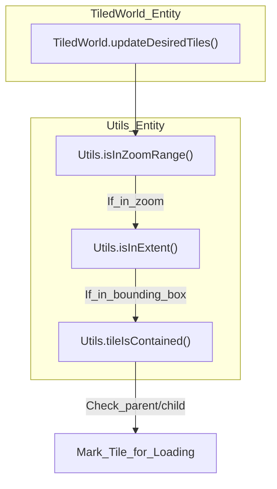
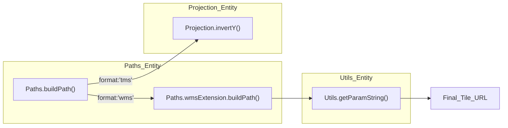

# Utils Library

Relevant source files

The following files were used as context for generating this wiki page:

- [dist/src/utils/index.d.ts](dist/src/utils/index.d.ts)
- [dist/src/utils/paths.d.ts](dist/src/utils/paths.d.ts)
- [src/utils/coordProperties.ts](src/utils/coordProperties.ts)
- [src/utils/gradientUtils.ts](src/utils/gradientUtils.ts)
- [src/utils/index.ts](src/utils/index.ts)
- [src/utils/paths.ts](src/utils/paths.ts)

The `Utils` module is a collection of stateless helper functions and spatial query logic used across the LithoSphere engine. It provides essential services for tile coordinate validation, quaternion-based 3D transformations, deep object manipulation, and URL construction for various tile protocols (TMS, WMTS, WMS). It also includes specialized utilities for handling Enhanced GeoJSON coordinate properties and color interpolation for gradient rendering.

## Spatial Queries and Tile Logic

The library provides critical logic for determining if specific tiles or coordinates fall within defined geographic or projected extents. This is primarily used by the `TiledWorld` and `Layer` systems to prune unnecessary network requests.

### Extent Validation
*   **`isInExtent`**: Determines if a tile at a specific `XYZ` coordinate intersects a bounding box defined in Latitude/Longitude `[minLng, minLat, maxLng, maxLat]` [src/utils/index.ts:49-105](). It checks all four corners of the tile by converting tile coordinates to Lat/Lng via the provided projection [src/utils/index.ts:55-102]().
*   **`isInExtentEN`**: A specialized version for Easting/Northing (projected) coordinates. It uses `tileXYZ2NwSe` to get the projected bounds of a tile and compares them against a bounding box `[minE, minN, maxE, maxN]` [src/utils/index.ts:109-123]().
*   **`isInZoomRange`**: A simple bounds check to see if a given zoom level falls between a layer's `minZoom` and `maxZoom` [src/utils/index.ts:125-137]().

### Containment and Caching
To optimize performance during LOD (Level of Detail) calculations, the library includes functions to check if one tile contains another across different zoom levels.
*   **`tileContains`**: Returns all tiles at a target zoom level `z` that are geographically inside the provided tile `xyz` [src/utils/index.ts:189-222]().
*   **`tileIsContained`**: Returns true if `xyzContained` is spatially within the bounds of `xyzContainer` [src/utils/index.ts:224-239]().
*   **LRU Caching**: Both functions utilize `lastTileContains` to store the results of recent calls, reducing redundant mathematical operations during heavy tile refreshing cycles [src/utils/index.ts:188-193]().

### Spatial Logic Flow
The following diagram illustrates how the `TiledWorld` system utilizes `Utils` to filter tile visibility.

**Title: Tile Visibility Logic**

Sources: [src/utils/index.ts:49-137](), [src/utils/index.ts:189-239]()

---

## 3D Math and Object Manipulation

LithoSphere relies on the `Utils` library for complex Three.js object transformations and deep cloning of configuration objects.

### Quaternion Math
*   **`rotateAroundArbAxis`**: Rotates a Three.js `Object3D` around an arbitrary axis in world space by a specified number of radians. It uses `Quaternion.setFromAxisAngle` and handles pre-multiplication to ensure the rotation is applied correctly relative to the object's current orientation [src/utils/index.ts:311-326]().

### Material and Scene Graph Traversal
*   **`setAllMaterialOpacity`**: A recursive helper that traverses a 3D model (e.g., a GLTF loaded via `ModelLayer`) and updates the `opacity` and `transparent` properties of every material found in its children [src/utils/index.ts:359-369]().
*   **`setChildrenMaterialOpacity`**: Similar to the above but provides more granular control over the recursion depth [src/utils/index.ts:348-357]().

### Data Access and Cloning
*   **`getIn`**: A safe property accessor that prevents "undefined" errors when traversing deep nested objects. It accepts a dot-notated string (e.g., `"options.style.color"`) or an array of keys [src/utils/index.ts:10-20]().
*   **`clone`**: A deep copy implementation that handles primitives, Dates, Arrays, and standard Objects recursively to avoid pass-by-reference side effects [src/utils/index.ts:139-170]().

---

## Path and URL Construction

The `Paths` module handles the generation of tile URLs for different server protocols.

### `Paths.buildPath`
This function acts as a dispatcher for tile URL generation based on the `format` string ('tms', 'wmts', or 'wms') [src/utils/paths.ts:6-53]().
*   **TMS/WMTS**: Performs simple string replacement for `{x}`, `{y}`, and `{z}` tokens. For TMS, it automatically inverts the Y-axis using `projection.invertY` [src/utils/paths.ts:40-45]().
*   **WMS**: Delegates to the `wmsExtension` to build complex query strings [src/utils/paths.ts:28-37]().

### `wmsExtension`
Constructs OGC Web Map Service (WMS) requests. It calculates the `BBOX` parameter by determining the North-West and South-East corners of a tile in the target CRS (usually EPSG:4326 or EPSG:3857) [src/utils/paths.ts:130-155]().
*   **`getParamString`**: Converts a flat object of key-value pairs into a URL query string, handling case sensitivity for WMS parameters [src/utils/index.ts:328-342]().

**Title: URL Generation Mapping**

Sources: [src/utils/paths.ts:6-53](), [src/utils/paths.ts:95-157](), [src/utils/index.ts:328-342]()

---

## GeoJSON and Gradient Utilities

The library includes specialized modules for handling complex GeoJSON data structures and color interpolation.

### Coordinate Properties
LithoSphere supports "Enhanced GeoJSON" where properties can be defined per-coordinate rather than just per-feature.
*   **`coordinateDepthTraversal`**: Recursively traverses nested coordinate arrays (LineStrings, Polygons, etc.) to apply operations at the leaf level [src/utils/coordProperties.ts:13-38]().
*   **`stitchArrays`**: Zips together an array of keys from `coord_properties` with an array of coordinate values to create a property object for a specific vertex [src/utils/coordProperties.ts:45-58]().
*   **`getCoordProperties`**: Resolves the final property set for a coordinate by merging global feature properties with the specific vertex properties extracted via `stitchArrays` [src/utils/coordProperties.ts:64-87]().

### Gradient Rendering
Used primarily by `GradientLayer` for interpolating colors along 3D polylines.
*   **`interpolateMultipleColors`**: Calculates an RGB color value at a specific point within a normalized range using a set of color stops [src/utils/gradientUtils.ts:33-73]().
*   **`buildColorStops`**: Normalizes an array of color strings into a standard `{ position, color }` format [src/utils/gradientUtils.ts:79-90]().
*   **`closestPointOnSegment`**: A geometric helper that finds the nearest point on a 2D line segment to a given point, returning the interpolation factor `t` [src/utils/gradientUtils.ts:140-159]().

---

## Canvas and UI Helpers

The library includes utility functions for the `ClampedLayer` and UI `Controls` to assist with drawing 2D elements.

*   **`drawTextBorder`**: Enhances text readability on a `CanvasRenderingContext2D` by drawing a multi-pass border (stroke) around text before filling it. This is used for feature labels and annotations [src/utils/index.ts:371-382]().
*   **`hexToRGB`**: Converts CSS hex strings to an object with `r`, `g`, and `b` integer values [src/utils/index.ts:276-294]().
*   **`rotatePoint`**: Rotates a 2D point `[x, y]` around a center point by a given angle, used for UI compass and bearing indicators [src/utils/index.ts:296-309]().

### Function Summary Table

| Function | Purpose | Key Dependency |
| :--- | :--- | :--- |
| `getIn` | Safe deep property access | N/A |
| `mod` | True modulo (handles negatives) | `Math.floor` |
| `isInExtent` | Spatial tile filtering (Lat/Lng) | `Projection` |
| `rotateAroundArbAxis` | Object rotation in 3D space | `THREE.Quaternion` |
| `buildPath` | Tile URL templating | `Paths` |
| `setAllMaterialOpacity` | Recursive mesh transparency | `THREE.Material` |
| `getCoordProperties` | Per-vertex GeoJSON metadata | `stitchArrays` |
| `interpolateColor` | Linear RGB color blending | `hexToRgb` / `parseRgb` |

Sources: [src/utils/index.ts:4-382](), [src/utils/paths.ts:5-159](), [src/utils/coordProperties.ts:1-88](), [src/utils/gradientUtils.ts:1-160]()
