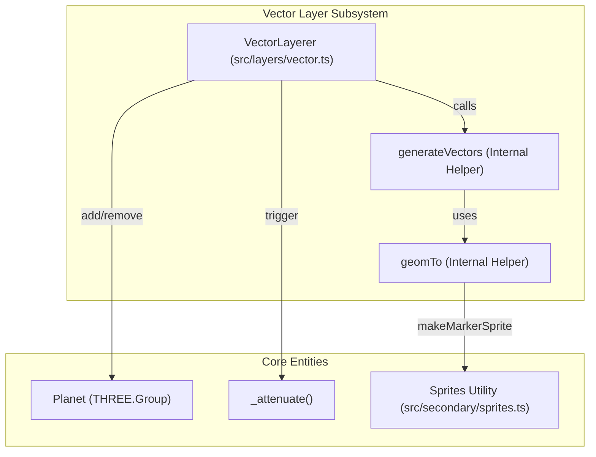
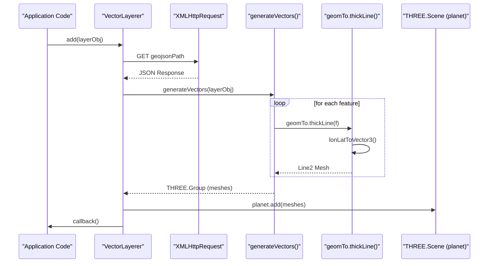

# Vector Layers

Relevant source files

The following files were used as context for generating this wiki page:

- [docs/pages/Layers/Vector/vector.markdown](docs/pages/Layers/Vector/vector.markdown)
- [src/controls/link.ts](src/controls/link.ts)
- [src/layers/vector.ts](src/layers/vector.ts)

Vector Layers in LithoSphere are 3D GeoJSON overlays rendered as distinct objects within the Three.js scene. Unlike Clamped Layers (which rasterize vectors onto terrain tiles), Vector Layers exist as independent meshes, sprites, and lines that can be positioned at specific altitudes, styled dynamically, and interact with the raycasting engine for feature selection.

## Architecture and Data Flow

The `VectorLayerer` class manages the lifecycle of vector data, from asynchronous fetching to 3D object generation and scene integration [src/layers/vector.ts:15-21]().

### Initialization and Fetching
When a layer is added via `add`, the system checks for either an inline `geojson` object or a `geojsonPath` URL [src/layers/vector.ts:49-55](). If a path is provided, the data is fetched asynchronously using `XMLHttpRequest` before proceeding to mesh generation [src/layers/vector.ts:60-75]().

### Component Relationship Diagram
This diagram shows how the `VectorLayerer` interacts with the core planet and the specialized `Sprites` utility.

Sources: [src/layers/vector.ts:15-21](), [src/layers/vector.ts:39-40](), [src/layers/vector.ts:45](), [src/layers/vector.ts:131-132](), [src/layers/vector.ts:192-208]().

## Mesh Generation (geomTo)

The `generateVectors` function iterates through GeoJSON features and delegates mesh creation to the `geomTo` helper based on the geometry type (`Point`, `LineString`, or `Polygon`) and style configuration [src/layers/vector.ts:148-177]().

### Point Rendering (Sprites)
Points are typically rendered as `THREE.Sprite` objects using the `Sprites.makeMarkerSprite` utility [src/layers/vector.ts:203-208]().
- **Annotations**: If a feature property `annotation` is true, the sprite includes textual labels [src/layers/vector.ts:198-201]().
- **Elevation**: If coordinates lack a Z-value, LithoSphere computes elevation from the terrain and applies an `elevOffset` (defaulting to a small vertical shift to prevent Z-fighting) [docs/pages/Layers/Vector/vector.markdown:40-41]().

### Line Rendering
LithoSphere supports two types of line rendering defined by the `lineType` style property [src/layers/vector.ts:162-168]():

| Type | Material / Class | Description |
| :--- | :--- | :--- |
| **Thin** | `LineBasicMaterial` | Standard GL lines. Fixed 1px width regardless of distance or zoom [src/layers/vector.ts:163-165](). |
| **Thick** | `Line2` / `LineGeometry` | Screen-space thick lines using `three/examples/jsm/lines`. These support variable widths and are raytraceable [src/layers/vector.ts:167-168](), [docs/pages/Layers/Vector/vector.markdown:84](). |

#### The "FirstPos" Hack
For thick lines, LithoSphere utilizes a `CatmullRomCurve3` to interpolate points and addresses coordinate precision issues by calculating positions relative to the first point in the sequence, ensuring stability at high zoom levels.

## Key Features

### Coordinate Handling
- **swapLL**: A configuration flag that swaps the default GeoJSON `[longitude, latitude]` order to `[latitude, longitude]` if the source data requires it [docs/pages/Layers/Vector/vector.markdown:67]().
- **Exaggeration**: All vector positions are multiplied by the global `options.exaggeration` factor to ensure they remain aligned with the displaced terrain [src/controls/link.ts:130]().

### Attenuation
Vector objects (especially sprites) often require scaling based on camera distance to remain legible. The `_attenuate` function in the `Events` class is triggered whenever vector layers are toggled or added [src/layers/vector.ts:45](), [src/layers/vector.ts:95](). This adjusts the scale of objects marked with `attenuate = true` [src/controls/link.ts:146-151]().

### Data Flow: From GeoJSON to Scene
The following diagram traces the transformation of a GeoJSON feature into a rendered 3D object.

Sources: [src/layers/vector.ts:23-47](), [src/layers/vector.ts:60-75](), [src/layers/vector.ts:131-189]().

## Configuration Reference

A vector layer object supports the following properties:

| Property | Type | Description |
| :--- | :--- | :--- |
| `name` | `string` | Unique identifier for the layer [src/layers/vector.ts:31](). |
| `geojson` | `object` | Inline GeoJSON FeatureCollection [src/layers/vector.ts:53](). |
| `geojsonPath`| `string` | URL to a GeoJSON file [src/layers/vector.ts:52](). |
| `on` | `boolean` | Initial visibility state [src/layers/vector.ts:51](). |
| `opacity` | `number` | Layer opacity (0.0 to 1.0) [src/layers/vector.ts:54](). |
| `style` | `object` | Styling rules including `pointType`, `lineType`, and `color` [src/layers/vector.ts:144-145](), [docs/pages/Layers/Vector/vector.markdown:72-89](). |

### Style Object Details
- `lineType`: `'thin'` or `'thick'`. Only `'thick'` lines support mouse interaction/raycasting [docs/pages/Layers/Vector/vector.markdown:84]().
- `pointType`: Currently defaults to sprites [src/layers/vector.ts:154-159]().
- `elevOffset`: Vertical offset in meters for point features [docs/pages/Layers/Vector/vector.markdown:32]().

Sources: [src/layers/vector.ts:1-210](), [src/controls/link.ts:1-165](), [docs/pages/Layers/Vector/vector.markdown:1-95]().
