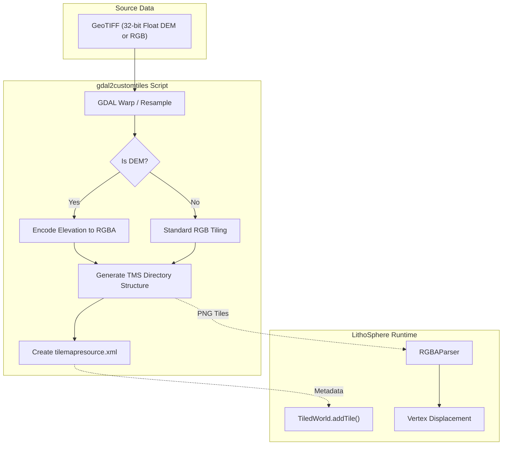
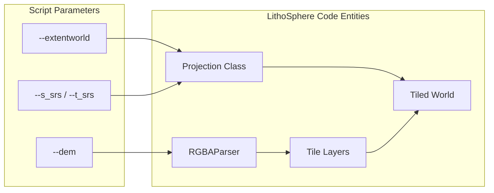

# gdal2customtiles — Raster & DEM Tiling

<details>
<summary>Relevant source files</summary>

The following files were used as context for generating this wiki page:

- [.eslintrc.js](.eslintrc.js)
- [README.md](README.md)
- [docs/assets/images/screenshot1.png](docs/assets/images/screenshot1.png)
- [src/parsers/rgba.ts](src/parsers/rgba.ts)
- [travis.yml](travis.yml)

</details>


The `gdal2customtiles` family of scripts serves as the primary data pre-processing pipeline for LithoSphere. These scripts transform standard geospatial rasters (GeoTIFFs) into Tile Map Service (TMS) compatible directory structures. A critical feature of this pipeline is the ability to encode high-precision 32-bit floating-point Digital Elevation Model (DEM) data into standard 8-bit RGBA PNG tiles, which the LithoSphere engine decodes at runtime to perform vertex displacement.

### Implementation Overview

The tiling process relies on the Geospatial Data Abstraction Library (GDAL) to handle coordinate transformations and raster resampling. The scripts extend the standard `gdal2tiles.py` logic to support LithoSphere-specific requirements, such as custom planetary radii and non-standard projections.

#### Key Capabilities
*   **Arbitrary Projections**: Support for any CRS via Proj4 strings, specifically utilizing the `--extentworld` flag to define the global bounding box for the tile set [README.md:53]().
*   **DEM Encoding**: Transformation of raw elevation values into a bit-packed format stored in PNGs, specifically designed for the `RGBAParser` [src/parsers/rgba.ts:1-6]().
*   **TMS Compatibility**: Generation of `tilemapresource.xml` files required by the `Projection` class to initialize coordinate systems [README.md:48-53]().

### Data Flow: Raster to LithoSphere Tile

The following diagram illustrates the transformation of a source GeoTIFF into a format consumable by the LithoSphere `TiledWorld` system.

**Tiling Pipeline Data Flow**

Sources: [README.md:48-53](), [src/parsers/rgba.ts:13-19]()

### DEM Encoding Mechanism

When the `--dem` flag is used, the script processes each pixel of the input elevation raster. Unlike standard imagery where RGB represents color, in a LithoSphere DEM tile, the channels represent a 32-bit floating point value encoded into R, G, B, and A channels [src/parsers/rgba.ts:1-6]().

The `RGBAParser` in LithoSphere decodes these channels back into a `heightArr` using the `RGBAto32` and `decodeFloat` functions [src/parsers/rgba.ts:33-43]().

| Step | Function / Entity | Logic |
| :--- | :--- | :--- |
| **Decoding** | `RGBAto32` | Concatenates R, G, B, and A bitstrings into a 32-bit binary string [src/parsers/rgba.ts:59-66](). |
| **Parsing** | `decodeFloat` | Interprets the 32-bit string as an IEEE 754 floating point number (Sign, Exponent, Significand) [src/parsers/rgba.ts:74-102](). |
| **Output** | `heightArr` | A flat array of elevation values used for mesh geometry [src/parsers/rgba.ts:50](). |

### System Component Mapping

The following diagram bridges the script parameters and outputs to the specific classes within the LithoSphere library that consume them.

**Script-to-Code Entity Mapping**

Sources: [README.md:47-53](), [src/parsers/rgba.ts:1-6](), [README.md:65]()

### Usage Examples

#### 1. Tiling a Global Imagery Raster
To tile a standard RGB image using a custom projection (e.g., for a non-Earth planet), the `--extentworld` parameter defines the coordinate boundaries that the `Projection` class will later use to calculate tile boundaries.

```bash
python gdal2customtiles.py \
    --extentworld -180 -90 180 90 \
    --s_srs "+proj=longlat +datum=WGS84" \
    input_imagery.tif \
    ./output_tiles_folder
```

#### 2. Tiling a Digital Elevation Model (DEM)
The `--dem` flag triggers the RGBA encoding necessary for the `TiledWorld` to perform 3D terrain displacement. This produces tiles compatible with the `RGBAParser` [src/parsers/rgba.ts:5]().

```bash
python gdal2customtiles.py \
    --dem \
    --extentworld -180 -90 180 90 \
    input_dem.tif \
    ./output_dem_folder
```

### GDAL Requirements
The scripts require a functional GDAL installation with Python bindings. Because LithoSphere often deals with planetary data [README.md:47](), it is recommended to ensure GDAL is configured with the latest `proj` library to handle complex IAU (International Astronomical Union) coordinate reference systems.

Sources: [README.md:19-21](), [README.md:48-53](), [src/parsers/rgba.ts:1-6]()
