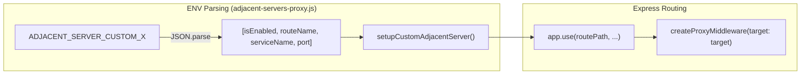

# Page: Adjacent Servers & Service Proxying

# Adjacent Servers & Service Proxying

<details>
<summary>Relevant source files</summary>

The following files were used as context for generating this wiki page:

- [API/Backend/Utils/routes/utils.js](API/Backend/Utils/routes/utils.js)
- [API/connection.js](API/connection.js)
- [API/websocket.js](API/websocket.js)
- [adjacent-servers/adjacent-servers-proxy.js](adjacent-servers/adjacent-servers-proxy.js)
- [adjacent-servers/validateTitilerUrl.js](adjacent-servers/validateTitilerUrl.js)
- [configuration/env.js](configuration/env.js)
- [docker-compose.sample.yml](docker-compose.sample.yml)
- [docs/pages/Migration/v3-to-v4/v3-to-v4.md](docs/pages/Migration/v3-to-v4/v3-to-v4.md)
- [docs/pages/Setup/Adjacent-Servers/adjacent-servers.md](docs/pages/Setup/Adjacent-Servers/adjacent-servers.md)
- [docs/pages/Setup/ENVs/ENVs.md](docs/pages/Setup/ENVs/ENVs.md)
- [sample.env](sample.env)
- [scripts/init-db.js](scripts/init-db.js)
- [scripts/server.js](scripts/server.js)
- [sds/unity/terraform/modules/ec2-docker/add-mmgis.sh](sds/unity/terraform/modules/ec2-docker/add-mmgis.sh)
- [sds/unity/terraform/modules/ec2-docker/bk.tf](sds/unity/terraform/modules/ec2-docker/bk.tf)
- [sds/unity/terraform/modules/ec2-docker/lb.tf](sds/unity/terraform/modules/ec2-docker/lb.tf)
- [sds/unity/terraform/modules/ec2-docker/main.tf](sds/unity/terraform/modules/ec2-docker/main.tf)
- [sds/unity/terraform/modules/ec2-docker/output.tf](sds/unity/terraform/modules/ec2-docker/output.tf)
- [sds/unity/terraform/modules/ec2-docker/variables.tf](sds/unity/terraform/modules/ec2-docker/variables.tf)
- [sds/unity/terraform/terraform.tf](sds/unity/terraform/terraform.tf)
- [sds/unity/terraform/terraform.tfvars](sds/unity/terraform/terraform.tfvars)
- [sds/unity/terraform/variables.tf](sds/unity/terraform/variables.tf)

</details>


MMGIS utilizes an "Adjacent Servers" architecture to offload specialized geospatial processing—such as STAC cataloging, dynamic tiling, and vector serving—to dedicated microservices. These services are integrated into the MMGIS ecosystem via a central proxying mechanism in the Node.js backend.

## Architecture Overview

The core MMGIS server acts as a gateway, providing a unified API surface and enforcing authentication for services that are otherwise independent. When running in a Docker environment, MMGIS communicates with these services over an internal Docker network, shielding them from direct public exposure.

### System Integration Diagram

This diagram illustrates how the MMGIS backend (`scripts/server.js`) orchestrates requests between the client and the specialized geospatial servers using `http-proxy-middleware`.

```mermaid
graph TD
    subgraph "Client Space"
        [Browser] -->|"/stac/*"| MMGIS_Proxy["initAdjacentServersProxy (adjacent-servers-proxy.js)"]
        [Browser] -->|"/titiler/*"| MMGIS_Proxy
        [Browser] -->|"/tipg/*"| MMGIS_Proxy
    end

    subgraph "MMGIS Backend (Node.js)"
        MMGIS_Proxy --> Auth["ensureUserForAdjacentServers"]
        MMGIS_Proxy --> SSRF["validateTitilerUrl (validateTitilerUrl.js)"]
        
        MMGIS_Proxy -->|Proxy Pass| STAC_Proxy["createProxyMiddleware"]
    end

    subgraph "Adjacent Servers Space"
        STAC["stac-fastapi (Port 8881)"]
        TiTiler["titiler (Port 8883)"]
        Tipg["tipg (Port 8882)"]
        TiPgSTAC["titiler-pgstac (Port 8884)"]
        Velo["veloserver (Port 8104)"]
    end

    STAC_Proxy --> STAC
    STAC_Proxy --> TiTiler
    STAC_Proxy --> Tipg
    STAC_Proxy --> TiPgSTAC
    STAC_Proxy --> Velo

    STAC -.-> DB_STAC[(PostgreSQL/mmgis-stac)]
    TiPgSTAC -.-> DB_STAC
    Tipg -.-> DB_STAC
```
**Sources:** `[scripts/server.js:38-39]()`, `[adjacent-servers/adjacent-servers-proxy.js:9-140]()`, `[docker-compose.sample.yml:31-210]()`, `[adjacent-servers/validateTitilerUrl.js:9-98]()`

---

## Service Definitions

MMGIS supports several adjacent services, each enabled via environment variables in the `.env` file.

| Service | Environment Variable | Default Port | Purpose |
| :--- | :--- | :--- | :--- |
| **stac-fastapi** | `WITH_STAC` | 8881 | STAC API implementation for searching geospatial assets. |
| **TiTiler** | `WITH_TITILER` | 8883 | Dynamic Cloud Optimized GeoTIFF (COG) tile server. |
| **Tipg** | `WITH_TIPG` | 8882 | OGC Features API (Vector Tiles/GeoJSON) from PostGIS. |
| **TiTiler-pgSTAC** | `WITH_TITILER_PGSTAC` | 8884 | Mosaic tile server for STAC collections. |
| **Veloserver** | `WITH_VELOSERVER` | 8104 | Specialized server for wind/velocity field visualization. |

**Sources:** `[sample.env:44-67]()`, `[docs/pages/Setup/Adjacent-Servers/adjacent-servers.md:12-26]()`, `[docker-compose.sample.yml:31-180]()`

---

## Proxy Implementation & URL Rewriting

The proxying logic is encapsulated in `initAdjacentServersProxy` `[adjacent-servers/adjacent-servers-proxy.js:9-140]()`. It uses `createProxyMiddleware` from `http-proxy-middleware` to map MMGIS subpaths to the internal service addresses.

### Path Mapping
When a request hits `https://{mmgis-domain}/stac/search`, the proxy:
1. Strips the `/stac` prefix via `pathRewrite` `[adjacent-servers/adjacent-servers-proxy.js:23-25]()`.
2. Forwards the request to the internal target (e.g., `http://stac-fastapi:8881/search`) `[adjacent-servers/adjacent-servers-proxy.js:14-16]()`.
3. Injects authentication headers if required via `ensureUserForAdjacentServers` `[adjacent-servers/adjacent-servers-proxy.js:19]()`.

### Swagger URL Rewriting
Many adjacent services provide an interactive `/docs` (Swagger) page. Because these services are proxied under subpaths (like `/titiler`), the default Swagger UI often generates incorrect relative links. MMGIS uses a `createSwaggerInterceptor` (via `responseInterceptor`) to rewrite URLs within the returned JSON/HTML to ensure the documentation remains functional through the proxy `[adjacent-servers/adjacent-servers-proxy.js:28]()`.

**Sources:** `[adjacent-servers/adjacent-servers-proxy.js:13-32]()`, `[adjacent-servers/adjacent-servers-proxy.js:80-91]()`, `[adjacent-servers/adjacent-servers-proxy.js:102-118]()`

---

## Security & SSRF Protection

### SSRF Protection for TiTiler
TiTiler accepts a `url` parameter pointing to remote files. To prevent Server-Side Request Forgery (SSRF), MMGIS implements a validation layer.

The `createTitilerUrlValidator` function `[adjacent-servers/validateTitilerUrl.js:9-98]()` compiles regex patterns defined in `TITILER_ALLOWED_URL_PATTERNS` `[sample.env:57]()`.
- **Validation Logic:** If enabled, the middleware checks the `url` query parameter (GET) or body parameter (POST) `[adjacent-servers/validateTitilerUrl.js:67]()`. If the URL does not match an allowed pattern, the request is rejected with a `403 Forbidden` `[adjacent-servers/validateTitilerUrl.js:87-92]()`.
- **Default Recommended Pattern:** `^https://(?!.*\\.\\.)(?!.*\\x00).*$` (Enforces HTTPS and blocks path traversal/null bytes) `[sample.env:57]()`.

### Authentication Enforcement
The proxy configuration applies MMGIS authentication to adjacent services:
- **General Access:** Controlled by `ensureUserForAdjacentServers()` middleware `[adjacent-servers/adjacent-servers-proxy.js:19]()`.
- **Admin Only:** Specific high-risk endpoints, such as `/titiler/cog/stac`, are wrapped in `ensureAdmin()` to prevent unauthorized STAC ingestion via TiTiler `[adjacent-servers/adjacent-servers-proxy.js:71-74]()`.

**Sources:** `[adjacent-servers/validateTitilerUrl.js:9-98]()`, `[adjacent-servers/adjacent-servers-proxy.js:67-78]()`, `[sample.env:53-61]()`, `[docs/pages/Setup/Adjacent-Servers/adjacent-servers.md:30-45]()`

---

## Custom Adjacent Servers

MMGIS allows developers to add arbitrary third-party services without modifying the core source code by using a naming convention in environment variables.

### Configuration Format
`ADJACENT_SERVER_CUSTOM_X=["isEnabled", "routeName", "serviceName", "port"]` `[sample.env:70]()`

The `setupCustomAdjacentServers` function `[adjacent-servers/adjacent-servers-proxy.js:147-209]()` iterates through all environment variables starting with `ADJACENT_SERVER_CUSTOM_`, parses the JSON array, and initializes a new proxy route.



**Sources:** `[adjacent-servers/adjacent-servers-proxy.js:147-231]()`, `[sample.env:69-81]()`

---

## Database Initialization for STAC

When `WITH_STAC`, `WITH_TIPG`, or `WITH_TITILER_PGSTAC` is enabled, the database initialization script `scripts/init-db.js` performs additional setup for the STAC-compliant database.

1. **Database Creation:** It creates a dedicated database named `mmgis-stac` `[scripts/init-db.js:131]()`.
2. **Schema Migration:** It executes the `pypgstac migrate` command to conform the `mmgis-stac` database to the `pgstac` schema required by the adjacent servers `[scripts/init-db.js:168-182]()`.
3. **Sequelize Connection:** The backend establishes a separate Sequelize instance, `sequelizeSTAC`, specifically for querying this database `[API/connection.js:55-98]()`.

**Sources:** `[scripts/init-db.js:124-198]()`, `[API/connection.js:55-98]()`, `[API/Backend/Utils/routes/utils.js:209-216]()`

---

## Docker Networking

In a standard deployment, the `docker-compose.sample.yml` file defines the networking relationship. The `mmgis` service and adjacent services share a network, allowing the proxy to use service names as hostnames (e.g., `stac-fastapi`, `titiler`, `db`).

### Resource Limits
Because dynamic tiling (TiTiler) and mosaicking (TiTiler-pgSTAC) are memory-intensive, the sample configuration applies specific Docker resource limits:
- **TiTiler-pgSTAC:** Limited to 12GB RAM with an 8GB reservation to prevent OOM (Out of Memory) cascades `[docker-compose.sample.yml:159-164]()`.
- **GDAL Configuration:** Environment variables like `GDAL_CACHEMAX` and `VSI_CACHE_SIZE` are tuned within the containers to optimize raster processing performance `[docker-compose.sample.yml:192-199]()`.

**Sources:** `[docker-compose.sample.yml:31-210]()`, `[docker-compose.sample.yml:142-145]()`, `[docker-compose.sample.yml:159-165]()`, `[docker-compose.sample.yml:190-203]()`
