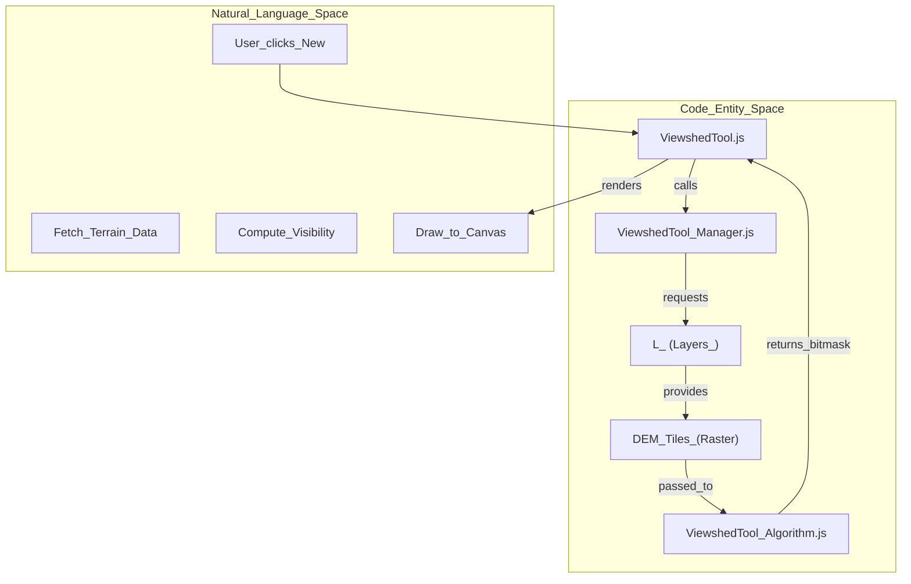
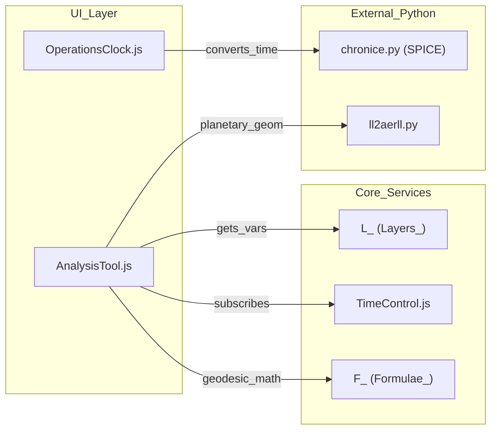

# Page: Analysis & Specialized Tools

# Analysis & Specialized Tools

Relevant source files

The following files were used as context for generating this wiki page:

- [API/updateTools.js](API/updateTools.js)
- [ATTRIBUTIONS.md](ATTRIBUTIONS.md)
- [Missions/spice-kernels-conf.example.json](Missions/spice-kernels-conf.example.json)
- [Missions/spice-kernels-conf.example.mars2020.json](Missions/spice-kernels-conf.example.mars2020.json)
- [Missions/spice-kernels-conf.example.msl.json](Missions/spice-kernels-conf.example.msl.json)
- [docs/pages/Configure/Tabs/Time/Time_Tab.md](docs/pages/Configure/Tabs/Time/Time_Tab.md)
- [docs/pages/Tools/Identifier/Identifier.md](docs/pages/Tools/Identifier/Identifier.md)
- [docs/pages/Tools/Legend/Legend.md](docs/pages/Tools/Legend/Legend.md)
- [private/api/chronice.py](private/api/chronice.py)
- [private/api/ll2aerll.py](private/api/ll2aerll.py)
- [private/api/naif-about.txt](private/api/naif-about.txt)
- [public/helps/ShadeTool.md](public/helps/ShadeTool.md)
- [public/helps/ViewshedTool.md](public/helps/ViewshedTool.md)
- [src/essence/Components/OperationsClock/OperationsClock.css](src/essence/Components/OperationsClock/OperationsClock.css)
- [src/essence/Components/OperationsClock/OperationsClock.js](src/essence/Components/OperationsClock/OperationsClock.js)
- [src/essence/Components/OperationsClock/README.md](src/essence/Components/OperationsClock/README.md)
- [src/essence/Components/OperationsClock/config.json](src/essence/Components/OperationsClock/config.json)
- [src/essence/Tools/Analysis/AnalysisTool.css](src/essence/Tools/Analysis/AnalysisTool.css)
- [src/essence/Tools/Analysis/AnalysisTool.js](src/essence/Tools/Analysis/AnalysisTool.js)
- [src/essence/Tools/Analysis/AnalysisTool.md](src/essence/Tools/Analysis/AnalysisTool.md)
- [src/essence/Tools/Analysis/config.json](src/essence/Tools/Analysis/config.json)
- [src/essence/Tools/Chemistry/ChemistryTool.js](src/essence/Tools/Chemistry/ChemistryTool.js)
- [src/essence/Tools/Identifier/IdentifierTool.js](src/essence/Tools/Identifier/IdentifierTool.js)
- [src/essence/Tools/Identifier/config.json](src/essence/Tools/Identifier/config.json)
- [src/essence/Tools/Isochrone/IsochroneTool.css](src/essence/Tools/Isochrone/IsochroneTool.css)
- [src/essence/Tools/Isochrone/IsochroneTool.js](src/essence/Tools/Isochrone/IsochroneTool.js)
- [src/essence/Tools/Isochrone/IsochroneTool_Algorithm.js](src/essence/Tools/Isochrone/IsochroneTool_Algorithm.js)
- [src/essence/Tools/Isochrone/IsochroneTool_Manager.js](src/essence/Tools/Isochrone/IsochroneTool_Manager.js)
- [src/essence/Tools/Isochrone/IsochroneTool_Query.js](src/essence/Tools/Isochrone/IsochroneTool_Query.js)
- [src/essence/Tools/Isochrone/config.json](src/essence/Tools/Isochrone/config.json)
- [src/essence/Tools/Isochrone/models/Model.js](src/essence/Tools/Isochrone/models/Model.js)
- [src/essence/Tools/Isochrone/models/Model_Example.js](src/essence/Tools/Isochrone/models/Model_Example.js)
- [src/essence/Tools/Isochrone/models/Model_Isodistance.js](src/essence/Tools/Isochrone/models/Model_Isodistance.js)
- [src/essence/Tools/Legend/LegendTool.js](src/essence/Tools/Legend/LegendTool.js)
- [src/essence/Tools/SegmentTool/SegmentTool.css](src/essence/Tools/SegmentTool/SegmentTool.css)
- [src/essence/Tools/SegmentTool/SegmentTool.js](src/essence/Tools/SegmentTool/SegmentTool.js)
- [src/essence/Tools/SegmentTool/config.json](src/essence/Tools/SegmentTool/config.json)
- [src/essence/Tools/Shade/ShadeTool.js](src/essence/Tools/Shade/ShadeTool.js)
- [src/essence/Tools/Sites/SitesTool.js](src/essence/Tools/Sites/SitesTool.js)
- [src/essence/Tools/Sites/config.json](src/essence/Tools/Sites/config.json)
- [src/essence/Tools/Viewshed/ViewshedTool.css](src/essence/Tools/Viewshed/ViewshedTool.css)
- [src/essence/Tools/Viewshed/ViewshedTool.js](src/essence/Tools/Viewshed/ViewshedTool.js)
- [src/essence/Tools/Viewshed/ViewshedTool_Algorithm.js](src/essence/Tools/Viewshed/ViewshedTool_Algorithm.js)
- [src/essence/Tools/Viewshed/ViewshedTool_Manager.js](src/essence/Tools/Viewshed/ViewshedTool_Manager.js)

The MMGIS platform includes a suite of advanced analysis tools designed for planetary science and mission operations. These tools leverage Digital Elevation Models (DEMs), SPICE kernels, and custom algorithms to provide visibility analysis, lighting simulation, traverse cost estimation, and multi-instrument data querying.

## Viewshed Tool

The Viewshed tool calculates line-of-sight visibility from a specific observer point across a 2D terrain. It dynamically fetches DEM tiles at configurable resolutions (32 to 256 pixels) to perform its calculations [src/essence/Tools/Viewshed/ViewshedTool.js:3-10]().

### Implementation & Algorithm
The tool uses a radial sweep algorithm to determine visibility. It supports specifying observer height, horizontal Field of View (FOV), and vertical elevation limits [src/essence/Tools/Viewshed/ViewshedTool.js:114-118]().

- **Manager**: `ViewshedTool_Manager.js` handles the lifecycle of viewshed elements, including their state and visibility toggles [src/essence/Tools/Viewshed/ViewshedTool_Manager.js:1-20]().
- **Algorithm**: `ViewshedTool_Algorithm.js` implements the core geometry logic, calculating whether a target pixel is obscured by intervening terrain relative to the observer's altitude [src/essence/Tools/Viewshed/ViewshedTool_Algorithm.js:1-21]().
- **Data Flow**: It captures DEM tiles for the current map extent and processes them into a canvas overlay [src/essence/Tools/Viewshed/ViewshedTool.js:72-74]().

### Viewshed Data Flow
Title: Viewshed Calculation Pipeline

Sources: [src/essence/Tools/Viewshed/ViewshedTool.js:1-25](), [src/essence/Tools/Viewshed/ViewshedTool_Manager.js:1-20](), [src/essence/Tools/Viewshed/ViewshedTool_Algorithm.js:1-21]()

---

## Shade Tool (Shadow Calculation)

The Shade tool simulates orbital lighting and shadows using planetary geometry. Unlike standard hillshading, it can calculate shadows cast by distant terrain at specific timestamps by integrating with the **SPICE** system [src/essence/Tools/Shade/ShadeTool.js:1-14]().

### Key Features
- **SPICE Integration**: Uses `chronice.py` to convert between UTC and Local Mean Solar Time (LMST) for missions like MSL and Mars2020 by loading planetary kernels [private/api/chronice.py:1-10](), [private/api/chronice.py:23-59]().
- **Dynamic Updates**: Automatically recalculates shadows when the `TimeControl` global time changes [src/essence/Tools/Shade/ShadeTool.js:173-183]().
- **Shadow Algorithm**: Implements a terrain-following shadow casting algorithm based on solar azimuth and elevation [src/essence/Tools/Shade/ShadeTool.js:1-5]().

Sources: [src/essence/Tools/Shade/ShadeTool.js:1-30](), [private/api/chronice.py:23-81](), [src/essence/Basics/TimeControl_/TimeControl.js:1-20]()

---

## Isochrone Tool

The Isochrone tool performs traverse time and cost analysis. It calculates areas reachable from a starting point within a given time or energy budget, considering terrain slope and rover-specific performance models [src/essence/Tools/Isochrone/IsochroneTool.js:1-20]().

### Architecture
- **Models**: Modular cost functions defined in `src/essence/Tools/Isochrone/models/`. Examples include `Model_Isodistance.js` (flat distance) and `Model_Example.js` (slope-aware) [src/essence/Tools/Isochrone/models/Model_Isodistance.js:1-10]().
- **Algorithm**: Uses a Dijkstra-based approach on the DEM grid via `IsochroneTool_Algorithm.js` [src/essence/Tools/Isochrone/IsochroneTool_Algorithm.js:1-20]().
- **Querying**: `IsochroneTool_Query.js` manages spatial queries against the terrain service to build the cost graph [src/essence/Tools/Isochrone/IsochroneTool_Query.js:1-15]().

Sources: [src/essence/Tools/Isochrone/IsochroneTool.js:1-20](), [src/essence/Tools/Isochrone/IsochroneTool_Algorithm.js:1-20](), [src/essence/Tools/Isochrone/models/Model.js:1-10]()

---

## Identifier Tool

The Identifier tool allows users to query raw raster band values by mousing over the map. It supports high bit-depth data (8, 16, 32-bit) and can perform on-the-fly scaling and unit conversion [src/essence/Tools/Identifier/IdentifierTool.js:1-11]().

### Configuration (config.json)
Layers must be explicitly configured in the tool's variables to be queryable:
- `url`: Path to the raw GeoTIFF or COG. Can use `{starttime}` and `{endtime}` tokens [src/essence/Tools/Identifier/config.json:63-68]().
- `bands`: Number of bands to query (e.g., 1 for DEM, 3 for RGB) [src/essence/Tools/Identifier/config.json:70-77]().
- `scalefactor`: Multiplier for raw values (e.g., converting DN to reflectance) [src/essence/Tools/Identifier/config.json:95-100]().
- `timeFormat`: Used to format the injected time tokens for time-enabled rasters [src/essence/Tools/Identifier/IdentifierTool.js:105-126]().

### Data Extraction
The tool draws the relevant tile to a hidden canvas via `getImageData` and retrieves the pixel value at the mouse coordinates using `getPixel` [src/essence/Tools/Identifier/IdentifierTool.js:130-150]().

Sources: [src/essence/Tools/Identifier/IdentifierTool.js:1-40](), [src/essence/Tools/Identifier/config.json:1-114](), [docs/pages/Tools/Identifier/Identifier.md:1-37]()

---

## Specialized Components

### OperationsClock
The `OperationsClock` is a specialized UI component (adapted from the FROZON project) that displays mission-specific timekeeping, such as Sol, LMST, and UTC [ATTRIBUTIONS.md:15-16](). It is defined as a standalone component that can be included in the interface [src/essence/Components/OperationsClock/OperationsClock.js:1-20]().

### Sites Tool
The Sites tool provides a navigation menu for named locations (waypoints, landing sites, or points of interest). It reads from a configured list and allows the map to "fly to" specific coordinates and zoom levels [src/essence/Tools/Sites/SitesTool.js:1-30]().

### Chemistry Tool
The Chemistry tool provides visualization for geochemical data, typically associated with point features (e.g., APXS or ChemCam targets).
- **Modes**: Supports "Single" (one target) and "Multi" (comparison) modes [src/essence/Tools/Chemistry/ChemistryTool.js:24-28]().
- **Visualization**: Integrates with `chemistrychart.js` to render D3-based plots of elemental abundances [src/essence/Tools/Chemistry/ChemistryTool.js:209-210]().

### Segment Tool
The Segment tool allows for specialized linear feature analysis, often used for cross-sections or profile segments along a path [src/essence/Tools/SegmentTool/SegmentTool.js:1-20]().

### Analysis Tool Logic
Title: Analysis Tool Module Relationships

Sources: [src/essence/Tools/Analysis/AnalysisTool.js:1-50](), [src/essence/Components/OperationsClock/OperationsClock.js:1-20](), [private/api/chronice.py:1-20](), [private/api/ll2aerll.py:1-10]()

---

## Tool Configuration Summary

| Tool | Primary Data Source | Key Logic File | Backend Dependencies |
| :--- | :--- | :--- | :--- |
| **Viewshed** | DEM Rasters | `ViewshedTool_Algorithm.js` | None (Client-side) |
| **Shade** | DEM Rasters | `ShadeTool_Algorithm.js` | `chronice.py` (SPICE) |
| **Isochrone** | DEM Rasters | `IsochroneTool_Algorithm.js` | None (Client-side) |
| **Identifier** | Raw GeoTIFF/COG | `IdentifierTool.js` | None (Client-side) |
| **Chemistry** | Vector Feature Props | `ChemistryTool.js` | None |
| **Sites** | Config JSON | `SitesTool.js` | None |

Sources: [src/essence/Tools/Viewshed/ViewshedTool.js:20-21](), [src/essence/Tools/Shade/ShadeTool.js:23-24](), [src/essence/Tools/Isochrone/IsochroneTool.js:20-25](), [src/essence/Tools/Identifier/IdentifierTool.js:16-30](), [src/essence/Tools/Chemistry/ChemistryTool.js:1-10](), [src/essence/Tools/Sites/SitesTool.js:1-10]()
