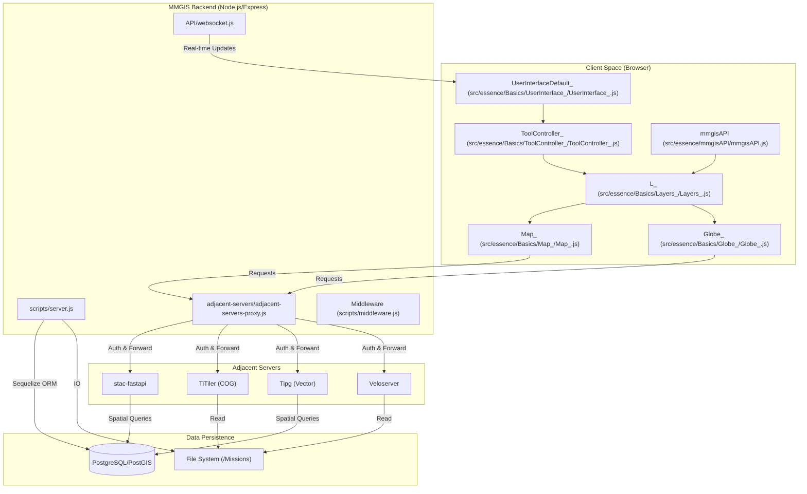
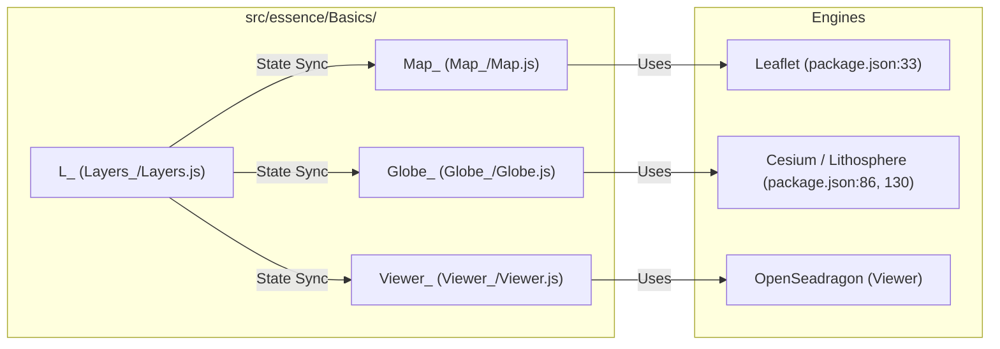
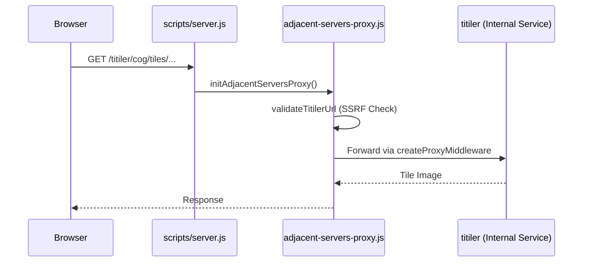

# Page: Architecture Overview

# Architecture Overview

Relevant source files

The following files were used as context for generating this wiki page:

- [AGENTS.md](AGENTS.md)
- [AI-GETTING-STARTED.md](AI-GETTING-STARTED.md)
- [API/Backend/Config/routes/configs.js](API/Backend/Config/routes/configs.js)
- [API/Backend/Config/uuids.js](API/Backend/Config/uuids.js)
- [API/Backend/Draw/routes/aggregations.js](API/Backend/Draw/routes/aggregations.js)
- [API/database.js](API/database.js)
- [API/websocket.js](API/websocket.js)
- [CHANGELOG.md](CHANGELOG.md)
- [adjacent-servers/adjacent-servers-proxy.js](adjacent-servers/adjacent-servers-proxy.js)
- [adjacent-servers/validateTitilerUrl.js](adjacent-servers/validateTitilerUrl.js)
- [configuration/env.js](configuration/env.js)
- [configure/package.json](configure/package.json)
- [docs/pages/APIs/Configure/Configure_REST_API.md](docs/pages/APIs/Configure/Configure_REST_API.md)
- [docs/pages/Setup/Adjacent-Servers/adjacent-servers.md](docs/pages/Setup/Adjacent-Servers/adjacent-servers.md)
- [docs/pages/Setup/ENVs/ENVs.md](docs/pages/Setup/ENVs/ENVs.md)
- [package-lock.json](package-lock.json)
- [package.json](package.json)
- [sample.env](sample.env)
- [scripts/server.js](scripts/server.js)
- [src/essence/Ancillary/Description.css](src/essence/Ancillary/Description.css)
- [src/essence/Basics/Globe_/Globe_.js](src/essence/Basics/Globe_/Globe_.js)
- [src/essence/essence.js](src/essence/essence.js)

MMGIS (Multi-Mission Geographic Information System) is a distributed web-based platform designed for planetary and terrestrial spatial data visualization. The system employs a decoupled architecture consisting of a **Node.js/Express** backend, a **PostgreSQL/PostGIS** database, a **React-based** frontend with tri-rendering engines (2D, 3D, and specialized Viewers), and a specialized **Adjacent-Servers** proxy pattern for high-performance geospatial data serving.

### System Architecture Diagram

The following diagram illustrates the high-level data flow and communication between the core system components, mapping "Natural Language Space" concepts to their corresponding "Code Entity Space" implementations.

**MMGIS High-Level Component Interaction**

**Sources:** [scripts/server.js:12-45](), [src/essence/Basics/Globe_/Globe_.js:8-15](), [adjacent-servers/adjacent-servers-proxy.js:9-40](), [package.json:38-41](), [src/essence/essence.js:23-45]().

---

### Backend: Node.js & Express

The MMGIS backend is a Node.js application using the Express framework. It serves three primary roles:
1.  **Configuration Management:** Handling the REST API for mission setup and layer metadata stored in the database. The server initializes these via `scripts/init-db.js` [package.json:39]().
2.  **Authentication & Security:** Managing user sessions using `express-session` [scripts/server.js:115-127]() and `connect-pg-simple` [package.json:92]() for persistent storage in PostgreSQL. It supports multiple modes including `local`, `none`, `off`, and `csso` [sample.env:10-16](), [docs/pages/Setup/ENVs/ENVs.md:22-29]().
3.  **Proxy Gateway:** Acting as a secure entry point for all geospatial data requests through the `adjacent-servers-proxy` [scripts/server.js:38]().

The server establishes a connection pool to PostgreSQL via `pg` [scripts/server.js:91-114]() and `Sequelize` [scripts/server.js:28](). It also manages real-time synchronization via WebSockets [scripts/server.js:34](), [API/websocket.js:1-20]().

**Sources:** [scripts/server.js:1-133](), [package.json:107-109](), [sample.env:3-38]().

---

### Database: PostgreSQL/PostGIS

MMGIS relies on **PostgreSQL** with the **PostGIS** extension for spatial data persistence [package.json:137](), [package.json:154](). The database stores:
*   **Configs:** Mission configurations and layer metadata managed via `API/Backend/Config/models/config.js` [API/Backend/Config/routes/configs.js:13]().
*   **User Data:** Credentials and permission groups [API/Backend/Config/routes/configs.js:15-16]().
*   **Session Data:** Persistent user sessions stored in the `session` table using `connect-pg-simple` [scripts/server.js:123-125]().
*   **Geodatasets:** Spatial datasets accessible via the `geodatasets:` URL prefix.

**Sources:** [scripts/server.js:91-114](), [API/Backend/Config/routes/configs.js:152-160](), [package.json:154]().

---

### Frontend: Tri-Rendering Architecture

The frontend is a single-page application (SPA) built with React [package.json:143](). It utilizes a "singleton controller" pattern where core modules maintain global state via `Layers_` (`L_`).

| Entity | Technology | Role |
| :--- | :--- | :--- |
| **`Map_`** | Leaflet | Primary 2D rendering engine. Handles custom CRS and projections [src/essence/essence.js:27](). |
| **`Globe_`** | Cesium/Lithosphere | 3D globe visualization. Uses `GlobeRenderer` to abstract Lithosphere/Cesium calls [src/essence/Basics/Globe_/Globe_.js:118-122](). |
| **`Viewer_`** | OpenSeadragon / THREE.js | Specialized viewer for high-res imagery (DZI), 3D models, and photospheres [src/essence/essence.js:26](). |
| **`L_`** | `Layers_.js` Singleton | Central state manager for mission data, layers, and active features [src/essence/essence.js:25](). |
| **`ToolController_`** | `ToolController_.js` | Manages the lifecycle of interactive tool plugins [src/essence/essence.js:30](). |

**Entity Mapping: Frontend Code to Rendering Logic**

**Sources:** [src/essence/essence.js:23-45](), [src/essence/Basics/Globe_/Globe_.js:8-31](), [package.json:86, 130]().

---

### Configure Sub-App Separation

MMGIS maintains a strict separation between the main mapping interface and the administrative **Configure** application.
*   **Main App:** Built from `src/` using Webpack [package.json:45]().
*   **Configure App:** A separate React application located in `configure/` with its own `package.json` [configure/package.json:1-6](). It uses Material UI and Redux Toolkit [configure/package.json:11-14]().
*   **Access Control:** The Configure UI can be completely disabled via the `HIDE_CONFIG` environment variable [sample.env:138](), [API/Backend/Config/routes/configs.js:53-57]().

**Sources:** [configure/package.json:1-42](), [API/Backend/Config/routes/configs.js:53-57](), [sample.env:137-140]().

---

### Adjacent-Servers Proxy Pattern

A defining feature of MMGIS is its use of "Adjacent Servers." Instead of the Node.js backend processing heavy geospatial rasters, it proxies these requests to specialized services. These are enabled via environment variables [sample.env:44-67]().

*   **stac-fastapi:** Queryable spatiotemporal asset catalog [adjacent-servers/adjacent-servers-proxy.js:13-32]().
*   **TiTiler:** Dynamic rendering of Cloud Optimized GeoTIFFs (COGs) [adjacent-servers/adjacent-servers-proxy.js:57-92]().
*   **Tipg:** Serves PostGIS layers as OGC Features or Vector Tiles [adjacent-servers/adjacent-servers-proxy.js:35-54]().
*   **Veloserver:** Specialized server for velocity field data [adjacent-servers/adjacent-servers-proxy.js:122-136]().
*   **Custom Servers:** Developers can add their own proxied services using `ADJACENT_SERVER_CUSTOM_X` variables [adjacent-servers/adjacent-servers-proxy.js:147-155]().

The `adjacent-servers-proxy.js` implementation provides **SSRF Protection** by validating TiTiler URLs against `TITILER_ALLOWED_URL_PATTERNS` [adjacent-servers/adjacent-servers-proxy.js:63-79]().

**Proxy Implementation Detail**

**Sources:** [scripts/server.js:38-39](), [adjacent-servers/adjacent-servers-proxy.js:1-231](), [sample.env:44-82]().
