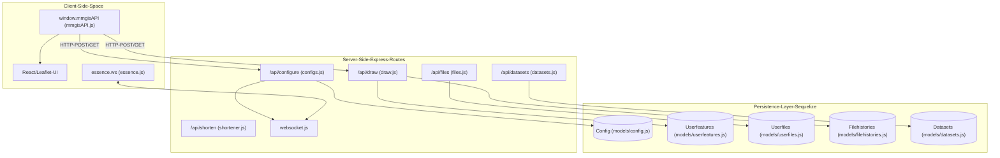

# Page: Backend API

# Backend API

Relevant source files

The following files were used as context for generating this wiki page:

- [API/Backend/Config/routes/configs.js](API/Backend/Config/routes/configs.js)
- [API/Backend/Config/uuids.js](API/Backend/Config/uuids.js)
- [API/Backend/Datasets/models/datasets.js](API/Backend/Datasets/models/datasets.js)
- [API/Backend/Datasets/routes/datasets.js](API/Backend/Datasets/routes/datasets.js)
- [API/Backend/Draw/routes/draw.js](API/Backend/Draw/routes/draw.js)
- [API/Backend/Draw/routes/files.js](API/Backend/Draw/routes/files.js)
- [API/Backend/Shortener/routes/shortener.js](API/Backend/Shortener/routes/shortener.js)
- [API/testEnv.js](API/testEnv.js)
- [API/utils.js](API/utils.js)
- [docs/pages/APIs/Configure/Configure_REST_API.md](docs/pages/APIs/Configure/Configure_REST_API.md)
- [src/essence/essence.js](src/essence/essence.js)

The MMGIS Backend API provides a comprehensive set of RESTful endpoints and a client-side JavaScript facade to manage mission configurations, spatial data, and real-time collaboration. The system is built on a Node.js/Express stack, utilizing Sequelize ORM for PostgreSQL/PostGIS persistence and WebSockets for live state synchronization.

### System Interaction Overview

The following diagram illustrates how different API surfaces interact with the core MMGIS logic and database entities.

**API Architecture & Entity Mapping**

Sources: [src/essence/mmgisAPI/mmgisAPI.js:13-24](), [API/Backend/Config/routes/configs.js:6-16](), [src/essence/essence.js:138-164](), [API/Backend/Draw/routes/draw.js:6-14](), [API/Backend/Draw/routes/files.js:6-15](), [API/Backend/Datasets/routes/datasets.js:15-18]()

---

## 6.1 JavaScript (Client-Side) API
The JavaScript API is exposed via the `window.mmgisAPI` object, acting as a high-level facade for the internal MMGIS state and the Leaflet map instance [src/essence/mmgisAPI/mmgisAPI.js:13-19](). It allows external scripts or plugins to programmatically control the map without deep knowledge of the internal `L_` (Layers) or `Map_` singletons.

Key capabilities include:
*   **Layer Management**: Methods like `addLayer`, `updateLayer`, and `removeLayer` to dynamically inject configurations into the client [src/essence/mmgisAPI/mmgisAPI.js:30-138]().
*   **Vector Manipulation**: Utilities for trimming `LineString` geometries and updating vector data in real-time.
*   **State Access**: Retrieval of active features via `getActiveFeature`, visible layers, and the underlying Leaflet `map` object.
*   **Time Control**: Global time state management via `setTime`, `setLayerTime`, and `reloadTimeLayers`.

For details, see [JavaScript (Client-Side) API](#6.1).

---

## 6.2 Configure REST API
The Configure API handles the lifecycle of mission configurations. It is the primary interface for the MMGIS CMS (Configuration Management System) and external automation scripts.

*   **Mission CRUD**: Endpoints for `upserting` full mission JSON objects or retrieving specific `versions` [API/Backend/Config/routes/configs.js:150-215]().
*   **Granular Updates**: Specialized routes like `/addLayer`, `/updateLayer`, and `/removeLayer` allow modifying parts of a configuration without re-uploading the entire object [docs/pages/APIs/Configure/Configure_REST_API.md:132-160]().
*   **UUID Management**: The backend automatically enforces unique identifiers for all layers using `populateUUIDs` to ensure consistent referencing across the system [API/Backend/Config/uuids.js:5-31]().
*   **Real-time Sync**: Updates made via this API can trigger a `forceClientUpdate`, broadcasting a WebSocket message to all connected clients to refresh their state [API/Backend/Config/routes/configs.js:45-46]().

For details, see [Configure REST API](#6.2).

---

## 6.3 Draw & Files REST API
This API surface manages user-generated spatial content and collaborative drawing sessions.

*   **Feature Persistence**: Manages GeoJSON features in the `user_features` table, supporting operations like `merge`, `split`, and `undo` [API/Backend/Draw/routes/draw.js:128-173]().
*   **File Versioning**: Handles the `user_files` table, tracking drawing file metadata, permissions, and the `published` status of datasets [API/Backend/Draw/routes/files.js:138-152]().
*   **History System**: Uses a `Filehistories` model to track every addition, edit, and deletion, allowing for robust undo/redo capabilities [API/Backend/Draw/routes/draw.js:47-59]().
*   **Aggregations**: Provides server-side spatial and property statistics for sampled features within drawing files.
*   **Mirroring**: Implements a mirroring pattern (e.g., `UserfilesTEST`) to synchronize drawing states between production and test environments [API/Backend/Draw/routes/files.js:50-51]().

For details, see [Draw & Files REST API](#6.3).

---

## 6.4 Webhooks & URL Shortener
MMGIS includes utility services to facilitate integration with external systems and simplify user sharing.

*   **Webhooks**: A system that sends HTTP POST payloads via `triggerWebhooks.js` to external URLs when specific events occur, such as `drawFileChange` [API/Backend/Draw/routes/draw.js:99-102]().
*   **URL Shortener**: Provides `/shorten` and `/expand` endpoints to manage long MMGIS state URLs using a 5+ character random base36 string [API/Backend/Shortener/routes/shortener.js:18-49]().
*   **Deep Linking**: Works in tandem with `QueryURL.js` to parse and generate stateful links that include camera position, zoom, and active tool states.
*   **Dataset Management**: The `/api/datasets` endpoints allow for programmatic querying and management of non-spatial tabular data, including CSV-to-table conversion [API/Backend/Datasets/routes/datasets.js:16-18]().

For details, see [Webhooks & URL Shortener](#6.4).

---

### API Endpoint Summary

| Category | Root Path | Primary Responsibility | Primary Files |
| :--- | :--- | :--- | :--- |
| **Configuration** | `/api/configure` | Mission JSON, Layers, and Versions | `configs.js`, `uuids.js` |
| **Drawing** | `/api/draw` | Collaborative GeoJSON features | `draw.js` |
| **Files** | `/api/files` | User file management and publishing | `files.js`, `filesutils.js` |
| **Datasets** | `/api/datasets` | Tabular data management | `datasets.js` |
| **Utility** | `/api/shorten` | URL shortening and expansion | `shortener.js` |

Sources: [API/Backend/Config/routes/configs.js:7](), [API/Backend/Draw/routes/draw.js:21](), [API/Backend/Draw/routes/files.js:27](), [API/Backend/Shortener/routes/shortener.js:6](), [API/Backend/Datasets/routes/datasets.js:6]()
