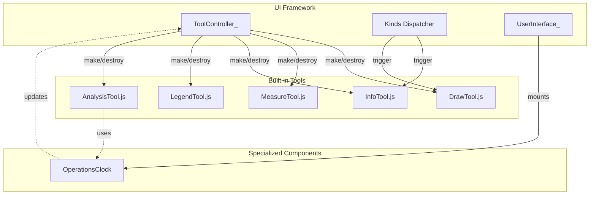
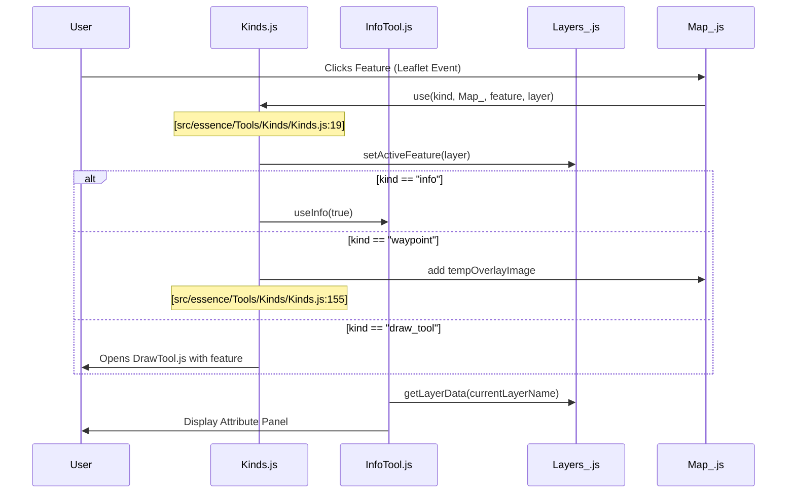

# Page: Built-in Tools

# Built-in Tools

Relevant source files

The following files were used as context for generating this wiki page:

- [docs/pages/Tools/Draw/Draw.md](docs/pages/Tools/Draw/Draw.md)
- [private/api/2ptsToProfile.py](private/api/2ptsToProfile.py)
- [private/api/BandsToProfile.py](private/api/BandsToProfile.py)
- [src/essence/Basics/Formulae_/Formulae_.js](src/essence/Basics/Formulae_/Formulae_.js)
- [src/essence/Tools/Draw/DrawTool.css](src/essence/Tools/Draw/DrawTool.css)
- [src/essence/Tools/Draw/DrawTool.js](src/essence/Tools/Draw/DrawTool.js)
- [src/essence/Tools/Draw/DrawTool_Drawing.js](src/essence/Tools/Draw/DrawTool_Drawing.js)
- [src/essence/Tools/Draw/DrawTool_Editing.js](src/essence/Tools/Draw/DrawTool_Editing.js)
- [src/essence/Tools/Draw/DrawTool_Files.js](src/essence/Tools/Draw/DrawTool_Files.js)
- [src/essence/Tools/Draw/DrawTool_Shapes.js](src/essence/Tools/Draw/DrawTool_Shapes.js)
- [src/essence/Tools/Draw/config.json](src/essence/Tools/Draw/config.json)
- [src/essence/Tools/Measure/MeasureTool.css](src/essence/Tools/Measure/MeasureTool.css)
- [src/essence/Tools/Measure/MeasureTool.js](src/essence/Tools/Measure/MeasureTool.js)
- [src/pre/calls.js](src/pre/calls.js)

MMGIS provides a robust suite of built-in interactive tools designed for planetary science, mission operations, and geospatial analysis. These tools are managed by the `ToolController_` and follow a standard lifecycle for initialization and destruction within the MMGIS UI framework [src/essence/Basics/ToolController_/ToolController_.js:1-20]().

### Tool Interaction Overview

Built-in tools typically interact with the map through the `L_` (Layers), `Map_` (Leaflet), and `Globe_` (Lithosphere/Cesium) singletons. They are registered in the system and can be activated via the sidebar or triggered programmatically via the `Kinds` dispatch system [src/essence/Tools/Kinds/Kinds.js:31-48](). The system also supports modular components like the `OperationsClock` for specialized time-based workflows [src/essence/Components/OperationsClock/config.json:2-15]().

MMGIS Tool & Component Architecture:

Sources: [src/essence/Tools/Kinds/Kinds.js:1-60](), [src/essence/Components/OperationsClock/config.json:1-20]()

---

## [Draw Tool](#4.1)
The **Draw Tool** is a collaborative vector drawing system that allows users to create, edit, and publish geospatial annotations [src/essence/Tools/Draw/config.json:4-5](). It supports various geometry types including polygons, circles, rectangles, lines, points, arrows, and text [src/essence/Tools/Draw/DrawTool.js:67-73](). Features created in the Draw Tool can be assigned "Intents" (e.g., ROI, Campaign, Trail) which categorize the data for mission-wide use [src/essence/Tools/Draw/config.json:7-14]().

*   **Key Capabilities:** History/undo system [src/essence/Tools/Draw/DrawTool.js:55-58](), spatial clipping (Over/Under/Through/Off) [src/essence/Tools/Draw/DrawTool_Drawing.js:16-19](), and the `DrawTool_Templater` engine for custom attribute forms [src/essence/Tools/Draw/DrawTool_Templater.js:1-15]().
*   **Workflow:** Private sketches can be "Published" to make them visible to the entire mission via the `api:publishedall` or `api:published:{intent}` URL schemes [src/essence/Tools/Draw/DrawTool_Publish.js:1-10]().

For details, see [Draw Tool](#4.1).

---

## [Measure Tool & Formulae_ Library](#4.2)
The **Measure Tool** provides high-precision distance and orientation calculations across planetary bodies [src/essence/Tools/Measure/MeasureTool.js:51-54](). It utilizes the `Formulae_` utility library for spherical and ellipsoidal geometry, defaulting to Mars radii (3396190m) but configurable per mission [src/essence/Basics/Formulae_/Formulae_.js:22-24]().

*   **Capabilities:** 2D/3D distance measurement, azimuth calculation, elevation profiling via DEM tiles [src/essence/Tools/Measure/MeasureTool.js:119-122](), and Line of Sight (LOS) analysis [src/essence/Tools/Measure/MeasureTool.js:38-42]().
*   **Backend Support:** Uses Python scripts like `2ptsToProfile.py` for server-side elevation sampling along a path [private/api/2ptsToProfile.py:1-10]().

For details, see [Measure Tool & Formulae_ Library](#4.2).

---

## [Info Tool & Feature Interaction (Kinds)](#4.3)
The **Info Tool** is the primary interface for inspecting feature attributes. It uses the `Kinds` system to determine how to react when a user clicks a map feature [src/essence/Tools/Kinds/Kinds.js:20]().

*   **Kinds System:** Dispatches actions based on layer configuration, such as `info` (standard attribute table), `waypoint` (attaches images/3D models), or `viewer_open` (opens the high-res Viewer panel) [src/essence/Tools/Kinds/Kinds.js:31-50]().
*   **Data Interaction:** Supports marker attachments like image overlays and 3D models directly on the map via the `Kinds` dispatcher [src/essence/Tools/Kinds/Kinds.js:155]().

For details, see [Info Tool & Feature Interaction (Kinds)](#4.3).

---

## [Legend Tool](#4.4)
The **Legend Tool** dynamically generates symbology guides based on the active layers. It supports multiple source types including static images, CSV-defined color ramps, and object arrays.

*   **Dynamic Scaling:** For COG (Cloud Optimized GeoTIFF) and Velocity layers, the tool can automatically populate scales based on the data's dynamic range.
*   **Symbology:** Supports standard shapes (circle, square, triangle) and Material Design Icons (MDI) for vector point features.

For details, see [Legend Tool](#4.4).

---

## [Analysis & Specialized Tools](#4.5)
MMGIS includes several specialized tools for scientific analysis and mission-specific workflows:

*   **Identifier:** Queries raw raster band values at a specific coordinate using the `BandsToProfile.py` backend script [private/api/BandsToProfile.py:1-6]().
*   **Operations Clock:** A specialized component for quick time range selection (e.g., "Today", "-1 week") designed for fast-paced mission operations [src/essence/Components/OperationsClock/config.json:2-15]().
*   **Viewshed:** Calculates visibility from a point based on DEM tiles.
*   **Shade:** Uses SPICE kernels to calculate orbital shadows on the terrain.
*   **Isochrone:** Analyzes traverse time and cost over terrain.

For details, see [Analysis & Specialized Tools](#4.5).

---

### Data Interaction Flow
This diagram illustrates how built-in tools interact with the core configuration and the map engine using code entities.

Sources: [src/essence/Tools/Kinds/Kinds.js:7-35](), [src/essence/Tools/Measure/MeasureTool.js:66-69](), [src/essence/Tools/Draw/DrawTool.js:139-141]()
