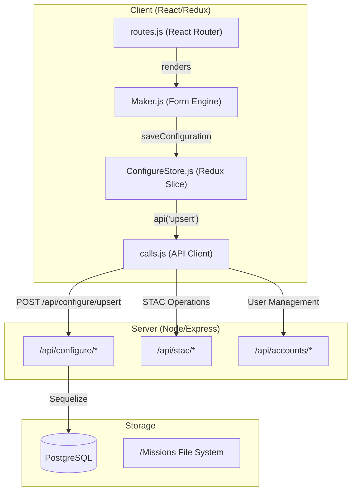

# Page: Configure CMS

# Configure CMS

Relevant source files

The following files were used as context for generating this wiki page:

- [API/Backend/Stac/routes/stac.js](API/Backend/Stac/routes/stac.js)
- [configure/README.md](configure/README.md)
- [configure/src/core/Configure.js](configure/src/core/Configure.js)
- [configure/src/core/ConfigureStore.js](configure/src/core/ConfigureStore.js)
- [configure/src/core/Maker.js](configure/src/core/Maker.js)
- [configure/src/core/calls.js](configure/src/core/calls.js)
- [configure/src/core/constants.js](configure/src/core/constants.js)
- [configure/src/core/routes/routes.js](configure/src/core/routes/routes.js)
- [configure/src/metaconfigs/tab-coordinates-config.json](configure/src/metaconfigs/tab-coordinates-config.json)
- [configure/src/metaconfigs/tab-ui-config.json](configure/src/metaconfigs/tab-ui-config.json)
- [configure/src/pages/APIs/APIs.js](configure/src/pages/APIs/APIs.js)
- [configure/src/pages/STAC/Modals/EditStacCollectionModal/EditStacCollectionModal.js](configure/src/pages/STAC/Modals/EditStacCollectionModal/EditStacCollectionModal.js)
- [configure/src/pages/STAC/Modals/EditStacCollectionModal/editStacCollectionConfig.js](configure/src/pages/STAC/Modals/EditStacCollectionModal/editStacCollectionConfig.js)
- [configure/src/pages/STAC/Modals/ImportStacItemsModal/ImportStacItemsModal.js](configure/src/pages/STAC/Modals/ImportStacItemsModal/ImportStacItemsModal.js)
- [configure/src/pages/STAC/Modals/NewStacCollectionModal/NewStacCollectionModal.js](configure/src/pages/STAC/Modals/NewStacCollectionModal/NewStacCollectionModal.js)
- [configure/src/pages/STAC/STAC.js](configure/src/pages/STAC/STAC.js)
- [configure/src/pages/Users/Modals/ResetPasswordModal/ResetPasswordModal.js](configure/src/pages/Users/Modals/ResetPasswordModal/ResetPasswordModal.js)
- [src/App.js](src/App.js)
- [src/essence/Basics/UserInterface_/UserInterfaceDefault_.js](src/essence/Basics/UserInterface_/UserInterfaceDefault_.js)
- [src/essence/Basics/UserInterface_/UserInterfaceMobile_.css](src/essence/Basics/UserInterface_/UserInterfaceMobile_.css)
- [src/essence/Basics/UserInterface_/UserInterfaceMobile_.js](src/essence/Basics/UserInterface_/UserInterfaceMobile_.js)
- [src/essence/Basics/Viewer_/PDFViewer.js](src/essence/Basics/Viewer_/PDFViewer.js)
- [src/essence/Basics/Viewer_/Viewer_.js](src/essence/Basics/Viewer_/Viewer_.js)

The **Configure CMS** is the administrative heart of MMGIS. Located at the `/configure` route, it provides a specialized React-based interface for managing missions, defining geospatial layers, administering user accounts, managing STAC (SpatioTemporal Asset Catalog) collections, and configuring the internal Geodatasets system.

Access to this interface is restricted to users with `Admin` or `SuperAdmin` permissions [configure/src/core/calls.js:49-52]().

### System Architecture
The CMS operates as a decoupled React application within the `configure/` directory. It communicates with the MMGIS backend via a dedicated set of REST endpoints under `/api/configure` [configure/src/core/calls.js:21-64]().

#### Data Flow & Persistence
1.  **State Management**: The CMS uses Redux (`ConfigureStore.js`) to manage the state of the current mission, layer configurations, and modal visibilities [configure/src/core/ConfigureStore.js:9-61]().
2.  **API Layer**: All backend communication is routed through `calls.js`, which wraps the standard `fetch` API to handle MMGIS-specific response formats and URL replacements [configure/src/core/calls.js:195-250]().
3.  **Persistence**: Configurations are stored in the `configs` table in PostgreSQL. Saving a configuration triggers an `upsert` call that creates a new version of the mission config [configure/src/core/ConfigureStore.js:196-209]().

#### Code Entity Map: CMS Architecture
The following diagram maps high-level CMS concepts to specific code entities and backend routes.

*Sources: [configure/src/core/Maker.js:1-44](), [configure/src/core/ConfigureStore.js:9-61](), [configure/src/core/calls.js:191-246](), [configure/src/core/routes/routes.js:11-31]()*

---

### Mission & Layer Configuration
The primary function of the CMS is defining "Missions"—unique GIS instances with their own projections, toolsets, and data layers. 

- **Mission Management**: Users can create, clone, rename, and delete missions via the mission-specific API calls [configure/src/core/calls.js:25-48]().
- **Layer Stack**: Layers are configured using a hierarchical tree. MMGIS supports various types including `vector`, `tile`, `COG`, `vectortile`, and `velocity`.
- **Projections**: Missions can use custom planetary projections by defining Proj4 strings or selecting from TiTiler `TileMatrixSets` [configure/src/metaconfigs/tab-coordinates-config.json:29-35]().

For details, see [Mission & Layer Configuration](#5.1).

*Sources: [configure/src/core/ConfigureStore.js:63-75](), [configure/src/metaconfigs/tab-coordinates-config.json:111-123](), [configure/src/core/calls.js:45-48]()*

---

### The Maker Form Engine
`Maker.js` is the core engine that generates the configuration UI dynamically. Instead of hard-coding forms for every layer type or tool, MMGIS uses **MetaConfigs**—JSON files that define the structure, validation, and layout of the configuration forms [configure/src/core/Maker.js:33-45]().

| Feature | Description |
| :--- | :--- |
| **Field Mapping** | Maps UI inputs to dot-notated paths in the config JSON via `setIn` and `getIn` utilities [configure/src/core/Maker.js:34-44](). |
| **Component Types** | Supports `text`, `number`, `switch`, `dropdown`, `colorpicker`, `markdown`, and `objectarray` [configure/src/core/Maker.js:9-27](). |
| **Dynamic Validation** | Uses `isFieldRequired` and `getAllValidationErrors` to prevent saving invalid configs [configure/src/core/Maker.js:45](), [configure/src/core/ConfigureStore.js:74](). |

For technical details on creating these forms, see the [Mission & Layer Configuration](#5.1).

*Sources: [configure/src/core/Maker.js:1-44](), [configure/src/core/ConfigureStore.js:71-75]()*

---

### STAC & TiTiler Integration
The CMS provides a dedicated interface for managing the SpatioTemporal Asset Catalog (STAC). Administrators can manage collections and items directly via the `STAC.js` component [configure/src/pages/STAC/STAC.js:89-96]().

- **Collection Management**: Create, edit, and delete STAC collections [configure/src/pages/STAC/STAC.js:48-54]().
- **Item Ingestion**: Bulk import STAC items via the `stac_bulk_items` API [configure/src/core/calls.js:121-124]().
- **Dynamic Serving**: Integration with TiTiler allows the CMS to query `tileMatrixSets` and `colorMaps` for raster rendering [configure/src/core/calls.js:177-188]().

For details, see [STAC & TiTiler Integration](#5.2).

*Sources: [configure/src/pages/STAC/STAC.js:1-55](), [configure/src/core/calls.js:101-132]()*

---

### User & Access Management
MMGIS supports multiple authentication modes (Local, CSSO, None). The CMS handles user lifecycle and permission assignment.

- **User Entries**: Retrieval and management of user accounts via `api/accounts/entries` [configure/src/core/calls.js:133-136]().
- **API Tokens**: Management of long-term tokens for external script access to MMGIS APIs [configure/src/core/calls.js:153-164]().
- **Permission Management**: Administrators can update user roles and permissions via dedicated modals [configure/src/core/ConfigureStore.js:49-52]().

For details, see [User & Access Management](#5.3).

*Sources: [configure/src/core/calls.js:133-152](), [configure/src/core/ConfigureStore.js:91-93]()*

---

### Geodatasets & Datasets
The CMS includes interfaces for managing the internal spatial database (Geodatasets) and non-spatial relational data (Datasets).

- **Geodatasets**: PostGIS-backed tables that can be queried spatially. The CMS allows recreating tables from GeoJSON and managing entries [configure/src/core/calls.js:65-84]().
- **Datasets**: Relational storage for mission-specific data like chemistry results or mission logs [configure/src/core/calls.js:85-100]().

For details, see [Geodatasets & Datasets](#5.4).

*Sources: [configure/src/core/calls.js:65-100](), [configure/src/core/ConfigureStore.js:82-87]()*
