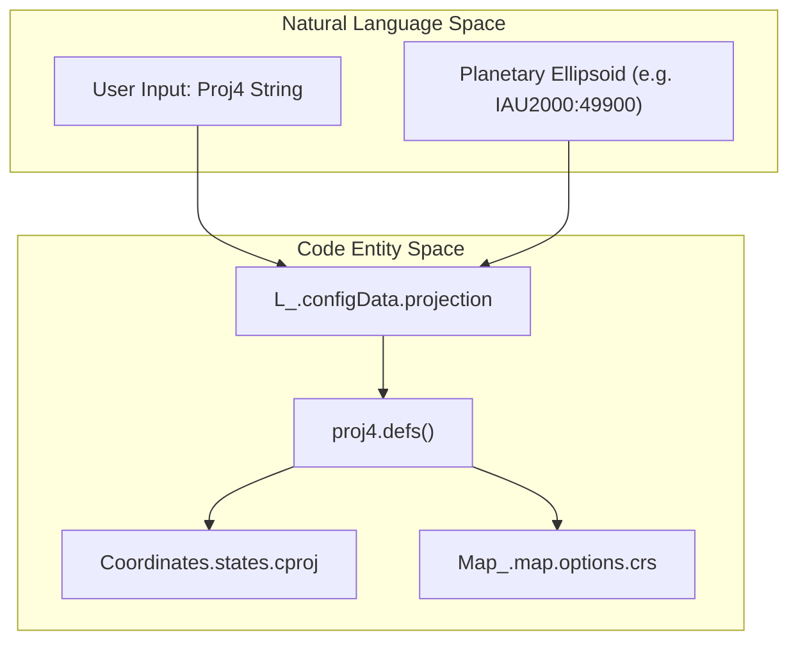
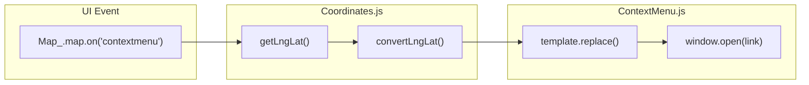

# Page: Coordinate Systems & Projections

# Coordinate Systems & Projections

Relevant source files

The following files were used as context for generating this wiki page:

- [API/Backend/Webhooks/processes/triggerwebhooks.js](API/Backend/Webhooks/processes/triggerwebhooks.js)
- [configuration/webpack.config.js](configuration/webpack.config.js)
- [docs/pages/Configure/Layers/Tile/Tile.md](docs/pages/Configure/Layers/Tile/Tile.md)
- [docs/pages/Configure/Layers/Vector/Vector.md](docs/pages/Configure/Layers/Vector/Vector.md)
- [src/css/mmgis.css](src/css/mmgis.css)
- [src/css/mmgisUI.css](src/css/mmgisUI.css)
- [src/essence/Ancillary/Coordinates.js](src/essence/Ancillary/Coordinates.js)
- [src/essence/Ancillary/QueryURL.js](src/essence/Ancillary/QueryURL.js)
- [src/essence/Basics/Layers_/leaflet-tilelayer-middleware.js](src/essence/Basics/Layers_/leaflet-tilelayer-middleware.js)
- [src/essence/Basics/UserInterface_/BottomBar.css](src/essence/Basics/UserInterface_/BottomBar.css)
- [src/essence/Basics/UserInterface_/BottomBar.js](src/essence/Basics/UserInterface_/BottomBar.js)
- [src/essence/Basics/UserInterface_/UserInterface_.js](src/essence/Basics/UserInterface_/UserInterface_.js)

MMGIS provides a robust framework for handling diverse coordinate reference systems (CRS), specifically tailored for planetary science where non-Earth ellipsoids and custom projections are standard. This system is managed through the `Coordinates` ancillary module, which handles transformations, UI display, and deep-linking.

## 1. The Coordinates Module

The `Coordinates` module is the central hub for coordinate transformation and display. It manages several "states" representing different coordinate systems simultaneously. It initializes by checking the user agent via the `UserInterface` module to determine if it should render in mobile or desktop mode [src/essence/Ancillary/Coordinates.js:114-119]().

### 1.1 Coordinate States
MMGIS supports multiple coordinate types, each defined in the `states` object of the `Coordinates` module [src/essence/Ancillary/Coordinates.js:56-113]().

| Key | Title | Description | Units | Precision |
| :--- | :--- | :--- | :--- | :--- |
| `ll` | lon/lat | Standard Geodetic Longitude and Latitude [src/essence/Ancillary/Coordinates.js:57-64](). | Degrees | 8 |
| `ll_r` | lat/lon | Reversed Geodetic (Latitude first) [src/essence/Ancillary/Coordinates.js:65-72](). | Degrees | 8 |
| `en` | east/north | Map-native Easting/Northing (usually Web Mercator) [src/essence/Ancillary/Coordinates.js:73-81](). | Meters | 3 |
| `cproj` | Projected | Primary projection defined in the mission configuration [src/essence/Ancillary/Coordinates.js:82-88](). | Meters | 3 |
| `sproj` | Secondary Projected | An additional custom projection defined via Proj4 string [src/essence/Ancillary/Coordinates.js:89-96](). | Meters | 3 |
| `rxy` | Relative | Coordinates relative to a selected point feature [src/essence/Ancillary/Coordinates.js:97-104](). | Meters | 3 |
| `site` | Local Level | Planetary "Site" coordinates (Y, X, -Z) [src/essence/Ancillary/Coordinates.js:105-112](). | Meters | 3 |

### 1.2 System Implementation & Data Flow
The `Coordinates` module listens to mouse movements on the Leaflet `Map_` and Lithosphere `Globe_` to update the UI in real-time.

**Coordinate Calculation Flow:**
1. **Input:** `Map_.map.on('mousemove')` provides a raw `latlng`.
2. **Transformation:** The `convertLngLat` function in `Coordinates.js` uses `proj4` or `Formulae_` to transform the raw geodetic point into the active state's system [src/essence/Ancillary/Coordinates.js:633-660]().
3. **UI Update:** The calculated values are formatted based on state-specific `precision` and `units` and injected into the `#mouseLngLat` and `#mouseElev` DOM elements [src/essence/Ancillary/Coordinates.js:18-42]().

**Sources:** [src/essence/Ancillary/Coordinates.js:56-113](), [src/essence/Ancillary/Coordinates.js:114-150](), [src/essence/Ancillary/Coordinates.js:633-660]()

## 2. Custom CRS & Planetary Projections

MMGIS allows missions to define custom projections to support planetary bodies (e.g., Mars, Moon). This is configured via the "Projection" tab in the Configure UI, which generates a Proj4 string.

### 2.1 Implementation Mapping
The following diagram illustrates how configuration strings are transformed into active Leaflet/Cesium projections.

**Projection Transformation Pipeline**

**Sources:** [src/essence/Ancillary/Coordinates.js:215-240](), [src/essence/Basics/Layers_/Layers_.js:1-50]()

## 3. QueryURL & Deep-Linking

The `QueryURL` module enables "deep-linking" by encoding the map state, selected features, and coordinate positions into the URL parameters. This allows users to share specific views or analysis results.

### 3.1 Key URL Parameters
The `queryURL` function parses the window location to set the initial state of the application [src/essence/Ancillary/QueryURL.js:14-43]().

*   `mapLat`, `mapLon`, `mapZoom`: Sets the 2D Leaflet view [src/essence/Ancillary/QueryURL.js:48-55]().
*   `globeLat`, `globeLon`, `globeZoom`, `globeCamera`: Sets the 3D view [src/essence/Ancillary/QueryURL.js:57-84]().
*   `selected`: Highlights a specific feature using `layerName,lat,lon` or `layerName,key,value` [src/essence/Ancillary/QueryURL.js:108-129]().
*   `startTime`, `endTime`: Sets the temporal extent for time-enabled layers [src/essence/Ancillary/QueryURL.js:162-183]().

### 3.2 Coordinate Writing
The `writeCoordinateURL` function generates shortenable links that encapsulate the current map state. This is triggered by the "Copy Link" button (`#topBarLink`) in the `BottomBar` [src/essence/Basics/UserInterface_/BottomBar.js:22-47]().

**Sources:** [src/essence/Ancillary/QueryURL.js:14-43](), [src/essence/Ancillary/QueryURL.js:48-55](), [src/essence/Ancillary/QueryURL.js:108-129](), [src/essence/Basics/UserInterface_/BottomBar.js:33-47]()

## 4. Context Menu Actions

MMGIS supports custom right-click actions that leverage the coordinate system. These are defined in the mission configuration under `rightClickMenuActions`.

### 4.1 Template Substitution
When a user right-clicks, the system scrapes the current coordinates and replaces template tokens in the configured `link`.

| Token | Replacement |
| :--- | :--- |
| `{ll[0]}` | Current Longitude [src/essence/Ancillary/Coordinates.js:633-660](). |
| `{en[1]}` | Current Northing [src/essence/Ancillary/Coordinates.js:73-81](). |

**Coordinate Template Resolution**

**Sources:** [src/essence/Ancillary/Coordinates.js:633-660]()

## 5. Planetcantile & TileMatrixSet Integration

For tiled raster data, MMGIS supports custom tiling schemes. This is critical for polar projections and non-spherical bodies.

*   **Integration:** Tile layers can specify a `TileMatrixSet` (TMS) in their configuration. The `Tile Format` setting in the layer configuration determines whether to use TMS, WMTS, or WMS [docs/pages/Configure/Layers/Tile/Tile.md:33-42]().
*   **Coordinate Offsets:** Geodetic offsets (longitude/latitude) can be applied via configuration to align legacy datasets with modern coordinate frames. These are parsed during initialization of the `Coordinates` module [src/essence/Ancillary/Coordinates.js:182-195]().
*   **Time Token Substitution:** For time-enabled tile layers, the `leaflet-tilelayer-middleware.js` replaces `{time}`, `{starttime}`, and `{endtime}` tokens in the URL before requesting tiles [src/essence/Basics/Layers_/leaflet-tilelayer-middleware.js:99-102]().

**Sources:** [src/essence/Ancillary/Coordinates.js:56-113](), [docs/pages/Configure/Layers/Tile/Tile.md:33-42](), [src/essence/Basics/Layers_/leaflet-tilelayer-middleware.js:99-102]()
