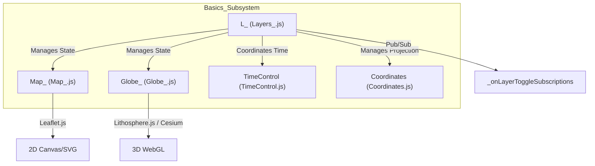
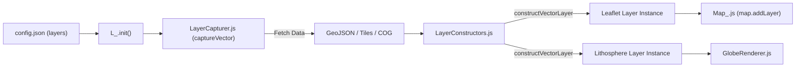

# Page: Core Map Engine

# Core Map Engine

Relevant source files

The following files were used as context for generating this wiki page:

- [configure/package.json](configure/package.json)
- [package-lock.json](package-lock.json)
- [package.json](package.json)
- [src/essence/Basics/Globe_/Globe_.js](src/essence/Basics/Globe_/Globe_.js)
- [src/essence/Basics/Layers_/Layers_.js](src/essence/Basics/Layers_/Layers_.js)
- [src/essence/Basics/Map_/Map_.js](src/essence/Basics/Map_/Map_.js)
- [src/essence/Tools/Layers/LayersTool.css](src/essence/Tools/Layers/LayersTool.css)
- [src/essence/Tools/Layers/LayersTool.js](src/essence/Tools/Layers/LayersTool.js)

The MMGIS Core Map Engine is a dual-renderer system that provides synchronized 2D and 3D geospatial visualization. It is built on a singleton state management pattern, where a central "Layers" controller (`L_`) orchestrates data between the Leaflet-based 2D map (`Map_`) and the Cesium/Lithosphere-based 3D globe (`Globe_`).

### System Architecture Overview

The engine operates as a bridge between raw configuration data (JSON) and live interactive renderers. When a mission is loaded, the system initializes the `L_` singleton, which then spawns the 2D and 3D environments via the `fina` (finalization) method [src/essence/Basics/Layers_/Layers_.js:147-161]().

#### Component Relationships
The following diagram illustrates how the core singletons interact to manage the map state and coordinate the user interface.

**Core Singleton Interop**

Sources: [src/essence/Basics/Layers_/Layers_.js:12-26](), [src/essence/Basics/Map_/Map_.js:39-48](), [src/essence/Basics/Globe_/Globe_.js:8-16](), [src/essence/Basics/Layers_/Layers_.js:155-161]()

---

### Layer State Management (`L_`)

The `L_` singleton is the "source of truth" for the application. It stores the mission configuration, layer visibility, opacity, and filters. It also handles the global `activeFeature` state, ensuring that clicking a point in 2D highlights the same point in 3D [src/essence/Basics/Layers_/Layers_.js:68-76]().

- **Config Storage**: Holds the full `configData` parsed from the mission configuration [src/essence/Basics/Layers_/Layers_.js:30]().
- **Layer Registry**: Maps layer UUIDs to live Leaflet/Lithosphere layer instances across internal objects like `layers.layer` (groups) and `layers.data` (metadata) [src/essence/Basics/Layers_/Layers_.js:31-42]().
- **Event Bus**: Provides a subscription model for tools to react to map events, such as layer toggles or time changes [src/essence/Basics/Layers_/Layers_.js:203-228]().

For details on state management and layer types, see [Layer System (Layers_, Map_, Globe_)](#2.1).

---

### Dual Rendering System

MMGIS maintains parity between 2D and 3D views through a "linking" mechanism managed via the `Globe_` controls [src/essence/Basics/Globe_/Globe_.js:174-190]().

| Feature | 2D Engine (`Map_`) | 3D Engine (`Globe_`) |
| :--- | :--- | :--- |
| **Library** | Leaflet.js [src/essence/Basics/Map_/Map_.js:29]() | Lithosphere / Cesium [src/essence/Basics/Globe_/Globe_.js:118-122]() |
| **Primary Use** | High-performance vector interaction | Terrain analysis and 3D context |
| **Projections** | Custom CRS via Proj4Leaflet [src/essence/Basics/Map_/Map_.js:142-160]() | Global sphere or custom TileMatrixSet [src/essence/Basics/Globe_/Globe_.js:54-74]() |
| **Synchronization** | `resetView` updates from Globe [src/essence/Basics/Globe_/Globe_.js:182]() | `setCenter` updates from Map [src/essence/Basics/Layers_/Layers_.js:196]() |

#### Data Flow: Config to Renderer
This diagram shows how a layer definition in the configuration becomes a rendered entity in the browser.

**Layer Construction Pipeline**

Sources: [src/essence/Basics/Layers_/Layers_.js:84-87](), [src/essence/Basics/Map_/Map_.js:4-8](), [src/essence/Basics/Map_/Map_.js:33-34]()

---

### Time and Temporal Control

The map engine is "time-aware." Layers can be configured with temporal properties, allowing the `TimeControl` module to filter features or swap tile URLs based on a global `starttime` and `endtime`.

- **Token Substitution**: URLs containing `{starttime}` and `{endtime}` are dynamically updated during the capture phase via `LayerCapturer` [src/essence/Basics/Map_/Map_.js:4-5]().
- **Global Clock**: The `TimeControl` singleton manages the current mission time and notifies all registered layers to refresh when the interval changes [src/essence/Basics/Layers_/Layers_.js:203-205]().
- **UI Integration**: The `LayersTool` provides per-layer time settings (e.g., `layerTimeTitle`) and integrates with the `TimeUI` slider [src/essence/Tools/Layers/LayersTool.js:12](), [src/essence/Tools/Layers/LayersTool.js:219-228]().

For details on temporal mapping, see [Time Control System](#2.4).

---

### Sub-Pages

*   **[Layer System (Layers_, Map_, Globe_)](#2.1)**: Deep dive into the `L_` singleton, layer types (Vector, Tile, COG, Velocity, Query, Model, VectorTile), and the `orderedBringToFront` Z-index system.
*   **[Vector Layer Construction & Symbology](#2.2)**: Technical details on `constructVectorLayer` and the symbology priority pipeline (Feature-level → Legend matching → Property mapping → Layer defaults).
*   **[Data Fetching & Layer Capturer](#2.3)**: How `LayerCapturer.js` handles various URL protocols (`geodatasets:`, `api:`, `stac-collection:`) and manages race conditions via timestamps.
*   **[Time Control System](#2.4)**: Documentation on the `TimeControl` module, `TimeUI` slider, temporal token substitution, and the `AnimationTool` for sequence exporting.
*   **[Coordinate Systems & Projections](#2.5)**: Overview of the `Coordinates` module, custom planetary CRS setup (EPSG/Proj strings), and the `QueryURL` deep-linking system.
