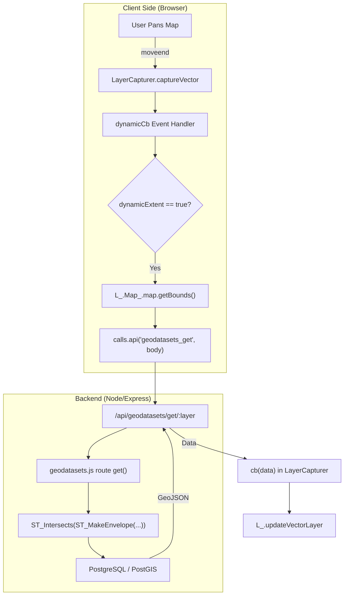
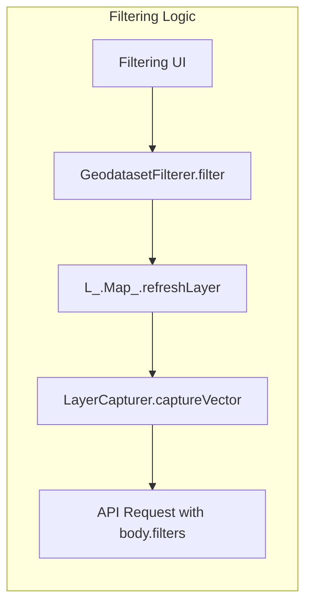
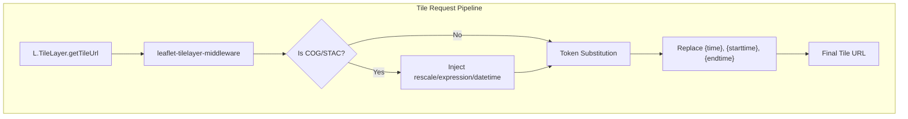

# Page: Data Fetching & Layer Capturer

# Data Fetching & Layer Capturer

Relevant source files

The following files were used as context for generating this wiki page:

- [API/Backend/Geodatasets/routes/geodatasets.js](API/Backend/Geodatasets/routes/geodatasets.js)
- [API/Backend/Webhooks/processes/triggerwebhooks.js](API/Backend/Webhooks/processes/triggerwebhooks.js)
- [configuration/webpack.config.js](configuration/webpack.config.js)
- [docs/pages/Configure/Layers/Tile/Tile.md](docs/pages/Configure/Layers/Tile/Tile.md)
- [docs/pages/Configure/Layers/Vector/Vector.md](docs/pages/Configure/Layers/Vector/Vector.md)
- [src/essence/Ancillary/QueryURL.js](src/essence/Ancillary/QueryURL.js)
- [src/essence/Basics/Layers_/LayerCapturer.js](src/essence/Basics/Layers_/LayerCapturer.js)
- [src/essence/Basics/Layers_/leaflet-tilelayer-middleware.js](src/essence/Basics/Layers_/leaflet-tilelayer-middleware.js)
- [tests/e2e/api/filesutils-sql-injection.spec.js](tests/e2e/api/filesutils-sql-injection.spec.js)
- [tests/e2e/api/geodatasets.spec.js](tests/e2e/api/geodatasets.spec.js)
- [tests/unit/sql-injection-prevention.spec.js](tests/unit/sql-injection-prevention.spec.js)

The **Layer Capturer** system is the primary data acquisition engine for MMGIS vector and query layers. It manages the lifecycle of data requests, from URL protocol resolution and time token substitution to dynamic spatial querying and race condition mitigation.

## 1. LayerCapturer.js Overview

`LayerCapturer.js` acts as a middleware between the layer configuration and the rendering engines (Leaflet/Lithosphere). It resolves abstract URL schemes into actionable network requests and handles the complexities of time-synced data.

### URL Protocol Branching
MMGIS uses a colon-delimited URL syntax to determine the data source. `captureVector` parses these strings to route requests:

| Protocol | Example | Description |
| :--- | :--- | :--- |
| `geodatasets:` | `geodatasets:my_table` | Fetches from the PostGIS-backed Geodatasets system [src/essence/Basics/Layers_/LayerCapturer.js:81-180](). |
| `api:published` | `api:publishedall` | Retrieves features published via the Draw Tool [src/essence/Basics/Layers_/LayerCapturer.js:184-210](). |
| `api:drawn` | `api:drawn:42` | Fetches a specific user-drawn file by ID [src/essence/Basics/Layers_/LayerCapturer.js:212-230](). |
| `standard` | `Missions/data.json` | Standard relative or absolute GeoJSON/JSON URLs [src/essence/Basics/Layers_/LayerCapturer.js:73](). |

**Sources:** [src/essence/Basics/Layers_/LayerCapturer.js:15-230]()

---

## 2. Time Token Substitution

For time-enabled layers, the system dynamically injects timestamps into the URL before fetching. This allows integration with REST APIs that filter by time via query parameters.

### Supported Tokens
* `{starttime}`: The current start time from `TimeControl` [src/essence/Basics/Layers_/LayerCapturer.js:57]().
* `{endtime}` / `{time}`: The current end time from `TimeControl` [src/essence/Basics/Layers_/LayerCapturer.js:58-59]().
* `{customtime.i}`: Indices from the `customTimes` array in `TimeControl` [src/essence/Basics/Layers_/LayerCapturer.js:66-69]().

### Implementation Logic
The system applies a default format (`%Y-%m-%dT%H:%M:%SZ`) unless a custom `time.format` is specified in the layer configuration [src/essence/Basics/Layers_/LayerCapturer.js:41-44](). If a layer is "time enabled" but lacks specific start/end overrides, it defaults to the global `TimeControl` values [src/essence/Basics/Layers_/LayerCapturer.js:46-53]().

**Sources:** [src/essence/Basics/Layers_/LayerCapturer.js:41-72]()

---

## 3. Dynamic Extent Loading

When a layer is configured with `variables.dynamicExtent: true`, MMGIS does not load the entire dataset at once. Instead, it queries the backend based on the current map viewport.

### Request Lifecycle
1. **Trigger:** Map events `moveend` or `zoomend` fire a `dynamicCb` [src/essence/Basics/Layers_/LayerCapturer.js:83]().
2. **Bounds Calculation:** The system retrieves the current Leaflet bounds (`_northEast`, `_southWest`) and the current zoom level [src/essence/Basics/Layers_/LayerCapturer.js:87-101]().
3. **Backend Request:** A POST/GET request is sent to `/api/geodatasets/get` containing the spatial envelope (`minx`, `miny`, `maxx`, `maxy`) and any active filters [src/essence/Basics/Layers_/LayerCapturer.js:153-156]().
4. **Race Condition Mitigation:** To prevent slow, older requests from overwriting newer data (e.g., during rapid panning), the system stores a `_geodatasetRequestLastTimestamp`. Responses are only processed if their timestamp matches the most recent request [src/essence/Basics/Layers_/LayerCapturer.js:143-164]().

### Dynamic Extent Data Flow
"Natural Language Space" to "Code Entity Space" mapping:

**Sources:** [src/essence/Basics/Layers_/LayerCapturer.js:79-170](), [API/Backend/Geodatasets/routes/geodatasets.js:17-23](), [API/Backend/Geodatasets/routes/geodatasets.js:156-170](), [src/pre/calls.js:138-141]()

---

## 4. Requery vs. Local Time Modes

MMGIS handles temporal data for vector layers in two distinct ways, configured via `layerData.time.type`:

### Requery Mode
In this mode, every time the `TimeControl` changes, the `LayerCapturer` initiates a new network request to the server with updated `starttime` and `endtime` parameters. This is essential for massive datasets stored in Geodatasets where client-side filtering is impractical [src/essence/Basics/Layers_/LayerCapturer.js:120-132](). The backend route translates these into SQL `BIGINT` comparisons against `start_time` and `end_time` columns [API/Backend/Geodatasets/routes/geodatasets.js:171-200]().

### Local Mode (Client-Side Filtering)
For standard GeoJSON files, the entire dataset is loaded once. The `LocalFilterer` then hides or shows features based on their properties matching the `TimeControl` range. This provides instantaneous updates without network latency [src/essence/Ancillary/LocalFilterer.js:71-115]().

---

## 5. Filtering Integration

`LayerCapturer` integrates with the `Filtering.js` subsystem to apply server-side constraints to Geodataset queries.

### Filter Encoding
When a user defines filters in the UI, `GeodatasetFilterer.js` encodes them into a string format (e.g., `key+op+type+value`) where the operator is mapped (e.g., `,` becomes `in`) [src/essence/Basics/Layers_/Filtering/GeodatasetFilterer.js:97-109](). This is appended to the `body.filters` of the `geodatasets_get` call [src/essence/Basics/Layers_/LayerCapturer.js:135-136]().

### Security and Sanitization
To prevent SQL injection, the backend utilizes `Utils.forceAlphaNumUnder()` to sanitize column names and property keys used in filters [API/Backend/Geodatasets/routes/geodatasets.js:151-153](). This utility strips non-alphanumeric characters except underscores [tests/unit/sql-injection-prevention.spec.js:28-34]().

### Server-Side Processing
The backend `geodatasets.js` route parses these filters from the query string or body and constructs SQL conditions. It handles group operations (`OR`, `AND`, `NOT_AND`, `NOT_OR`) and standard comparisons [API/Backend/Geodatasets/routes/geodatasets.js:70-89]().

**Sources:** [src/essence/Basics/Layers_/Filtering/GeodatasetFilterer.js:66-115](), [API/Backend/Geodatasets/routes/geodatasets.js:70-89](), [src/essence/Basics/Layers_/LayerCapturer.js:135-140](), [API/Backend/Geodatasets/routes/geodatasets.js:151-153](), [tests/unit/sql-injection-prevention.spec.js:28-34]()

---

## 6. Tile Layer Data Fetching

For raster data, the system uses `leaflet-tilelayer-middleware.js` to extend Leaflet's `TileLayer`. This middleware handles time substitution and dynamic parameter injection for advanced raster sources like COGs and STAC collections.

### STAC and COG Parameter Injection
If a layer is of type `stac-collection` or `COG`, the middleware injects `datetime`, `rescale`, and `expression` parameters into the tile URL [src/essence/Basics/Layers_/leaflet-tilelayer-middleware.js:24-81]().

### Tile Time Substitution
Similar to vector layers, tile URLs are processed to replace `{time}`, `{starttime}`, and `{endtime}` tokens [src/essence/Basics/Layers_/leaflet-tilelayer-middleware.js:99-103](). For TMS layers with time enabled, it ensures `starttime` and `time` parameters are appended if not present [src/essence/Basics/Layers_/leaflet-tilelayer-middleware.js:116-136]().

**Sources:** [src/essence/Basics/Layers_/leaflet-tilelayer-middleware.js:20-138]()

---

## 7. Key Classes and Functions

| Entity | Location | Role |
| :--- | :--- | :--- |
| `captureVector` | [src/essence/Basics/Layers_/LayerCapturer.js:15]() | Main entry point for fetching vector data and resolving protocols. |
| `_geodatasetRequestLastTimestamp` | [src/essence/Basics/Layers_/LayerCapturer.js:11]() | State object for mitigating request race conditions by tracking the latest request ID. |
| `get` (Route) | [API/Backend/Geodatasets/routes/geodatasets.js:25]() | Backend function handling spatial envelope and attribute filtering. |
| `GeodatasetFilterer` | [src/essence/Basics/Layers_/Filtering/GeodatasetFilterer.js:11]() | Translates UI filter state into Geodataset API parameters for server-side execution. |
| `LocalFilterer` | [src/essence/Ancillary/LocalFilterer.js:10]() | Performs client-side GeoJSON attribute and spatial matching for local layers. |
| `calls.api` | [src/pre/calls.js:168]() | Unified AJAX wrapper for all backend communication. |
| `colorFilterExtension` | [src/essence/Basics/Layers_/leaflet-tilelayer-middleware.js:16]() | Extends Leaflet TileLayers with CSS filters and dynamic URL parameter injection. |

**Sources:** [src/essence/Basics/Layers_/LayerCapturer.js:11-15](), [API/Backend/Geodatasets/routes/geodatasets.js:25](), [src/essence/Basics/Layers_/Filtering/GeodatasetFilterer.js:11](), [src/essence/Ancillary/LocalFilterer.js:10](), [src/pre/calls.js:168](), [src/essence/Basics/Layers_/leaflet-tilelayer-middleware.js:16-21]()
