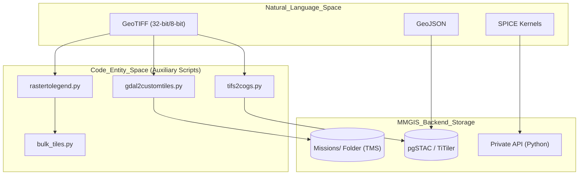
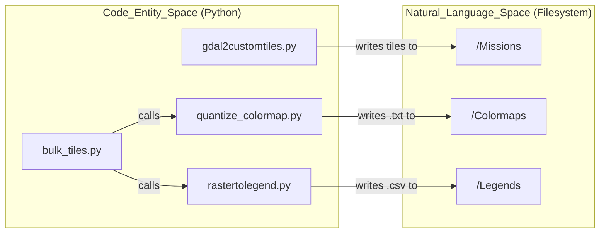

# Page: Data Processing & Auxiliary Scripts

# Data Processing & Auxiliary Scripts

Relevant source files

The following files were used as context for generating this wiki page:

- [auxiliary/bulk_tiles/README.md](auxiliary/bulk_tiles/README.md)
- [auxiliary/bulk_tiles/bulk_tiles.py](auxiliary/bulk_tiles/bulk_tiles.py)
- [auxiliary/gdal2customtiles/gdal2customtiles.py](auxiliary/gdal2customtiles/gdal2customtiles.py)
- [auxiliary/gdal2customtiles/legacy/gdal2customtiles_py27.py](auxiliary/gdal2customtiles/legacy/gdal2customtiles_py27.py)
- [auxiliary/gdal2customtiles/legacy/gdal2tiles_3.5.2.py](auxiliary/gdal2customtiles/legacy/gdal2tiles_3.5.2.py)
- [auxiliary/gdal2customtiles/legacy/rasters2customtiles_3.5.2.py](auxiliary/gdal2customtiles/legacy/rasters2customtiles_3.5.2.py)
- [auxiliary/gdal2customtiles/legacy/readme.md](auxiliary/gdal2customtiles/legacy/readme.md)
- [auxiliary/gdal2customtiles/rasters2customtiles.py](auxiliary/gdal2customtiles/rasters2customtiles.py)
- [auxiliary/gdal2customtiles/readme.md](auxiliary/gdal2customtiles/readme.md)
- [auxiliary/quantize_colormap/README.md](auxiliary/quantize_colormap/README.md)
- [auxiliary/quantize_colormap/quantize_colormap.py](auxiliary/quantize_colormap/quantize_colormap.py)
- [auxiliary/rasterstotiles/rasterstotiles.py](auxiliary/rasterstotiles/rasterstotiles.py)
- [auxiliary/rastertolegend/rastertolegend.py](auxiliary/rastertolegend/rastertolegend.py)

This section provides an overview of the auxiliary scripts and private API components used to prepare, tile, and process geospatial data for MMGIS. These tools bridge the gap between raw scientific data (GeoTIFFs, DEMs, SPICE kernels) and the optimized formats required for high-performance web rendering and analysis.

The system is divided into three primary functional areas:
1.  **Raster Tiling**: Converting large rasters into TMS-compatible tile trees, including specialized support for planetary projections and 32-bit elevation data.
2.  **STAC & COG Management**: Modernizing data workflows using Cloud Optimized GeoTIFFs and SpatioTemporal Asset Catalogs.
3.  **Server-Side Computation**: Python-based APIs for heavy lifting such as elevation profiling and planetary geometry calculations.

### Data Processing Workflow

The following diagram illustrates how raw data moves through the auxiliary scripts into the MMGIS ecosystem.

**Data Preparation Pipeline**

Sources: [auxiliary/gdal2customtiles/gdal2customtiles.py:1-60](), [auxiliary/bulk_tiles/bulk_tiles.py:18-89](), [auxiliary/rastertolegend/rastertolegend.py:7-36]()

---

## [Raster Tiling Scripts](#8.1)

The primary tool for data ingestion is `gdal2customtiles.py`, a highly modified version of the standard `gdal2tiles` utility. It is designed to handle the unique requirements of planetary science, such as non-Mercator projections and high-bit-depth elevation data.

*   **Custom Extents**: Unlike standard web-mappers, MMGIS often uses `raster` profiles where the "world" is defined by a specific planetary projection's bounds using the `--extentworld` flag [auxiliary/gdal2customtiles/readme.md:9-32](). This is handled by the `getTilePxBounds` method when `isRasterBounded` is true [auxiliary/gdal2customtiles/gdal2customtiles.py:74-124]().
*   **DEM Tiling**: Encodes 32-bit float data into the RGBA channels of a PNG via the `--dem` flag [auxiliary/gdal2customtiles/readme.md:39-53](). This supports terrain meshes and data layers. To support the value 0 without clashing with transparency, 0 data values are mapped to $2^{31}$ (RGBA=79,0,0,0) and decoded back to 0 by the MMGIS reader [auxiliary/gdal2customtiles/readme.md:60-62](), [auxiliary/gdal2customtiles/gdal2customtiles.py:67-69]().
*   **Bulk Processing**: The `bulk_tiles.py` script automates the colorization and tiling of entire directories, generating both the tilesets and the corresponding MMGIS layer configuration JSON [auxiliary/bulk_tiles/bulk_tiles.py:117-158]().
*   **Compositing**: A specialized `near-composite` resampling algorithm allows new tiles to be overlaid onto existing ones in the output directory, making it possible to accumulate or combine tilesets at the individual tile image level [auxiliary/gdal2customtiles/readme.md:64-74]().

For details, see [Raster Tiling Scripts](#8.1).

Sources: [auxiliary/gdal2customtiles/gdal2customtiles.py:70-132](), [auxiliary/gdal2customtiles/readme.md:39-62](), [auxiliary/bulk_tiles/bulk_tiles.py:1-17](), [auxiliary/gdal2customtiles/rasters2customtiles.py:115-142]()

---

## [STAC & COG Data Preparation](#8.2)

MMGIS supports the modern **Cloud Optimized GeoTIFF (COG)** format, which allows the client to request only the portions of a file needed for the current view.

*   **Conversion**: `tifs2cogs.py` streamlines the conversion of standard GeoTIFFs into COGs with appropriate overviews and internal tiling.
*   **Cataloging**: Scripts in `auxiliary/stac/` facilitate the creation of STAC items and collections, which are then ingested into the `stac-fastapi` and `pgSTAC` backend for dynamic serving via TiTiler.
*   **NDGeoJSON**: Utilities like `geojson2ndgeojson` prepare large vector datasets for efficient streaming and database ingestion.

For details, see [STAC & COG Data Preparation](#8.2).

Sources: [auxiliary/bulk_tiles/bulk_tiles.py:117-155]()

---

## [Private API & SPICE Integration](#8.3)

The `private/api` directory contains Python scripts that provide complex computational services to the Node.js backend. These are often invoked for tasks that require specialized libraries like `numpy`, `scipy`, or `SpiceyPy`.

*   **Profiling**: `2ptsToProfile.py` and `BandsToProfile.py` extract elevation or multi-spectral data along a drawn path. These scripts are often called via the `MeasureTool` or specialized `Analysis` tools.
*   **Planetary Geometry**: Integration with NASA's SPICE toolkit (via `chronos.py` and `ll2aerll.py`) allows MMGIS to calculate lighting, orbital positions, and coordinate transformations between different planetary reference frames.
*   **Colormap Quantization**: `quantize_colormap.py` uses Matplotlib to generate quantized colormap text files from input rasters based on data percentiles [auxiliary/quantize_colormap/quantize_colormap.py:70-90](). This is useful for creating `rastertolegend` compatible color files [auxiliary/quantize_colormap/quantize_colormap.py:39-50]().

For details, see [Private API & SPICE Integration](#8.3).

**System Entity Mapping**

Sources: [auxiliary/bulk_tiles/bulk_tiles.py:18-40](), [auxiliary/quantize_colormap/quantize_colormap.py:51-100](), [auxiliary/rastertolegend/rastertolegend.py:38-104]()

---

### Key File Summary

| Script/File | Role | Language |
| :--- | :--- | :--- |
| `gdal2customtiles.py` | Core raster tiling engine with DEM and custom projection support [auxiliary/gdal2customtiles/gdal2customtiles.py:1-60](). | Python |
| `rasters2customtiles.py` | Convenience wrapper for `gdal2customtiles.py` that handles reprojection to EPSG:4326 [auxiliary/gdal2customtiles/rasters2customtiles.py:108-113](). | Python |
| `bulk_tiles.py` | Orchestrates colormapping, tiling, and config generation for many files [auxiliary/bulk_tiles/bulk_tiles.py:159-187](). | Python |
| `quantize_colormap.py` | Generates quantized colormaps from rasters using Matplotlib [auxiliary/quantize_colormap/quantize_colormap.py:39-50](). | Python |
| `rastertolegend.py` | Colorizes a raster based on a color file and generates a corresponding CSV legend [auxiliary/rastertolegend/rastertolegend.py:18-36](). | Python |
| `rasterstotiles.py` | Wraps GDAL tools to reproject and tile rasters specifically for MMGIS [auxiliary/rasterstotiles/rasterstotiles.py:82-110](). | Python |

Sources: [auxiliary/gdal2customtiles/gdal2customtiles.py:1-60](), [auxiliary/bulk_tiles/bulk_tiles.py:160-187](), [auxiliary/gdal2customtiles/rasters2customtiles.py:115-142](), [auxiliary/rastertolegend/rastertolegend.py:18-36](), [auxiliary/rasterstotiles/rasterstotiles.py:82-110]()
