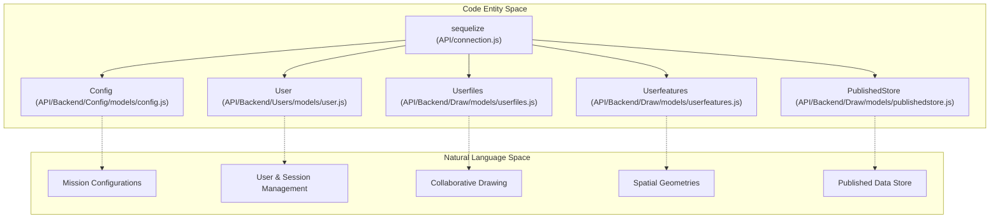
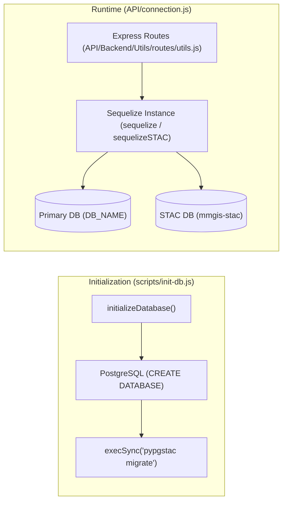

# Page: Database & Persistence

# Database & Persistence

Relevant source files

The following files were used as context for generating this wiki page:

- [API/Backend/Utils/routes/utils.js](API/Backend/Utils/routes/utils.js)
- [API/connection.js](API/connection.js)
- [docker-compose.sample.yml](docker-compose.sample.yml)
- [docs/assets/images/database_schemas/ancillary.png](docs/assets/images/database_schemas/ancillary.png)
- [docs/assets/images/database_schemas/configuration.png](docs/assets/images/database_schemas/configuration.png)
- [docs/assets/images/database_schemas/drawtool.png](docs/assets/images/database_schemas/drawtool.png)
- [docs/assets/images/database_schemas/infrastructural.png](docs/assets/images/database_schemas/infrastructural.png)
- [docs/pages/Database/Ancillary/Ancillary.md](docs/pages/Database/Ancillary/Ancillary.md)
- [docs/pages/Database/Configuration/Configuration.md](docs/pages/Database/Configuration/Configuration.md)
- [docs/pages/Database/Database.md](docs/pages/Database/Database.md)
- [docs/pages/Database/Infrastructural/Infrastructural.md](docs/pages/Database/Infrastructural/Infrastructural.md)
- [docs/pages/Migration/v3-to-v4/v3-to-v4.md](docs/pages/Migration/v3-to-v4/v3-to-v4.md)
- [scripts/init-db.js](scripts/init-db.js)

MMGIS utilizes a **PostgreSQL** database with the **PostGIS** extension for all spatial and non-spatial persistence. The backend interacts with the database primarily through the **Sequelize ORM**, which manages schema synchronization, connection pooling, and model definitions.

For detailed information on specific tables and adjacent services, see:
*   [Database Schema Reference](#7.1) — Detailed documentation of table groups (Configuration, Drawing, Infrastructural, Ancillary).
*   [Adjacent Servers & Service Proxying](#7.2) — Documentation of the STAC, TiTiler, and pgSTAC integration.

## Database Initialization & Connection

MMGIS manages its own database lifecycle. On startup, the system ensures the existence of the primary database (defined by `DB_NAME` in `.env`) and, if enabled, a secondary `mmgis-stac` database for metadata indexing [scripts/init-db.js:124-131]().

### Connection Management
The `API/connection.js` file establishes the Sequelize instances used across the backend. It supports SSL configurations (including CA certificate injection via base64 or file paths), connection pooling, and environment-based logging levels [API/connection.js:7-52]().

*   **Primary Instance**: Exported as `sequelize`, it connects to the main application database [API/connection.js:120]().
*   **STAC Instance**: Exported as `sequelizeSTAC`, it connects to the `mmgis-stac` database used by adjacent services like `stac-fastapi` when `WITH_STAC` is enabled [API/connection.js:55-98]().

### Initialization Flow
The initialization script `scripts/init-db.js` performs the following sequence:
1.  **Check/Create Databases**: Connects to the `postgres` system database to create `mmgis-stac` and the primary `DB_NAME` if they do not exist [scripts/init-db.js:131-201]().
2.  **STAC Migration**: If STAC-related features are enabled (`WITH_STAC`, `WITH_TIPG`, or `WITH_TITILER_PGSTAC`), it runs `pypgstac migrate` via `execSync` to conform the schema to the pgSTAC specification [scripts/init-db.js:124-182]().
3.  **Model Sync**: Synchronizes all Sequelize models (creating tables and indexes) [scripts/init-db.js:240-250]().

Sources: [scripts/init-db.js:72-201](), [API/connection.js:7-120]()

## System Entity Mapping

The following diagrams bridge the gap between high-level system concepts and the actual Sequelize models and files that implement them.

### Persistence Architecture

Sources: [API/connection.js:7-120](), [API/Backend/Draw/models/userfeatures.js:1-61](), [API/Backend/Config/models/config.js:1-31]()

### Data Flow Diagram

Sources: [scripts/init-db.js:72-201](), [API/connection.js:101-120](), [API/Backend/Utils/routes/utils.js:12-14]()

## Major Table Groups

The MMGIS schema is logically divided into primary areas. Each area is managed by its own set of Sequelize models.

| Group | Primary Tables | Purpose |
| :--- | :--- | :--- |
| **Configuration** | `configs`, `webhooks`, `long_term_tokens` | Stores versioned mission JSON, API keys, and event triggers [API/Backend/Config/models/config.js:8-31](). |
| **Drawing** | `user_files`, `user_features`, `file_histories` | Persistence for the collaborative Draw Tool, including geometry and undo/redo history [API/Backend/Draw/models/userfeatures.js:25-61](). |
| **Data Store** | `published_stores` | Key-value storage for published data items with timestamps. |
| **Infrastructure** | `users`, `session`, `url_shorteners` | Core system state, authentication, and deep-link mapping [docs/pages/Database/Infrastructural/Infrastructural.md:15-26](), [docs/pages/Database/Ancillary/Ancillary.md:15-18](). |

### Configuration Versioning
The `configs` table stores full JSON objects representing the state of a mission's configuration. Every update in the `/configure` UI increments the version, facilitating configuration history tracking [API/Backend/Config/models/config.js:8-31]().

### Drawing Persistence
The drawing system uses a relational pattern between files and features. 
*   **user_files**: Metadata for user-created files (owner, name, description, privacy).
*   **file_histories**: An append-only log of file states, enabling undo/redo and version traversal.
*   **user_features**: Stores actual geometries using PostGIS types and feature-level properties [API/Backend/Draw/models/userfeatures.js:25-61]().

### Adjacent Server Databases
When `WITH_STAC` or related flags are enabled, MMGIS initializes a `mmgis-stac` database [scripts/init-db.js:124-131](). This database is populated via `pgstac` migrations and serves as the backend for `stac-fastapi`, `titiler-pgstac`, and `tipg` [docker-compose.sample.yml:43, 82, 182]().

For a complete list of tables and column definitions, see the [Database Schema Reference](#7.1).

Sources: [API/Backend/Config/models/config.js:8-31](), [API/Backend/Draw/models/userfeatures.js:25-61](), [scripts/init-db.js:124-198](), [docker-compose.sample.yml:31-207]()
