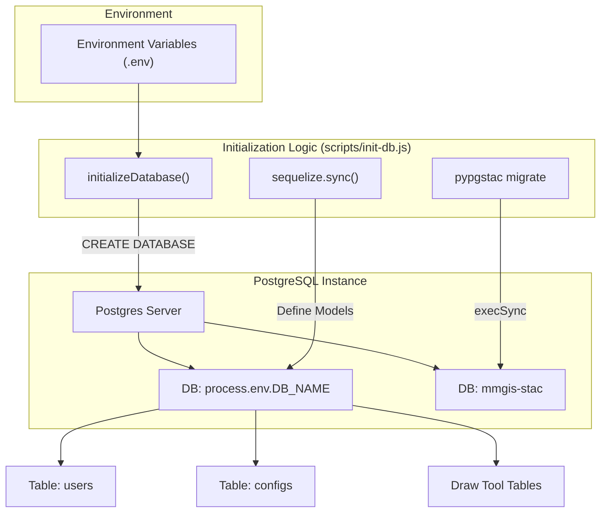
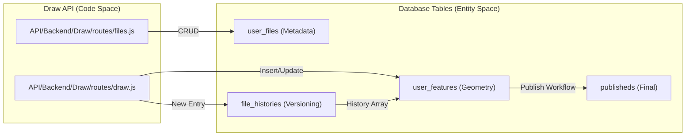

# Page: Database Schema Reference

# Database Schema Reference

Relevant source files

The following files were used as context for generating this wiki page:

- [API/Backend/Draw/models/published.js](API/Backend/Draw/models/published.js)
- [API/Backend/Utils/routes/utils.js](API/Backend/Utils/routes/utils.js)
- [API/connection.js](API/connection.js)
- [docker-compose.sample.yml](docker-compose.sample.yml)
- [docs/Gemfile](docs/Gemfile)
- [docs/Gemfile.lock](docs/Gemfile.lock)
- [docs/_config.yml](docs/_config.yml)
- [docs/assets/images/database_schemas/ancillary.png](docs/assets/images/database_schemas/ancillary.png)
- [docs/assets/images/database_schemas/configuration.png](docs/assets/images/database_schemas/configuration.png)
- [docs/assets/images/database_schemas/drawtool.png](docs/assets/images/database_schemas/drawtool.png)
- [docs/assets/images/database_schemas/infrastructural.png](docs/assets/images/database_schemas/infrastructural.png)
- [docs/pages/Database/Ancillary/Ancillary.md](docs/pages/Database/Ancillary/Ancillary.md)
- [docs/pages/Database/Configuration/Configuration.md](docs/pages/Database/Configuration/Configuration.md)
- [docs/pages/Database/Database.md](docs/pages/Database/Database.md)
- [docs/pages/Database/DrawTool/DrawTool.md](docs/pages/Database/DrawTool/DrawTool.md)
- [docs/pages/Database/Infrastructural/Infrastructural.md](docs/pages/Database/Infrastructural/Infrastructural.md)
- [docs/pages/Migration/v3-to-v4/v3-to-v4.md](docs/pages/Migration/v3-to-v4/v3-to-v4.md)
- [scripts/init-db.js](scripts/init-db.js)
- [src/external/Leaflet/leaflet1.5.1_DEBUG.js](src/external/Leaflet/leaflet1.5.1_DEBUG.js)

MMGIS utilizes a PostgreSQL database with PostGIS extensions for spatial data persistence. The system uses the Sequelize ORM for most interactions, though raw SQL is used for high-performance spatial queries and dynamic table management.

## Initialization and Connection

The database is initialized via a standalone script that ensures the existence of the primary MMGIS database and, optionally, a separate `mmgis-stac` database if STAC features are enabled [scripts/init-db.js:124-131]().

### Connection Management
Connections are managed in `API/connection.js`, which exports two Sequelize instances:
- `sequelize`: The primary connection for core MMGIS tables [API/connection.js:7-52]().
- `sequelizeSTAC`: An optional connection for pgSTAC-compliant metadata, enabled when `WITH_STAC=true` [API/connection.js:55-98]().

The primary connection uses a pool with a default maximum of 10 connections, configurable via `DB_POOL_MAX` [API/connection.js:37-40]().

### Code-to-Entity Mapping: Database Bootstrap
This diagram shows how the initialization script transitions from environment variables to a functional schema.

Sources: [scripts/init-db.js:72-210](), [API/connection.js:7-52]()

---

## Core System Tables

### configs (Mission Configuration)
Stores the versioned history of mission configurations. Each mission's entire setup (layers, tools, projections) is stored as a JSON object.
- `mission`: (String) Unique identifier for the mission.
- `version`: (Integer) Incremental version number.
- `config`: (JSON) The complete configuration blob containing layer arrays and tool settings.

### users
The `users` table is used when the environment variable `AUTH=local` is set and for the Site Admin's account [docs/pages/Database/Infrastructural/Infrastructural.md:23-26](). It stores usernames, emails, and encrypted passwords.

### session
The `session` table enables the MMGIS Server to track authenticated user sessions across requests [docs/pages/Database/Infrastructural/Infrastructural.md:15-18](). Storing tokens in a table allows the backend to scale horizontally without losing user state.

### spatial_ref_sys
Used by the PostGIS extension to maintain a catalog of spatial reference systems (EPSG/ESRI codes) [docs/pages/Database/Infrastructural/Infrastructural.md:19-22]().

Sources: [docs/pages/Database/Infrastructural/Infrastructural.md:15-26](), [API/connection.js:7-52]()

---

## Draw Tool Schema

The Draw Tool implements a collaborative vector environment with full version history and publishing workflows [docs/pages/Database/DrawTool/DrawTool.md:15-17]().

### Table Relationships: Feature Persistence
This diagram maps the flow from a user action in the Draw Tool to the multi-table persistence layer.

Sources: [docs/pages/Database/DrawTool/DrawTool.md:15-84]()

### Major Draw Tables
| Table | Purpose | Key Columns |
| :--- | :--- | :--- |
| `user_files` | Metadata for drawing files (folders, tags, owners) | `file_name`, `file_owner`, `publicity_type`, `template` [docs/pages/Database/DrawTool/DrawTool.md:15-41]() |
| `file_histories` | Version control for features; stores state as an array of IDs | `file_id`, `history` (int array), `action_index` [docs/pages/Database/DrawTool/DrawTool.md:43-63]() |
| `user_features` | The actual PostGIS geometries and properties | `geom` (PostGIS), `properties` (JSON), `level` [docs/pages/Database/DrawTool/DrawTool.md:65-75]() |
| `publisheds` | Read-optimized table for the "final" version of a drawing | `geom`, `properties`, `intent`, `level` [API/Backend/Draw/models/published.js:25-68](), [docs/pages/Database/DrawTool/DrawTool.md:81-84]() |
| `published_stores` | Hierarchical metadata used during publishing validation | Spatial/Relational metadata [docs/pages/Database/DrawTool/DrawTool.md:77-79]() |

---

## Geodatasets and Datasets

These systems allow MMGIS to host arbitrary spatial and non-spatial data. Unlike static tables, these systems dynamically create new tables for each uploaded dataset.

### Geodatasets (Spatial)
The `geodatasets` table acts as a registry for dynamically created spatial tables.
- **Registry Columns**: `name`, `table` (the physical table name), `start_time_field`, `end_time_field`, `group_id_field`, `feature_id_field`.
- **Dynamic Tables**: Created with names like `g1_geodatasets`. Each contains a `geom` column with a GIST index and a `properties` JSON column.

### Datasets (Non-Spatial)
The `datasets` table registers non-spatial CSV/JSON uploads.
- **Registry Columns**: `name`, `table`.
- **Dynamic Tables**: Created with names like `d1_datasets`. Columns are dynamically generated based on the source file's headers.

### Spatial and Temporal Indexing
When a Geodataset is created, the system generates indexes to optimize queries:
1. **Spatial**: `USING gist (geom)` provides high-performance bounding box and intersection queries.
2. **Temporal**: Time-based indexing if start/end time fields are specified.

Sources: [docs/pages/Database/DrawTool/DrawTool.md:77-84]()

---

## Ancillary Tables

### url_shorteners
Stores mappings between short character sequences (e.g., `?s=mdxeg`) and full deep-link URLs [docs/pages/Database/Ancillary/Ancillary.md:15-18](). This table also records the user who created the link.

### long_term_tokens
Stores API keys that bypass standard session-based authentication for automated scripts or external integrations. These are initialized during the database setup [scripts/init-db.js:240-260]().

### webhooks
Registers external URLs to be notified of system events, such as when a drawing file is published or modified.
- `event`: The trigger event name (e.g., "draw.publish").
- `url`: The destination endpoint.

### Adjacent Services (pgSTAC)
When services like `stac-fastapi` or `titiler-pgstac` are enabled, MMGIS interacts with the `mmgis-stac` database. This database is conformed to the `pgstac` schema using `pypgstac migrate` [scripts/init-db.js:168-182]().

Sources: [docs/pages/Database/Ancillary/Ancillary.md:15-18](), [scripts/init-db.js:124-182](), [docker-compose.sample.yml:31-150]()
