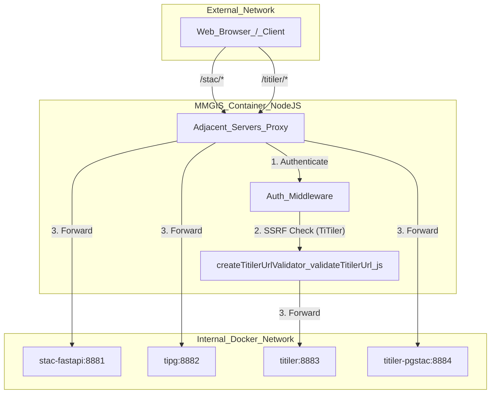
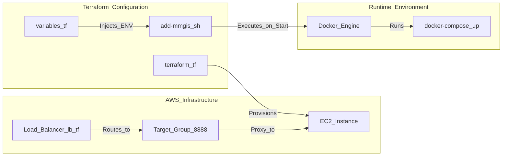

# Page: Docker & Deployment

# Docker & Deployment

Relevant source files

The following files were used as context for generating this wiki page:

- [.github/workflows/docker-build.yml](.github/workflows/docker-build.yml)
- [API/Backend/Utils/routes/utils.js](API/Backend/Utils/routes/utils.js)
- [API/connection.js](API/connection.js)
- [Dockerfile](Dockerfile)
- [docker-compose.sample.yml](docker-compose.sample.yml)
- [docker-compose.v1-sample.yml](docker-compose.v1-sample.yml)
- [docs/pages/Migration/v3-to-v4/v3-to-v4.md](docs/pages/Migration/v3-to-v4/v3-to-v4.md)
- [python-environment.yml](python-environment.yml)
- [python-requirements.txt](python-requirements.txt)
- [scripts/init-db.js](scripts/init-db.js)
- [sds/unity/terraform/modules/ec2-docker/add-mmgis.sh](sds/unity/terraform/modules/ec2-docker/add-mmgis.sh)
- [sds/unity/terraform/modules/ec2-docker/bk.tf](sds/unity/terraform/modules/ec2-docker/bk.tf)
- [sds/unity/terraform/modules/ec2-docker/lb.tf](sds/unity/terraform/modules/ec2-docker/lb.tf)
- [sds/unity/terraform/modules/ec2-docker/main.tf](sds/unity/terraform/modules/ec2-docker/main.tf)
- [sds/unity/terraform/modules/ec2-docker/output.tf](sds/unity/terraform/modules/ec2-docker/output.tf)
- [sds/unity/terraform/modules/ec2-docker/variables.tf](sds/unity/terraform/modules/ec2-docker/variables.tf)
- [sds/unity/terraform/terraform.tf](sds/unity/terraform/terraform.tf)
- [sds/unity/terraform/terraform.tfvars](sds/unity/terraform/terraform.tfvars)
- [sds/unity/terraform/variables.tf](sds/unity/terraform/variables.tf)

MMGIS utilizes a containerized architecture to manage its core Node.js application, its PostgreSQL/PostGIS database, and a suite of "adjacent servers" that provide specialized geospatial capabilities like STAC cataloging and dynamic tiling.

## Docker Infrastructure

The system is defined by a multi-stage `Dockerfile` and orchestrated via `docker-compose.yml`.

### Multi-Stage Dockerfile
The MMGIS `Dockerfile` uses a two-stage build process to minimize the final image size and improve security by excluding build-time dependencies from the runtime environment.

1.  **Builder Stage**: Uses `oraclelinux:8.9` as a base [[Dockerfile:6]](). It installs Node.js 20 [[Dockerfile:33]]() and `micromamba` to manage a Python 3.12 environment [[Dockerfile:39-56]](). It compiles both the main MMGIS frontend and the Configure CMS using `npm run build` [[Dockerfile:81-86]]().
2.  **Runtime Stage**: A clean `oraclelinux:8.9` image [[Dockerfile:93]](). It copies the compiled `/build` and `/configure/build` artifacts and the micromamba Python environment from the builder stage [[Dockerfile:109-124]](). It installs only production Node.js dependencies via `npm ci --only=production` [[Dockerfile:119-120]]().

### Service Orchestration
The `docker-compose.sample.yml` defines the full ecosystem of services required for a feature-complete MMGIS instance.

| Service | Image / Source | Purpose |
| :--- | :--- | :--- |
| `mmgis` | `ghcr.io/nasa-ammos/mmgis` | Core Node.js API and static frontend [[docker-compose.sample.yml:2-4]]() |
| `db` | `postgis/postgis:16-3.4-alpine` | PostgreSQL database with PostGIS extensions [[docker-compose.v1-sample.yml:166]]() |
| `stac-fastapi` | `stac-fastapi-pgstac:6.2.2` | STAC API for metadata searching [[docker-compose.sample.yml:31-32]]() |
| `tipg` | `tipg:1.3.0` | OGC Features API for vector data [[docker-compose.sample.yml:62-63]]() |
| `titiler` | `titiler:1.2.1` | Dynamic tile server for COGs [[docker-compose.sample.yml:98-102]]() |
| `titiler-pgstac` | `titiler-pgstac:1.9.0` | Mosaic tile server using STAC items [[docker-compose.sample.yml:150-154]]() |

**Sources:** [[Dockerfile:1-150]](), [[docker-compose.sample.yml:1-210]](), [[python-environment.yml:1-35]](), [[docker-compose.v1-sample.yml:166-177]]()

---

## Data Flow & Proxy Architecture

MMGIS acts as a reverse proxy for all adjacent servers. This ensures that client-side requests only need to communicate with the main MMGIS port (default `8888`), and MMGIS handles authentication and SSRF protection before forwarding requests to internal Docker services.

### Proxy Route Mapping
The following diagram illustrates how the system maps external URL paths to internal Docker service names and the validation logic involved.

**Figure 1: Proxy Route Mapping**

**Sources:** [[docs/pages/Migration/v3-to-v4/v3-to-v4.md:23-26]](), [[adjacent-servers/validateTitilerUrl.js:9-60]]()

### Volume Mapping & Security
Data persistence and mission assets are managed through Docker volumes:
*   **`/Missions`**: Mapped from the host to `/usr/src/app/Missions`. This directory contains mission configurations, vector data, and local raster files [[docker-compose.sample.yml:28]](). The `queryTilesetTimesDir` function strictly validates that paths start with `/Missions` and prevents traversal via `..` sequences [[API/Backend/Utils/routes/utils.js:69-83]]().
*   **`/ssl`**: Contains SSL certificates for HTTPS-enabled deployments [[docker-compose.sample.yml:29]]().
*   **`mmgis-db`**: A named volume for persistent PostgreSQL data [[docker-compose.v1-sample.yml:174-176]]().
*   **`/adjacent-servers/resources`**: Used to provide custom `TileMatrixSet` definitions (e.g., `planetcantile_v4`) to tiling services [[docker-compose.sample.yml:125, 148]]().

---

## Database Initialization
The `scripts/init-db.js` script is responsible for setting up the environment. It performs the following:
1.  Connects to PostgreSQL using `Sequelize` [[scripts/init-db.js:74-110]]().
2.  Creates the primary `DB_NAME` database if it does not exist [[scripts/init-db.js:201-207]]().
3.  If `WITH_STAC` is enabled, it creates the `mmgis-stac` database [[scripts/init-db.js:130-133]]() and runs `pypgstac migrate` using the micromamba environment to initialize the STAC schema [[scripts/init-db.js:168-188]]().

**Sources:** [[scripts/init-db.js:1-239]](), [[API/connection.js:7-52]]()

---

## Deployment Configuration

### CI/CD and Image Building
MMGIS uses GitHub Actions for automated Docker builds. The workflow `docker-build.yml` handles:
*   **Multi-architecture support**: Builds images for both `linux/amd64` and `linux/arm64` [[.github/workflows/docker-build.yml:127-171]]().
*   **Tagging strategy**: Generates tags based on the branch (`master` becomes `latest`, `development` becomes `development`) and semver from `package.json` [[.github/workflows/docker-build.yml:64-118]]().
*   **Cache management**: Uses `type=registry` cache to speed up subsequent builds [[.github/workflows/docker-build.yml:165-166]]().

**Sources:** [[.github/workflows/docker-build.yml:1-125]]()

---

## Unity/SDS Terraform Deployment

For enterprise deployments (specifically NASA Unity/SDS environments), MMGIS includes Terraform modules for automated infrastructure provisioning.

### Deployment Logic Diagram
This diagram maps Terraform variables and scripts to the resulting EC2/Docker deployment.

**Figure 2: Terraform to Infrastructure Mapping**

**Sources:** [[sds/unity/terraform/terraform.tf:117-128]](), [[sds/unity/terraform/variables.tf:65-100]]()

### Deployment Components
*   **`ec2-docker` module**: Sets up an EC2 instance, installs Docker/Docker Compose, and clones the MMGIS repository [[sds/unity/terraform/terraform.tf:117-128]]().
*   **`docker-compose` Variable**: The Terraform configuration includes a heredoc `docker-compose` variable that defines the `mmgis` and `mmgis.db` services, injecting Terraform variables (like `db_pass`, `auth`, `server`) into the container environment [[sds/unity/terraform/terraform.tf:14-69]]().
*   **Load Balancing**: Configures an AWS Security Group `allow_http` to permit traffic on port 80, which is then routed to the instance [[sds/unity/terraform/terraform.tf:97-113]]().

**Sources:** [[sds/unity/terraform/variables.tf:1-200]](), [[sds/unity/terraform/terraform.tf:1-128]]()
