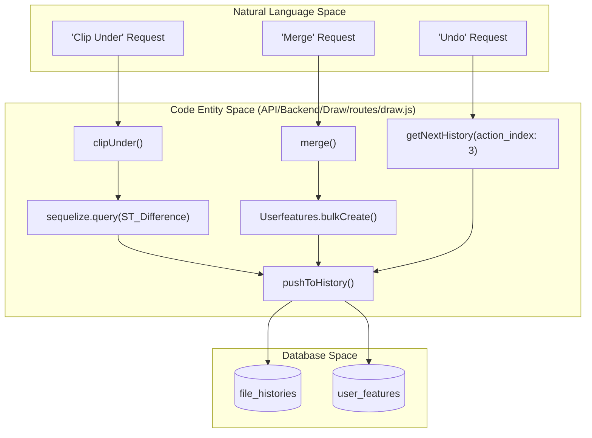
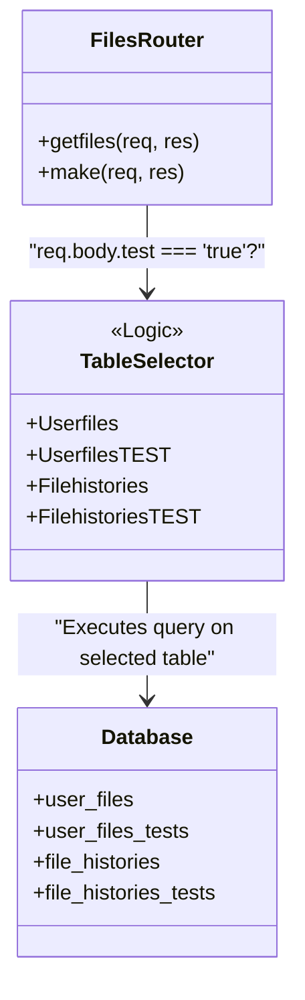

# Page: Draw & Files REST API

# Draw & Files REST API

Relevant source files

The following files were used as context for generating this wiki page:

- [AGENTS.md](AGENTS.md)
- [AI-GETTING-STARTED.md](AI-GETTING-STARTED.md)
- [API/Backend/Datasets/models/datasets.js](API/Backend/Datasets/models/datasets.js)
- [API/Backend/Datasets/routes/datasets.js](API/Backend/Datasets/routes/datasets.js)
- [API/Backend/Draw/routes/aggregations.js](API/Backend/Draw/routes/aggregations.js)
- [API/Backend/Draw/routes/draw.js](API/Backend/Draw/routes/draw.js)
- [API/Backend/Draw/routes/files.js](API/Backend/Draw/routes/files.js)
- [API/Backend/Draw/routes/filesutils.js](API/Backend/Draw/routes/filesutils.js)
- [API/Backend/Shortener/routes/shortener.js](API/Backend/Shortener/routes/shortener.js)
- [API/database.js](API/database.js)
- [API/testEnv.js](API/testEnv.js)
- [API/utils.js](API/utils.js)
- [CHANGELOG.md](CHANGELOG.md)
- [src/essence/Ancillary/Description.css](src/essence/Ancillary/Description.css)
- [tests/e2e/api/draw-crud.spec.js](tests/e2e/api/draw-crud.spec.js)
- [tests/e2e/api/draw.spec.js](tests/e2e/api/draw.spec.js)
- [tests/e2e/security/sql-injection.spec.js](tests/e2e/security/sql-injection.spec.js)

The Draw & Files REST API provides the backend infrastructure for MMGIS's collaborative vector drawing system. It manages the lifecycle of user-created spatial data, including file CRUD operations, feature-level versioning, history tracking (undo/redo), spatial clipping/merging, and the publishing workflow.

## 1. File Management (`/api/files`)

The files API manages `user_files` metadata and access control. Files can be owned by individual users or groups and can have various publicity settings.

### Key Endpoints
| Endpoint | Method | Description |
| :--- | :--- | :--- |
| `/getfiles` | `POST` | Retrieves all files owned by the user or marked as public. [API/Backend/Draw/routes/files.js:49-97]() |
| `/getfile` | `POST` | Returns a GeoJSON representation of a file, supporting point-in-time history, temporal filters, and published versions. [API/Backend/Draw/routes/filesutils.js:16-135]() |
| `/make` | `POST` | Creates a new drawing file, optionally initializing it with a GeoJSON feature set. [API/Backend/Draw/routes/files.js:119-211]() |

### File Metadata Structure
Drawing files are defined in the `user_files` table. Metadata includes `file_owner`, `file_name`, `intent` (purpose), and a `template` JSON for enforcing property schemas on features. [API/Backend/Draw/routes/files.js:140-149]()

Sources: `[API/Backend/Draw/routes/files.js:49-211](), [API/Backend/Draw/routes/filesutils.js:16-135]()`

---

## 2. Drawing Operations & Geometry Logic (`/api/draw`)

The drawing API handles the creation and modification of individual `user_features`. MMGIS implements advanced spatial operations directly in the backend using PostGIS.

### Spatial Operations Pipeline
When a user performs an action like "Clip Over", the system executes a complex SQL query using `ST_Difference` and `ST_Intersects` to calculate the difference between the new geometry and existing features in that file's history. [API/Backend/Draw/routes/draw.js:180-240]()

Sources: `[API/Backend/Draw/routes/draw.js:180-240](), [API/Backend/Draw/routes/draw.js:47-115](), [API/Backend/Draw/routes/draw.js:143-159]()`

---

## 3. History & Versioning System

MMGIS uses an immutable-feature pattern. Every "edit" is actually the creation of a new feature row and a new history entry.

### The History Entry
The `file_histories` table tracks the state of a file over time. Each entry contains:
- `history`: An array of `user_features` IDs (integers) representing the active features at that moment. [API/Backend/Draw/models/filehistories.js:42-45]()
- `action_index`: The operation type (Add: 0, Edit: 1, Delete: 2, Undo: 3, Publish: 4, Add Over: 5, Merge: 6, Add Under: 7, Split: 8). [API/Backend/Draw/routes/files.js:30-40]()
- `author`: The username of the person who performed the action. [API/Backend/Draw/models/filehistories.js:46-50]()

### Undo Logic
The `undo` operation (action 3) does not delete data. It retrieves the state from a specific `undoToTime` and creates a new history entry that copies the `history` array from that previous point in time. [API/Backend/Draw/routes/draw.js:143-159]()

Sources: `[API/Backend/Draw/models/filehistories.js:25-51](), [API/Backend/Draw/routes/files.js:30-40](), [API/Backend/Draw/routes/draw.js:143-159]()`

---

## 4. Feature Aggregations

The `/api/draw/aggregations` endpoint allows for statistical sampling of feature properties within one or more files. This is used to build UI filters and data summaries.

- **Sampling:** The system selects a random subset of features (default limit: 500) from the current history of the requested files using `ORDER BY RANDOM()`. [API/Backend/Draw/routes/aggregations.js:54-137]()
- **Spatial Filtering:** Supports optional bounding box filters using `ST_Intersects` and `ST_MakeEnvelope`. [API/Backend/Draw/routes/aggregations.js:115-123]()
- **Type Detection:** It automatically detects if properties are numbers or strings to provide appropriate aggregation buckets (min/max for numbers, counts for strings). [API/Backend/Draw/routes/aggregations.js:154-204]()

Sources: `[API/Backend/Draw/routes/aggregations.js:15-204]()`

---

## 5. Publishing Workflow

Publishing is a specialized operation where features from a drawing file are validated and moved into the `publisheds` table for mission-wide consumption.

1. **Spatial Compile:** The system builds a "family tree" of features, determining parent-child relationships (e.g., which points are inside which polygons) and levels. [API/Backend/Draw/routes/filesutils.js:52-61]()
2. **Quick Published Access:** The `/getfile` endpoint supports a `quick_published` flag to bypass standard file history and pull directly from the flattened `publisheds` table. [API/Backend/Draw/routes/filesutils.js:30-49]()
3. **Sorting:** Features are automatically sorted by `level` and geometry type (Polygons → Lines → Points) to ensure correct rendering order. [API/Backend/Draw/routes/filesutils.js:68-93]()

Sources: `[API/Backend/Draw/routes/filesutils.js:30-96]()`

---

## 6. Implementation Detail: Test Mirroring

The Draw API supports a "test environment mirroring" pattern. Most endpoints check for a `test: "true"` flag in the request body. If present, the API redirects all operations from production tables to their test counterparts.

| Production Model | Test Mirror Model | File Path |
| :--- | :--- | :--- |
| `Userfiles` | `UserfilesTEST` | [API/Backend/Draw/routes/files.js:10-11]() |
| `Userfeatures` | `UserfeaturesTEST` | [API/Backend/Draw/routes/files.js:14-15]() |
| `Filehistories` | `FilehistoriesTEST` | [API/Backend/Draw/routes/files.js:7-8]() |
| `Published` | `PublishedTEST` | [API/Backend/Draw/routes/files.js:17-18]() |

Sources: `[API/Backend/Draw/routes/files.js:7-15](), [API/Backend/Draw/routes/files.js:50](), [API/Backend/Draw/routes/draw.js:189](), [API/Backend/Draw/routes/aggregations.js:29-31]()`

---

## 7. Security & Input Validation

The Draw and Files API implements strict input validation to prevent SQL injection and unauthorized access.

- **Taint Analysis Mitigation:** Safe lookup maps `SAFE_GROUP_OPS` and `SAFE_SQL_OPS` are used to validate incoming filter operations, breaking potential injection chains. [API/Backend/Draw/routes/filesutils.js:12-14]()
- **Sanitization Utilities:** The `Utils.forceAlphaNumUnder` function is used extensively to sanitize table names, property keys, and identifiers before they are concatenated into SQL queries. [API/utils.js:186-208]()
- **Numeric ID Validation:** Endpoints like `/getfile` explicitly validate that file IDs are numeric to prevent string-based injection attacks. [API/Backend/Draw/routes/filesutils.js:108-135]()
- **E2E Verification:** Playwright-based tests in `tests/e2e/security/sql-injection.spec.js` verify that malicious payloads in `timeProp`, `filters`, and `sortBy` parameters do not trigger server errors or SQL execution. [tests/e2e/security/sql-injection.spec.js:58-158]()

Sources: `[API/Backend/Draw/routes/filesutils.js:12-14](), [API/utils.js:186-208](), [API/Backend/Draw/routes/filesutils.js:108-135](), [tests/e2e/security/sql-injection.spec.js:58-158]()`
