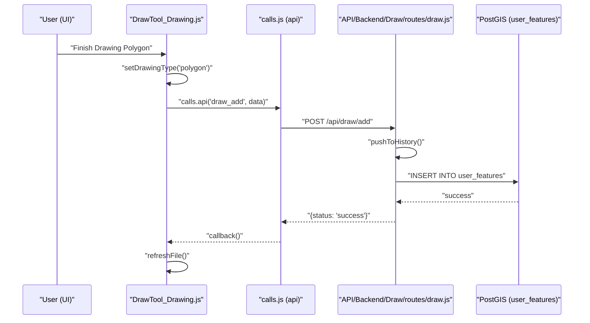
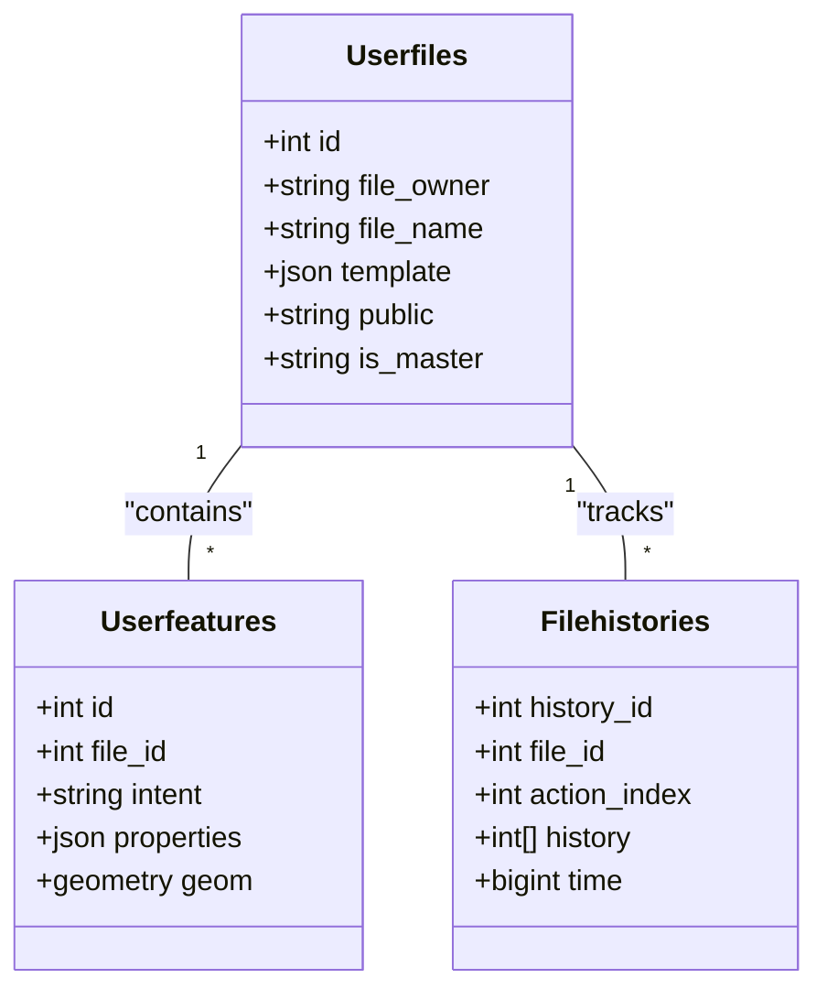

# Page: Draw Tool

# Draw Tool

Relevant source files

The following files were used as context for generating this wiki page:

- [.dockerignore](.dockerignore)
- [.gitignore](.gitignore)
- [API/Backend/Draw/models/filehistories.js](API/Backend/Draw/models/filehistories.js)
- [API/Backend/Draw/routes/filesutils.js](API/Backend/Draw/routes/filesutils.js)
- [docs/pages/Tools/Draw/Draw.md](docs/pages/Tools/Draw/Draw.md)
- [src/essence/Tools/Draw/DrawTool.css](src/essence/Tools/Draw/DrawTool.css)
- [src/essence/Tools/Draw/DrawTool.js](src/essence/Tools/Draw/DrawTool.js)
- [src/essence/Tools/Draw/DrawTool_Drawing.js](src/essence/Tools/Draw/DrawTool_Drawing.js)
- [src/essence/Tools/Draw/DrawTool_Editing.js](src/essence/Tools/Draw/DrawTool_Editing.js)
- [src/essence/Tools/Draw/DrawTool_FileModal.js](src/essence/Tools/Draw/DrawTool_FileModal.js)
- [src/essence/Tools/Draw/DrawTool_Files.js](src/essence/Tools/Draw/DrawTool_Files.js)
- [src/essence/Tools/Draw/DrawTool_History.js](src/essence/Tools/Draw/DrawTool_History.js)
- [src/essence/Tools/Draw/DrawTool_Shapes.js](src/essence/Tools/Draw/DrawTool_Shapes.js)
- [src/essence/Tools/Draw/DrawTool_Templater.css](src/essence/Tools/Draw/DrawTool_Templater.css)
- [src/essence/Tools/Draw/DrawTool_Templater.js](src/essence/Tools/Draw/DrawTool_Templater.js)
- [src/essence/Tools/Draw/config.json](src/essence/Tools/Draw/config.json)
- [src/pre/calls.js](src/pre/calls.js)
- [tests/e2e/api/draw-crud.spec.js](tests/e2e/api/draw-crud.spec.js)
- [tests/e2e/api/draw.spec.js](tests/e2e/api/draw.spec.js)
- [tests/e2e/security/sql-injection.spec.js](tests/e2e/security/sql-injection.spec.js)

The **Draw Tool** is a collaborative vector drawing and geospatial data management system within MMGIS. It allows users to create, edit, and organize vector features (points, lines, polygons, circles, rectangles, arrows, and text) across multiple shared or private files. It features a robust history system, advanced geometry operations like clipping and splitting, and a dynamic form engine (Templater) for attribute entry.

## Architecture Overview

The Draw Tool is implemented as a modular frontend tool with a corresponding set of REST endpoints and a PostGIS-backed persistence layer.

### Core Components
- **DrawTool.js**: The main entry point that initializes sub-modules and manages the primary UI and tool lifecycle [src/essence/Tools/Draw/DrawTool.js:1-25]().
- **DrawTool_Drawing.js**: Handles interactive geometry creation logic and clipping modes [src/essence/Tools/Draw/DrawTool_Drawing.js:12-26]().
- **DrawTool_Editing.js**: Manages feature selection, context menus, and attribute updates [src/essence/Tools/Draw/DrawTool_Editing.js:16-26]().
- **DrawTool_Files.js**: Manages file CRUD operations, visibility toggling, and file-level metadata [src/essence/Tools/Draw/DrawTool_Files.js:20-36]().
- **DrawTool_Shapes.js**: Handles the feature list UI, filtering, and pagination [src/essence/Tools/Draw/DrawTool_Shapes.js:14-39]().
- **DrawTool_Templater.js**: A dynamic form engine that renders UI inputs based on a JSON template schema [src/essence/Tools/Draw/DrawTool_Templater.js:18-20]().

### Data Flow: Natural Language to Code Entity
The following diagram illustrates how a user action (e.g., drawing a polygon) traverses the system from the UI to the Database.

**Drawing Data Flow**

Sources: [src/essence/Tools/Draw/DrawTool_Drawing.js:27-89](), [src/essence/Tools/Draw/DrawTool_Drawing.js:52-88](). Backend routes logic is typically invoked via `calls.api` defined in [src/pre/calls.js:54-57]().

## Drawing Operations & Clipping

MMGIS supports several "Draw Clipping" modes that determine how new geometries interact with existing features in the active file.

| Mode | Behavior | Implementation |
| :--- | :--- | :--- |
| **Over** | The new feature is added on top of existing ones. | `DrawTool.drawOver` [src/essence/Tools/Draw/DrawTool_Drawing.js:27-89]() |
| **Under** | The new feature is placed behind existing ones, and existing features are clipped to not overlap the new one. | `DrawTool.drawUnder` [src/essence/Tools/Draw/DrawTool_Drawing.js:18]() |
| **Through** | The new feature "cuts through" existing features, removing the overlapping area from them. | `DrawTool.drawThrough` uses `turf.difference` [src/essence/Tools/Draw/DrawTool_Drawing.js:90-140]() |
| **Off** | Standard addition without any spatial interaction logic. | [src/essence/Tools/Draw/DrawTool.js:85]() |

### Geometry Types
The tool supports the following intents via Leaflet.Draw:
- **Polygon**: Standard closed area [src/essence/Tools/Draw/DrawTool.js:67]().
- **Line**: Standard polyline [src/essence/Tools/Draw/DrawTool.js:70]().
- **Point**: Single coordinate marker [src/essence/Tools/Draw/DrawTool.js:71]().
- **Circle**: Defined by center and radius (can force radius in meters) [src/essence/Tools/Draw/DrawTool.js:103-108]().
- **Rectangle**: Defined by two corners [src/essence/Tools/Draw/DrawTool.js:69]().
- **Arrow**: A polyline with an arrow-head property [src/essence/Tools/Draw/DrawTool.js:73]().
- **Text**: An annotation feature [src/essence/Tools/Draw/DrawTool.js:72]().

Sources: [src/essence/Tools/Draw/DrawTool.js:62-74](), [src/essence/Tools/Draw/DrawTool_Drawing.js:90-140](), [src/essence/Tools/Draw/config.json:7-13]().

## Templater: Dynamic Form Engine

The Templater allows administrators to define custom metadata schemas for drawing files. When a user creates or edits a feature in a file with a template, the UI dynamically generates the appropriate input fields.

### Supported Field Types
The `renderTemplate` function in `DrawTool_Templater.js` processes a `templateObj` and generates markup for:
- `text` / `textarea`: Standard string inputs [src/essence/Tools/Draw/DrawTool_Templater.js:59-76]().
- `number`: Numeric input with `min`, `max`, and `step` [src/essence/Tools/Draw/DrawTool_Templater.js:47-58]().
- `dropdown`: Selection list using the `Dropy` library [src/essence/Tools/Draw/DrawTool_Templater.js:91-97]().
- `checkbox`: Boolean toggle [src/essence/Tools/Draw/DrawTool_Templater.js:40-46]().
- `date`: Date/time picker using `TempusDominus` [src/essence/Tools/Draw/DrawTool_Templater.js:98-104]().
- `incrementer`: Text field for auto-incrementing patterns [src/essence/Tools/Draw/DrawTool_Templater.js:105-113]().
- `point`: A specialized field that allows associating multiple coordinate points with a single feature [src/essence/Tools/Draw/DrawTool_Templater.js:114-124]().

Sources: [src/essence/Tools/Draw/DrawTool_Templater.js:18-125](), [src/essence/Tools/Draw/config.json:21-79]().

## Backend API & Persistence

The Draw Tool communicates with the backend via `/api/draw` and `/api/files` endpoints.

### File Management (`/api/files`)
- **getfiles**: Retrieves all files the user has permission to see (owned, public, or group-shared).
- **getfile**: Returns the GeoJSON content of a specific file. The backend implementation in `filesutils.js` handles sorting by geometry type and level [API/Backend/Draw/routes/filesutils.js:16-100]().
- **make**: Creates a new file entry in the database.

### Security and Validation
The backend employs strict validation to prevent SQL injection, especially in the `getfile` route where dynamic filters and sorting are applied.
- **Sanitization**: Safe lookup maps like `SAFE_GROUP_OPS` and `SAFE_SQL_OPS` are used to validate incoming filter operators [API/Backend/Draw/routes/filesutils.js:13-14]().
- **Type Checking**: File IDs are validated to be numeric to prevent injection via non-numeric strings [API/Backend/Draw/routes/filesutils.js:109-135]().
- **Taint Analysis Mitigation**: The system uses frozen lookup maps to break taint chains from request parameters to SQL queries [API/Backend/Draw/routes/filesutils.js:12-14]().

### History and Undo System
Every change to a drawing file is versioned.
- **Action Indices**: The system tracks actions such as Add, Edit, Remove, Undo, Merge, and Split.
- **Undo Logic**: The tool provides an interface to revert to previous states by calling the `draw_undo` endpoint.

**Database Schema Mapping**

Sources: [API/Backend/Draw/routes/filesutils.js:5-10](), [API/Backend/Draw/models/filehistories.js](), [src/essence/Tools/Draw/DrawTool_Files.js:103-136]().

## Publish Workflow

Drawing files are "working copies." To make features available to the wider mission, they can be published.

1. **Publish Action**: The user triggers a publish via the API bridge.
2. **Master Files**: Specific files can be designated as "Master" files. These are collaborative layers that are automatically toggled for all users and serve as the authoritative record for mission-critical features [src/essence/Tools/Draw/DrawTool_Files.js:103-136]().
3. **Master Checkbox**: The UI provides a master toggle to turn on/off all master files simultaneously [src/essence/Tools/Draw/DrawTool_Files.js:103-136]().

Sources: [src/essence/Tools/Draw/DrawTool_Files.js:103-136](), [API/Backend/Draw/routes/filesutils.js:30-49]().
