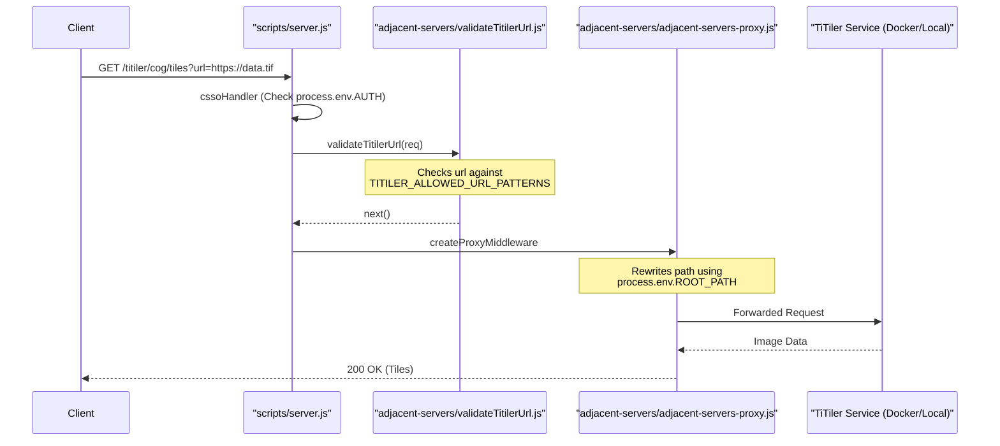

# Page: Environment Configuration (ENVs)

# Environment Configuration (ENVs)

<details>
<summary>Relevant source files</summary>

The following files were used as context for generating this wiki page:

- [.nvmrc](.nvmrc)
- [API/websocket.js](API/websocket.js)
- [CITATION.cff](CITATION.cff)
- [README.md](README.md)
- [adjacent-servers/adjacent-servers-proxy.js](adjacent-servers/adjacent-servers-proxy.js)
- [adjacent-servers/validateTitilerUrl.js](adjacent-servers/validateTitilerUrl.js)
- [configuration/env.js](configuration/env.js)
- [docs/assets/images/NASA-AMMOS-MMGIS-frame0.png](docs/assets/images/NASA-AMMOS-MMGIS-frame0.png)
- [docs/assets/images/divider.png](docs/assets/images/divider.png)
- [docs/pages/Overview/Overview.md](docs/pages/Overview/Overview.md)
- [docs/pages/Setup/Adjacent-Servers/adjacent-servers.md](docs/pages/Setup/Adjacent-Servers/adjacent-servers.md)
- [docs/pages/Setup/ENVs/ENVs.md](docs/pages/Setup/ENVs/ENVs.md)
- [docs/pages/Setup/Installation/Installation.md](docs/pages/Setup/Installation/Installation.md)
- [sample.env](sample.env)
- [scripts/server.js](scripts/server.js)
- [specs/001-authentication-and-user-management/plan.md](specs/001-authentication-and-user-management/plan.md)
- [src/essence/Tools/Viewshed/config.json](src/essence/Tools/Viewshed/config.json)

</details>


This page provides a technical reference for the environment variables used to configure the MMGIS backend, security posture, and adjacent service integrations. MMGIS uses the `dotenv` package to load configurations from a `.env` file at the project root [scripts/server.js:1](). In development, variables are also injected into the React client via Webpack's `DefinePlugin` [configuration/env.js:60-127]().

## Core Server Configuration

The primary server settings define the execution environment, network ports, and basic identification.

| Variable | Description | Implementation Detail |
| :--- | :--- | :--- |
| `SERVER` | The type of server engine. Defaults to `node` [sample.env:4](). | Used in legacy checks; `apache` is deprecated [docs/pages/Setup/ENVs/ENVs.md:15-20](). |
| `PORT` | The network port the Express server listens on. | Defaults to `8888`. Parsed as integer in `server.js` [scripts/server.js:82](). |
| `NODE_ENV` | Sets the environment mode (`development` or `production`). | `isDevEnv` constant toggles `ROOT_PATH` behavior [scripts/server.js:47-52](). |
| `SECRET` | String used for session signing. | Passed to `express-session` middleware [scripts/server.js:117](). |
| `ROOT_PATH` | The subpath under which MMGIS is deployed. | Prepended to all Express routes and proxy paths [scripts/server.js:52](), [adjacent-servers/adjacent-servers-proxy.js:18](). |
| `VERBOSE_LOGGING`| Enables detailed backend logs. | Controlled in `sample.env` [sample.env:41](). |

### Data Flow: Server Initialization
The following diagram illustrates how `server.js` consumes environment variables to initialize core components.

**Server Startup Entity Mapping**
```mermaid
graph TD
    ENV[".env File"] -->|require('dotenv').config| PROC["process.env"]
    PROC -->|"PORT"| APP["Express App"]
    PROC -->|"SECRET"| SESS["express-session"]
    PROC -->|"DB_USER/PASS/HOST"| POOL["pg.Pool"]
    PROC -->|"AUTH"| CSSO["cssoHandler Middleware"]
    
    subgraph "scripts/server.js"
        APP
        SESS
        POOL
        CSSO
    end
    
    POOL -->|Connects| PG[("PostgreSQL DB")]
    SESS -->|store| PG_SESS["connect-pg-simple"]
```
Sources: [scripts/server.js:1-127](), [sample.env:1-122](), [configuration/env.js:11-42]()

---

## Authentication Modes

MMGIS supports four primary authentication modes via the `AUTH` variable [sample.env:10-16]().

*   **`off`**: Disables all authentication. Tools requiring user context (like Draw) will fail.
*   **`none`**: No gatekeeping, but users can optionally sign up/log in to manage personal files.
*   **`local`**: MMGIS manages its own user database. Requires `AUTH_LOCAL_ALLOW_SIGNUP` to be true for new users to register without admin intervention [sample.env:18-20]().
*   **`csso`**: Cloud Single Sign On. MMGIS expects headers like `X-Groups` and `X-Sub` from a reverse proxy [scripts/server.js:151-163]().

### SSO Configuration
When `AUTH=csso`, MMGIS parses group information from base64-encoded headers:
*   **`CSSO_GROUPS`**: A JSON array of LDAP groups allowed to access the system [sample.env:143]().
*   **`CSSO_LEAD_GROUP`**: The specific group that grants "Lead" (administrative) permissions [sample.env:145]().

Sources: [scripts/server.js:140-176](), [sample.env:10-20](), [docs/pages/Setup/ENVs/ENVs.md:22-30]()

---

## Database Settings

MMGIS requires a PostgreSQL/PostGIS database. Connection pooling is managed via `pg.Pool` for sessions and `sequelize` for application data.

| Variable | Description | Default |
| :--- | :--- | :--- |
| `DB_HOST` | Hostname of the Postgres instance. | `localhost` [sample.env:117]() |
| `DB_PORT` | Port of the Postgres instance. | `5432` [sample.env:119]() |
| `DB_SSL` | Enable SSL for DB connections. | `false` [sample.env:130]() |
| `DB_SSL_CERT` | Path to the SSL certificate file. | `null` [sample.env:132]() |
| `DB_SSL_CERT_BASE64` | Base64 encoded certificate (overrides path). | `null` [sample.env:134]() |
| `DB_POOL_MAX` | Max concurrent connections. | `10` [docs/pages/Setup/ENVs/ENVs.md:82]() |

Implementation: The `Pool` is initialized in `scripts/server.js` [scripts/server.js:91-114]() and the Sequelize instance is exported from `API/connection.js` [scripts/server.js:28]().

Sources: [sample.env:115-134](), [scripts/server.js:91-114]()

---

## Adjacent Server Toggles

MMGIS acts as a gateway for several specialized geospatial microservices. These are enabled via `WITH_` toggles and configured with corresponding `_PORT` variables.

### Service Proxy Logic
The `initAdjacentServersProxy` function in `adjacent-servers/adjacent-servers-proxy.js` sets up `http-proxy-middleware` instances for each enabled service [adjacent-servers/adjacent-servers-proxy.js:9-140]().

| Service | Toggle | Default Port | Description |
| :--- | :--- | :--- | :--- |
| **STAC** | `WITH_STAC` | `8881` | SpatioTemporal Asset Catalog API [sample.env:46](). |
| **TiPG** | `WITH_TIPG` | `8882` | OGC Features API for PostGIS [sample.env:49](). |
| **TiTiler** | `WITH_TITILER` | `8883` | Dynamic Tile Server for COGs [sample.env:52](). |
| **TiTiler-pgSTAC** | `WITH_TITILER_PGSTAC` | `8884` | Mosaic Tile Server for STAC items [sample.env:64](). |
| **Veloserver** | `WITH_VELOSERVER` | `8104` | Wind/Velocity data visualization [sample.env:67](). |

### Custom Adjacent Servers
Users can add arbitrary proxy targets using the `ADJACENT_SERVER_CUSTOM_X` pattern [sample.env:69-81]().
*   **Format**: `["isEnabled", "routeName", "serviceName", "port"]` [adjacent-servers/adjacent-servers-proxy.js:144-147]()
*   **Example**: `ADJACENT_SERVER_CUSTOM_0=["true", "my_api", "api_container", "9000"]` results in a proxy at `/{ROOT_PATH}/my_api` [adjacent-servers/adjacent-servers-proxy.js:218-229]().

Sources: [adjacent-servers/adjacent-servers-proxy.js:13-136](), [sample.env:44-81](), [docs/pages/Setup/Adjacent-Servers/adjacent-servers.md:12-26]()

---

## Security Options

### TiTiler SSRF Prevention
To prevent Server-Side Request Forgery, the TiTiler proxy uses the `TITILER_ALLOWED_URL_PATTERNS` variable. This is a JSON array of regex strings [sample.env:53-61]().

*   **Implementation**: `createTitilerUrlValidator` in `adjacent-servers/validateTitilerUrl.js` compiles these regexes at startup [adjacent-servers/validateTitilerUrl.js:9-57]().
*   **Middleware**: The `validateTitilerUrl` middleware checks the `?url=` query parameter against the whitelist [adjacent-servers/validateTitilerUrl.js:60-97]().
*   **Admin Restrictions**: The `/cog/stac` endpoint within TiTiler is always restricted to Admin users regardless of global auth mode [adjacent-servers/adjacent-servers-proxy.js:70-74]().

### Content Security Policy (CSP)
*   **`FRAME_ANCESTORS`**: Sets the `Content-Security-Policy: frame-ancestors` header to control where MMGIS can be embedded [sample.env:83-84]().
*   **`THIRD_PARTY_COOKIES`**: If `true`, sets `SameSite=None; Secure` on session cookies to allow authenticated use within iframes [scripts/server.js:86-89]().

### Header Injection Protection
The `checkHeadersCodeInjection` middleware scans incoming URLs for common injection patterns like `<script>` to mitigate XSS and injection attacks [scripts/server.js:183-206]().

Sources: [adjacent-servers/validateTitilerUrl.js:1-101](), [scripts/server.js:86-89](), [sample.env:83-89](), [adjacent-servers/adjacent-servers-proxy.js:63-79]()

---

## SPICE and Scheduling

MMGIS can automatically manage SPICE kernels (Planetary Geometry data) for missions requiring orbital calculations through the `Shade` tool and other geometry-dependent features.

*   **`SPICE_SCHEDULED_KERNEL_DOWNLOAD`**: Toggles the cron job for kernel updates [sample.env:153]().
*   **`SPICE_SCHEDULED_KERNEL_CRON_EXPR`**: Standard cron expression for the update frequency [sample.env:155]().
*   **Implementation**: `setSPICEKernelDownloadSchedule` (from `spice/getKernels.js`) is called during server initialization in `server.js` if enabled [scripts/server.js:36](), [scripts/server.js:129-133]().

Sources: [scripts/server.js:129-133](), [sample.env:153-156](), [scripts/server.js:36]()

---

## Technical Architecture: Proxy & Auth Flow

This diagram shows how environment variables control the flow of a request through the MMGIS proxy to an adjacent service like TiTiler, emphasizing the interaction between security middleware and configuration.

**Proxy Request Lifecycle**

Sources: [adjacent-servers/adjacent-servers-proxy.js:57-92](), [adjacent-servers/validateTitilerUrl.js:60-97](), [scripts/server.js:140-176](), [sample.env:57-61]()
