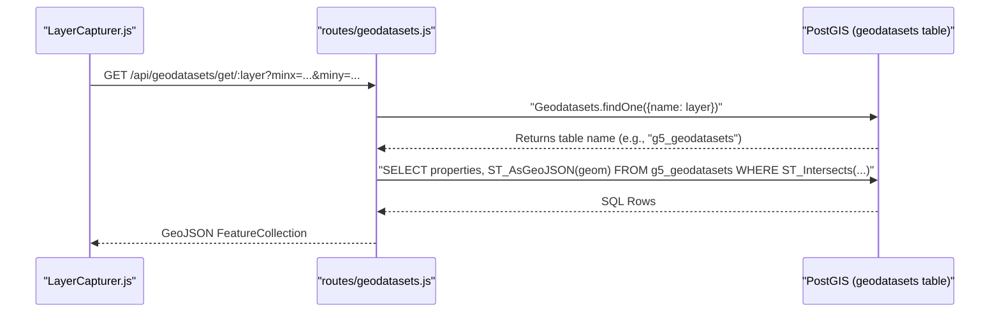
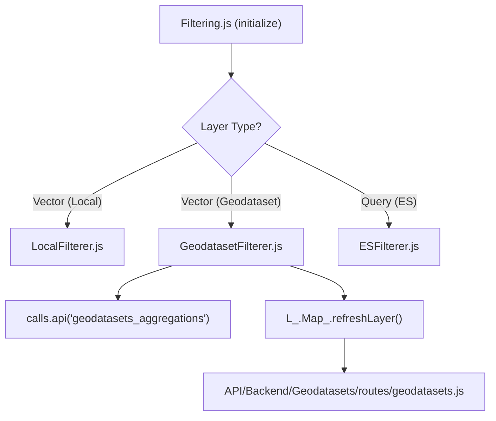

# Page: Geodatasets & Datasets

# Geodatasets & Datasets

Relevant source files

The following files were used as context for generating this wiki page:

- [API/Backend/Geodatasets/models/geodatasets.js](API/Backend/Geodatasets/models/geodatasets.js)
- [API/Backend/Geodatasets/routes/geodatasets.js](API/Backend/Geodatasets/routes/geodatasets.js)
- [API/logger.js](API/logger.js)
- [configure/src/external/line-navigator.js](configure/src/external/line-navigator.js)
- [configure/src/pages/GeoDatasets/Modals/AppendGeoDatasetModal/AppendGeoDatasetModal.js](configure/src/pages/GeoDatasets/Modals/AppendGeoDatasetModal/AppendGeoDatasetModal.js)
- [configure/src/pages/GeoDatasets/Modals/NewGeoDatasetModal/NewGeoDatasetModal.js](configure/src/pages/GeoDatasets/Modals/NewGeoDatasetModal/NewGeoDatasetModal.js)
- [configure/src/pages/GeoDatasets/Modals/UpdateGeoDatasetModal/UpdateGeoDatasetModal.js](configure/src/pages/GeoDatasets/Modals/UpdateGeoDatasetModal/UpdateGeoDatasetModal.js)
- [public/helps/LayersTool-Filtering.md](public/helps/LayersTool-Filtering.md)
- [src/essence/Ancillary/LocalFilterer.js](src/essence/Ancillary/LocalFilterer.js)
- [src/essence/Basics/Layers_/Filtering/ESFilterer.js](src/essence/Basics/Layers_/Filtering/ESFilterer.js)
- [src/essence/Basics/Layers_/Filtering/Filtering.css](src/essence/Basics/Layers_/Filtering/Filtering.css)
- [src/essence/Basics/Layers_/Filtering/Filtering.js](src/essence/Basics/Layers_/Filtering/Filtering.js)
- [src/essence/Basics/Layers_/Filtering/GeodatasetFilterer.js](src/essence/Basics/Layers_/Filtering/GeodatasetFilterer.js)
- [src/essence/Basics/Layers_/LayerCapturer.js](src/essence/Basics/Layers_/LayerCapturer.js)
- [src/essence/Tools/Draw/DrawTool_Shapes.css](src/essence/Tools/Draw/DrawTool_Shapes.css)
- [tests/e2e/api/filesutils-sql-injection.spec.js](tests/e2e/api/filesutils-sql-injection.spec.js)
- [tests/e2e/api/geodatasets.spec.js](tests/e2e/api/geodatasets.spec.js)
- [tests/unit/sql-injection-prevention.spec.js](tests/unit/sql-injection-prevention.spec.js)

MMGIS provides two primary systems for handling large-scale tabular and spatial data: **Geodatasets** for PostGIS-backed spatial features and **Datasets** for non-spatial records. These systems allow MMGIS to serve data that is too large for static GeoJSON files by leveraging server-side querying and filtering.

## 1. Geodatasets System

Geodatasets are spatial datasets stored in dedicated PostgreSQL tables with PostGIS extensions. They are accessed using the `geodatasets:` URL prefix in layer configurations [API/Backend/Geodatasets/routes/geodatasets.js:109-112]().

### 1.1 Implementation & Data Flow
When a layer is defined with a `geodatasets:` URL, the backend dynamically maps the request to a specific database table managed by the `Geodatasets` model [API/Backend/Geodatasets/models/geodatasets.js:56]().

**Key Components:**
*   **Model Definition:** The `geodatasets` table tracks metadata such as the original filename, feature count, and mapping for time and ID fields [API/Backend/Geodatasets/models/geodatasets.js:9-49]().
*   **Dynamic Table Creation:** `makeNewGeodatasetTable` generates a new PostGIS-enabled table for each uploaded dataset, including spatial (`geom`) and temporal (`start_time`, `end_time`) indexes [API/Backend/Geodatasets/models/geodatasets.js:58-103]().
*   **Spatial Indexing:** Automatically creates GIST indexes on the `geom` column to optimize bounding box queries [API/Backend/Geodatasets/models/geodatasets.js:143-152]().
*   **Security:** Input parameters such as table names and column identifiers are sanitized using `Utils.forceAlphaNumUnder` to prevent SQL injection [API/Backend/Geodatasets/routes/geodatasets.js:151-153](), [tests/unit/sql-injection-prevention.spec.js:12-17]().

### 1.2 Geodataset API Interactions
The system supports several query types via `API/Backend/Geodatasets/routes/geodatasets.js`:
*   **GeoJSON Export:** Returns features within a bounding box (`minx`, `miny`, `maxx`, `maxy`) [API/Backend/Geodatasets/routes/geodatasets.js:156-170]().
*   **Temporal Filtering:** Filters records based on `starttime` and `endtime` parameters if the geodataset has time fields configured [API/Backend/Geodatasets/routes/geodatasets.js:175-200]().
*   **MVT (Mapbox Vector Tiles):** Dynamically generates vector tiles for large datasets using PostGIS `ST_AsMVT` [API/Backend/Geodatasets/routes/geodatasets.js:50-56]().

### Geodataset Request Lifecycle
The following diagram bridges the frontend request to the backend PostGIS execution.

Sources: [API/Backend/Geodatasets/routes/geodatasets.js:109-168](), [src/essence/Basics/Layers_/LayerCapturer.js:81-116]()

---

## 2. Datasets System

The Datasets system handles non-spatial, record-based data (e.g., chemical analysis results, sensor logs) that can be linked to spatial features.

### 2.1 Schema and Management
*   **Storage:** Similar to Geodatasets, the `datasets` table tracks metadata, while actual records are stored in dynamically created tables.
*   **Linking:** Spatial features link to Datasets via `datasetLinks` in the layer's `variables` configuration.
*   **Querying:** The `/api/datasets/get` endpoint allows searching for specific records by matching a column key and value.

Sources: [API/Backend/Geodatasets/models/geodatasets.js:44-49]()

---

## 3. GeodatasetFilterer

The `GeodatasetFilterer` provides server-side filtering logic for Geodataset layers, allowing the UI to filter millions of points without downloading them all.

### 3.1 Filtering Logic
*   **Aggregations:** Before filtering, `getAggregations` fetches unique values and counts for properties within the current map bounds to populate the UI filter dropdowns [src/essence/Basics/Layers_/Filtering/GeodatasetFilterer.js:24-43]().
*   **Encoded Queries:** Filters are converted into a URL-safe string format (e.g., `key+op+type+value`) and sent to the backend [src/essence/Basics/Layers_/Filtering/GeodatasetFilterer.js:97-109]().
*   **Spatial Filtering:** Supports point-in-radius queries by passing a `spatialFilter` parameter (lat, lng, radius) to the backend [src/essence/Basics/Layers_/Filtering/GeodatasetFilterer.js:75-82]().

### Filtering Architecture
This diagram shows how `Filtering.js` dispatches to specific filterer implementations.

Sources: [src/essence/Basics/Layers_/Filtering/Filtering.js:83-117](), [src/essence/Basics/Layers_/Filtering/GeodatasetFilterer.js:44-63](), [src/essence/Basics/Layers_/Filtering/GeodatasetFilterer.js:113]()

---

## 4. Description Ancillary Module

The `Description.js` module provides a navigation and information overlay in the bottom-left of the UI. It is particularly important for Geodatasets as it allows "stepping" through features sequentially.

### 4.1 Feature Navigation
*   **Navigation Bar:** Provides UI elements for `Previous`, `Next`, `First`, and `Last` feature selection.
*   **Filtering Integration:** The navigation can be restricted to the current map extent, a specific time range, or geometry type.
*   **Spatial Panning:** When enabled, the map will automatically pan to the feature as the user navigates through the list.

---

## 5. Implementation Reference

### Key Classes & Functions

| Entity | Location | Role |
| :--- | :--- | :--- |
| `Geodatasets` | `API/Backend/Geodatasets/models/geodatasets.js` | Sequelize model for geodataset metadata [API/Backend/Geodatasets/models/geodatasets.js:56](). |
| `makeNewGeodatasetTable` | `API/Backend/Geodatasets/models/geodatasets.js` | Generates dynamic PostgreSQL tables with PostGIS indexes [API/Backend/Geodatasets/models/geodatasets.js:58](). |
| `GeodatasetFilterer` | `src/essence/Basics/Layers_/Filtering/GeodatasetFilterer.js` | Frontend logic for server-side geodataset filtering [src/essence/Basics/Layers_/Filtering/GeodatasetFilterer.js:11](). |
| `LocalFilterer` | `src/essence/Ancillary/LocalFilterer.js` | Client-side filtering for standard GeoJSON layers [src/essence/Ancillary/LocalFilterer.js:10](). |
| `Utils.forceAlphaNumUnder` | `API/utils.js` | Sanitization utility for SQL column/table names [API/Backend/Geodatasets/routes/geodatasets.js:151](). |

Sources: [API/Backend/Geodatasets/models/geodatasets.js:56-58](), [src/essence/Basics/Layers_/Filtering/GeodatasetFilterer.js:11](), [src/essence/Ancillary/LocalFilterer.js:10](), [API/Backend/Geodatasets/routes/geodatasets.js:151]()
