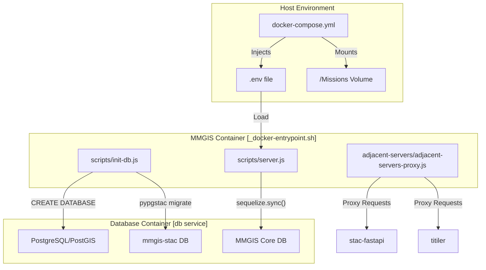
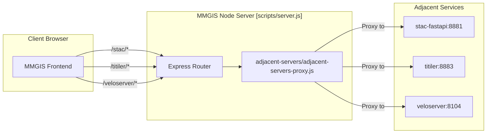

# Page: Getting Started & Installation

# Getting Started & Installation

Relevant source files

The following files were used as context for generating this wiki page:

- [.github/workflows/docker-build.yml](.github/workflows/docker-build.yml)
- [.nvmrc](.nvmrc)
- [API/Backend/Utils/routes/utils.js](API/Backend/Utils/routes/utils.js)
- [API/connection.js](API/connection.js)
- [API/setups.js](API/setups.js)
- [CITATION.cff](CITATION.cff)
- [CONTRIBUTING.md](CONTRIBUTING.md)
- [Dockerfile](Dockerfile)
- [README.md](README.md)
- [configure/public/index.html](configure/public/index.html)
- [docker-compose.sample.yml](docker-compose.sample.yml)
- [docs/assets/images/NASA-AMMOS-MMGIS-frame0.png](docs/assets/images/NASA-AMMOS-MMGIS-frame0.png)
- [docs/assets/images/divider.png](docs/assets/images/divider.png)
- [docs/pages/Contributing/Contributing.md](docs/pages/Contributing/Contributing.md)
- [docs/pages/Migration/v3-to-v4/v3-to-v4.md](docs/pages/Migration/v3-to-v4/v3-to-v4.md)
- [docs/pages/Overview/Overview.md](docs/pages/Overview/Overview.md)
- [docs/pages/Setup/Installation/Installation.md](docs/pages/Setup/Installation/Installation.md)
- [public/index.html](public/index.html)
- [python-environment.yml](python-environment.yml)
- [python-requirements.txt](python-requirements.txt)
- [scripts/init-db.js](scripts/init-db.js)
- [specs/001-authentication-and-user-management/plan.md](specs/001-authentication-and-user-management/plan.md)
- [src/essence/Tools/Viewshed/config.json](src/essence/Tools/Viewshed/config.json)

This page provides a technical guide for installing and initializing MMGIS. MMGIS is a Node.js and Express-based application that utilizes a PostgreSQL/PostGIS database for spatial persistence and a suite of adjacent servers for advanced geospatial services like STAC, Cloud-Optimized GeoTIFF (COG) rendering, and vector tile serving.

## System Architecture Overview

MMGIS follows a microservices-adjacent architecture. The core application handles mission configuration, user management, and collaborative drawing, while specialized containers handle raster and vector tile serving.

### System Component Flow
The following diagram illustrates the relationship between the host environment, Docker containers, and the internal MMGIS initialization logic.

**MMGIS Setup & Data Flow**

**Sources:** [scripts/init-db.js:72-131](), [docker-compose.sample.yml:1-30](), [Dockerfile:149](), [API/connection.js:1-50]()

---

## Installation via Docker (Recommended)

Docker is the preferred installation method as it bundles the Node.js environment, Python geospatial dependencies (GDAL), and adjacent servers.

### 1. Build or Pull Image
You can use the prebuilt image from the GitHub Container Registry or build a custom version.
*   **Pull:** `image: ghcr.io/nasa-ammos/mmgis:development` [docker-compose.sample.yml:4]()
*   **Build:** `docker build -t <image tag> .` [README.md:132]()

The `Dockerfile` uses a multi-stage build:
1.  **Builder Stage:** Installs Node.js 20 [Dockerfile:33](), micromamba for Python [Dockerfile:40-51](), and GDAL [python-environment.yml:6](). It compiles the React frontend and the Configure CMS [Dockerfile:82-86]().
2.  **Runtime Stage:** Creates a slim Oracle Linux 8.9 image containing only production dependencies and built artifacts [Dockerfile:93-149]().

**Sources:** [README.md:123-132](), [Dockerfile:1-150](), [python-environment.yml:1-35]()

### 2. Environment Configuration
Copy `sample.env` to `.env` and configure the database credentials.

| Variable | Description | Default |
| :--- | :--- | :--- |
| `AUTH` | Authentication mode (`off`, `none`, `local`, `csso`) | `none` |
| `DB_HOST` | Database service name (e.g., `db` in Docker) | `localhost` |
| `DB_NAME` | Name of the primary MMGIS database | `name` |
| `DB_USER` | PostgreSQL username | `user` |
| `DB_PASS` | PostgreSQL password | `password` |
| `WITH_STAC` | Enable STAC adjacent server | `true` |

**Sources:** [README.md:138-154](), [docs/pages/Setup/Installation/Installation.md:32-52]()

### 3. Database Initialization
When the container starts, it executes `_docker-entrypoint.sh` which triggers `scripts/init-db.js`.

*   **Database Creation:** The script connects to PostgreSQL and issues `CREATE DATABASE` commands for both the core MMGIS database and the `mmgis-stac` database if required [scripts/init-db.js:74-131]().
*   **STAC Migration:** If `WITH_STAC` is enabled, it runs `pypgstac migrate` via `execSync` to prepare the PostGIS schema for STAC items [scripts/init-db.js:168-182]().
*   **Schema Sync:** The script uses `sequelize.sync()` to create tables defined in the MMGIS models (e.g., `configs`, `users`, `user_files`) [scripts/init-db.js:240-260]().

**Sources:** [scripts/init-db.js:1-260](), [Dockerfile:149]()

---

## Manual Installation (Without Docker)

### System Requirements
*   **Node.js:** v22.20.0+ [docs/pages/Setup/Installation/Installation.md:91]()
*   **PostgreSQL:** v16+ with PostGIS 3+ [docs/pages/Setup/Installation/Installation.md:93-94]()
*   **Python:** 3.12 (managed via micromamba) [python-environment.yml:5]()

### Steps
1.  **Clone Repository:** `git clone https://github.com/NASA-AMMOS/MMGIS` [docs/pages/Setup/Installation/Installation.md:18]()
2.  **Install Node.js Dependencies:** Run `npm install` in the root `/` [docs/pages/Setup/Installation/Installation.md:139]()
3.  **Configure Environment:** Copy `/sample.env` to `.env` and update `DB_NAME`, `DB_USER`, and `DB_PASS` [docs/pages/Setup/Installation/Installation.md:141-158]().
4.  **Build Assets:**
    *   Run `npm run build` from root [docs/pages/Setup/Installation/Installation.md:160]().
    *   In `/configure`, run `npm install` and `npm run build` [docs/pages/Setup/Installation/Installation.md:162]().
5.  **Setup Python Environment:**
    *   `micromamba env create -y --name mmgis --file=python-environment.yml` [docs/pages/Setup/Installation/Installation.md:112]()
    *   `micromamba activate mmgis` [docs/pages/Setup/Installation/Installation.md:122]()
6.  **Run Server:** `npm run start:prod` [docs/pages/Setup/Installation/Installation.md:170]().

**Sources:** [docs/pages/Setup/Installation/Installation.md:88-170](), [README.md:118]()

---

## First-Time UI Setup

Once the server is running (default `http://localhost:8888`), initialize your first mission.

### 1. Create Admin Account
Navigate to `http://localhost:8888/configure`. If the `users` table is empty, you are prompted to create the first user, who is automatically granted Administrator privileges [docs/pages/Setup/Installation/Installation.md:73-75]().

### 2. Create a Mission
1.  Log in to the Configure CMS.
2.  Click **NEW MISSION** and enter a mission name.
3.  Click **MAKE MISSION**. This creates a new configuration entry in the `configs` table [docs/pages/Setup/Installation/Installation.md:79-81]().
    *   Optionally, use the mission name `"Test"` (case-sensitive) to create the sample mission [docs/pages/Setup/Installation/Installation.md:81]().

### 3. Access Your Mission
Navigate to `http://localhost:8888` to view your newly created mission [docs/pages/Setup/Installation/Installation.md:83]().

### 4. Adjacent Server Proxying
MMGIS routes requests to specialized services using a proxy pattern.

**Internal Proxy Routing**

The `adjacent-servers-proxy.js` module dynamically sets up proxy routes for services like STAC, TiTiler, and Veloserver based on environment variables [docker-compose.sample.yml:31-149]().

**Sources:** [docker-compose.sample.yml:31-149](), [Dockerfile:141](), [scripts/init-db.js:124-128]()

---

## Troubleshooting

| Issue | Likely Cause | Resolution |
| :--- | :--- | :--- |
| `Database connection failed` | Incorrect `.env` credentials | Check `DB_USER`, `DB_PASS`, `DB_HOST` in `.env`. [scripts/init-db.js:212-232]() |
| `micromamba not found` | Environment not activated | Run `micromamba activate mmgis` [docs/pages/Setup/Installation/Installation.md:122]() |
| `STAC layers not loading` | `mmgis-stac` DB missing | Ensure `WITH_STAC=true` and check `init-db.js` logs. [scripts/init-db.js:124-164]() |
| `Configure sub-app 404` | Build missing | Run `npm run build` inside the `/configure` directory. [docs/pages/Setup/Installation/Installation.md:162]() |

**Sources:** [scripts/init-db.js:10-60](), [docs/pages/Setup/Installation/Installation.md:115-123](), [README.md:138-154]()
